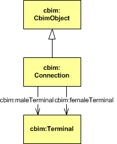

# COINS 1.1 Classes
The Classes in Version 1.1 

## Cbim:Amount
**[rdfs:comment](http://www.w3.org/2000/01/rdf-schema#comment)** Specifies the amount of identical catalogue part instances.

**[owl:Class]**(http://www.w3.org/2000/01/rdf-schema#Class): cbim:Amount

**[rdfs:subClassOf](http://www.w3.org/2000/01/rdf-schema#subClassOf)**: cbim:PropertyValue

**[owl:equivalentClass](http://www.w3.org/2002/07/owl#equivalentClass)**:
* cbim:nextVersion owl:allValuesFrom cbim:Amount
* cbim:cataloguePart owl:cardinality 1
* cbim:locator owl:maxCardinality 1

**[rdfs:domain](http://www.w3.org/2000/01/rdf-schema#domain)**:	
* cbim:cataloguePart
* cbim:locator
* cbim:propertyValue

**[rdfs:range](http://www.w3.org/2000/01/rdf-schema#range)**: 
cbim:contains

## Cbim:Baseline

**[rdfs:comment](http://www.w3.org/2000/01/rdf-schema#comment)**  Aggregates all objects of the same baseline.
**[rdfs:seeAlso](http://www.w3.org/2000/01/rdf-schema#seeAlso)** http://www.coinsweb.nl/wiki/index.php/Systems_Engineering#Baselines

**[owl:Class]**(http://www.w3.org/2000/01/rdf-schema#Class): cbim:Baseline	

**[rdfs:subClassOf](http://www.w3.org/2000/01/rdf-schema#subClassOf)**: cbim:CbimObject

**[owl:equivalentClass](http://www.w3.org/2002/07/owl#equivalentClass)**:
* cbim:nextVersion owl:allValuesFrom cbim:Baseline

**[rdfs:domain](http://www.w3.org/2000/01/rdf-schema#domain)**:	
* cbim:baselineObject
* cbim:baselineStatus

**[rdfs:range](http://www.w3.org/2000/01/rdf-schema#range)**: cbim:baseline

## Cbim:CbimObject
**[rdfs:comment](http://www.w3.org/2000/01/rdf-schema#comment)**: Abstract supertype of all C-BIM classes.

**[rdfs:seeAlso](http://www.w3.org/2000/01/rdf-schema#seeAlso)**: [Version Management](https://bimloket.github.io/COINS_2.0/coinsarchive/#versionmanagement)

**[rdfs:seeAlso](http://www.w3.org/2000/01/rdf-schema#seeAlso)**:[Identification of CBIM information objects](https://bimloket.github.io/COINS_2.0/coinsarchive/#identificationofcbimobjects)

**[rdfs:seeAlso](http://www.w3.org/2000/01/rdf-schema#seeAlso)**:[Systems Engineering Layering](https://bimloket.github.io/COINS_2.0/coinsarchive/#systemsengineeringlayering)

**[owl:Class](http://www.w3.org/2000/01/rdf-schema#Class)**:
* cbim:Baseline
* cbim:CbimObject
* cbim:Connection
* cbim:Document
* cbim:Function
* cbim:FunctionFulfiller
* cbim:Locator
* cbim:Parameter
* cbim:Performance
* cbim:PersonOrOrganisation
* cbim:PropertyType
* cbim:PropertyValue
* cbim:Requirement
* cbim:State
* cbim:Task
* cbim:Terminal
* cbim:Vector
* cbim:Verification 

**[rdfs:subClassOf](http://www.w3.org/2000/01/rdf-schema#subClassOf)**: owl:Thing

**[owl:equivalentClass](http://www.w3.org/2002/07/owl#equivalentClass)**:
	
* cbim:baseline owl:maxCardinality 1
* cbim:creator owl:maxCardinality 1
* cbim:modifier owl:maxCardinality 1
* cbim:nextVersion owl:maxCardinality 1

**[rdfs:domain](http://www.w3.org/2000/01/rdf-schema#domain)**	

* cbim:baseline
* cbim:changelog
* cbim:creationDate
* cbim:creator
* cbim:description
* cbim:document
* cbim:expired
* cbim:layerIndex
* cbim:modificationDate
* cbim:modifier
* cbim:name
* cbim:nextVersion
* cbim:releaseDate
* cbim:releaseStatus
* cbim:userID

**[rdfs:range](http://www.w3.org/2000/01/rdf-schema#range)**:
* cbim:baselineObject
* cbim:nextVersion
  

## Cbim:CataloguePart

**[rdfs:comment](http://www.w3.org/2000/01/rdf-schema#comment)** Library object for storing a parametric component.

**[owl:Class](http://www.w3.org/2000/01/rdf-schema#Class)** Cbim:CataloguePart

**[rdfs:subClassOf](http://www.w3.org/2000/01/rdf-schema#subClassOf)** cbim:PropertyType

**[owl:equivalentClass](http://www.w3.org/2002/07/owl#equivalentClass)**
* cbim:amountPropertyType owl:cardinality 1
* cbim:nextVersion owl:allValuesFrom 
* cbim:CataloguePart
* cbim:supertype owl:maxCardinality 1

**[rdfs:domain](http://www.w3.org/2000/01/rdf-schema#domain)**	
* cbim:amountPropertyType
* cbim:contains
* cbim:propertyValue
* cbim:shape
* cbim:supertype

**[rdfs:range](http://www.w3.org/2000/01/rdf-schema#range)**
* cbim:supertype
* cbim:cataloguePart

## Cbim:Connection
**[rdfs:comment](http://www.w3.org/2000/01/rdf-schema#comment)** Establishes a connection between two terminal objects. 

**[rdfs:seeAlso](http://www.w3.org/2000/01/rdf-schema#seeAlso)** 
* Topological_relations
* Systems Engineering Layering

**[owl:Class](http://www.w3.org/2000/01/rdf-schema#Class)**: Cbim:Connection

**[rdfs:subClassOf](http://www.w3.org/2000/01/rdf-schema#subClassOf)** cbim:CbimObject

**[owl:equivalentClass](http://www.w3.org/2002/07/owl#equivalentClass)**
* cbim:femaleTerminal owl:cardinality 1
* cbim:maleTerminal owl:cardinality 1
* cbim:nextVersion owl:allValuesFrom cbim:Connection

**[rdfs:domain](http://www.w3.org/2000/01/rdf-schema#domain)**	
* cbim:femaleTerminal
* cbim:maleTerminal

## Cbim:Document
**[rdfs:comment](http://www.w3.org/2000/01/rdf-schema#comment)**: General document link object.

**[owl:Class](http://www.w3.org/2000/01/rdf-schema#Class)**: cbim:Document

**[rdfs:subClassOf](http://www.w3.org/2000/01/rdf-schema#subClassOf)**: 	
[CbimObject](https://bimloket.github.io/COINS_2.0/coinsarchive/#cbimobject)

**[owl:equivalentClass](http://www.w3.org/2002/07/owl#equivalentClass)**:
* cbim:nextVersion
* owl:allValuesFrom](http://www.w3.org/2002/07/owl#allValuesFrom)
* cbim:Document

**[rdfs:domain](http://www.w3.org/2000/01/rdf-schema#domain)**	
* cbim:documentUri 
* cbim:checksumUri
* cbim:checksumUriAlgorithm
* cbim:documentAliasFilePath
* cbim:documentFragment
* cbim:checksumFile
* cbim:checksumFileAlgorithm
* cbim:documentType

**[rdfs:range](http://www.w3.org/2000/01/rdf-schema#range)**: cbim:document
  

## Cbim:Explicit3DRepresentation  
**[rdfs:comment](http://www.w3.org/2000/01/rdf-schema#comment)**:  Shape document link object.

**[owl:Class]**(http://www.w3.org/2000/01/rdf-schema#Class): cbim:Explicit3DRepresentation

**[rdfs:subClassOf](http://www.w3.org/2000/01/rdf-schema#subClassOf)**: cbim:Document

**[owl:equivalentClass](http://www.w3.org/2002/07/owl#equivalentClass)**:
	
* cbim:firstParameter owl:maxCardinality 1
* cbim:nextVersion owl:allValues
* From cbim:Explicit3DRepresentation

**[rdfs:domain](http://www.w3.org/2000/01/rdf-schema#domain)**: cbim:firstParameter

**[rdfs:range](http://www.w3.org/2000/01/rdf-schema#range)**: cbim:shape

 

## Cbim:Function
**[rdfs:comment](http://www.w3.org/2000/01/rdf-schema#comment)**  Specifies functional behavior through a bundle of functional requirements.

**[rdfs:seeAlso](http://www.w3.org/2000/01/rdf-schema#seeAlso)**  Systems Engineering Layering

**[owl:Class](http://www.w3.org/2000/01/rdf-schema#Class)** Cbim:Function

**[rdfs:subClassOf](http://www.w3.org/2000/01/rdf-schema#subClassOf)** cbim:CbimObject

**[owl:equivalentClass](http://www.w3.org/2002/07/owl#equivalentClass)** cbim:nextVersion owl:allValuesFrom cbim:Function

cbim:
**[rdfs:domain](http://www.w3.org/2000/01/rdf-schema#domain)**
* cbim:isFulfilledBy
* cbim:requirement	

**[rdfs:range](http://www.w3.org/2000/01/rdf-schema#range)**
* cbim:fulfills
* cbim:requirementOf

 

cbimfs:
**[rdfs:domain](http://www.w3.org/2000/01/rdf-schema#domain)**
* cbimfs:superFunction

**[rdfs:range](http://www.w3.org/2000/01/rdf-schema#range)**
* cbimfs:superFunction

 

## Cbim:FunctionFulfiller
**[rdfs:comment](http://www.w3.org/2000/01/rdf-schema#comment)**  Abstract supertype of the object tree node classes.

**[rdfs:seeAlso](http://www.w3.org/2000/01/rdf-schema#seeAlso)**
* Object tree
* Topological_relations
* Systems Engineering Layering

**[owl:Class](http://www.w3.org/2000/01/rdf-schema#Class)** Cbim:FunctionFulfiller

**[rdfs:subClassOf](http://www.w3.org/2000/01/rdf-schema#subClassOf)** cbim:CbimObject

**[owl:equivalentClass](http://www.w3.org/2002/07/owl#equivalentClass)**
* owl:unionOf cbim:PhysicalObject, cbim:Space
* cbim:currentState owl:maxCardinality 1
* cbim:locator owl:maxCardinality 1
* cbim:parent owl:maxCardinality 1

**[rdfs:domain](http://www.w3.org/2000/01/rdf-schema#domain)**	
* cbim:child
* cbim:currentState
* cbim:fulfills
* cbim:isAffectedBy
* cbim:locator
* cbim:parent
* cbim:performance
* cbim:shape
* cbim:terminal

**[rdfs:range](http://www.w3.org/2000/01/rdf-schema#range)**
* cbim:affects
* cbim:child
* cbim:isFulfilledBy
* cbim:parent
* cbim:performanceOf
* cbim:stateOf
* cbim:terminalOf
* cbim:verificationFunctionFulfiller

 

cbimfs:nonFunctionalRequirement

 

## Cbim:LibraryReference

**[rdfs:comment](http://www.w3.org/2000/01/rdf-schema#comment)** Document link to an external library or an object in an external library.

**[owl:Class](http://www.w3.org/2000/01/rdf-schema#Class)** Cbim:LibraryReference

**[rdfs:subClassOf](http://www.w3.org/2000/01/rdf-schema#subClassOf)** cbim:Document

**[owl:equivalentClass](http://www.w3.org/2002/07/owl#equivalentClass)**
* cbim:nextVersion owl:allValuesFrom 
* cbim:LibraryReference

 

**[owl:Class](http://www.w3.org/2000/01/rdf-schema#Class)** 
* cbimotl:FunctionTypeReference
* cbimotl:PerformanceTypeReference
* cbimotl:RequirementTypeReference

**[rdfs:domain](http://www.w3.org/2000/01/rdf-schema#domain)**: cbimotl:objectReference

 

## Cbim:Locator
**[rdfs:comment](http://www.w3.org/2000/01/rdf-schema#comment)** Specifier for position, orientation and bounding box in 3D Euclidean space.

**[rdfs:seeAlso](http://www.w3.org/2000/01/rdf-schema#seeAlso)**: https://bimloket.github.io/COINS_2.0/coinsarchive/#topologicalrelations

**[owl:Class]**(http://www.w3.org/2000/01/rdf-schema#Class): cbim:Locator

**[rdfs:subClassOf](http://www.w3.org/2000/01/rdf-schema#subClassOf)**: cbim:CbimObject

**[owl:equivalentClass](http://www.w3.org/2002/07/owl#equivalentClass)**:
* cbim:maxBoundingBox owl:maxCardinality 1
* cbim:minBoundingBox owl:maxCardinality 1
* cbim:nextVersion owl:allValuesFrom cbim:Locator
* cbim:primaryOrientation owl:maxCardinality 1
* cbim:secondaryOrientation owl:maxCardinality 1
* cbim:translation owl:maxCardinality 1

**[rdfs:domain](http://www.w3.org/2000/01/rdf-schema#domain)**:	
* cbim:maxBoundingBox
* cbim:minBoundingBox
* cbim:primaryOrientation
* cbim:secondaryOrientation
* cbim:translation

**[rdfs:range](http://www.w3.org/2000/01/rdf-schema#range)**: 
cbim:locator

## Cbim:Parameter

**[rdfs:comment](http://www.w3.org/2000/01/rdf-schema#comment)** Parameter of an explicit 3D reference object.

**[owl:Class](http://www.w3.org/2000/01/rdf-schema#Class)** Cbim:Parameter

**[rdfs:subClassOf](http://www.w3.org/2000/01/rdf-schema#subClassOf)** cbim:CbimObject

**[owl:equivalentClass](http://www.w3.org/2002/07/owl#equivalentClass)**
* cbim:nextParameter owl:maxCardinality 1
* cbim:nextVersion owl:allValuesFrom cbim:Parameter
* cbim:propertyValue owl:maxCardinality 1

**[rdfs:domain](http://www.w3.org/2000/01/rdf-schema#domain)**	
* cbim:defaultValue
* cbim:nextParameter
* cbim:propertyValue

**[rdfs:range](http://www.w3.org/2000/01/rdf-schema#range)**
cbim:firstParameter
cbim:nextParameter

 

**[rdfs:range](http://www.w3.org/2000/01/rdf-schema#range)** cbimotl:firstEnumerationItem

 

## Cbim:Performance

**[rdfs:comment](http://www.w3.org/2000/01/rdf-schema#comment)**  Explicit performance of a function fulfiller.

**[rdfs:seeAlso](http://www.w3.org/2000/01/rdf-schema#seeAlso)** Systems Engineering Layering

**[owl:Class](http://www.w3.org/2000/01/rdf-schema#Class)**  Cbim:Performance

**[rdfs:subClassOf](http://www.w3.org/2000/01/rdf-schema#subClassOf)** cbim:CbimObject

**[owl:equivalentClass](http://www.w3.org/2002/07/owl#equivalentClass)**
* cbim:nextVersion owl:allValuesFrom cbim:Performance
* cbim:performanceOf owl:maxCardinality 1

**[rdfs:domain](http://www.w3.org/2000/01/rdf-schema#domain)**	cbim:performanceOf

**[rdfs:range](http://www.w3.org/2000/01/rdf-schema#range)** cbim:performance

 

**[rdfs:domain](http://www.w3.org/2000/01/rdf-schema#domain)**	cbimfs:propertyValue

 

## Cbim:PersonOrOrganisation

**[rdfs:comment](http://www.w3.org/2000/01/rdf-schema#comment)**: Reference to the responsible person or organisation.	

**[owl:Class]**(http://www.w3.org/2000/01/rdf-schema#Class): cbim:PersonOrOrganisation

**[rdfs:subClassOf](http://www.w3.org/2000/01/rdf-schema#subClassOf)**: cbim:CbimObject

**[owl:equivalentClass](http://www.w3.org/2002/07/owl#equivalentClass)**:
* cbim:nextVersion owl:allValues
* From cbim:PersonOrOrganisation

**[rdfs:range](http://www.w3.org/2000/01/rdf-schema#range)**:

* cbim:creator
* cbim:modifier
* cbim:verificationPerformer

 

* cbimfs:authorizedBy
* cbimfs:plannedVerificationPerformer

 
  

## Cbim:PhysicalObject
**[rdfs:comment](http://www.w3.org/2000/01/rdf-schema#comment)**: Tangible function fulfiller.

**[rdfs:seeAlso](http://www.w3.org/2000/01/rdf-schema#seeAlso)**:
* [Object Tree](./#objecttree)
* [TopologicalRelations](./topologicalrelations)

**[owl:Class](http://www.w3.org/2000/01/rdf-schema#Class)** cbim:PhysicalObject

**[rdfs:subClassOf](http://www.w3.org/2000/01/rdf-schema#subClassOf)**
* cbim:FunctionFulfiller
* owl:disjointWith cbim:Space

**[owl:equivalentClass](http://www.w3.org/2002/07/owl#equivalentClass)**
* cbim:isSituatedIn owl:maxCardinality 1
* cbim:nextVersion owl:allValuesFrom cbim:PhysicalObject
* cbim:physicalParent owl:maxCardinality 1

**[rdfs:domain](http://www.w3.org/2000/01/rdf-schema#domain)**	
* cbim:contains
* cbim:isSituatedIn
* cbim:physicalChild
* cbim:physicalParent

**[rdfs:range](http://www.w3.org/2000/01/rdf-schema#range)**
* cbim:physicalChild
* cbim:physicalParent
* cbim:situates

 

	
**[rdfs:domain](http://www.w3.org/2000/01/rdf-schema#domain)**	cbimqe:calculatedResource

 

## cbim:PropertyType

**[rdfs:comment](http://www.w3.org/2000/01/rdf-schema#comment)** Specifier of quantity type, value type and unit type of a property.

**[owl:Class](http://www.w3.org/2000/01/rdf-schema#Class)** cbim:PropertyType

**[rdfs:subClassOf](http://www.w3.org/2000/01/rdf-schema#subClassOf)** cbim:CbimObject

**[owl:equivalentClass](http://www.w3.org/2002/07/owl#equivalentClass)** cbim:nextVersion owl:allValuesFrom cbim:PropertyType

**[rdfs:domain](http://www.w3.org/2000/01/rdf-schema#domain)**	
* cbim:unit
* cbim:valueDomain

**[rdfs:range](http://www.w3.org/2000/01/rdf-schema#range)**
* cbim:amountPropertyType
* cbim:propertyType

 

**[owl:equivalentClass](http://www.w3.org/2002/07/owl#equivalentClass)** cbimfs:template owl:maxCardinality 1

**[rdfs:domain](http://www.w3.org/2000/01/rdf-schema#domain)**	 cbimfs:template

**[rdfs:range](http://www.w3.org/2000/01/rdf-schema#range)** cbimfs:propertyType

 

**[rdfs:domain](http://www.w3.org/2000/01/rdf-schema#domain)**	cbimotl:firstEnumerationItem

**[rdfs:range](http://www.w3.org/2000/01/rdf-schema#range)**

 

**[rdfs:range](http://www.w3.org/2000/01/rdf-schema#range)** cbimqe:quantityType

 

## cbim:PropertyValue

**[rdfs:comment](http://www.w3.org/2000/01/rdf-schema#comment)**  Property value specifier.

**[owl:Class](http://www.w3.org/2000/01/rdf-schema#Class)** cbim:PropertyValue

**[rdfs:subClassOf](http://www.w3.org/2000/01/rdf-schema#subClassOf)** cbim:CbimObject

**[owl:equivalentClass](http://www.w3.org/2002/07/owl#equivalentClass)** 
* cbim:nextVersion owl:allValuesFrom cbim:PropertyType
* cbim:propertyType owl:cardinality 1

**[rdfs:domain](http://www.w3.org/2000/01/rdf-schema#domain)**	
* cbim:value
* cbim:propertyType

**[rdfs:range](http://www.w3.org/2000/01/rdf-schema#range)**
cbim:propertyValue

**[rdfs:domain](http://www.w3.org/2000/01/rdf-schema#domain)**	cbimfs:complexValue

**[rdfs:range](http://www.w3.org/2000/01/rdf-schema#range)** cbimfs:propertyValue

 

## cbim:Requirement

**[rdfs:comment](http://www.w3.org/2000/01/rdf-schema#comment)** Functional requirement specifier.

**[rdfs:seeAlso](http://www.w3.org/2000/01/rdf-schema#seeAlso)** Systems Engineering Layering

**[owl:Class](http://www.w3.org/2000/01/rdf-schema#Class)** cbim:Requirement

**[rdfs:subClassOf](http://www.w3.org/2000/01/rdf-schema#subClassOf)** cbim:CbimObject

**[owl:equivalentClass](http://www.w3.org/2002/07/owl#equivalentClass)**
* cbim:nextVersion owl:allValuesFrom cbim:Requirement
* cbim:requirementOf owl:maxCardinality 1

**[rdfs:domain](http://www.w3.org/2000/01/rdf-schema#domain)**	cbim:requirementOf

**[rdfs:range](http://www.w3.org/2000/01/rdf-schema#range)**
* cbim:requirement
* cbim:verificationRequirement

 

**[owl:equivalentClass](http://www.w3.org/2002/07/owl#equivalentClass)**
cbimfs:superRequirement owl:maxCardinality 1

**[rdfs:domain](http://www.w3.org/2000/01/rdf-schema#domain)**	
* cbimfs:superRequirement
* cbimfs:interval

**[rdfs:range](http://www.w3.org/2000/01/rdf-schema#range)** cbimfs:superRequirement

 

	

 
## cbim:Space

**[rdfs:comment](http://www.w3.org/2000/01/rdf-schema#comment)** Intangible function fulfiller.

**[rdfs:seeAlso](http://www.w3.org/2000/01/rdf-schema#seeAlso)** Object tree

**[owl:Class](http://www.w3.org/2000/01/rdf-schema#Class)** cbim:Space

**[rdfs:subClassOf](http://www.w3.org/2000/01/rdf-schema#subClassOf)** cbim:CbimObject

**[owl:equivalentClass](http://www.w3.org/2002/07/owl#equivalentClass)** 	
* cbim:nextVersion owl:allValuesFrom cbim:Space
* cbim:spatialParent owl:maxCardinality 1

**[rdfs:domain](http://www.w3.org/2000/01/rdf-schema#domain)**	
* cbim:situates
* cbim:spatialChild
* cbim:spatialParent

**[rdfs:range](http://www.w3.org/2000/01/rdf-schema#range)**
* cbim:isSituatedIn
* cbim:spatialChild
* cbim:spatialParent

 

	
## cbim:State
**[rdfs:comment](http://www.w3.org/2000/01/rdf-schema#comment)**   Bundles function fulfiller information in an explicit state context.

**[owl:Class](http://www.w3.org/2000/01/rdf-schema#Class)** cbim:State

**[rdfs:subClassOf](http://www.w3.org/2000/01/rdf-schema#subClassOf)** cbim:CbimObject

**[owl:equivalentClass](http://www.w3.org/2002/07/owl#equivalentClass)**
* cbim:nextVersion owl:allValuesFrom cbim:State
* cbim:previousState owl:maxCardinality 1
* cbim:stateOf owl:cardinality 1

**[rdfs:domain](http://www.w3.org/2000/01/rdf-schema#domain)**	
* cbim:contains
* cbim:isAffectedBy
* cbim:performance
* cbim:previousState
* cbim:shape
* cbim:stateOf

**[rdfs:range](http://www.w3.org/2000/01/rdf-schema#range)**
* cbim:affects
* cbim:currentState
* cbim:performanceOf
* cbim:previousState

 

## Cbim:Task

**[rdfs:comment](http://www.w3.org/2000/01/rdf-schema#comment)** Planning specifier.

**[owl:Class](http://www.w3.org/2000/01/rdf-schema#Class)** Cbim:Task

**[rdfs:subClassOf](http://www.w3.org/2000/01/rdf-schema#subClassOf)** cbim:CbimObject

**[owl:equivalentClass](http://www.w3.org/2002/07/owl#equivalentClass)**	
* cbim:nextVersion owl:allValuesFrom cbim:Task
* cbim:taskType owl:maxCardinality 1

**[rdfs:domain](http://www.w3.org/2000/01/rdf-schema#domain)**	
* cbim:affects
* cbim:endDateActual
* cbim:endDatePlanned
* cbim:startDateActual
* cbim:startDatePlanned
* cbim:taskType

**[rdfs:range](http://www.w3.org/2000/01/rdf-schema#range)** cbim:isAffectedBy

 

## Cbim:TaskType
**[rdfs:comment](http://www.w3.org/2000/01/rdf-schema#comment)** Task Type specifier.

**[owl:Class](http://www.w3.org/2000/01/rdf-schema#Class)**  Cbim:TaskType

**[rdfs:subClassOf](http://www.w3.org/2000/01/rdf-schema#subClassOf)** owl:Thing

**[owl:equivalentClass](http://www.w3.org/2002/07/owl#equivalentClass)**
* Constructing
* Destructing
* Unchanged
	

**[rdfs:range](http://www.w3.org/2000/01/rdf-schema#range)** cbim:taskType

 

## Cbim:Terminal
**[rdfs:comment](http://www.w3.org/2000/01/rdf-schema#comment)**   Terminal specifier of a function fulfiller.

**[rdfs:seeAlso](http://www.w3.org/2000/01/rdf-schema#seeAlso)**
* Topological relations
* Systems Engineering layering

**[owl:Class](http://www.w3.org/2000/01/rdf-schema#Class)** Cbim:Terminal

**[rdfs:subClassOf](http://www.w3.org/2000/01/rdf-schema#subClassOf)** cbim:CbimObject

**[owl:equivalentClass](http://www.w3.org/2002/07/owl#equivalentClass)**
* cbim:locator owl:maxCardinality 1
* cbim:nextVersion owl:allValuesFrom cbim:Terminal
* cbim:terminalOf owl:cardinality 1

**[rdfs:domain](http://www.w3.org/2000/01/rdf-schema#domain)**	
* cbim:locator
* cbim:shape
* cbim:terminalOf

**[rdfs:range](http://www.w3.org/2000/01/rdf-schema#range)**
* cbim:femaleTerminal
* cbim:maleTerminal
* cbim:terminal

 

## Cbim:ValueDomain

**[rdfs:comment](http://www.w3.org/2000/01/rdf-schema#comment)**  ValueDomain specification.

**[owl:Class](http://www.w3.org/2000/01/rdf-schema#Class)** ValueDomain 

**[rdfs:subClassOf](http://www.w3.org/2000/01/rdf-schema#subClassOf)** owl:Thing

**[owl:equivalentClass](http://www.w3.org/2002/07/owl#equivalentClass)**
* cbim:XsdBoolean
* cbim:XsdFloat
* cbim:XsdString
* cbim:XsdInt

**[rdfs:range](http://www.w3.org/2000/01/rdf-schema#range)** cbim:valueDomain

 

## Cbim:Vector

**[rdfs:comment](http://www.w3.org/2000/01/rdf-schema#comment)**  3D Vector specifier.

**[owl:Class](http://www.w3.org/2000/01/rdf-schema#Class)** Cbim:Vector

**[rdfs:subClassOf](http://www.w3.org/2000/01/rdf-schema#subClassOf)** cbim:CbimObject

**[owl:equivalentClass](http://www.w3.org/2002/07/owl#equivalentClass)** 	
cbim:nextVersion owl:allValuesFrom cbim:Vector

**[rdfs:domain](http://www.w3.org/2000/01/rdf-schema#domain)**	
* cbim:xCoordinate
* cbim:yCoordinate
* cbim:zCoordinate

**[rdfs:range](http://www.w3.org/2000/01/rdf-schema#range)**
* cbim:maxBoundingBox
* cbim:minBoundingBox
* cbim:primaryOrientation
* cbim:secondaryOrientation
* cbim:translation

 

## Cbim:Verification
**[rdfs:comment](http://www.w3.org/2000/01/rdf-schema#comment)**  Functionfulfiller/requirement combination verification specifier.

**[rdfs:seeAlso](http://www.w3.org/2000/01/rdf-schema#seeAlso)** Systems Engineering Layering

**[owl:Class](http://www.w3.org/2000/01/rdf-schema#Class)**  Cbim:Verification

**[rdfs:subClassOf](http://www.w3.org/2000/01/rdf-schema#subClassOf)** cbim:CbimObject

**[owl:equivalentClass](http://www.w3.org/2002/07/owl#equivalentClass)**
* cbim:nextVersion owl:allValuesFrom cbim:Verification
* cbim:verificationFunctionFulfiller owl:cardinality 1
* cbim:verificationPerformer owl:maxCardinality 1
* cbim:verificationRequirement owl:cardinality 1

**[rdfs:domain](http://www.w3.org/2000/01/rdf-schema#domain)**	
* cbim:verificationDate
* cbim:verificationFunctionFulfiller
* cbim:verificationMethod
* cbim:verificationPerformer
* cbim:verificationRequirement
* cbim:verificationResult

**[rdfs:range](http://www.w3.org/2000/01/rdf-schema#range)**

 

**[rdfs:domain](http://www.w3.org/2000/01/rdf-schema#domain)**	
	
* cbimfs:authorizationDate
* cbimfs:authorizationDefects
* cbimfs:authorizationMeasures
* cbimfs:authorizationRemarks
* cbimfs:authorizedBy
* cbimfs:plannedRemarks
* cbimfs:plannedVerificationDate
* cbimfs:plannedVerificationMethod
* cbimfs:plannedVerificationPerformer
* cbimfs:plannedWorkPackage
* cbimfs:verificationRequirement
* cbimfs:verificationRisks

 

## Cbim:VisiMessage

**[rdfs:comment](http://www.w3.org/2000/01/rdf-schema#comment)** COINS Container transfer message.

**[owl:Class](http://www.w3.org/2000/01/rdf-schema#Class)** Cbim:VisiMessage

**[rdfs:subClassOf](http://www.w3.org/2000/01/rdf-schema#subClassOf)** cbim:Document

**[owl:equivalentClass](http://www.w3.org/2002/07/owl#equivalentClass)**
cbim:nextVersion owl:allValuesFrom cbim:VisiMessage

**[rdfs:domain](http://www.w3.org/2000/01/rdf-schema#domain)**	

**[rdfs:range](http://www.w3.org/2000/01/rdf-schema#range)**

 

