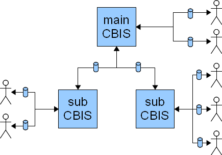
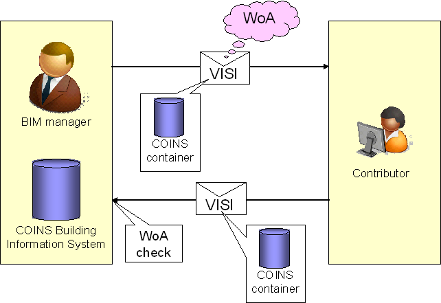

# Functional specification

Version:4.1

Date:10 November 2009

Prepared by:Working group 'Specification'

Members: Henk Schaap, Peter Willems, Arjen Adriaanse, Renzo van Rijswijk, Hans Jongedijk, René Dorleijn, Bram Mommers

## Introduction

To maintain the building information in a building construction project a building information system dealing with object information is essential. The availability of a COINS-compatible building information system is a prerequisite for a broad implementation / deployment of the COINS standard. Therefore, in the COINS project group meeting of September 23, 2009 it is decided to send out an appeal to the software market to deliver a COINS-compatible building information system.

Initially, such a building information system should support the following functionality:

* Importing a COINS-container
* Merging the contributions of various project partners into one central COINS Building Information Model (CBIM)
* Tracing modifications
* Keeping up with the consecutive versions of information objects
* Keeping up with baselines
* Seeing to that only designated persons (using explicit authorizations) are allowed to make changes to certain information objects
* Browsing the CBIM from various viewpoints (systems engineering, 3D representation, verification, etc.)
* Extracting sections of the central CBIM for export in a COINS container
* Recording of receipt messages (VISI) http://www.crow.nl/visi/
* Reporting of performed modifications
* Application Programming Interface (API)
* Multi-user environment

Many of the functions stated above can be demonstrated in a software tool: COINS Navigator http://www.coinsweb.nl/wiki/index.php/COINS_Navigator. This tool is a reference implementation (in addition to the documentation set) to gain a clear insight into how to apply the various COINS concepts.

## Global Architecture

The global architecture of a COINS compatible Building Information System is depicted in figure 1. The CBIS kernel manages exclusively the database containing the central BIM and its associated documents residing in a protected document store. Protected means documents are subject to version management control by CBIS exclusively. Primary input and output is organized around a VISI framework of formal transactions which are executed using standard messages and attached COINS containers. Although the deployment of VISI is not a prerequisite for the application of COINS the CBIS should be able to (let) interpret a VISI message and deal with the appropriate linking of affected objects with these VISI messages (See also: 4.2 Merging the contributions of various project partners into one central COINS Building Information Model (CBIM)). The COINS containers are the vehicles that transport content information between CBIS and COINS compatible discipline specific applications (e.g. Revit, Ticon, Allplan, Smarteam FS, MSProject). The CBIS-API should enable a set of dashboard applications to assist the BIM manager with a wide spectrum of inspection and control functions. In addition, report generators could use the same channel to output up-to-date general surveys over arbitrary periods and for various model views.

Figure 2: Hub and spoke configuration with multiple CBIS's
Enlarge
Figure 2: Hub and spoke configuration with multiple CBIS's
In a larger project it could occur that a project partner organizes his information management around a local CBIS (e.g. to communicate with sub-partners/departments). This situation will not change the communication protocol really. The BIM manager of the partner using a local CBIS must decide what part of the CBIS is public (i.e. should be communicated with the main CBIS) and what part is private and should only communicated with the sub-partners.

Besides the interaction with a discipline specific application a COINS dedicated application (modeler) could be useful. This modeler is not the same as the editor application on top of the CBIS. This last tool is meant for small repairs performed by the BIM manager. However, a COINS modeling tool is perfectly aligned with the complete CBIM specification instead of the indirect control from a discipline specific application which only observes a mapped model view.

An information object in a CBIM may reference an external object in a public or local object library. If this object library has a CBIM structure CBIS should be able to handle this reference (e.g. an existence check). However, if the object library has a foreign structure CBIS should accept the link as is.

.The blue area marks the actual CBIS, while the gray objects describe the interaction environment. The usage of VISI is not mandatory for the application of COINS. A less accurate solution could deploy e-mail messages instead.") 

 

## BIM Specification

### OWL

The COINS BIM specification is formally recorded in the Web Ontology Language http://en.wikipedia.org/wiki/Web_Ontology_Language. OWL is a standard of the World Wide Web Consortium (W3C) http://en.wikipedia.org/wiki/World_Wide_Web_Consortium, the standardization body that also maintains the XML and HTML recommendations.

The OWL files that specify the COINS kernel schema and two sub-schema's for the established reference frameworks (functional specification and quantity estimation) are part of this specification.

### IFC

The COINS BIM development team has decided not to add shape representation object classes to the specification schema. The considerations for this decision are various:

it is a considerable effort
it will take a long time to persuade the CAD vendors to implement yet another shape representation format
there are already various standardized formats available
As a result COINS does not prescribe a shape representation format. In principle, any agreed upon format is permitted including proprietary formats. However, IFC is regarded as somewhat special because it is aimed for use in the building industry and because most CAD vendors that serve the construction market offer import and export facilities for IFC. In this way IFC can at least play the role of a lingua franca in a way that PDF fills a corresponding role for text documents, i.e. a read-only publishing format.

For this reason a CBIS implementation should at least be able to parse and render IFC models and additionally being capable to establish and maintain links between CBIM objects and IFC objects.

### Plug-in reference frameworks

The COINS standard has a built-in structure to extend the central schema with sub-models (reference frameworks) that focus on specific topics for certain particular applications. At this moment two reference frameworks are specified and published (functional specification and quantity estimation) while others are in various stages of development. In addition to the reference frameworks that form part of the COINS standardization effort it is essentially the intention that development communities outside the COINS organization could specify customized reference frameworks in the scope of a project or a company or a particular branch or discipline of the building and construction industry.

A productive COINS compatible Building Information System should display enough flexibility to support this need for extendability.

### CBIS functionality

A COINS compatible Building Information System maintains the actual central CBIM including the development history of the model. In principle all modifications lead to new versions of the infor­mation objects involved while preserving the preceding object versions (identifiable by the state value expired). The structure offers the opportunity to undo modifications under exceptional circumstances returning effectively to a previous database state. This functionality amounts to the standard available facilities of general database management systems.

 

Partners in a construction project will not operate directly on the central CBIM. COINS facilitates concurrent engineering using a structure of off-line information packages (COINS containers) which contain a subset of the central CBIM including an authorization prescription which part is open for modifications (additions, deletions) and which part is restricted to read-only access. How the participating applications this authorization prescription incorporate in their user-interface is left to the application supplier. However, the CBIS should contain features to check the result container of the contributing partner on authorization violations.

If the contribution is accepted the sub-model is merged with the central CBIM. After the merge operation the modified section will be incorporated in new versions of the affected information objects (in case of deleted objects this only leads to objects with an expired status).

The CBIS should maintain an administration of all issued transactions (expected contributions of partners) with the accompanying authorization prescriptions. In principle at any point in time only one partner should have modification rights in the same demarcated area of the central CBIM. However, enforcing this policy belongs to the responsibility of the BIM manager, e.g. by aligning the authorizations of the issued transactions. CBIS itself should not impose any restrictions in this field.

Below follows a more detailed description of the essential CBIS functions.

### Importing a COINS container

As a rule a COINS container contains a CBIM file with associated documents. The import of a COINS container will include at least the following tasks:

* Unpack the container
* Deserialize the CBIM file into the native CBIS storage format as a separate model
* Store the attached documents
* Update the document links of the CBIM

### Merging models

Merging the contributions of various project partners into one central COINS Building Information Model (CBIM)
Merging the contribution of a project partner (packed in a COINS container) with the central CBIM will include at least the following tasks:

* Add the accompanying VISI message to the document store.
* Scan the contribution on new, modified and deleted information objects.
* New objects are added to the central BIM.
* Deleted objects are marked expired.
* Modified objects receive also expired status in the central BIM.
* Create new versions of the modified objects with the actual attributes and links.
* Let the previous version of a modified object point to the new version.
* Let all new, modified and deleted objects link to the accompanying VISI message.
* The merge operation should implicate the corresponding authorization prescription (Window of Authorization).

### Tracing modifications
In principle an information object is never removed from the central BIM. Modifications are incorporated in a new version of the object. The previous (expired) version contains a link to the new version. Not affected objects that point to the modified object continue pointing to the original object version (This rule enables an undo of the applied modification, furthermore external links will stay valid: the next-version relations build up a linked list ultimately pointing to the actual object version.).

Each object may contain meta-data with among others the creation date and the last modification date. This offers the opportunity to compile a changes report over an established period of time.

#### Keeping up with the consecutive versions of information objects
The central CBIM is able to contain all versions of the same information object. A newly created object is automatically assigned version 0. Subsequent versions increment this number with 1. To give each object version a unique ID this version number is post-fixed to the ID.

#### Keeping up with baselines
Information objects can be assigned to a baseline. A baseline is either in the status open or closed. Objects belonging to a closed baseline should be protected to unauthorized modifications.

Seeing to that only designated persons (using explicit authorizations) are allowed to make changes to certain information objects
An authorization prescription (Window of Authorization of WoA) describes which part of the central BIM are open for modifications (write access), which part is open for inspection (read-only access) and which parts remain invisible (no access). The COINS container that is compiled for a specific WoA will not include the no-access part. During the merge operation of the result contribution the original WoA will tell if the authorization prescription is violated or not, i.e. if modifications are encountered in the read-only section.

Browsing the CBIM from various viewpoints (systems engineering, 3D representation, verification, etc.)
Obviously the CBIS must support browsing functionality. In addition support for graphical inspec­tion of the associated 3D representation is essential. A click-able 3D window should select the associated CBIM objects. Conversely selecting a CBIM object should single out associated 3D objects (if such a link exists of course).

Initially this functionality is required for 3D objects represented according the IFC format.

#### Extracting sections of the central BIM for export in a COINS container
Creating a COINS container as part of a transaction in a construction project will include at least the following tasks:

An authorization prescription is determined (WoA) with the various sections for write access, read access and no-access.
Under control of this WoA a sub-BIM is compiled with only actual (valid) versions of the objects in the write access and read access sections.
The sub-BIM is places in a ZIP file (COINS container) in the top-level folder bim.
Relevant documents (to be decided by the BIM manager) are placed in the top-level folder doc (either as file copy or as web link).
The WoA itself (an XML file) is placed in top level folder woa.

#### Recording of receipt messages (VISI)
VISI messages that accompany the partner contributions are added to the document store of the CBIS. All information objects which during the merge operation are assigned the expired status or are newly created object versions will include a link that points to this accompanying message.

#### Reporting of performed modifications
The CBIS should be able to generate changes reports of arbitrary periods of time.

#### Application Programming Interface (API)
The CBIS should implement an application programming interface specification to enable third parties to interface with the functionality of CBIS.

#### Multi-user environment
The CBIS should facilitate a multi-user environment. More than one user should be allowed to access the information stored and managed by CBIS either by API, webservices, web page or any other means of access.

