# COINS version 1.1
Version 1.1 

## Version Management

### Introduction
Although many database systems support version management in one way or another there are good reasons to store version management data also in the information model itself. In this way one standard way of representing the history of the model can be preserved over various database implementations. Conservation of the history of model modifications is also core business for building information modeling. It is simply of utmost importance to keep track of which modifications were when introduced by whom operating in which role. Apart from that the native version management functions of the applied database system can still (and therefor should be) used for daily operation and where the COINS Building Information System (CBIS) version management data is handled in the same way as the actual content data.

The starting point for the CBIS Version Management design was the concept of preserving every model state. This means that the information model can in principle only grow because never an information object will be physically deleted. Of course the actual implementation of this principle could be quite an undertaking. Here we describe the design features to make such an implementation feasible, not the actual implementation itself. A reference implementation is available as part of the COINS Testing tool that can be downloaded from the COINS web site: http://www.coinsweb.nl/wiki/index.php/COINS_Testgereedschap.

### Representing deleted and modified information objects
All information objects in a COINS Building Information Model (CBIM) are instances of a class that inherits directly or indirectly of the abstract super type CbimObject. CbimObject defines primarily a set of attributes for identification, meta data and management data. It also defines two attributes which serve the implementation of version management: expired and nextVersion. Version management is typically implemented as part of a CBIS, i.e. the shared project CBIM that is under control of a so-called building director (in Dutch: bouwwerkregisseur). A CBIM as part of a COINS Container (a cabinet file containing the CBIM and all referenced document files) will typically only contain an up-to-date model without any previous versions of information objects.

These different uses of CBIM (as the central shared project model or as part of a information transaction using COINS containers) also affects some basic handling of the model objects. In a CBIM without version management information objects can explicitly be modified or deleted. However, in a CBIS CBIM an information object will never be updated or deleted. A modification of an object will always result in a new object containing the new state of the original object. The deletion of an object is effected by simply setting the expired flag. Only the creation of a new object is handled the same.

### Representing a deleted object
Figure 1: A CBIM representation of an object before and after its deletion.
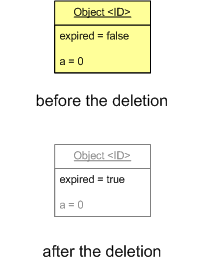

As stated before under version management control an information object is never physically deleted from the model. The state of the deleted object is unaffectedly preserved. The only difference in state before and after the deletion is the expired flag which is set to true after the deletion.

### Representing a modified object
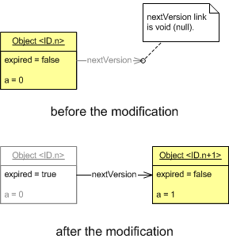
After an information object has been changed the original object instance points with its nextVersion property to the newly created object instance. The ID's of both objects will be the same. However, because two or more object instances cannot be represented with identical ID's in the same model the version number is added to the identical logical ID's to create different physical ID's. Logical ID and version number are separated by a dot character. Therefore the physical ID of a CBIM object is put together from the logical ID followed by a dot character followed by the version number: <physical ID> ::= <logical ID>.<version number>. By convention the first version (with version number = 0) may be skipped, so a physical ID without a “trailing dot plus integer number” shall be treated as <logical ID>.0.

  
### Linking policy with deleted and modified information objects
Until here the discussion restricts itself to the implications for the data properties of an object, i.e. properties which refer to a literal value: a character string or a boolean, integer or real value. These values are unaffected (in case of deletion) or simply copied to the new object instance (in case of modification). In this section will be discussed how to handle the object properties or links, i.e. properties that refer to one or more other objects. Since object properties have a direction a distinction can be made between ingoing links and outgoing links.

### Linking policy with deleted information objects
Figure 3: The incoming and outgoing links that existed before the deletion still exist after the deletion.
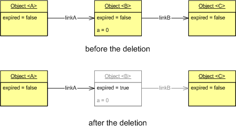

Deleting an information object, i.e. setting its expired flag, does not affect the ingoing and outgoing links.
However, there are implications in the semantics. In the example of figure 3 object A refers to object B through property linkA. After the deletion it still refers to object B, which is now expired. In a historical view the semantics are that up to a certain moment in time (the last modification date of the expired object) object A referred to object B. After that moment object B ceases to exist, which implicates that linkA from that instant effectively is reduced to a void link. As a result the actual view (which only displays existing or non-expired objects) should reveal that linkA is void or empty. In the same example object B refers through property linkB to object C. The historical view shows that once object B existed and referred to object C. In the actual view this historical fact has completely disappeared.

### Linking policy with modified information objects

As discussed before modifying an information object results into a new object instance with identical logical ID and an incremented version number. Except for the expired flag all property values of the original object instance are cloned into the new instance. This holds for both data properties as well as object properties (outgoing links).

Figure 4: Cloning all data properties and object properties into the new object instance.
Figure 4: Cloning all data properties and object properties into the new object instance.
In the example of figure 4 object A is referring to object B through object property linkA. After the modification of object B this link still points to object B. But unlike the deleted object case now there is a non-void nextVersion link available which effectively points to the next version of object B. If this version should also be expired and again a non-void nextVersion link is available this procedure could be repeated until a real expired object B version is encountered or a non-expired i.e. the current version of object B.
The pre-modified version of object B refers to object C through object property linkB. The new version of object B also copies this link to object C so that there are now two link instances linkB to object C. The reason for copying the link is that the deletion of this link could be the trigger to create the new version. Copying the link shows that this is not the case here. Mark that simply deleting the new version instance (and implicitly the copied link) and resetting the expired flag in the previous version instance is sufficient to roll back to the original state.

### Bi-directional linking (inverse relation) policy
Certain object property are defined bi-directional, i.e. there exists an inverse relationship. As a rule in a CBIM only one direction is explicitly specified (while for performance reasons the inverse direction could be inferred and temporarily added to the live model). The policy here is that adding a bi-directional link will always trigger the creation of a new object instance no matter which actual direction was chosen. So adding a bi-directional link between two existing objects will force both sides to create new versions.

### Merging
The CBIS CBIM could be updated interactively by adding, deleting and updating objects one at a time. However, in a transaction based system (for instance using VISI) the updating takes place in a batch like manner. The building director will send out an assignment to a partner role in the project (specifier, designer, planner, etc.). The assignment is described in a formal message specified according to the VISI framework schema for that specific project. Part of this message is a COINS container which holds a relevant part of the actual CBIS CBIM including referenced documents. The person who fulfills the partner role at that moment will execute the assignment which results in an updated CBIM, i.e. some new objects are added, a few obsolete objects are removed and a number of existing objects are modified. This result is returned to the building director using again a COINS container. After acceptance this result must be added the the shared CBIS CBIM in a so called merge operation.

Merging could be interpreted as a sequence of separate modifications, however only the result is exchanged not the way this result has been achieved. In order to merge the CBIS CBIM and the received container CBIM must be compared to detect newly created objects, deleted objects and updated objects. To prevent the creation of superfluous new versions it is necessary to collect all changes on each object before the actual merging operation.

To realize an optimal control on the life cycle of each information object every affected object of the merge operation is attached a document reference to the VISI message that accompanied the container. This VISI message as a result of a specific transaction explains the changes in this version of the object.

## Identification of CBIM information objects 
  
### Introduction
CBIM objects are normally presented using their name and user ID attribute values. Although this identification method will be satisfactory for most users it is simply not reliable enough to count on. The unique identification of CBIM objects is a feature that usually is kept invisible to most users. Tools will suppress this bit of information because it is semantically irrelevant. Unique identification of information objects is a major concern for ICT applications to guarantee a reliable operation: they need to possess an attribute value they can count on to be different for each object instance always and everywhere.

Until recently the available COINS tools (COINS Navigator and API library) employed a simple method for assigning identification strings. For each model the object's local name was based on a serial number starting at 1 and incremented for each new object instance. In combination with the Uniform Resource Identifier (URI) of the model this produces a global unique identification following the format <model-uri>#<local-name> for example http://www.coinsweb.nl/pilots/strukton/carpark.owl#Function34. This strategy works fine when the object creation is centralized. However, CBIM objects will be created simultaneously at various locations in a, for the time being, semi-off-line way. This brought about the need for a globally unique naming convention which should be independent from the model URI although the designation of CBIM objects will still use the format <model-uri>#<local-name>. This policy offers the possibility to track CBIM objects over the Internet.

### GUID's or UUID's
Creating globally unique identifications is a well described topic in the ICT literature. The term GUID usually refers to Microsoft's implementation of the Universally Unique Identifier (UUID) standard, however the term is common in applications not written by Microsoft, or for their operating systems. The GUID is a 16-byte (128-bit) number. GUID's are most commonly written in text as a sequence of hexadecimal digits such as: 3f2504e0-4f89-11d3-9a0c-0305e82c3301.

The guideline for the identification of CBIM information objects prescribes to exclusively use the string form of GUID's as the value for the local name attribute (rdf:ID) for all CBIM object classes. Because the syntax of a fragment identifier is defined as a NCName (XML "non-colonized" name) it should start with a letter or an underscore character. The guideline recommends the use of the underscore character.
For example: http://www.coinsweb.nl/pilots/strukton/carpark.owl#_3f2504e0-4f89-11d3-9a0c-0305e82c3301.

### Object versions
In a COINS Building Information System information objects are never removed or modified. If the information content of a CBIM object need to be changed the original object instance will be marked expired while a new object instance will be created representing the new state of the original object 

![New object version after a modification}(./media/VersionManagementFigure02.png "New object version after a modification"
The new version of the object is primarily a clone of the original object, i.e. the local name attribute value (= the globally unique ID) will be copied, too. Yet, having two objects with identical ID's in the same name space cannot be allowed. For this reason the local name is extended with the version serial number separated by a dot character. By convention the initial version number (0) can be omitted.

This leads to the final form of a CBIM object identification (in BNF notation):

<<CBIM-object-ID> ::= <model-ID> # <local-name>
<model-ID> ::= <model-name-space> / <model-file-name>
<local-name> ::= _<guid> | _<guid> . <version-number>
<version-number> ::= <integer>
For example: http://www.coinsweb.nl/pilots/strukton/carpark.owl#_3f2504e0-4f89-11d3-9a0c-0305e82c3301.2, which refers to an object version number 2.>

### Document references
CBIM objects can point to other CBIM objects using the guideline discussed above. Referring to information objects outside the CBIM name space is handled by objects of the CBIM Document class or descendant classes (e.g. Explicit 3D Representation and Visi Message). A document stored on a local file system can be addressed by its absolute file path. If the document is shipped in a COINS container the file path is re-routed to point to the doc folder of the container. Importing the container will result in unwrapping the document in the assigned local folder. A document need not to be physically transported if it can be reached over the Internet (this could be good practice for very large documents). The document is then addressed by its URI. Employing both the file path and URI address options could be handy to prevent downloading over and over again or to be able to operate off-line.

Usually the document will be addressed as a whole but sometimes the use of a fragment identifier could be convenient to link to a small portion in a large HTML document or to refer to a specific object in a shape representation model file. For example in an IFC model file the global ID attribute can be used to point to a specific object in the IFC file.

## Systems Engineering Layering
Systems Engineering is an important guiding modelling principle underlying the COINS Systematics core schema. This influence is expressed in various ways and will be discussed in the following sections.

### Layering
Layering is an organizing principle to collect information objects with their related neighboring pieces of information and on a corresponding level of detail. Point of departure is always a function fulfiller. The top node of a decomposition tree of function fulfillers resides normally in the first layer: layer 0. The child function function fulfillers are located in the following layer, i.e. the number of parent function fulfiller plus one, etc.
Neighboring objects of a function fulfiller are for example the function(s) that must be fulfilled. Those function(s) should lie in the same layer. Similarly, a requirement (partly) describing a function lies in the same layer or the performance (partly) describing a function fulfiller.
Not all object classes follow this principle, for example a document may be referred to by objects in different layers. The Document class is therefore layer independent. As a result layering is only meaningful for classes that are closely related to systems engineer: Connection, Function, FunctionFulfiller, Performance, Requirement, Terminal and Verification.

As a rule all objects in the same layer represent the total building at a specific level of detail. For this reason all layers should always be specified completely even if certain branches typically need more decomposition layers then others. In that case the shorter branches must be extended until the occupied layer with the highest number. For the same reason a branch can never skip a layer.

To assign an information object to a certain layer its layerIndex attribute should be specified. Since this property has CbimObject as its domain type virtually all COINS classes may specify a layer index. As observed above only systems engineering classes may use this attribute value meaningfully. This leads to the following rules:

* the fullfills or isFulfilledBy object properties only allow domain and range objects with the same layerIndex value.
* the requirement or requirementOf object properties only allow domain and range objects with the same layerIndex value.
* the performance or performanceOf object properties only allow domain and range objects with the same layerIndex value.
* the verificationRequirement and verificationFunctionFulfiller object properties only allow domain and range objects with the same layerIndex value.
* the terminal or terminalOf object properties only allow domain and range objects with the same layerIndex value.
* the maleTerminal and femaleTerminal object properties only allow domain and range objects that have adjacent layerIndex values.
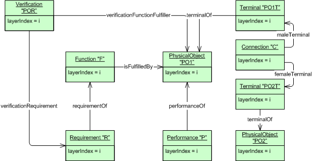
* the parent or child object properties only allow domain and range objects that have adjacent layerIndex values.
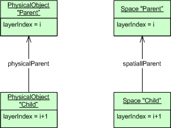

### Baselines
Baselines form another organizing principle, which often (but not necessarily) coincides with one or more layers. Where layers are not information objects themselves (only an integer attribute value) a baseline is a class with explicit links to the participating information objects of that particular baseline.
An information object can only form part of one baseline.

A baseline has a baselineStatus property of type boolean, which determines the status open ( = true) or closed ( = false).
An open baseline is open for changes (addition, deletion, updating), while a closed baseline is not. COINS compatible software should protect information objects in a closed baseline from unintentional changes. Only users of a recognized authorization level should be allowed to unlock the baseline (temporarily) and make the necessary modifications.

![Warning message of the COINS Navigator.}(./media/ClosedBaseline.png "Warning message of the COINS Navigator.")

  
### Requirements and Performances
Functional Requirements specify the function that contains them, i.e. a functional requirement belongs to exactly one function. Performances characterize the function fulfiller that contains them, i.e. a performance belongs to exactly one function fulfiller. The COINS systematics only supports a textual (human interpretable) specification of requirements and performances. As a result it is not possible to verify automatically requirements with the corresponding performances. The reference framework "Functional Specification" extends the Requirement and Performance classes with associated PropertyTypes and quantitative PropertyValue restrictions and actual values. These extensions support in principle the automatic checking of requirements and performances.

 requirements, while a function fulfiller is characterized by a set of performances.")

### Verifications
A verification asserts explicitly the conformance of a function fulfiller to a specific requirement. This assertion is the outcome of formal test procedure performed by a designated person at a certain date.
A verification will generally be associated to a certain baseline, which offers the opportunity to specify several verifications at various stages during the life cycle.

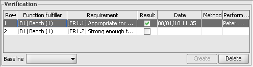

## Topological Relations

### Introduction
The COINS Building information model (CBIM) is primarily structured around an object tree. Function fulfillers are organized according the decomposition principle, i.e. part-of relationships between an assembly object (parent) and its constituting part objects (children). A part object in its turn may act as an assembly object for even smaller part objects, etcetera until atomic part objects (the leaves of the decomposition tree) are reached. Leaf objects are the basic building stones of this structure: we know either how to produce them or how to obtain from a third party (supply company). It is perfectly acceptable to restrict the backbone structure to this object tree. However, certain applications need more information then just decomposition. E.g. structural analysis or energy transmission calculations need also access to the topological structure: which part is connected to which other parts. The primary connections are defined between leaf objects on the lowest decomposition layer, although in a more abstract sense assembly objects in more higher layers could also specify connections. Because of this topological relationships can be viewed as the horizontal structuring in contrast with the vertical structuring of decomposition.

### Topological classes
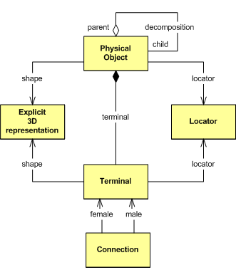
Figure 1 shows a simplified UML diagram of the topological classes and relationships of CBIM (It should be emphasized that the formal CBIM definition is in OWL. UML diagrams cannot show all particulars of the OWL specification and should only be used to get a general idea of the model architecture). A physical object (or more general a function fulfiller) may have zero or more terminals. A terminal is a surface part that potentially may link to another terminal of another physical object. If the link is deliberately established this fact is acknowledged by a connection. Connections are only allowed between physical Objects in the same decomposition layer, though they need not share the same parent object.

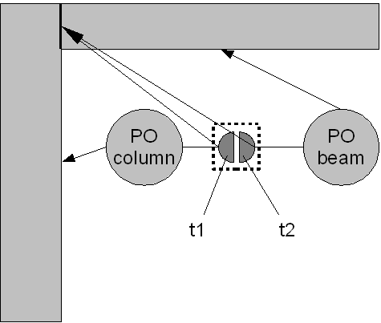
Of course, topological relationships typically have also a geometrical aspect. As the owner physical object may refer to location and shape data its terminals may also refer to locations and shapes. Yet certain restrictions should be obeyed.

The locator of a terminal should be treated as relative to the locator of the owning physical object.
The locations and primary orientations of two terminals should be the same and in line to be able to be connected. The primary orientation should be read as the normal vector on the surface. Under certain circumstances the secondary orientation (rotation around the normal vector) could be of interest. In that case the secondary orientations should also match.
The (surface) shape representation of a terminal should lie on the surface contour of the owning physical object.
The shape representations of two connected terminals should match, i.e. they are co-planar or typically refer to the same shape representation.
Connections situated on higher decomposition levels should match with the topological structure on the lowest decomposition layer. E.g. if a higher level connection is specified between two assembly objects but the child objects of those assemblies do not appear to have any branch crossing connection then this is a certainly a contradicting situation (although this may easily occur during the construction of the BIM: the requirement should therefore only be enforced on a stable state of the model). In principle higher level connections can be derived from lower level connections.

### Spatial topology
Though most applications will be interested in physical (tangible) connections, spatial topology (topological relations between two spaces and even between a physical object and a space) are also possible. Early architectural design may already specify which spaces will be adjacent to a specific space. Energy calculations may be interested to know which walls delimit a certain space and finally configuration management may need knowledge about which physical objects are situated in which space. This last topological relation is established with the situates/isSituatedIn relation between spaces and physical objects.

	
## Object Tree

### Introduction
The COINS Building information model (CBIM) is primarily structured around an object tree. function fulfillers are organized according the decomposition principle, i.e. part-of relationships between an assembly object (parent) and its constituting part objects (children). A part object in its turn may act as an assembly object for even smaller part objects, etcetera until atomic part objects (the leaves of the decomposition tree) are reached. Leaf objects are the basic building stones of this structure: we know either how to produce them or how to obtain from a third party (supply company).

### Object tree classes
Figure 1 shows the UML representation of the object tree data structure. Since Function Fulfiller is an abstract class (no instances) the actual object tree contains physical objects or spaces.

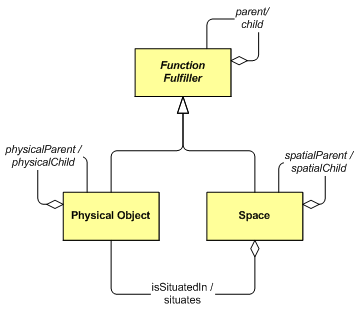

These function fulfiller types cannot be mixed, i.e. a physical object cannot decompose into spaces and vice versa. This is explicitly specified in the supproperties physicalChild/physicalParent and spatialChild/spatialParent of the child/parent relations.
The interconnection between a physical object tree and a space tree can be specified with the isSituatedIn/situates relation.

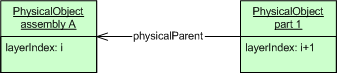 

## States

A State represents a life-cycle stage of a function fulfiller. It bundles all information that is relevant for that particular life-cycle stage. A State object cannot exist independently but is always uniquely associated with its owner function fulfiller.

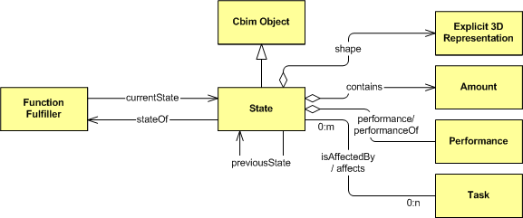 

A State has a narrow relationship with Baseline. In fact States represent the various baseline aspects of one and the same Function Fulfiller. For this reason it is recommended practice to give the State object the same name as its associated Baseline object.
A Function Fulfiller refers to its most recent State through the currentState relation. A State refers to its direct predecessor through the previousState relation. All States refer to their owner Function Fulfiller through the stateOf relation.

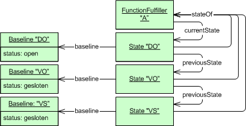 