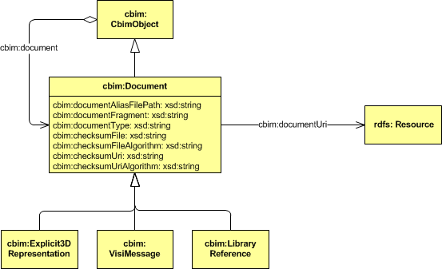
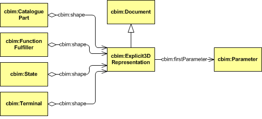

## Exchange

## COINS 1.1 container

The COINS Container is the central means of communication for object related content and associated documents between the various users/contributors of BIM data. Physically the container is a common Zip file with a predefined folder structure. At this stage three folders are recognized:

* **bim** 
In the bim folder the CBIM (sub)model can be found.
* **doc** 
The doc folder will contain all associated documents referenced from the CBIM in the bim folder. Here we may find 3D representation files, text documents, spreadsheets, etc.
* **woa** 
The woa folder is reserved for the window of authorization description file called woa.xml.

### Export procedure

A COINS Container is composed during an export procedure by a COINS compatible application or a COINS Building Information System. During the export procedure a COINS model is serialized using RDF/XML formatting into a physical file. This model file is put into the bim folder of the COINS Container file.

As part of this transfer an inventory is drawn up of all the documents that are referenced by objects in this particular model. In principle, these documents are added to the doc folder of the COINS Container file. However, if a document is only referred to by a web address then this document reference is preserved as a web link. If copies of the document are both available on the web and on the local file system of the exporting party, a choice has to be made to either reference the document with a link to a copy in the doc folder or to reference it with a web link. If different document versions are referenced as a copy in the doc folder and as a weblink the document instance in the container has precedence over the weblink document instance.

If the document file is physically into the doc folder the document object which contains the original file path to the document needs to be updated because the absolute file path is not relevant anymore. By convention the file path is reduced to just the file name. In case of documents with the same name an extra digit or letter should be added to prevent unintentional overwriting.

Exporting from a COINS Building Information System is little bit more complicated. Before the model can be serialized several filter operations are necessary:

* The export model will only contain last object versions that are non-expired.
* Previous object versions will only confuse the COINS compatible applications that are probably less sophisticated in this respect. The information of previous object versions is also not relevant in order to do their assignment correctly.
* The export model will not contain VISI messages (or other document references that contain information about how a particular object has turned up in the central model). Again, this is not relevant for COINS compatible applications.
* As a guideline it is cleaner to strip all version extensions from the export model. Version number are only meaningful within a COINS Building Information System. So for example an object with ID "http://www.example.com/COINS/testmodel.owl#_0d94476b-3b4b-4f4b-beb6-0f6973c6650a.6" is exported as "http://www.example.com/COINS/testmodel.owl#_0d94476b-3b4b-4f4b-beb6-0f6973c6650a" without the version delimiting dot and the version number itself.
* In case of a WoA (Window of Authorization) specification the objects that are marked non-accessible should be stripped from the export model. The WoA specification itself is stored in the woa folder of the COINS Container file.

### Import procedure

Importing a COINS Container is relatively simple for a COINS compatible application:

* Firstly the COINS Container is unpacked in a working directory or folder.
* This is rather straight forward since the COINS Container is an ordinary ZIP file. The result will be a set of sub-folders: at least a bim folder and possibly also a doc and/or woa folder.

Then the model file in the bim folder is loaded. After loading the document objects are updated to point with a correct absolute file path to the documents in the doc folder.
Importing a COINS Container in a COINS Building Information System is in principle the same procedure. However, normally the BIM manager will merge the contents of a COINS Container with the content of the shared project model. This means that the standard import procedure will be followed by the much more complex merge procedure. Merging is described in more detail in the Merging section of Version Management.

### Delta container
Since COINS 1.1 a COINS container may also support modifications to a an earlier communicated reference model. This container format type is called a Delta container. 

#### formaat-uitbreiding
De containerformaat-uitbreiding met deltawaarden betekent in feite dat de COINS 1.0 samenvoegingsoperatie wordt verplaatst van de ontvanger naar de verzender van de container. Onderdeel van de samenvoegingsoperatie is een vergelijking van twee modellen, namelijk het actuele model met een model dat op een eerder moment is opgeslagen. De partij die de container met delta-waarden verstuurt moet dus op basis van deze vergelijking de verschillen vaststellen en deze verschillen in de container plaatsen. In het volgende worden wat basis-mutaties bekeken.

#### Basis-mutaties

1. Nieuw object toevoegen
Het eerste voorbeeld is het meest eenvoudige geval: het toevoegen van een object aan een leeg model. Bij het samenvoegen van het vorige model (Model.0) met het actuele model (Model.1) ontstaat het samengestelde model (Model.1+0) met de 0-versie van het nieuwe object. Het verschilmodel (Model.1-0) dient ook dit nieuwe object te bevatten.

 is leeg en het actuele model (Model.1) bevat een object (object 1). De samenvoeging van deze twee modellen (Model.1+0) toont het object met versienummer 0. Het verschilmodel (Model.1-0) bevat het nieuwe object en is inhoudelijk gelijk aan Model.1.") 

<pre>&lt;?xml version="1.0"?&gt;
&lt;rdf:RDF
   xmlns:rdf="<a href="http://www.w3.org/1999/02/22-rdf-syntax-ns#" class='external free' title="http://www.w3.org/1999/02/22-rdf-syntax-ns#" rel="nofollow">http://www.w3.org/1999/02/22-rdf-syntax-ns#</a>"
   xmlns:owl="<a href="http://www.w3.org/2002/07/owl#" class='external free' title="http://www.w3.org/2002/07/owl#" rel="nofollow">http://www.w3.org/2002/07/owl#</a>"
   xmlns="<a href="http://www.coinsweb.nl/COINS-1.1/DeltaContainer/model.owl#" class='external free' title="http://www.coinsweb.nl/COINS-1.1/DeltaContainer/model.owl#" rel="nofollow">http://www.coinsweb.nl/COINS-1.1/DeltaContainer/model.owl#</a>"
   xmlns:xsd="<a href="http://www.w3.org/2001/XMLSchema#" class='external free' title="http://www.w3.org/2001/XMLSchema#" rel="nofollow">http://www.w3.org/2001/XMLSchema#</a>"
   xmlns:cbim="<a href="http://www.coinsweb.nl/c-bim.owl#" class='external free' title="http://www.coinsweb.nl/c-bim.owl#" rel="nofollow">http://www.coinsweb.nl/c-bim.owl#</a>"
   xmlns:rdfs="<a href="http://www.w3.org/2000/01/rdf-schema#" class='external free' title="http://www.w3.org/2000/01/rdf-schema#" rel="nofollow">http://www.w3.org/2000/01/rdf-schema#</a>"
 xml:base="<a href="http://www.coinsweb.nl/COINS-1.1/DeltaContainer/model.owl" class='external free' title="http://www.coinsweb.nl/COINS-1.1/DeltaContainer/model.owl" rel="nofollow">http://www.coinsweb.nl/COINS-1.1/DeltaContainer/model.owl</a>"&gt;
 &lt;owl:Ontology rdf:about=""&gt;
   &lt;owl:versionInfo rdf:datatype="<a href="http://www.w3.org/2001/XMLSchema#string" class='external free' title="http://www.w3.org/2001/XMLSchema#string" rel="nofollow">http://www.w3.org/2001/XMLSchema#string</a>"
   &gt;Created with COINS-IO API &lt;/owl:versionInfo&gt;
   &lt;owl:imports rdf:resource="<a href="http://www.coinsweb.nl/c-bim.owl" class='external free' title="http://www.coinsweb.nl/c-bim.owl" rel="nofollow">http://www.coinsweb.nl/c-bim.owl</a>"/&gt;
 &lt;/owl:Ontology&gt;
 &lt;cbim:PersonOrOrganisation rdf:ID="_cc08c019-e5a7-43c3-ba94-eac025071236.0"&gt;
   &lt;cbim:name rdf:datatype="<a href="http://www.w3.org/2001/XMLSchema#string" class='external free' title="http://www.w3.org/2001/XMLSchema#string" rel="nofollow">http://www.w3.org/2001/XMLSchema#string</a>"
   &gt;willemsph&lt;/cbim:name&gt;
   &lt;cbim:creationDate rdf:datatype="<a href="http://www.w3.org/2001/XMLSchema#dateTime" class='external free' title="http://www.w3.org/2001/XMLSchema#dateTime" rel="nofollow">http://www.w3.org/2001/XMLSchema#dateTime</a>"
   &gt;2014-02-27T10:27:23.391Z&lt;/cbim:creationDate&gt;
 &lt;/cbim:PersonOrOrganisation&gt;
&lt;/rdf:RDF&gt;
</pre>

<pre>&lt;?xml version="1.0"?&gt;
&lt;rdf:RDF
   xmlns:rdf="<a href="http://www.w3.org/1999/02/22-rdf-syntax-ns#" class='external free' title="http://www.w3.org/1999/02/22-rdf-syntax-ns#" rel="nofollow">http://www.w3.org/1999/02/22-rdf-syntax-ns#</a>"
   xmlns:owl="<a href="http://www.w3.org/2002/07/owl#" class='external free' title="http://www.w3.org/2002/07/owl#" rel="nofollow">http://www.w3.org/2002/07/owl#</a>"
   xmlns="<a href="http://www.coinsweb.nl/COINS-1.1/DeltaContainer/model.owl#" class='external free' title="http://www.coinsweb.nl/COINS-1.1/DeltaContainer/model.owl#" rel="nofollow">http://www.coinsweb.nl/COINS-1.1/DeltaContainer/model.owl#</a>"
   xmlns:xsd="<a href="http://www.w3.org/2001/XMLSchema#" class='external free' title="http://www.w3.org/2001/XMLSchema#" rel="nofollow">http://www.w3.org/2001/XMLSchema#</a>"
   xmlns:cbim="<a href="http://www.coinsweb.nl/c-bim.owl#" class='external free' title="http://www.coinsweb.nl/c-bim.owl#" rel="nofollow">http://www.coinsweb.nl/c-bim.owl#</a>"
   xmlns:rdfs="<a href="http://www.w3.org/2000/01/rdf-schema#" class='external free' title="http://www.w3.org/2000/01/rdf-schema#" rel="nofollow">http://www.w3.org/2000/01/rdf-schema#</a>"
 xml:base="<a href="http://www.coinsweb.nl/COINS-1.1/DeltaContainer/model.owl" class='external free' title="http://www.coinsweb.nl/COINS-1.1/DeltaContainer/model.owl" rel="nofollow">http://www.coinsweb.nl/COINS-1.1/DeltaContainer/model.owl</a>"&gt;
 &lt;owl:Ontology rdf:about=""&gt;
   &lt;owl:versionInfo rdf:datatype="<a href="http://www.w3.org/2001/XMLSchema#string" class='external free' title="http://www.w3.org/2001/XMLSchema#string" rel="nofollow">http://www.w3.org/2001/XMLSchema#string</a>"
   &gt;Created with COINS-IO API &lt;/owl:versionInfo&gt;
   &lt;owl:imports rdf:resource="<a href="http://www.coinsweb.nl/c-bim.owl" class='external free' title="http://www.coinsweb.nl/c-bim.owl" rel="nofollow">http://www.coinsweb.nl/c-bim.owl</a>"/&gt;
 &lt;/owl:Ontology&gt;
 &lt;cbim:PhysicalObject rdf:ID="_dad954b2-699a-4637-9a4c-f4605e24221e.0"&gt;
   &lt;cbim:layerIndex rdf:datatype="<a href="http://www.w3.org/2001/XMLSchema#int" class='external free' title="http://www.w3.org/2001/XMLSchema#int" rel="nofollow">http://www.w3.org/2001/XMLSchema#int</a>"
   &gt;0&lt;/cbim:layerIndex&gt;
   &lt;cbim:creationDate rdf:datatype="<a href="http://www.w3.org/2001/XMLSchema#dateTime" class='external free' title="http://www.w3.org/2001/XMLSchema#dateTime" rel="nofollow">http://www.w3.org/2001/XMLSchema#dateTime</a>"
   &gt;2014-02-27T10:29:56.659Z&lt;/cbim:creationDate&gt;
   &lt;cbim:creator&gt;
     &lt;cbim:PersonOrOrganisation rdf:ID="_cc08c019-e5a7-43c3-ba94-eac025071236.0"&gt;
       &lt;cbim:name rdf:datatype="<a href="http://www.w3.org/2001/XMLSchema#string" class='external free' title="http://www.w3.org/2001/XMLSchema#string" rel="nofollow">http://www.w3.org/2001/XMLSchema#string</a>"
       &gt;willemsph&lt;/cbim:name&gt;
       &lt;cbim:creationDate rdf:datatype="<a href="http://www.w3.org/2001/XMLSchema#dateTime" class='external free' title="http://www.w3.org/2001/XMLSchema#dateTime" rel="nofollow">http://www.w3.org/2001/XMLSchema#dateTime</a>"
       &gt;2014-02-27T10:27:23.391Z&lt;/cbim:creationDate&gt;
     &lt;/cbim:PersonOrOrganisation&gt;
   &lt;/cbim:creator&gt;
   &lt;cbim:name rdf:datatype="<a href="http://www.w3.org/2001/XMLSchema#string" class='external free' title="http://www.w3.org/2001/XMLSchema#string" rel="nofollow">http://www.w3.org/2001/XMLSchema#string</a>"
   &gt;Object 1&lt;/cbim:name&gt;
 &lt;/cbim:PhysicalObject&gt;
&lt;/rdf:RDF&gt;
</pre>

<pre>&lt;?xml version="1.0"?&gt;
&lt;rdf:RDF
   xmlns:rdf="<a href="http://www.w3.org/1999/02/22-rdf-syntax-ns#" class='external free' title="http://www.w3.org/1999/02/22-rdf-syntax-ns#" rel="nofollow">http://www.w3.org/1999/02/22-rdf-syntax-ns#</a>"
   xmlns:owl="<a href="http://www.w3.org/2002/07/owl#" class='external free' title="http://www.w3.org/2002/07/owl#" rel="nofollow">http://www.w3.org/2002/07/owl#</a>"
   xmlns="<a href="http://www.coinsweb.nl/COINS-1.1/DeltaContainer/model.owl#" class='external free' title="http://www.coinsweb.nl/COINS-1.1/DeltaContainer/model.owl#" rel="nofollow">http://www.coinsweb.nl/COINS-1.1/DeltaContainer/model.owl#</a>"
   xmlns:xsd="<a href="http://www.w3.org/2001/XMLSchema#" class='external free' title="http://www.w3.org/2001/XMLSchema#" rel="nofollow">http://www.w3.org/2001/XMLSchema#</a>"
   xmlns:cbim="<a href="http://www.coinsweb.nl/c-bim.owl#" class='external free' title="http://www.coinsweb.nl/c-bim.owl#" rel="nofollow">http://www.coinsweb.nl/c-bim.owl#</a>"
   xmlns:rdfs="<a href="http://www.w3.org/2000/01/rdf-schema#" class='external free' title="http://www.w3.org/2000/01/rdf-schema#" rel="nofollow">http://www.w3.org/2000/01/rdf-schema#</a>"
 xml:base="<a href="http://www.coinsweb.nl/COINS-1.1/DeltaContainer/model.owl" class='external free' title="http://www.coinsweb.nl/COINS-1.1/DeltaContainer/model.owl" rel="nofollow">http://www.coinsweb.nl/COINS-1.1/DeltaContainer/model.owl</a>"&gt;
 &lt;owl:Ontology rdf:about=""&gt;
   &lt;owl:versionInfo rdf:datatype="<a href="http://www.w3.org/2001/XMLSchema#string" class='external free' title="http://www.w3.org/2001/XMLSchema#string" rel="nofollow">http://www.w3.org/2001/XMLSchema#string</a>"
   &gt;Created with COINS-IO API &lt;/owl:versionInfo&gt;
   &lt;owl:imports rdf:resource="<a href="http://www.coinsweb.nl/c-bim.owl" class='external free' title="http://www.coinsweb.nl/c-bim.owl" rel="nofollow">http://www.coinsweb.nl/c-bim.owl</a>"/&gt;
 &lt;/owl:Ontology&gt;
 &lt;cbim:PhysicalObject rdf:ID="_dad954b2-699a-4637-9a4c-f4605e24221e.0"&gt;
   &lt;cbim:creator&gt;
     &lt;cbim:PersonOrOrganisation rdf:ID="_cc08c019-e5a7-43c3-ba94-eac025071236.0"&gt;
       &lt;cbim:name rdf:datatype="<a href="http://www.w3.org/2001/XMLSchema#string" class='external free' title="http://www.w3.org/2001/XMLSchema#string" rel="nofollow">http://www.w3.org/2001/XMLSchema#string</a>"
       &gt;willemsph&lt;/cbim:name&gt;
       &lt;cbim:creationDate rdf:datatype="<a href="http://www.w3.org/2001/XMLSchema#dateTime" class='external free' title="http://www.w3.org/2001/XMLSchema#dateTime" rel="nofollow">http://www.w3.org/2001/XMLSchema#dateTime</a>"
       &gt;2014-02-27T10:27:23.391Z&lt;/cbim:creationDate&gt;
     &lt;/cbim:PersonOrOrganisation&gt;
   &lt;/cbim:creator&gt;
   &lt;cbim:name rdf:datatype="<a href="http://www.w3.org/2001/XMLSchema#string" class='external free' title="http://www.w3.org/2001/XMLSchema#string" rel="nofollow">http://www.w3.org/2001/XMLSchema#string</a>"
   &gt;Object 1&lt;/cbim:name&gt;
   &lt;cbim:document&gt;
     &lt;cbim:VisiMessage rdf:ID="_55379f23-29b0-499f-9abe-66ee1916190b.0"&gt;
       &lt;cbim:description rdf:datatype="<a href="http://www.w3.org/2001/XMLSchema#string" class='external free' title="http://www.w3.org/2001/XMLSchema#string" rel="nofollow">http://www.w3.org/2001/XMLSchema#string</a>"
       &gt;27-Feb-2014 11:31:51&lt;/cbim:description&gt;
       &lt;cbim:name rdf:datatype="<a href="http://www.w3.org/2001/XMLSchema#string" class='external free' title="http://www.w3.org/2001/XMLSchema#string" rel="nofollow">http://www.w3.org/2001/XMLSchema#string</a>"
       &gt;VISI&lt;/cbim:name&gt;
       &lt;cbim:creationDate rdf:datatype="<a href="http://www.w3.org/2001/XMLSchema#dateTime" class='external free' title="http://www.w3.org/2001/XMLSchema#dateTime" rel="nofollow">http://www.w3.org/2001/XMLSchema#dateTime</a>"
       &gt;2014-02-27T10:31:51.697Z&lt;/cbim:creationDate&gt;
       &lt;cbim:creator rdf:resource="#_cc08c019-e5a7-43c3-ba94-eac025071236.0"/&gt;
     &lt;/cbim:VisiMessage&gt;
   &lt;/cbim:document&gt;
   &lt;cbim:layerIndex rdf:datatype="<a href="http://www.w3.org/2001/XMLSchema#int" class='external free' title="http://www.w3.org/2001/XMLSchema#int" rel="nofollow">http://www.w3.org/2001/XMLSchema#int</a>"
   &gt;0&lt;/cbim:layerIndex&gt;
   &lt;cbim:creationDate rdf:datatype="<a href="http://www.w3.org/2001/XMLSchema#dateTime" class='external free' title="http://www.w3.org/2001/XMLSchema#dateTime" rel="nofollow">http://www.w3.org/2001/XMLSchema#dateTime</a>"
   &gt;2014-02-27T10:29:56.659Z&lt;/cbim:creationDate&gt;
 &lt;/cbim:PhysicalObject&gt;
&lt;/rdf:RDF&gt;
</pre>

<pre>&lt;?xml version="1.0"?&gt;
&lt;rdf:RDF
   xmlns="<a href="http://www.coinsweb.nl/COINS-1.1/DeltaContainer/model.1-0.owl#" class='external free' title="http://www.coinsweb.nl/COINS-1.1/DeltaContainer/model.1-0.owl#" rel="nofollow">http://www.coinsweb.nl/COINS-1.1/DeltaContainer/model.1-0.owl#</a>"
   xmlns:rdf="<a href="http://www.w3.org/1999/02/22-rdf-syntax-ns#" class='external free' title="http://www.w3.org/1999/02/22-rdf-syntax-ns#" rel="nofollow">http://www.w3.org/1999/02/22-rdf-syntax-ns#</a>"
   xmlns:owl="<a href="http://www.w3.org/2002/07/owl#" class='external free' title="http://www.w3.org/2002/07/owl#" rel="nofollow">http://www.w3.org/2002/07/owl#</a>"
   xmlns:xsd="<a href="http://www.w3.org/2001/XMLSchema#" class='external free' title="http://www.w3.org/2001/XMLSchema#" rel="nofollow">http://www.w3.org/2001/XMLSchema#</a>"
   xmlns:cbim="<a href="http://www.coinsweb.nl/c-bim.owl#" class='external free' title="http://www.coinsweb.nl/c-bim.owl#" rel="nofollow">http://www.coinsweb.nl/c-bim.owl#</a>"
   xmlns:rdfs="<a href="http://www.w3.org/2000/01/rdf-schema#" class='external free' title="http://www.w3.org/2000/01/rdf-schema#" rel="nofollow">http://www.w3.org/2000/01/rdf-schema#</a>"
 xml:base="<a href="http://www.coinsweb.nl/COINS-1.1/DeltaContainer/model.1-0.owl" class='external free' title="http://www.coinsweb.nl/COINS-1.1/DeltaContainer/model.1-0.owl" rel="nofollow">http://www.coinsweb.nl/COINS-1.1/DeltaContainer/model.1-0.owl</a>"&gt;
 &lt;owl:Ontology rdf:about=""&gt;
   &lt;owl:imports rdf:resource="<a href="http://www.coinsweb.nl/c-bim.owl" class='external free' title="http://www.coinsweb.nl/c-bim.owl" rel="nofollow">http://www.coinsweb.nl/c-bim.owl</a>"/&gt;
   &lt;owl:versionInfo rdf:datatype="<a href="http://www.w3.org/2001/XMLSchema#string" class='external free' title="http://www.w3.org/2001/XMLSchema#string" rel="nofollow">http://www.w3.org/2001/XMLSchema#string</a>"
   &gt;Created with COINS-IO API &lt;/owl:versionInfo&gt;
 &lt;/owl:Ontology&gt;
 &lt;cbim:PhysicalObject rdf:ID="_dad954b2-699a-4637-9a4c-f4605e24221e.0"&gt;
   &lt;cbim:creator&gt;
     &lt;cbim:PersonOrOrganisation rdf:ID="_cc08c019-e5a7-43c3-ba94-eac025071236.0"/&gt;
   &lt;/cbim:creator&gt;
   &lt;cbim:name rdf:datatype="<a href="http://www.w3.org/2001/XMLSchema#string" class='external free' title="http://www.w3.org/2001/XMLSchema#string" rel="nofollow">http://www.w3.org/2001/XMLSchema#string</a>"
   &gt;Object 1&lt;/cbim:name&gt;
   &lt;cbim:creationDate rdf:datatype="<a href="http://www.w3.org/2001/XMLSchema#dateTime" class='external free' title="http://www.w3.org/2001/XMLSchema#dateTime" rel="nofollow">http://www.w3.org/2001/XMLSchema#dateTime</a>"
   &gt;2014-02-27T10:29:56.659Z&lt;/cbim:creationDate&gt;
   &lt;cbim:layerIndex rdf:datatype="<a href="http://www.w3.org/2001/XMLSchema#int" class='external free' title="http://www.w3.org/2001/XMLSchema#int" rel="nofollow">http://www.w3.org/2001/XMLSchema#int</a>"
   &gt;0&lt;/cbim:layerIndex&gt;
 &lt;/cbim:PhysicalObject&gt;
&lt;/rdf:RDF&gt;
</pre>

 leeg is is in dit bijzondere geval het verschilmodel (1-0) gelijk aan het actuele model (1). Het linken aan een creator-PersonOrOrganisation is standaard in COINS 1.0. De COINS Navigator creëert dit object automatisch bij een nieuw model.") 

2. Nieuw object toevoegen en verbinden met een bestaand object
Aan het bestaande model met een object (object 1) wordt een nieuw object (object 2) toegevoegd en verbonden met een part-of (parent) relatie.

 bevat ook het oorspronkelijke, niet verbonden object maar nu gemarkeerd als “expired”. De actuele versie van dit object (1) is verbonden met het nieuwe object. Het verschilmodel (Model.2-1) bevat het oorspronkelijke object verbonden met het nieuwe object.") 

<pre>&lt;?xml version="1.0"?&gt;
&lt;rdf:RDF
   xmlns:rdf="<a href="http://www.w3.org/1999/02/22-rdf-syntax-ns#" class='external free' title="http://www.w3.org/1999/02/22-rdf-syntax-ns#" rel="nofollow">http://www.w3.org/1999/02/22-rdf-syntax-ns#</a>"
   xmlns:owl="<a href="http://www.w3.org/2002/07/owl#" class='external free' title="http://www.w3.org/2002/07/owl#" rel="nofollow">http://www.w3.org/2002/07/owl#</a>"
   xmlns="<a href="http://www.coinsweb.nl/COINS-1.1/DeltaContainer/model.owl#" class='external free' title="http://www.coinsweb.nl/COINS-1.1/DeltaContainer/model.owl#" rel="nofollow">http://www.coinsweb.nl/COINS-1.1/DeltaContainer/model.owl#</a>"
   xmlns:xsd="<a href="http://www.w3.org/2001/XMLSchema#" class='external free' title="http://www.w3.org/2001/XMLSchema#" rel="nofollow">http://www.w3.org/2001/XMLSchema#</a>"
   xmlns:cbim="<a href="http://www.coinsweb.nl/c-bim.owl#" class='external free' title="http://www.coinsweb.nl/c-bim.owl#" rel="nofollow">http://www.coinsweb.nl/c-bim.owl#</a>"
   xmlns:rdfs="<a href="http://www.w3.org/2000/01/rdf-schema#" class='external free' title="http://www.w3.org/2000/01/rdf-schema#" rel="nofollow">http://www.w3.org/2000/01/rdf-schema#</a>"
 xml:base="<a href="http://www.coinsweb.nl/COINS-1.1/DeltaContainer/model.owl" class='external free' title="http://www.coinsweb.nl/COINS-1.1/DeltaContainer/model.owl" rel="nofollow">http://www.coinsweb.nl/COINS-1.1/DeltaContainer/model.owl</a>"&gt;
 &lt;owl:Ontology rdf:about=""&gt;
   &lt;owl:imports rdf:resource="<a href="http://www.coinsweb.nl/c-bim.owl" class='external free' title="http://www.coinsweb.nl/c-bim.owl" rel="nofollow">http://www.coinsweb.nl/c-bim.owl</a>"/&gt;
   &lt;owl:versionInfo rdf:datatype="<a href="http://www.w3.org/2001/XMLSchema#string" class='external free' title="http://www.w3.org/2001/XMLSchema#string" rel="nofollow">http://www.w3.org/2001/XMLSchema#string</a>"
   &gt;Created with COINS-IO API &lt;/owl:versionInfo&gt;
 &lt;/owl:Ontology&gt;
 &lt;cbim:PhysicalObject rdf:ID="_060f8f3d-5f7a-45bd-99ed-5f7478bd5591.0"&gt;
   &lt;cbim:name rdf:datatype="<a href="http://www.w3.org/2001/XMLSchema#string" class='external free' title="http://www.w3.org/2001/XMLSchema#string" rel="nofollow">http://www.w3.org/2001/XMLSchema#string</a>"
   &gt;Object 2&lt;/cbim:name&gt;
   &lt;cbim:physicalParent&gt;
     &lt;cbim:PhysicalObject rdf:ID="_dad954b2-699a-4637-9a4c-f4605e24221e.0"&gt;
       &lt;cbim:name rdf:datatype="<a href="http://www.w3.org/2001/XMLSchema#string" class='external free' title="http://www.w3.org/2001/XMLSchema#string" rel="nofollow">http://www.w3.org/2001/XMLSchema#string</a>"
       &gt;Object 1&lt;/cbim:name&gt;
       &lt;cbim:creator&gt;
         &lt;cbim:PersonOrOrganisation 
           rdf:ID="_cc08c019-e5a7-43c3-ba94-eac025071236.0"&gt;
           &lt;cbim:creationDate 
      rdf:datatype="<a href="http://www.w3.org/2001/XMLSchema#dateTime" class='external free' title="http://www.w3.org/2001/XMLSchema#dateTime" rel="nofollow">http://www.w3.org/2001/XMLSchema#dateTime</a>"
           &gt;2014-02-27T10:27:23.391Z&lt;/cbim:creationDate&gt;
           &lt;cbim:name rdf:datatype="<a href="http://www.w3.org/2001/XMLSchema#string" class='external free' title="http://www.w3.org/2001/XMLSchema#string" rel="nofollow">http://www.w3.org/2001/XMLSchema#string</a>"
           &gt;willemsph&lt;/cbim:name&gt;
         &lt;/cbim:PersonOrOrganisation&gt;
       &lt;/cbim:creator&gt;
       &lt;cbim:creationDate rdf:datatype="<a href="http://www.w3.org/2001/XMLSchema#dateTime" class='external free' title="http://www.w3.org/2001/XMLSchema#dateTime" rel="nofollow">http://www.w3.org/2001/XMLSchema#dateTime</a>"
       &gt;2014-02-27T10:29:56.659Z&lt;/cbim:creationDate&gt;
       &lt;cbim:layerIndex rdf:datatype="<a href="http://www.w3.org/2001/XMLSchema#int" class='external free' title="http://www.w3.org/2001/XMLSchema#int" rel="nofollow">http://www.w3.org/2001/XMLSchema#int</a>"
       &gt;0&lt;/cbim:layerIndex&gt;
     &lt;/cbim:PhysicalObject&gt;
   &lt;/cbim:physicalParent&gt;
   &lt;cbim:creator rdf:resource="#_cc08c019-e5a7-43c3-ba94-eac025071236.0"/&gt;
   &lt;cbim:creationDate rdf:datatype="<a href="http://www.w3.org/2001/XMLSchema#dateTime" class='external free' title="http://www.w3.org/2001/XMLSchema#dateTime" rel="nofollow">http://www.w3.org/2001/XMLSchema#dateTime</a>"
   &gt;2014-02-27T13:11:49.569Z&lt;/cbim:creationDate&gt;
   &lt;cbim:layerIndex rdf:datatype="<a href="http://www.w3.org/2001/XMLSchema#int" class='external free' title="http://www.w3.org/2001/XMLSchema#int" rel="nofollow">http://www.w3.org/2001/XMLSchema#int</a>"
   &gt;1&lt;/cbim:layerIndex&gt;
 &lt;/cbim:PhysicalObject&gt;
&lt;/rdf:RDF&gt;
</pre>

<pre>&lt;?xml version="1.0"?&gt;
&lt;rdf:RDF
   xmlns:rdf="<a href="http://www.w3.org/1999/02/22-rdf-syntax-ns#" class='external free' title="http://www.w3.org/1999/02/22-rdf-syntax-ns#" rel="nofollow">http://www.w3.org/1999/02/22-rdf-syntax-ns#</a>"
   xmlns:owl="<a href="http://www.w3.org/2002/07/owl#" class='external free' title="http://www.w3.org/2002/07/owl#" rel="nofollow">http://www.w3.org/2002/07/owl#</a>"
   xmlns="<a href="http://www.coinsweb.nl/COINS-1.1/DeltaContainer/model.owl#" class='external free' title="http://www.coinsweb.nl/COINS-1.1/DeltaContainer/model.owl#" rel="nofollow">http://www.coinsweb.nl/COINS-1.1/DeltaContainer/model.owl#</a>"
   xmlns:xsd="<a href="http://www.w3.org/2001/XMLSchema#" class='external free' title="http://www.w3.org/2001/XMLSchema#" rel="nofollow">http://www.w3.org/2001/XMLSchema#</a>"
   xmlns:cbim="<a href="http://www.coinsweb.nl/c-bim.owl#" class='external free' title="http://www.coinsweb.nl/c-bim.owl#" rel="nofollow">http://www.coinsweb.nl/c-bim.owl#</a>"
   xmlns:rdfs="<a href="http://www.w3.org/2000/01/rdf-schema#" class='external free' title="http://www.w3.org/2000/01/rdf-schema#" rel="nofollow">http://www.w3.org/2000/01/rdf-schema#</a>"
 xml:base="<a href="http://www.coinsweb.nl/COINS-1.1/DeltaContainer/model.owl" class='external free' title="http://www.coinsweb.nl/COINS-1.1/DeltaContainer/model.owl" rel="nofollow">http://www.coinsweb.nl/COINS-1.1/DeltaContainer/model.owl</a>"&gt;
 &lt;owl:Ontology rdf:about=""&gt;
   &lt;owl:imports rdf:resource="<a href="http://www.coinsweb.nl/c-bim.owl" class='external free' title="http://www.coinsweb.nl/c-bim.owl" rel="nofollow">http://www.coinsweb.nl/c-bim.owl</a>"/&gt;
   &lt;owl:versionInfo rdf:datatype="<a href="http://www.w3.org/2001/XMLSchema#string" class='external free' title="http://www.w3.org/2001/XMLSchema#string" rel="nofollow">http://www.w3.org/2001/XMLSchema#string</a>"
   &gt;Created with COINS-IO API &lt;/owl:versionInfo&gt;
 &lt;/owl:Ontology&gt;
 &lt;cbim:PhysicalObject rdf:ID="_060f8f3d-5f7a-45bd-99ed-5f7478bd5591.0"&gt;
   &lt;cbim:physicalParent&gt;
     &lt;cbim:PhysicalObject rdf:ID="_dad954b2-699a-4637-9a4c-f4605e24221e.1"&gt;
       &lt;cbim:creator&gt;
         &lt;cbim:PersonOrOrganisation rdf:ID="_cc08c019-e5a7-43c3-ba94-eac025071236.0"&gt;
           &lt;cbim:creationDate rdf:datatype="<a href="http://www.w3.org/2001/XMLSchema#dateTime" class='external free' title="http://www.w3.org/2001/XMLSchema#dateTime" rel="nofollow">http://www.w3.org/2001/XMLSchema#dateTime</a>"
           &gt;2014-02-27T10:27:23.391Z&lt;/cbim:creationDate&gt;
           &lt;cbim:name rdf:datatype="<a href="http://www.w3.org/2001/XMLSchema#string" class='external free' title="http://www.w3.org/2001/XMLSchema#string" rel="nofollow">http://www.w3.org/2001/XMLSchema#string</a>"
           &gt;willemsph&lt;/cbim:name&gt;
         &lt;/cbim:PersonOrOrganisation&gt;
       &lt;/cbim:creator&gt;
       &lt;cbim:document&gt;
         &lt;cbim:VisiMessage rdf:ID="_333ba994-cab8-4e98-a39f-a0008e4ed520.0"&gt;
           &lt;cbim:description rdf:datatype="<a href="http://www.w3.org/2001/XMLSchema#string" class='external free' title="http://www.w3.org/2001/XMLSchema#string" rel="nofollow">http://www.w3.org/2001/XMLSchema#string</a>"
           &gt;27-Feb-2014 14:13:44&lt;/cbim:description&gt;
           &lt;cbim:name rdf:datatype="<a href="http://www.w3.org/2001/XMLSchema#string" class='external free' title="http://www.w3.org/2001/XMLSchema#string" rel="nofollow">http://www.w3.org/2001/XMLSchema#string</a>"
           &gt;VISI&lt;/cbim:name&gt;
           &lt;cbim:creationDate rdf:datatype="<a href="http://www.w3.org/2001/XMLSchema#dateTime" class='external free' title="http://www.w3.org/2001/XMLSchema#dateTime" rel="nofollow">http://www.w3.org/2001/XMLSchema#dateTime</a>"
           &gt;2014-02-27T13:13:44.702Z&lt;/cbim:creationDate&gt;
           &lt;cbim:creator rdf:resource="#_cc08c019-e5a7-43c3-ba94-eac025071236.0"/&gt;
         &lt;/cbim:VisiMessage&gt;
       &lt;/cbim:document&gt;
       &lt;cbim:name rdf:datatype="<a href="http://www.w3.org/2001/XMLSchema#string" class='external free' title="http://www.w3.org/2001/XMLSchema#string" rel="nofollow">http://www.w3.org/2001/XMLSchema#string</a>"
       &gt;Object 1&lt;/cbim:name&gt;
       &lt;cbim:modificationDate rdf:datatype="<a href="http://www.w3.org/2001/XMLSchema#dateTime" class='external free' title="http://www.w3.org/2001/XMLSchema#dateTime" rel="nofollow">http://www.w3.org/2001/XMLSchema#dateTime</a>"
       &gt;2014-02-27T13:13:44.702Z&lt;/cbim:modificationDate&gt;
       &lt;cbim:layerIndex rdf:datatype="<a href="http://www.w3.org/2001/XMLSchema#int" class='external free' title="http://www.w3.org/2001/XMLSchema#int" rel="nofollow">http://www.w3.org/2001/XMLSchema#int</a>"
       &gt;0&lt;/cbim:layerIndex&gt;
       &lt;cbim:creationDate rdf:datatype="<a href="http://www.w3.org/2001/XMLSchema#dateTime" class='external free' title="http://www.w3.org/2001/XMLSchema#dateTime" rel="nofollow">http://www.w3.org/2001/XMLSchema#dateTime</a>"
       &gt;2014-02-27T10:29:56.659Z&lt;/cbim:creationDate&gt;
     &lt;/cbim:PhysicalObject&gt;
   &lt;/cbim:physicalParent&gt;
   &lt;cbim:creator rdf:resource="#_cc08c019-e5a7-43c3-ba94-eac025071236.0"/&gt;
   &lt;cbim:name rdf:datatype="<a href="http://www.w3.org/2001/XMLSchema#string" class='external free' title="http://www.w3.org/2001/XMLSchema#string" rel="nofollow">http://www.w3.org/2001/XMLSchema#string</a>"
   &gt;Object 2&lt;/cbim:name&gt;
   &lt;cbim:document rdf:resource="#_333ba994-cab8-4e98-a39f-a0008e4ed520.0"/&gt;
   &lt;cbim:layerIndex rdf:datatype="<a href="http://www.w3.org/2001/XMLSchema#int" class='external free' title="http://www.w3.org/2001/XMLSchema#int" rel="nofollow">http://www.w3.org/2001/XMLSchema#int</a>"
   &gt;1&lt;/cbim:layerIndex&gt;
   &lt;cbim:creationDate rdf:datatype="<a href="http://www.w3.org/2001/XMLSchema#dateTime" class='external free' title="http://www.w3.org/2001/XMLSchema#dateTime" rel="nofollow">http://www.w3.org/2001/XMLSchema#dateTime</a>"
   &gt;2014-02-27T13:11:49.569Z&lt;/cbim:creationDate&gt;
 &lt;/cbim:PhysicalObject&gt;
 &lt;cbim:PhysicalObject rdf:ID="_dad954b2-699a-4637-9a4c-f4605e24221e.0"&gt;
   &lt;cbim:expired rdf:datatype="<a href="http://www.w3.org/2001/XMLSchema#boolean" class='external free' title="http://www.w3.org/2001/XMLSchema#boolean" rel="nofollow">http://www.w3.org/2001/XMLSchema#boolean</a>"
   &gt;true&lt;/cbim:expired&gt;
   &lt;cbim:nextVersion rdf:resource="#_dad954b2-699a-4637-9a4c-f4605e24221e.1"/&gt;
   &lt;cbim:name rdf:datatype="<a href="http://www.w3.org/2001/XMLSchema#string" class='external free' title="http://www.w3.org/2001/XMLSchema#string" rel="nofollow">http://www.w3.org/2001/XMLSchema#string</a>"
   &gt;Object 1&lt;/cbim:name&gt;
   &lt;cbim:creator rdf:resource="#_cc08c019-e5a7-43c3-ba94-eac025071236.0"/&gt;
   &lt;cbim:creationDate rdf:datatype="<a href="http://www.w3.org/2001/XMLSchema#dateTime" class='external free' title="http://www.w3.org/2001/XMLSchema#dateTime" rel="nofollow">http://www.w3.org/2001/XMLSchema#dateTime</a>"
   &gt;2014-02-27T10:29:56.659Z&lt;/cbim:creationDate&gt;
   &lt;cbim:layerIndex rdf:datatype="<a href="http://www.w3.org/2001/XMLSchema#int" class='external free' title="http://www.w3.org/2001/XMLSchema#int" rel="nofollow">http://www.w3.org/2001/XMLSchema#int</a>"
   &gt;0&lt;/cbim:layerIndex&gt;
 &lt;/cbim:PhysicalObject&gt;
&lt;/rdf:RDF&gt;
</pre>

<pre>&lt;?xml version="1.0"?&gt;
&lt;rdf:RDF
   xmlns:rdf="<a href="http://www.w3.org/1999/02/22-rdf-syntax-ns#" class='external free' title="http://www.w3.org/1999/02/22-rdf-syntax-ns#" rel="nofollow">http://www.w3.org/1999/02/22-rdf-syntax-ns#</a>"
   xmlns:owl="<a href="http://www.w3.org/2002/07/owl#" class='external free' title="http://www.w3.org/2002/07/owl#" rel="nofollow">http://www.w3.org/2002/07/owl#</a>"
   xmlns:xsd="<a href="http://www.w3.org/2001/XMLSchema#" class='external free' title="http://www.w3.org/2001/XMLSchema#" rel="nofollow">http://www.w3.org/2001/XMLSchema#</a>"
   xmlns:cbim="<a href="http://www.coinsweb.nl/c-bim.owl#" class='external free' title="http://www.coinsweb.nl/c-bim.owl#" rel="nofollow">http://www.coinsweb.nl/c-bim.owl#</a>"
   xmlns="<a href="http://www.coinsweb.nl/COINS-1.1/DeltaContainer/model.2-1.owl#" class='external free' title="http://www.coinsweb.nl/COINS-1.1/DeltaContainer/model.2-1.owl#" rel="nofollow">http://www.coinsweb.nl/COINS-1.1/DeltaContainer/model.2-1.owl#</a>"
   xmlns:rdfs="<a href="http://www.w3.org/2000/01/rdf-schema#" class='external free' title="http://www.w3.org/2000/01/rdf-schema#" rel="nofollow">http://www.w3.org/2000/01/rdf-schema#</a>"
 xml:base="<a href="http://www.coinsweb.nl/COINS-1.1/DeltaContainer/model.2-1.owl" class='external free' title="http://www.coinsweb.nl/COINS-1.1/DeltaContainer/model.2-1.owl" rel="nofollow">http://www.coinsweb.nl/COINS-1.1/DeltaContainer/model.2-1.owl</a>"&gt;
 &lt;owl:Ontology rdf:about=""&gt;
   &lt;owl:imports rdf:resource="<a href="http://www.coinsweb.nl/c-bim.owl" class='external free' title="http://www.coinsweb.nl/c-bim.owl" rel="nofollow">http://www.coinsweb.nl/c-bim.owl</a>"/&gt;
   &lt;owl:versionInfo rdf:datatype="<a href="http://www.w3.org/2001/XMLSchema#string" class='external free' title="http://www.w3.org/2001/XMLSchema#string" rel="nofollow">http://www.w3.org/2001/XMLSchema#string</a>"
   &gt;Created with COINS-IO API &lt;/owl:versionInfo&gt;
 &lt;/owl:Ontology&gt;
 &lt;cbim:PhysicalObject rdf:ID="_060f8f3d-5f7a-45bd-99ed-5f7478bd5591.0"&gt;
   &lt;cbim:creator&gt;
     &lt;cbim:PersonOrOrganisation rdf:ID="_cc08c019-e5a7-43c3-ba94-eac025071236.0"/&gt;
   &lt;/cbim:creator&gt;
   &lt;cbim:physicalParent&gt;
     &lt;cbim:PhysicalObject rdf:ID="_dad954b2-699a-4637-9a4c-f4605e24221e.0"/&gt;
   &lt;/cbim:physicalParent&gt;
   &lt;cbim:name rdf:datatype="<a href="http://www.w3.org/2001/XMLSchema#string" class='external free' title="http://www.w3.org/2001/XMLSchema#string" rel="nofollow">http://www.w3.org/2001/XMLSchema#string</a>"
   &gt;Object 2&lt;/cbim:name&gt;
   &lt;cbim:creationDate rdf:datatype="<a href="http://www.w3.org/2001/XMLSchema#dateTime" class='external free' title="http://www.w3.org/2001/XMLSchema#dateTime" rel="nofollow">http://www.w3.org/2001/XMLSchema#dateTime</a>"
   &gt;2014-02-27T13:11:49.569Z&lt;/cbim:creationDate&gt;
   &lt;cbim:layerIndex rdf:datatype="<a href="http://www.w3.org/2001/XMLSchema#int" class='external free' title="http://www.w3.org/2001/XMLSchema#int" rel="nofollow">http://www.w3.org/2001/XMLSchema#int</a>"
   &gt;1&lt;/cbim:layerIndex&gt;
 &lt;/cbim:PhysicalObject&gt;
&lt;/rdf:RDF&gt;
</pre>

 

Het verschilmodel bevat zowel het oorspronkelijke object (object 1) als het nieuwe object (object 2). De noodzaak om ook object 1 aan het verschilmodel toe te voegen vergt wat uitleg. Men kan redeneren dat het feit dat object 2 naar object 1 verwijst geen verandering van object 1 is. Maar zonder de aanwezigheid van object 1 kan deze relatie niet gespecificeerd worden. Dat in het samenvoegingsmodel voor object 1 een nieuwe versie (1) ontstaat heeft te maken met het feit dat de parent-relatie een expliciete inverse heeft, de relatie is dus bi-directioneel en daarom geldt dit ook als een mutatie van object 1.

3. Verwijderen van een object en (impliciet) zijn relatie met een ander object
In deze stap wordt het laatst toegevoegde object weer verwijderd. In het samenvoegingsmodel worden beide objecten “expired” verklaard maar alleen van object 1 wordt een nieuwe versie (1) aangemaakt.

 

<pre>&lt;?xml version="1.0"?&gt;
&lt;rdf:RDF
   xmlns:rdf="<a href="http://www.w3.org/1999/02/22-rdf-syntax-ns#" class='external free' title="http://www.w3.org/1999/02/22-rdf-syntax-ns#" rel="nofollow">http://www.w3.org/1999/02/22-rdf-syntax-ns#</a>"
   xmlns:owl="<a href="http://www.w3.org/2002/07/owl#" class='external free' title="http://www.w3.org/2002/07/owl#" rel="nofollow">http://www.w3.org/2002/07/owl#</a>"
   xmlns="<a href="http://www.coinsweb.nl/COINS-1.1/DeltaContainer/model.owl#" class='external free' title="http://www.coinsweb.nl/COINS-1.1/DeltaContainer/model.owl#" rel="nofollow">http://www.coinsweb.nl/COINS-1.1/DeltaContainer/model.owl#</a>"
   xmlns:xsd="<a href="http://www.w3.org/2001/XMLSchema#" class='external free' title="http://www.w3.org/2001/XMLSchema#" rel="nofollow">http://www.w3.org/2001/XMLSchema#</a>"
   xmlns:cbim="<a href="http://www.coinsweb.nl/c-bim.owl#" class='external free' title="http://www.coinsweb.nl/c-bim.owl#" rel="nofollow">http://www.coinsweb.nl/c-bim.owl#</a>"
   xmlns:rdfs="<a href="http://www.w3.org/2000/01/rdf-schema#" class='external free' title="http://www.w3.org/2000/01/rdf-schema#" rel="nofollow">http://www.w3.org/2000/01/rdf-schema#</a>"
 xml:base="<a href="http://www.coinsweb.nl/COINS-1.1/DeltaContainer/model.owl" class='external free' title="http://www.coinsweb.nl/COINS-1.1/DeltaContainer/model.owl" rel="nofollow">http://www.coinsweb.nl/COINS-1.1/DeltaContainer/model.owl</a>"&gt;
 &lt;owl:Ontology rdf:about=""&gt;
   &lt;owl:versionInfo rdf:datatype="<a href="http://www.w3.org/2001/XMLSchema#string" class='external free' title="http://www.w3.org/2001/XMLSchema#string" rel="nofollow">http://www.w3.org/2001/XMLSchema#string</a>"
   &gt;Created with COINS-IO API &lt;/owl:versionInfo&gt;
   &lt;owl:imports rdf:resource="<a href="http://www.coinsweb.nl/c-bim.owl" class='external free' title="http://www.coinsweb.nl/c-bim.owl" rel="nofollow">http://www.coinsweb.nl/c-bim.owl</a>"/&gt;
 &lt;/owl:Ontology&gt;
 &lt;cbim:PhysicalObject rdf:ID="_dad954b2-699a-4637-9a4c-f4605e24221e.0"&gt;
   &lt;cbim:layerIndex rdf:datatype="<a href="http://www.w3.org/2001/XMLSchema#int" class='external free' title="http://www.w3.org/2001/XMLSchema#int" rel="nofollow">http://www.w3.org/2001/XMLSchema#int</a>"
   &gt;0&lt;/cbim:layerIndex&gt;
   &lt;cbim:creationDate rdf:datatype="<a href="http://www.w3.org/2001/XMLSchema#dateTime" class='external free' title="http://www.w3.org/2001/XMLSchema#dateTime" rel="nofollow">http://www.w3.org/2001/XMLSchema#dateTime</a>"
   &gt;2014-02-27T10:29:56.659Z&lt;/cbim:creationDate&gt;
   &lt;cbim:creator&gt;
     &lt;cbim:PersonOrOrganisation rdf:ID="_cc08c019-e5a7-43c3-ba94-eac025071236.0"&gt;
       &lt;cbim:name rdf:datatype="<a href="http://www.w3.org/2001/XMLSchema#string" class='external free' title="http://www.w3.org/2001/XMLSchema#string" rel="nofollow">http://www.w3.org/2001/XMLSchema#string</a>"
       &gt;willemsph&lt;/cbim:name&gt;
       &lt;cbim:creationDate rdf:datatype="<a href="http://www.w3.org/2001/XMLSchema#dateTime" class='external free' title="http://www.w3.org/2001/XMLSchema#dateTime" rel="nofollow">http://www.w3.org/2001/XMLSchema#dateTime</a>"
       &gt;2014-02-27T10:27:23.391Z&lt;/cbim:creationDate&gt;
     &lt;/cbim:PersonOrOrganisation&gt;
   &lt;/cbim:creator&gt;
   &lt;cbim:name rdf:datatype="<a href="http://www.w3.org/2001/XMLSchema#string" class='external free' title="http://www.w3.org/2001/XMLSchema#string" rel="nofollow">http://www.w3.org/2001/XMLSchema#string</a>"
   &gt;Object 1&lt;/cbim:name&gt;
 &lt;/cbim:PhysicalObject&gt;
&lt;/rdf:RDF&gt;
</pre>

<pre>&lt;?xml version="1.0"?&gt;
&lt;rdf:RDF
   xmlns:rdf="<a href="http://www.w3.org/1999/02/22-rdf-syntax-ns#" class='external free' title="http://www.w3.org/1999/02/22-rdf-syntax-ns#" rel="nofollow">http://www.w3.org/1999/02/22-rdf-syntax-ns#</a>"
   xmlns:owl="<a href="http://www.w3.org/2002/07/owl#" class='external free' title="http://www.w3.org/2002/07/owl#" rel="nofollow">http://www.w3.org/2002/07/owl#</a>"
   xmlns="<a href="http://www.coinsweb.nl/COINS-1.1/DeltaContainer/model.owl#" class='external free' title="http://www.coinsweb.nl/COINS-1.1/DeltaContainer/model.owl#" rel="nofollow">http://www.coinsweb.nl/COINS-1.1/DeltaContainer/model.owl#</a>"
   xmlns:xsd="<a href="http://www.w3.org/2001/XMLSchema#" class='external free' title="http://www.w3.org/2001/XMLSchema#" rel="nofollow">http://www.w3.org/2001/XMLSchema#</a>"
   xmlns:cbim="<a href="http://www.coinsweb.nl/c-bim.owl#" class='external free' title="http://www.coinsweb.nl/c-bim.owl#" rel="nofollow">http://www.coinsweb.nl/c-bim.owl#</a>"
   xmlns:rdfs="<a href="http://www.w3.org/2000/01/rdf-schema#" class='external free' title="http://www.w3.org/2000/01/rdf-schema#" rel="nofollow">http://www.w3.org/2000/01/rdf-schema#</a>"
 xml:base="<a href="http://www.coinsweb.nl/COINS-1.1/DeltaContainer/model.owl" class='external free' title="http://www.coinsweb.nl/COINS-1.1/DeltaContainer/model.owl" rel="nofollow">http://www.coinsweb.nl/COINS-1.1/DeltaContainer/model.owl</a>"&gt;
 &lt;owl:Ontology rdf:about=""&gt;
   &lt;owl:versionInfo rdf:datatype="<a href="http://www.w3.org/2001/XMLSchema#string" class='external free' title="http://www.w3.org/2001/XMLSchema#string" rel="nofollow">http://www.w3.org/2001/XMLSchema#string</a>"
   &gt;Created with COINS-IO API &lt;/owl:versionInfo&gt;
   &lt;owl:imports rdf:resource="<a href="http://www.coinsweb.nl/c-bim.owl" class='external free' title="http://www.coinsweb.nl/c-bim.owl" rel="nofollow">http://www.coinsweb.nl/c-bim.owl</a>"/&gt;
 &lt;/owl:Ontology&gt;
 &lt;cbim:PhysicalObject rdf:ID="_060f8f3d-5f7a-45bd-99ed-5f7478bd5591.0"&gt;
   &lt;cbim:expired rdf:datatype="<a href="http://www.w3.org/2001/XMLSchema#boolean" class='external free' title="http://www.w3.org/2001/XMLSchema#boolean" rel="nofollow">http://www.w3.org/2001/XMLSchema#boolean</a>"
   &gt;true&lt;/cbim:expired&gt;
   &lt;cbim:modificationDate rdf:datatype="<a href="http://www.w3.org/2001/XMLSchema#dateTime" class='external free' title="http://www.w3.org/2001/XMLSchema#dateTime" rel="nofollow">http://www.w3.org/2001/XMLSchema#dateTime</a>"
   &gt;2014-02-27T15:07:20.71Z&lt;/cbim:modificationDate&gt;
   &lt;cbim:modifier&gt;
     &lt;cbim:PersonOrOrganisation rdf:ID="_cc08c019-e5a7-43c3-ba94-eac025071236.0"&gt;
       &lt;cbim:name rdf:datatype="<a href="http://www.w3.org/2001/XMLSchema#string" class='external free' title="http://www.w3.org/2001/XMLSchema#string" rel="nofollow">http://www.w3.org/2001/XMLSchema#string</a>"
       &gt;willemsph&lt;/cbim:name&gt;
       &lt;cbim:creationDate rdf:datatype="<a href="http://www.w3.org/2001/XMLSchema#dateTime" class='external free' title="http://www.w3.org/2001/XMLSchema#dateTime" rel="nofollow">http://www.w3.org/2001/XMLSchema#dateTime</a>"
       &gt;2014-02-27T10:27:23.391Z&lt;/cbim:creationDate&gt;
     &lt;/cbim:PersonOrOrganisation&gt;
   &lt;/cbim:modifier&gt;
   &lt;cbim:layerIndex rdf:datatype="<a href="http://www.w3.org/2001/XMLSchema#int" class='external free' title="http://www.w3.org/2001/XMLSchema#int" rel="nofollow">http://www.w3.org/2001/XMLSchema#int</a>"
   &gt;1&lt;/cbim:layerIndex&gt;
   &lt;cbim:creationDate rdf:datatype="<a href="http://www.w3.org/2001/XMLSchema#dateTime" class='external free' title="http://www.w3.org/2001/XMLSchema#dateTime" rel="nofollow">http://www.w3.org/2001/XMLSchema#dateTime</a>"
   &gt;2014-02-27T13:11:49.569Z&lt;/cbim:creationDate&gt;
   &lt;cbim:creator rdf:resource="#_cc08c019-e5a7-43c3-ba94-eac025071236.0"/&gt;
   &lt;cbim:physicalParent&gt;
     &lt;cbim:PhysicalObject rdf:ID="_dad954b2-699a-4637-9a4c-f4605e24221e.0"&gt;
       &lt;cbim:expired rdf:datatype="<a href="http://www.w3.org/2001/XMLSchema#boolean" class='external free' title="http://www.w3.org/2001/XMLSchema#boolean" rel="nofollow">http://www.w3.org/2001/XMLSchema#boolean</a>"
       &gt;true&lt;/cbim:expired&gt;
       &lt;cbim:nextVersion&gt;
         &lt;cbim:PhysicalObject rdf:ID="_dad954b2-699a-4637-9a4c-f4605e24221e.1"&gt;
           &lt;cbim:creator rdf:resource="#_cc08c019-e5a7-43c3-ba94-eac025071236.0"/&gt;
           &lt;cbim:document&gt;
             &lt;cbim:VisiMessage rdf:ID="_c6493e21-ac42-459d-8b0e-e9ed3b286f70.0"&gt;
               &lt;cbim:description 
                 rdf:datatype="<a href="http://www.w3.org/2001/XMLSchema#string" class='external free' title="http://www.w3.org/2001/XMLSchema#string" rel="nofollow">http://www.w3.org/2001/XMLSchema#string</a>"
               &gt;27-Feb-2014 16:07:20&lt;/cbim:description&gt;
               &lt;cbim:name rdf:datatype="<a href="http://www.w3.org/2001/XMLSchema#string" class='external free' title="http://www.w3.org/2001/XMLSchema#string" rel="nofollow">http://www.w3.org/2001/XMLSchema#string</a>"
               &gt;VISI&lt;/cbim:name&gt;
               &lt;cbim:creationDate 
                 rdf:datatype="<a href="http://www.w3.org/2001/XMLSchema#dateTime" class='external free' title="http://www.w3.org/2001/XMLSchema#dateTime" rel="nofollow">http://www.w3.org/2001/XMLSchema#dateTime</a>"
               &gt;2014-02-27T15:07:20.69Z&lt;/cbim:creationDate&gt;
               &lt;cbim:creator 
                 rdf:resource="#_cc08c019-e5a7-43c3-ba94-eac025071236.0"/&gt;
             &lt;/cbim:VisiMessage&gt;
           &lt;/cbim:document&gt;
           &lt;cbim:layerIndex rdf:datatype="<a href="http://www.w3.org/2001/XMLSchema#int" class='external free' title="http://www.w3.org/2001/XMLSchema#int" rel="nofollow">http://www.w3.org/2001/XMLSchema#int</a>"
           &gt;0&lt;/cbim:layerIndex&gt;
           &lt;cbim:creationDate 
             rdf:datatype="<a href="http://www.w3.org/2001/XMLSchema#dateTime" class='external free' title="http://www.w3.org/2001/XMLSchema#dateTime" rel="nofollow">http://www.w3.org/2001/XMLSchema#dateTime</a>"
           &gt;2014-02-27T10:29:56.659Z&lt;/cbim:creationDate&gt;
           &lt;cbim:name rdf:datatype="<a href="http://www.w3.org/2001/XMLSchema#string" class='external free' title="http://www.w3.org/2001/XMLSchema#string" rel="nofollow">http://www.w3.org/2001/XMLSchema#string</a>"
           &gt;Object 1&lt;/cbim:name&gt;
           &lt;cbim:modificationDate 
             rdf:datatype="<a href="http://www.w3.org/2001/XMLSchema#dateTime" class='external free' title="http://www.w3.org/2001/XMLSchema#dateTime" rel="nofollow">http://www.w3.org/2001/XMLSchema#dateTime</a>"
           &gt;2014-02-27T15:07:20.69Z&lt;/cbim:modificationDate&gt;
         &lt;/cbim:PhysicalObject&gt;
       &lt;/cbim:nextVersion&gt;
       &lt;cbim:layerIndex rdf:datatype="<a href="http://www.w3.org/2001/XMLSchema#int" class='external free' title="http://www.w3.org/2001/XMLSchema#int" rel="nofollow">http://www.w3.org/2001/XMLSchema#int</a>"
       &gt;0&lt;/cbim:layerIndex&gt;
       &lt;cbim:creationDate rdf:datatype="<a href="http://www.w3.org/2001/XMLSchema#dateTime" class='external free' title="http://www.w3.org/2001/XMLSchema#dateTime" rel="nofollow">http://www.w3.org/2001/XMLSchema#dateTime</a>"
       &gt;2014-02-27T10:29:56.659Z&lt;/cbim:creationDate&gt;
       &lt;cbim:creator rdf:resource="#_cc08c019-e5a7-43c3-ba94-eac025071236.0"/&gt;
       &lt;cbim:name rdf:datatype="<a href="http://www.w3.org/2001/XMLSchema#string" class='external free' title="http://www.w3.org/2001/XMLSchema#string" rel="nofollow">http://www.w3.org/2001/XMLSchema#string</a>"
       &gt;Object 1&lt;/cbim:name&gt;
     &lt;/cbim:PhysicalObject&gt;
   &lt;/cbim:physicalParent&gt;
   &lt;cbim:name rdf:datatype="<a href="http://www.w3.org/2001/XMLSchema#string" class='external free' title="http://www.w3.org/2001/XMLSchema#string" rel="nofollow">http://www.w3.org/2001/XMLSchema#string</a>"
   &gt;Object 2&lt;/cbim:name&gt;
 &lt;/cbim:PhysicalObject&gt;
&lt;/rdf:RDF&gt;
</pre>

<pre>&lt;?xml version="1.0"?&gt;
&lt;rdf:RDF
   xmlns:rdf="<a href="http://www.w3.org/1999/02/22-rdf-syntax-ns#" class='external free' title="http://www.w3.org/1999/02/22-rdf-syntax-ns#" rel="nofollow">http://www.w3.org/1999/02/22-rdf-syntax-ns#</a>"
   xmlns="<a href="http://www.coinsweb.nl/COINS-1.1/DeltaContainer/model.3-2.owl#" class='external free' title="http://www.coinsweb.nl/COINS-1.1/DeltaContainer/model.3-2.owl#" rel="nofollow">http://www.coinsweb.nl/COINS-1.1/DeltaContainer/model.3-2.owl#</a>"
   xmlns:owl="<a href="http://www.w3.org/2002/07/owl#" class='external free' title="http://www.w3.org/2002/07/owl#" rel="nofollow">http://www.w3.org/2002/07/owl#</a>"
   xmlns:xsd="<a href="http://www.w3.org/2001/XMLSchema#" class='external free' title="http://www.w3.org/2001/XMLSchema#" rel="nofollow">http://www.w3.org/2001/XMLSchema#</a>"
   xmlns:cbim="<a href="http://www.coinsweb.nl/c-bim.owl#" class='external free' title="http://www.coinsweb.nl/c-bim.owl#" rel="nofollow">http://www.coinsweb.nl/c-bim.owl#</a>"
   xmlns:rdfs="<a href="http://www.w3.org/2000/01/rdf-schema#" class='external free' title="http://www.w3.org/2000/01/rdf-schema#" rel="nofollow">http://www.w3.org/2000/01/rdf-schema#</a>"
 xml:base="<a href="http://www.coinsweb.nl/COINS-1.1/DeltaContainer/model.3-2.owl" class='external free' title="http://www.coinsweb.nl/COINS-1.1/DeltaContainer/model.3-2.owl" rel="nofollow">http://www.coinsweb.nl/COINS-1.1/DeltaContainer/model.3-2.owl</a>"&gt;
 &lt;owl:Ontology rdf:about=""&gt;
   &lt;owl:imports rdf:resource="<a href="http://www.coinsweb.nl/c-bim.owl" class='external free' title="http://www.coinsweb.nl/c-bim.owl" rel="nofollow">http://www.coinsweb.nl/c-bim.owl</a>"/&gt;
   &lt;owl:versionInfo rdf:datatype="<a href="http://www.w3.org/2001/XMLSchema#string" class='external free' title="http://www.w3.org/2001/XMLSchema#string" rel="nofollow">http://www.w3.org/2001/XMLSchema#string</a>"
   &gt;Created with COINS-IO API &lt;/owl:versionInfo&gt;
 &lt;/owl:Ontology&gt;
 &lt;cbim:PhysicalObject rdf:ID="_dad954b2-699a-4637-9a4c-f4605e24221e.0"/&gt;
 &lt;cbim:PhysicalObject rdf:ID="_060f8f3d-5f7a-45bd-99ed-5f7478bd5591.0"&gt;
   &lt;cbim:expired rdf:datatype="<a href="http://www.w3.org/2001/XMLSchema#boolean" class='external free' title="http://www.w3.org/2001/XMLSchema#boolean" rel="nofollow">http://www.w3.org/2001/XMLSchema#boolean</a>"
   &gt;true&lt;/cbim:expired&gt;
 &lt;/cbim:PhysicalObject&gt;
&lt;/rdf:RDF&gt;
</pre>

 

4 Veranderen van de waarde van een objecteigenschap
In deze stap wordt het veld “Description” van object 1 ingevuld. Het verschilmodel bevat dit object inclusief de ingevulde waarde.

 

<pre>&lt;?xml version="1.0"?&gt;
&lt;rdf:RDF
   xmlns:rdf="<a href="http://www.w3.org/1999/02/22-rdf-syntax-ns#" class='external free' title="http://www.w3.org/1999/02/22-rdf-syntax-ns#" rel="nofollow">http://www.w3.org/1999/02/22-rdf-syntax-ns#</a>"
   xmlns:owl="<a href="http://www.w3.org/2002/07/owl#" class='external free' title="http://www.w3.org/2002/07/owl#" rel="nofollow">http://www.w3.org/2002/07/owl#</a>"
   xmlns="<a href="http://www.coinsweb.nl/COINS-1.1/DeltaContainer/model.owl#" class='external free' title="http://www.coinsweb.nl/COINS-1.1/DeltaContainer/model.owl#" rel="nofollow">http://www.coinsweb.nl/COINS-1.1/DeltaContainer/model.owl#</a>"
   xmlns:xsd="<a href="http://www.w3.org/2001/XMLSchema#" class='external free' title="http://www.w3.org/2001/XMLSchema#" rel="nofollow">http://www.w3.org/2001/XMLSchema#</a>"
   xmlns:cbim="<a href="http://www.coinsweb.nl/c-bim.owl#" class='external free' title="http://www.coinsweb.nl/c-bim.owl#" rel="nofollow">http://www.coinsweb.nl/c-bim.owl#</a>"
   xmlns:rdfs="<a href="http://www.w3.org/2000/01/rdf-schema#" class='external free' title="http://www.w3.org/2000/01/rdf-schema#" rel="nofollow">http://www.w3.org/2000/01/rdf-schema#</a>"
 xml:base="<a href="http://www.coinsweb.nl/COINS-1.1/DeltaContainer/model.owl" class='external free' title="http://www.coinsweb.nl/COINS-1.1/DeltaContainer/model.owl" rel="nofollow">http://www.coinsweb.nl/COINS-1.1/DeltaContainer/model.owl</a>"&gt;
 &lt;owl:Ontology rdf:about=""&gt;
   &lt;owl:imports rdf:resource="<a href="http://www.coinsweb.nl/c-bim.owl" class='external free' title="http://www.coinsweb.nl/c-bim.owl" rel="nofollow">http://www.coinsweb.nl/c-bim.owl</a>"/&gt;
   &lt;owl:versionInfo rdf:datatype="<a href="http://www.w3.org/2001/XMLSchema#string" class='external free' title="http://www.w3.org/2001/XMLSchema#string" rel="nofollow">http://www.w3.org/2001/XMLSchema#string</a>"
   &gt;Created with COINS-IO API &lt;/owl:versionInfo&gt;
 &lt;/owl:Ontology&gt;
 &lt;cbim:PhysicalObject rdf:ID="_dad954b2-699a-4637-9a4c-f4605e24221e.0"&gt;
   &lt;cbim:description rdf:datatype="<a href="http://www.w3.org/2001/XMLSchema#string" class='external free' title="http://www.w3.org/2001/XMLSchema#string" rel="nofollow">http://www.w3.org/2001/XMLSchema#string</a>"
   &gt;My Description&lt;/cbim:description&gt;
   &lt;cbim:modifier&gt;
     &lt;cbim:PersonOrOrganisation rdf:ID="_cc08c019-e5a7-43c3-ba94-eac025071236.0"&gt;
       &lt;cbim:creationDate rdf:datatype="<a href="http://www.w3.org/2001/XMLSchema#dateTime" class='external free' title="http://www.w3.org/2001/XMLSchema#dateTime" rel="nofollow">http://www.w3.org/2001/XMLSchema#dateTime</a>"
       &gt;2014-02-27T10:27:23.391Z&lt;/cbim:creationDate&gt;
       &lt;cbim:name rdf:datatype="<a href="http://www.w3.org/2001/XMLSchema#string" class='external free' title="http://www.w3.org/2001/XMLSchema#string" rel="nofollow">http://www.w3.org/2001/XMLSchema#string</a>"
       &gt;willemsph&lt;/cbim:name&gt;
     &lt;/cbim:PersonOrOrganisation&gt;
   &lt;/cbim:modifier&gt;
   &lt;cbim:modificationDate rdf:datatype="<a href="http://www.w3.org/2001/XMLSchema#dateTime" class='external free' title="http://www.w3.org/2001/XMLSchema#dateTime" rel="nofollow">http://www.w3.org/2001/XMLSchema#dateTime</a>"
   &gt;2014-02-27T15:32:17.727Z&lt;/cbim:modificationDate&gt;
   &lt;cbim:name rdf:datatype="<a href="http://www.w3.org/2001/XMLSchema#string" class='external free' title="http://www.w3.org/2001/XMLSchema#string" rel="nofollow">http://www.w3.org/2001/XMLSchema#string</a>"
   &gt;Object 1&lt;/cbim:name&gt;
   &lt;cbim:creator rdf:resource="#_cc08c019-e5a7-43c3-ba94-eac025071236.0"/&gt;
   &lt;cbim:creationDate rdf:datatype="<a href="http://www.w3.org/2001/XMLSchema#dateTime" class='external free' title="http://www.w3.org/2001/XMLSchema#dateTime" rel="nofollow">http://www.w3.org/2001/XMLSchema#dateTime</a>"
   &gt;2014-02-27T10:29:56.659Z&lt;/cbim:creationDate&gt;
   &lt;cbim:layerIndex rdf:datatype="<a href="http://www.w3.org/2001/XMLSchema#int" class='external free' title="http://www.w3.org/2001/XMLSchema#int" rel="nofollow">http://www.w3.org/2001/XMLSchema#int</a>"
   &gt;0&lt;/cbim:layerIndex&gt;
 &lt;/cbim:PhysicalObject&gt;
&lt;/rdf:RDF&gt;
</pre>

<pre>&lt;?xml version="1.0"?&gt;
&lt;rdf:RDF
   xmlns:rdf="<a href="http://www.w3.org/1999/02/22-rdf-syntax-ns#" class='external free' title="http://www.w3.org/1999/02/22-rdf-syntax-ns#" rel="nofollow">http://www.w3.org/1999/02/22-rdf-syntax-ns#</a>"
   xmlns:owl="<a href="http://www.w3.org/2002/07/owl#" class='external free' title="http://www.w3.org/2002/07/owl#" rel="nofollow">http://www.w3.org/2002/07/owl#</a>"
   xmlns="<a href="http://www.coinsweb.nl/COINS-1.1/DeltaContainer/model.owl#" class='external free' title="http://www.coinsweb.nl/COINS-1.1/DeltaContainer/model.owl#" rel="nofollow">http://www.coinsweb.nl/COINS-1.1/DeltaContainer/model.owl#</a>"
   xmlns:xsd="<a href="http://www.w3.org/2001/XMLSchema#" class='external free' title="http://www.w3.org/2001/XMLSchema#" rel="nofollow">http://www.w3.org/2001/XMLSchema#</a>"
   xmlns:cbim="<a href="http://www.coinsweb.nl/c-bim.owl#" class='external free' title="http://www.coinsweb.nl/c-bim.owl#" rel="nofollow">http://www.coinsweb.nl/c-bim.owl#</a>"
   xmlns:rdfs="<a href="http://www.w3.org/2000/01/rdf-schema#" class='external free' title="http://www.w3.org/2000/01/rdf-schema#" rel="nofollow">http://www.w3.org/2000/01/rdf-schema#</a>"
 xml:base="<a href="http://www.coinsweb.nl/COINS-1.1/DeltaContainer/model.owl" class='external free' title="http://www.coinsweb.nl/COINS-1.1/DeltaContainer/model.owl" rel="nofollow">http://www.coinsweb.nl/COINS-1.1/DeltaContainer/model.owl</a>"&gt;
 &lt;owl:Ontology rdf:about=""&gt;
   &lt;owl:imports rdf:resource="<a href="http://www.coinsweb.nl/c-bim.owl" class='external free' title="http://www.coinsweb.nl/c-bim.owl" rel="nofollow">http://www.coinsweb.nl/c-bim.owl</a>"/&gt;
   &lt;owl:versionInfo rdf:datatype="<a href="http://www.w3.org/2001/XMLSchema#string" class='external free' title="http://www.w3.org/2001/XMLSchema#string" rel="nofollow">http://www.w3.org/2001/XMLSchema#string</a>"
   &gt;Created with COINS-IO API &lt;/owl:versionInfo&gt;
 &lt;/owl:Ontology&gt;
 &lt;cbim:PhysicalObject rdf:ID="_dad954b2-699a-4637-9a4c-f4605e24221e.0"&gt;
   &lt;cbim:expired rdf:datatype="<a href="http://www.w3.org/2001/XMLSchema#boolean" class='external free' title="http://www.w3.org/2001/XMLSchema#boolean" rel="nofollow">http://www.w3.org/2001/XMLSchema#boolean</a>"
   &gt;true&lt;/cbim:expired&gt;
   &lt;cbim:nextVersion&gt;
     &lt;cbim:PhysicalObject rdf:ID="_dad954b2-699a-4637-9a4c-f4605e24221e.1"&gt;
       &lt;cbim:modifier&gt;
         &lt;cbim:PersonOrOrganisation
           rdf:ID="_cc08c019-e5a7-43c3-ba94-eac025071236.0"&gt;
           &lt;cbim:creationDate 
             rdf:datatype="<a href="http://www.w3.org/2001/XMLSchema#dateTime" class='external free' title="http://www.w3.org/2001/XMLSchema#dateTime" rel="nofollow">http://www.w3.org/2001/XMLSchema#dateTime</a>"
           &gt;2014-02-27T10:27:23.391Z&lt;/cbim:creationDate&gt;
           &lt;cbim:name rdf:datatype="<a href="http://www.w3.org/2001/XMLSchema#string" class='external free' title="http://www.w3.org/2001/XMLSchema#string" rel="nofollow">http://www.w3.org/2001/XMLSchema#string</a>"
           &gt;willemsph&lt;/cbim:name&gt;
         &lt;/cbim:PersonOrOrganisation&gt;
       &lt;/cbim:modifier&gt;
       &lt;cbim:creator rdf:resource="#_cc08c019-e5a7-43c3-ba94-eac025071236.0"/&gt;
       &lt;cbim:description rdf:datatype="<a href="http://www.w3.org/2001/XMLSchema#string" class='external free' title="http://www.w3.org/2001/XMLSchema#string" rel="nofollow">http://www.w3.org/2001/XMLSchema#string</a>"
       &gt;My Description&lt;/cbim:description&gt;
       &lt;cbim:document&gt;
         &lt;cbim:VisiMessage rdf:ID="_cd198f71-5947-4e7d-8a48-887c6cab335a.0"&gt;
           &lt;cbim:description 
             rdf:datatype="<a href="http://www.w3.org/2001/XMLSchema#string" class='external free' title="http://www.w3.org/2001/XMLSchema#string" rel="nofollow">http://www.w3.org/2001/XMLSchema#string</a>"
           &gt;27-Feb-2014 16:34:32&lt;/cbim:description&gt;
           &lt;cbim:name rdf:datatype="<a href="http://www.w3.org/2001/XMLSchema#string" class='external free' title="http://www.w3.org/2001/XMLSchema#string" rel="nofollow">http://www.w3.org/2001/XMLSchema#string</a>"
           &gt;VISI&lt;/cbim:name&gt;
           &lt;cbim:creationDate 
             rdf:datatype="<a href="http://www.w3.org/2001/XMLSchema#dateTime" class='external free' title="http://www.w3.org/2001/XMLSchema#dateTime" rel="nofollow">http://www.w3.org/2001/XMLSchema#dateTime</a>"
           &gt;2014-02-27T15:34:32.923Z&lt;/cbim:creationDate&gt;
           &lt;cbim:creator rdf:resource="#_cc08c019-e5a7-43c3-ba94-eac025071236.0"/&gt;
         &lt;/cbim:VisiMessage&gt;
       &lt;/cbim:document&gt;
       &lt;cbim:name rdf:datatype="<a href="http://www.w3.org/2001/XMLSchema#string" class='external free' title="http://www.w3.org/2001/XMLSchema#string" rel="nofollow">http://www.w3.org/2001/XMLSchema#string</a>"
       &gt;Object 1&lt;/cbim:name&gt;
       &lt;cbim:modificationDate 
         rdf:datatype="<a href="http://www.w3.org/2001/XMLSchema#dateTime" class='external free' title="http://www.w3.org/2001/XMLSchema#dateTime" rel="nofollow">http://www.w3.org/2001/XMLSchema#dateTime</a>"
       &gt;2014-02-27T15:34:32.923Z&lt;/cbim:modificationDate&gt;
       &lt;cbim:layerIndex rdf:datatype="<a href="http://www.w3.org/2001/XMLSchema#int" class='external free' title="http://www.w3.org/2001/XMLSchema#int" rel="nofollow">http://www.w3.org/2001/XMLSchema#int</a>"
       &gt;0&lt;/cbim:layerIndex&gt;
       &lt;cbim:creationDate rdf:datatype="<a href="http://www.w3.org/2001/XMLSchema#dateTime" class='external free' title="http://www.w3.org/2001/XMLSchema#dateTime" rel="nofollow">http://www.w3.org/2001/XMLSchema#dateTime</a>"
       &gt;2014-02-27T10:29:56.659Z&lt;/cbim:creationDate&gt;
     &lt;/cbim:PhysicalObject&gt;
   &lt;/cbim:nextVersion&gt;
   &lt;cbim:name rdf:datatype="<a href="http://www.w3.org/2001/XMLSchema#string" class='external free' title="http://www.w3.org/2001/XMLSchema#string" rel="nofollow">http://www.w3.org/2001/XMLSchema#string</a>"
   &gt;Object 1&lt;/cbim:name&gt;
   &lt;cbim:creator rdf:resource="#_cc08c019-e5a7-43c3-ba94-eac025071236.0"/&gt;
   &lt;cbim:creationDate rdf:datatype="<a href="http://www.w3.org/2001/XMLSchema#dateTime" class='external free' title="http://www.w3.org/2001/XMLSchema#dateTime" rel="nofollow">http://www.w3.org/2001/XMLSchema#dateTime</a>"
   &gt;2014-02-27T10:29:56.659Z&lt;/cbim:creationDate&gt;
   &lt;cbim:layerIndex rdf:datatype="<a href="http://www.w3.org/2001/XMLSchema#int" class='external free' title="http://www.w3.org/2001/XMLSchema#int" rel="nofollow">http://www.w3.org/2001/XMLSchema#int</a>"
   &gt;0&lt;/cbim:layerIndex&gt;
 &lt;/cbim:PhysicalObject&gt;
&lt;/rdf:RDF&gt;
</pre>

<pre>&lt;?xml version="1.0"?&gt;
&lt;rdf:RDF
   xmlns:rdf="<a href="http://www.w3.org/1999/02/22-rdf-syntax-ns#" class='external free' title="http://www.w3.org/1999/02/22-rdf-syntax-ns#" rel="nofollow">http://www.w3.org/1999/02/22-rdf-syntax-ns#</a>"
   xmlns:owl="<a href="http://www.w3.org/2002/07/owl#" class='external free' title="http://www.w3.org/2002/07/owl#" rel="nofollow">http://www.w3.org/2002/07/owl#</a>"
   xmlns:xsd="<a href="http://www.w3.org/2001/XMLSchema#" class='external free' title="http://www.w3.org/2001/XMLSchema#" rel="nofollow">http://www.w3.org/2001/XMLSchema#</a>"
   xmlns:cbim="<a href="http://www.coinsweb.nl/c-bim.owl#" class='external free' title="http://www.coinsweb.nl/c-bim.owl#" rel="nofollow">http://www.coinsweb.nl/c-bim.owl#</a>"
   xmlns="<a href="http://www.coinsweb.nl/COINS-1.1/DeltaContainer/model.4-3.owl#" class='external free' title="http://www.coinsweb.nl/COINS-1.1/DeltaContainer/model.4-3.owl#" rel="nofollow">http://www.coinsweb.nl/COINS-1.1/DeltaContainer/model.4-3.owl#</a>"
   xmlns:rdfs="<a href="http://www.w3.org/2000/01/rdf-schema#" class='external free' title="http://www.w3.org/2000/01/rdf-schema#" rel="nofollow">http://www.w3.org/2000/01/rdf-schema#</a>"
 xml:base="<a href="http://www.coinsweb.nl/COINS-1.1/DeltaContainer/model.4-3.owl" class='external free' title="http://www.coinsweb.nl/COINS-1.1/DeltaContainer/model.4-3.owl" rel="nofollow">http://www.coinsweb.nl/COINS-1.1/DeltaContainer/model.4-3.owl</a>"&gt;
 &lt;owl:Ontology rdf:about=""&gt;
   &lt;owl:imports rdf:resource="<a href="http://www.coinsweb.nl/c-bim.owl" class='external free' title="http://www.coinsweb.nl/c-bim.owl" rel="nofollow">http://www.coinsweb.nl/c-bim.owl</a>"/&gt;
   &lt;owl:versionInfo rdf:datatype="<a href="http://www.w3.org/2001/XMLSchema#string" class='external free' title="http://www.w3.org/2001/XMLSchema#string" rel="nofollow">http://www.w3.org/2001/XMLSchema#string</a>"
   &gt;Created with COINS-IO API &lt;/owl:versionInfo&gt;
 &lt;/owl:Ontology&gt;
 &lt;cbim:PhysicalObject rdf:ID="_dad954b2-699a-4637-9a4c-f4605e24221e.0"&gt;
   &lt;cbim:modifier&gt;
     &lt;cbim:PersonOrOrganisation rdf:ID="_cc08c019-e5a7-43c3-ba94-eac025071236.0"/&gt;
   &lt;/cbim:modifier&gt;
   &lt;cbim:modificationDate rdf:datatype="<a href="http://www.w3.org/2001/XMLSchema#dateTime" class='external free' title="http://www.w3.org/2001/XMLSchema#dateTime" rel="nofollow">http://www.w3.org/2001/XMLSchema#dateTime</a>"
   &gt;2014-02-27T15:32:17.727Z&lt;/cbim:modificationDate&gt;
   &lt;cbim:description rdf:datatype="<a href="http://www.w3.org/2001/XMLSchema#string" class='external free' title="http://www.w3.org/2001/XMLSchema#string" rel="nofollow">http://www.w3.org/2001/XMLSchema#string</a>"
   &gt;My Description&lt;/cbim:description&gt;
 &lt;/cbim:PhysicalObject&gt;
&lt;/rdf:RDF&gt;
</pre>

 

#### Checksum for attached documents

The option to specify a checksum for a referenced document is an new extension to the cbim:Document object class.

A checksum or hash sum is a small-size datum computed from an arbitrary block of digital data for the purpose of detecting errors which may have been introduced during its transmission or storage. The actual procedure which yields the checksum, given a data input is called a checksum function or checksum algorithm. http://en.wikipedia.org/wiki/Checksum

The computational result of the checksum algorithm applied to the file (the hash) is recorded in the datatype property cbim:checksumFile. The applied checksum-algorithm is specified in the datatype property cbim:checksumFileAlgorithm. COINS does not prescribe which checksum algorithm should be applied but leaves this to be agreed by the transaction partners.

 

COINS offers the option to by-pass of actual storing a copy of the document in the container by specifying a web-address where the document can be found. In that event the checksum helps the receiver of the container to assess that the linked document is indeed the correct document.

 

Example:

 

<pre>&lt;cbim:Document rdf:ID="_599d0edf-984d-48d6-815a-7ffb1427d71a.0"&gt;
   &lt;cbim:checksumUriAlgorithm rdf:datatype="<a href="http://www.w3.org/2001/XMLSchema#string" class='external free' title="http://www.w3.org/2001/XMLSchema#string" rel="nofollow">http://www.w3.org/2001/XMLSchema#string</a>"
   &gt;MD5&lt;/cbim:checksumUriAlgorithm&gt;
   &lt;cbim:checksumFileAlgorithm rdf:datatype="<a href="http://www.w3.org/2001/XMLSchema#string" class='external free' title="http://www.w3.org/2001/XMLSchema#string" rel="nofollow">http://www.w3.org/2001/XMLSchema#string</a>"
   &gt;MD5&lt;/cbim:checksumFileAlgorithm&gt;
   &lt;cbim:modificationDate rdf:datatype="<a href="http://www.w3.org/2001/XMLSchema#dateTime" class='external free' title="http://www.w3.org/2001/XMLSchema#dateTime" rel="nofollow">http://www.w3.org/2001/XMLSchema#dateTime</a>"
   &gt;2014-03-31T10:00:54.14Z&lt;/cbim:modificationDate&gt;
   &lt;cbim:documentAliasFilePath rdf:resource="file:///article1.pdf" /&gt;
   &lt;cbim:documentType rdf:datatype="<a href="http://www.w3.org/2001/XMLSchema#string" class='external free' title="http://www.w3.org/2001/XMLSchema#string" rel="nofollow">http://www.w3.org/2001/XMLSchema#string</a>"
   &gt;PDF&lt;/cbim:documentType&gt;
   &lt;cbim:modifier&gt;
     &lt;cbim:PersonOrOrganisation rdf:ID="_dfdaebdc-9edf-43bb-bb8a-89dd94be62c6.0"&gt;
       &lt;cbim:creationDate rdf:datatype="<a href="http://www.w3.org/2001/XMLSchema#dateTime" class='external free' title="http://www.w3.org/2001/XMLSchema#dateTime" rel="nofollow">http://www.w3.org/2001/XMLSchema#dateTime</a>"
       &gt;2014-03-28T10:20:36.479Z&lt;/cbim:creationDate&gt;
       &lt;cbim:name rdf:datatype="<a href="http://www.w3.org/2001/XMLSchema#string" class='external free' title="http://www.w3.org/2001/XMLSchema#string" rel="nofollow">http://www.w3.org/2001/XMLSchema#string</a>"
       &gt;willemsph&lt;/cbim:name&gt;
     &lt;/cbim:PersonOrOrganisation&gt;
   &lt;/cbim:modifier&gt;
   &lt;cbim:name rdf:datatype="<a href="http://www.w3.org/2001/XMLSchema#string" class='external free' title="http://www.w3.org/2001/XMLSchema#string" rel="nofollow">http://www.w3.org/2001/XMLSchema#string</a>"
   &gt;Document_1&lt;/cbim:name&gt;
   &lt;cbim:checksumFile rdf:datatype="<a href="http://www.w3.org/2001/XMLSchema#string" class='external free' title="http://www.w3.org/2001/XMLSchema#string" rel="nofollow">http://www.w3.org/2001/XMLSchema#string</a>"
   &gt;f633cae3f6a3c345985a8d31ba2d5a48&lt;/cbim:checksumFile&gt;
   &lt;cbim:checksumUri rdf:datatype="<a href="http://www.w3.org/2001/XMLSchema#string" class='external free' title="http://www.w3.org/2001/XMLSchema#string" rel="nofollow">http://www.w3.org/2001/XMLSchema#string</a>"
   &gt;c7f140a5d580047ab868961f28eea295&lt;/cbim:checksumUri&gt;
   &lt;cbim:creator rdf:resource="#_dfdaebdc-9edf-43bb-bb8a-89dd94be62c6.0"/&gt;
   &lt;cbim:documentUri rdf:resource="<a href="http://www.modelservers.org/public/COINS/1.1/models/cbim-1.1.owl" class='external free' title="http://www.modelservers.org/public/COINS/1.1/models/cbim-1.1.owl" rel="nofollow">http://www.modelservers.org/public/COINS/1.1/models/cbim-1.1.owl</a>"/&gt;
   &lt;cbim:creationDate rdf:datatype="<a href="http://www.w3.org/2001/XMLSchema#dateTime" class='external free' title="http://www.w3.org/2001/XMLSchema#dateTime" rel="nofollow">http://www.w3.org/2001/XMLSchema#dateTime</a>"
   &gt;2014-03-28T10:20:46.236Z&lt;/cbim:creationDate&gt;
 &lt;/cbim:Document&gt;
</pre>

## COINS-IO
The COINS-IO software module has built-in functions for both importing and exporting a COINS Container.

## Window of Authorization

An important aspect of the COINS information transaction process using COINS Containers is the control over the data access rights of the person who executes an assignment. A BIM contributor typically needs access to a subset of the central BIM and will generally add, update or delete information objects to this sub-model. It should be completely unambiguous if a certain information object is accessible (read access) or can be updated (write access).

The Window of Authorization is able to specify the access status for all information objects of the central CBIM in a very compact way. The main principle is to mark certain nodes of the object tree with explicit access rights (write access, read access or no access) and to propagate these access rights along the tree branches and along the information objects that can be reached from there.

The Window of Authorization specification forms no part of the CBIM itself. A central BIM may have many parallel WoA's in several concurrent transactions. A WoA is therefore saved in a separate XML file and shipped in a separate folder of the COINS Container.

### WoA Specification

 

The WoA specification uses the object tree as its base structure. The procedure is to specify the access rights for a set of function fulfillers explicitly while afterwards an algorithm uses some rules to decide what the access rights will be of all the other information objects (including object instances of other classes).
A function fulfiller object may express three different access rights:

* write access
Write access means that in principle all attribute and relation types of the function fulfiller are open for updating (adding, removing, modifying). The 'in principle' addition means that certain restrictions may apply.
The function fulfiller that explicitly receives write access rights (in contrast to getting these rights as a derivation from an ancestor) are beforehand limited (limited write access) in updating its relations (especially in the same layer and above).
* read access
Read access means that in principle all attribute and relation types of the function fulfiller are open for reading (inspecting, traversing). The 'in principle' addition means that certain restrictions may apply.
The function fulfiller that explicitly receives read access rights (in contract to getting these rights as a derivation from an ancestor) are beforehand limited (limited read access) in inspecting and traversing its relations (especially in the same layer and above).
* no access
No access means that such an object can in no way be accessed. Even its very existence is hidden, which is practically achieved by leaving them out during the export procedure to a COINS Container.

The WoA specification can be serialized into an XML file. For example the WoA of the COINS BIM shown above could be expressed as follows:

<pre>&lt;?xml version="1.0" encoding="UTF-8"?&gt;
&lt;woa:WindowOfAuthorization xmlns:woa="<a href="http://www.coinsweb.nl" class='external free' title="http://www.coinsweb.nl" rel="nofollow">http://www.coinsweb.nl</a>"
   xmlns:xsi="<a href="http://www.w3.org/2001/XMLSchema-instance" class='external free' title="http://www.w3.org/2001/XMLSchema-instance" rel="nofollow">http://www.w3.org/2001/XMLSchema-instance</a>"
   xsi:schemaLocation="nl/coinsweb/cbim/woa/WindowOfAuthorization.xsd"&gt;
   &lt;woa:WriteAccess&gt;
       &lt;woa:RootObject layerDepth="1"
           objectID="<a href="http://www.coinsweb.nl/woa-example.owl#_b6f6ac82-295e-11b2-80a1-840ad48ff048" class='external free' title="http://www.coinsweb.nl/woa-example.owl# b6f6ac82-295e-11b2-80a1-840ad48ff048" rel="nofollow">http://www.coinsweb.nl/woa-example.owl#_b6f6ac82-295e-11b2-80a1-840ad48ff048</a>"&gt;
           &lt;woa:Name&gt;B1.1&lt;/woa:Name&gt;
           &lt;woa:UserID/&gt;
           &lt;woa:LinkAccess&gt;<a href="http://www.coinsweb.nl/c-bim.owl#physicalChild" class='external free' title="http://www.coinsweb.nl/c-bim.owl#physicalChild" rel="nofollow">http://www.coinsweb.nl/c-bim.owl#physicalChild</a>&lt;/woa:LinkAccess&gt;
       &lt;/woa:RootObject&gt;
   &lt;/woa:WriteAccess&gt;
   &lt;woa:ReadAccess&gt;
       &lt;woa:RootObject layerDepth="2"
           objectID="<a href="http://www.coinsweb.nl/woa-example.owl#_b6f6ac80-295e-11b2-80a1-840ad48ff048" class='external free' title="http://www.coinsweb.nl/woa-example.owl# b6f6ac80-295e-11b2-80a1-840ad48ff048" rel="nofollow">http://www.coinsweb.nl/woa-example.owl#_b6f6ac80-295e-11b2-80a1-840ad48ff048</a>"&gt;
           &lt;woa:Name&gt;B1&lt;/woa:Name&gt;
           &lt;woa:UserID/&gt;
       &lt;/woa:RootObject&gt;
   &lt;/woa:ReadAccess&gt;
&lt;/woa:WindowOfAuthorization&gt;
</pre>

The WoA specification may contain up to three sections: to specify the write access area, read access area and no access area respectively. In this example the no-access part is left out which means that it is implicitly defined: any object that has no write access or read access is automatically regarded to be a no-access object.

<pre>&lt;woa:WriteAccess&gt;
    &lt;woa:RootObject layerDepth="1"
        objectID="<a href="http://www.coinsweb.nl/woa-example.owl#_b6f6ac82-295e-11b2-80a1-840ad48ff048" class='external free' title="http://www.coinsweb.nl/woa-example.owl# b6f6ac82-295e-11b2-80a1-840ad48ff048" rel="nofollow">http://www.coinsweb.nl/woa-example.owl#_b6f6ac82-295e-11b2-80a1-840ad48ff048</a>"&gt;
        &lt;woa:Name&gt;B1.1&lt;/woa:Name&gt;
        &lt;woa:UserID/&gt;
        &lt;woa:LinkAccess&gt;<a href="http://www.coinsweb.nl/c-bim.owl#physicalChild" class='external free' title="http://www.coinsweb.nl/c-bim.owl#physicalChild" rel="nofollow">http://www.coinsweb.nl/c-bim.owl#physicalChild</a>&lt;/woa:LinkAccess&gt;
    &lt;/woa:RootObject&gt;
&lt;/woa:WriteAccess&gt;
</pre>

The write access area specification mentions one function fulfiller (B1.1) as a write access area root object that extends one layer deep and thus includes its children (B1.1.1, B1.1.2, B1.1.3). The link access element specifies that only child relations of the root object are open for updating (besides the attribute values), which facilitates, in this particular case, adding or removing child objects to this root object.

<pre>&lt;woa:ReadAccess&gt;
   &lt;woa:RootObject layerDepth="2"
       objectID="<a href="http://www.coinsweb.nl/woa-example.owl#_b6f6ac80-295e-11b2-80a1-840ad48ff048" class='external free' title="http://www.coinsweb.nl/woa-example.owl# b6f6ac80-295e-11b2-80a1-840ad48ff048" rel="nofollow">http://www.coinsweb.nl/woa-example.owl#_b6f6ac80-295e-11b2-80a1-840ad48ff048</a>"&gt;
       &lt;woa:Name&gt;B1&lt;/woa:Name&gt;
       &lt;woa:UserID/&gt;
   &lt;/woa:RootObject&gt;
&lt;/woa:ReadAccess&gt;
</pre>

The read access area specification mentions one function fulfiller (B1) as a read access area root object that extends two layers deep and thus includes its children and grandchildren (B1.1, B1.2, B1.2.1). The write access area has precedence over the read access area so function fulfiller B1.1 is only upward read-only and its children are entirely not affected though they are located in the two-layer read access area.

#### Propagation rules

A WoA specification only specifies access rights for a subset of the function fulfillers. A set of rules dictates how to determine the access rights of the rest of the function fulfillers and all information objects that are no function fulfillers at all.
Those rules are:

<ul><li> If a so called WoA root object (i.e. a function fulfiller that has explicitly defined access rights) has a layer depth greater than 0 descendant function fulfillers inherit the access rights of this root object.
</li><li> Within the object tree a write access area overrules a read access area and a read access area overrules a no-access area.
</li><li> Function fulfillers outside any access area belong implicitly to the no-access area.
</li><li> Other (no function fulfiller) information objects that are referenced by a function fulfiller inherit the same access rights.
</li><li> If such an information object is referenced by more than one function fulfiller the most restricted rights take precedence, i.e. a read access right takes precedence of a write access right and a no-access rights takes always precedence other access rights. There is one exception with regard to baseline objects. The reason is that baselines often will contain a mix function fulfillers (write access, read access or no-access) and would end therefore as a no-access information object itself. That would be undesirable, besides baselines have a protection mechanism of its own: a baseline can be open or closed for updating. Of course only information objects with write access can be updated in an open baseline. Normally you won't expect information objects with write access in a closed baseline. When this situation occurs the closed baseline status should take precedence.
</li><li> The previous rule can be applied recurrently between the rest of the model objects. The algorithm should take care that all function fulfillers are assigned their access rights first. Other information objects cannot overrule this status afterwards.
</li><li> Finally, all (non-function fulfiller) information objects that cannot be reached using above procedure will receive by default write-access rights.
</li></ul>

### individual object
Besides the specification method based on object tree access individual CBIM objects can declared explicitly to reside in an authorization class. This possibility is sometimes needed to overrule the standard propagation rules or when, in an early model stage, the object tree is not available yet.

### transaction

The WoA specification XML file should be part of a COINS container. By convention, it is stored in a folder named woa.

XML Schema
The serialization of the WoA specification is in XML format. The XML Schema is shown below:

<pre>&lt;?xml version="1.0" encoding="UTF-8"?&gt;
&lt;xs:schema xmlns:xs="<a href="http://www.w3.org/2001/XMLSchema" class='external free' title="http://www.w3.org/2001/XMLSchema" rel="nofollow">http://www.w3.org/2001/XMLSchema</a>"
	xmlns:woa="<a href="http://www.coinsweb.nl" class='external free' title="http://www.coinsweb.nl" rel="nofollow">http://www.coinsweb.nl</a>" targetNamespace="<a href="http://www.coinsweb.nl" class='external free' title="http://www.coinsweb.nl" rel="nofollow">http://www.coinsweb.nl</a>"
	elementFormDefault="qualified" attributeFormDefault="unqualified"
	version="0.1"&gt;
	&lt;xs:element name="WindowOfAuthorization" type="woa:WindowOfAuthorizationType"&gt;
		&lt;xs:annotation&gt;
			&lt;xs:documentation&gt;Window of Authorization specifies the access rights
				of the accompanying building information model.
			&lt;/xs:documentation&gt;
		&lt;/xs:annotation&gt;
	&lt;/xs:element&gt;
	&lt;xs:complexType name="WindowOfAuthorizationType"&gt;
		&lt;xs:sequence&gt;
			&lt;xs:element name="WriteAccess" type="woa:WriteAccessType"
				minOccurs="0" maxOccurs="unbounded" /&gt;
			&lt;xs:element name="ReadAccess" type="woa:ReadAccessType"
				minOccurs="0" maxOccurs="unbounded" /&gt;
			&lt;xs:element name="NoAccess" type="woa:NoAccessType"
				minOccurs="0" maxOccurs="unbounded" /&gt;
		&lt;/xs:sequence&gt;
	&lt;/xs:complexType&gt;
	&lt;xs:complexType name="WriteAccessType"&gt;
		&lt;xs:sequence&gt;
			&lt;xs:element name="RootObject" type="woa:RootObjectType"
				minOccurs="0" maxOccurs="unbounded" /&gt;
			&lt;xs:element name="CbimObject" type="woa:CbimObjectType"
				minOccurs="0" maxOccurs="unbounded" /&gt;
		&lt;/xs:sequence&gt;
	&lt;/xs:complexType&gt;
	&lt;xs:complexType name="ReadAccessType"&gt;
		&lt;xs:sequence&gt;
			&lt;xs:element name="RootObject" type="woa:RootObjectType"
				minOccurs="0" maxOccurs="unbounded" /&gt;
			&lt;xs:element name="CbimObject" type="woa:CbimObjectType"
				minOccurs="0" maxOccurs="unbounded" /&gt;
		&lt;/xs:sequence&gt;
	&lt;/xs:complexType&gt;
	&lt;xs:complexType name="NoAccessType"&gt;
		&lt;xs:sequence&gt;
			&lt;xs:element name="RootObject" type="woa:RootObjectType"
				minOccurs="0" maxOccurs="unbounded" /&gt;
			&lt;xs:element name="CbimObject" type="woa:CbimObjectType"
				minOccurs="0" maxOccurs="unbounded" /&gt;
		&lt;/xs:sequence&gt;
	&lt;/xs:complexType&gt;
	&lt;xs:complexType name="RootObjectType"&gt;
		&lt;xs:sequence&gt;
			&lt;xs:element name="Name" type="xs:string" minOccurs="0"
				maxOccurs="1" /&gt;
			&lt;xs:element name="UserID" type="xs:string" minOccurs="0"
				maxOccurs="1" /&gt;
			&lt;xs:element name="LinkAccess" type="woa:PropertyType"
				minOccurs="0" maxOccurs="unbounded"
				default="<a href="http://www.coinsweb.nl/c-bim.owl#physicalChild" class='external free' title="http://www.coinsweb.nl/c-bim.owl#physicalChild" rel="nofollow">http://www.coinsweb.nl/c-bim.owl#physicalChild</a>" /&gt;
		&lt;/xs:sequence&gt;
		&lt;xs:attribute name="objectID" type="woa:ObjectIDType"
			use="required" /&gt;
		&lt;xs:attribute name="layerDepth" type="woa:LayerDepthType"
			default="1" /&gt;
	&lt;/xs:complexType&gt;
	&lt;xs:complexType name="CbimObjectType"&gt;
		&lt;xs:sequence&gt;
			&lt;xs:element name="Name" type="xs:string" minOccurs="0"
				maxOccurs="1" /&gt;
			&lt;xs:element name="UserID" type="xs:string" minOccurs="0"
				maxOccurs="1" /&gt;
		&lt;/xs:sequence&gt;
		&lt;xs:attribute name="objectID" type="woa:ObjectIDType"
			use="required" /&gt;
	&lt;/xs:complexType&gt;
	&lt;xs:simpleType name="LayerDepthType"&gt;
		&lt;xs:restriction base="xs:integer"&gt;&lt;/xs:restriction&gt;
	&lt;/xs:simpleType&gt;
	&lt;xs:simpleType name="ObjectIDType"&gt;
		&lt;xs:restriction base="xs:anyURI" /&gt;
	&lt;/xs:simpleType&gt;
	&lt;xs:simpleType name="PropertyType"&gt;
		&lt;xs:restriction base="xs:anyURI" /&gt;
	&lt;/xs:simpleType&gt;
&lt;/xs:schema&gt;
</pre>

### WoA Checking

There are two ways to check on violations of the WoA specification:

during the actual updating by a COINS compatible application
during a merge operation of a COINS container with the central BIM
The first option is primarily to assist the person charged to update the model. He/she will be informed immediately that a certain modification is not allowed by the prevailing WoA.
Various (configurable) implementation forms can be used. The COINS Navigator for example warns but enables the user to neglect this warning. The idea behind it is the possibility that the WoA is too restrictively defined for the job in question. Informal communication could agree about broadening the write access area.
It could of course also happen that an application add-on cannot prevent (read: has insufficient access) WoA violations. In that case a separate WoA checker could do the job.
Before the actual merge operation a final check is done. The COINS Building Information System should offer sufficient control how to deal with encountered violations.

As a rule, more than one transaction will stand out at an arbitrary point in time. The BIM manager should have an overview of all those transactions and their corresponding WoA's. In principle, write access areas should not overlap. This will prevent update clashes. The WoA specification offers fine tuning in updating the relationships giving write access for relation type A (for example updating parent/child relations) while blocking write access for relation type B (for example attaching planning objects).

### Navigator

 

A Window of Authorization can be specified using the object tree panel. Selecting a function fulfiller and right clicking shows a pop-up menu including a Window of Authorization sub-menu. The menu-items trigger the following functions:

<ul><li> <i>Add write access</i> Declare this object a read/write access root.
</li><li> <i>Add read access</i> Declare this object a read-only access root.
</li><li> <i>Add no access</i> Declare this object inaccessible.
</li><li> <i>Link access</i> Sub-menu to fine-grain the link accessibility.
</li><li> <i>Remove access</i> Remove the access specification.
</li><li> <i>Increase layer depth</i> Increase the number of downward layers this access specification can reach. Initially the number of layers is set to 0 meaning: the same layer as the function fulfiller itself.
</li><li> <i>Decrease layer depth</i> Inverse function of increase layer depth.
</li><li> <i>Read WoA</i> Import a WoA description file.
</li><li> <i>Write WoA</i> Export a WoA description file.
</li><li> <i>Propagate WoA</i> Propagate the WoA root object specifications over all the information objects of the BIM.
</li><li> <i>Reset WoA</i> Remove the current WoA specification.
</li></ul>

### Colour coding

 

To have a quick clue about the access status of a certain information object the COINS Navigator uses colour coding:
* Green
Full read/write access.
* Turquoise
Limited read/write access for certain link types.
* Blue
Full read-only access.
* Violet
Limited read access for certain link types.
* Red
No access.

The red colour code (no access rights) can only be observed in a CBIS environment. During the generation of a COINS Container the no-access information objects are simply skipped.

### Violation messages

 

The COINS Navigator actively checks all changes to a CBIM object. If a violation is detected a warning message is issued.
The COINS Navigator offers the option to ignore the WoA specification. The reason is that during the execution of the assignment it may turn out that the WoA was defined to restrictively. In that case it could be very cumbersome to generate a new COINS Container and restart the transaction. Then it could be handy to circumvent the authorization. Still there is a final check during the merge operation with the central BIM. At that point in the transaction this violation will be detected and must be approved or rejected.

## Document linking

he COINS Building Information Model (CBIM) is of course object based. However, until the ultimate goal that all available information is object based we have to deal with document oriented information. CBIM has a Document class to link to external documents which enables any CBIM object to attach a document even Document objects itself.

 

The Document class may specify a file path or a file URI or both to address the indicated document. If both options are used the container document copy precedes the weblink document copy.
If a document file URI is specified the user has to decide when the model is exported into a COINS Container if the document should be physically stored or only virtually as a hyperlink.
The Document class has several specializations:

* Explicit 3D Representation
Used for 3D shape related documents.
* Visi Message
Used to attach meta-data how this particular object showed up in the model.
* Library Reference
Used to link to an object definition in an object library.

### 3D representation

 

Explicit 3D representation objects are typically addressed by a subset of the CBIM classes:

* FunctionFulfiller
* State
* Terminal
* CataloguePart

To distinguish these specific shape related documents they are specified using the shape relation.

If the shape document contains object based information where objects have unique addressable ID's an Explicit 3D Representation object may use a fragment identifier to deep link to an object inside the shape document.

 

 

If a FunctionFulfiller specifies States shape links can be discriminated to a certain state (e.g. early design, detail design, as-built, etc.). More generally a shape relation may address more than one Explicit 3D Representation. The recommended semantics is that in that case various representations of the same shape are intended. However, in case of deep linking in the same shape document the various shape objects are supposed to form one representation.

If the shape document/object publishes parameters that can be valued from outside an Explicit 3D Representation may specify parameter objects to specify specific values for specific parameters.

 

 

### VISI message

 

A Visi Message object is a document link that attaches a meta-data document to the object that specifies the link. In spite of the class name the referenced document could be any document and not necessarily a VISI message. The link is typically created during a merge operation of a COINS Container into a COINS Building Information System. New, updated or expired COINS objects will reference a meta-date object that clarifies the origin of their current state. In case of a VISI message the meta-data could contain:

* the transaction involved
* the executioner
* the persons in role
* message specific data

### Library reference

 

A Library Reference object is a document link that addresses a definition in an external object library. Typical examples are:

* IFD Library
* Cheobs
* []TIM/2BA](https://www.etim-international.com/)

However, a library reference could also link to company or project object library.

## COINS-IO API

The COINS-IO API is a platform independent interface to facilitate application programmers with functions to read and write CBIM model files and importing and exporting COINS containers. To fulfill the platform independence requirement the implementation of the IO functions is realized in Java. The API actually publishes two different interfaces:

a tightly coupling
which is gained by direct calling of the Java functions (by a Java application or using a generated DLL (eg. IKVM).

a loosely coupling
which uses a SOAP protocol in a service oriented architecture.

 

The SOAP protocol offers the opportunity to install COINS-IO as a client-server architecture where the server may or may not run on the same platform. This choice has some influence on the behaviour of some of the API functions. For example if the server does not run on the same platform local files need to be uploaded before the load or importContainer functions can be invoked. However, if these files can be retrieved from the web the location of the server is not relevant anymore.

Software to implement a COINS-IO interface yourself is available, see #Software.

### API definition

Let op, de linkjes in deze tabel werken niet meer

<table class="wikitable" width="90%" border="1" cellpadding="5" cellspacing="0" align="center">

<tr valign="top">
<th colspan="3">

API definition

</th></tr>
<tr valign="top">
<th>  Function call
</th><th>  Return value
</th><th>  Description
</th></tr>
<tr valign="top">
<td> <a href="/wiki/index.php?title=API_addAttributeFloatValue&amp;action=edit" class="new" title="API addAttributeFloatValue">addAttributeFloatValue(String, int, Float)</a>
</td><td> void
</td><td> <b>postponed</b> Since there are no multiple valued attributes in CBIM
</td></tr>
<tr valign="top">
<td> <a href="/wiki/index.php?title=API_addAttributeIntValue&amp;action=edit" class="new" title="API addAttributeIntValue">addAttributeIntValue(String, int, Integer)</a>
</td><td> void
</td><td> <b>postponed</b> Since there are no multiple valued attributes in CBIM
</td></tr>
<tr valign="top">
<td> <a href="/wiki/index.php?title=API_addAttributeStringValue&amp;action=edit" class="new" title="API addAttributeStringValue">addAttributeStringValue(String, int, String)</a>
</td><td> void
</td><td> <b>postponed</b> Since there are no multiple valued attributes in CBIM
</td></tr>
<tr valign="top">
<td> <a href="/wiki/index.php/API_addObject" title="API addObject">addObject(int, String, String)</a>
</td><td> String
</td><td> Create and add a new object to the model.
</td></tr>
<tr valign="top">
<td> <a href="/wiki/index.php/API_addObjectWithId" title="API addObjectWithId">addObjectWithID(int, String, String, String)</a>
</td><td> void
</td><td> Create and add object with ID to the model.
</td></tr>
<tr valign="top">
<td> <a href="/wiki/index.php/API_addOntology" title="API addOntology">addOntology(int, String)</a>
</td><td> void
</td><td> Add an imported ontology to the model.
</td></tr>
<tr valign="top">
<td> <a href="/wiki/index.php/API_addRelationTargetObject" title="API addRelationTargetObject">addRelationTargetObject(String, String, String)</a>
</td><td> void
</td><td> Add the relation target object.
</td></tr>
<tr valign="top">
<td> <a href="/wiki/index.php/API_cloneAttributeValues" title="API cloneAttributeValues">cloneAttributeValues(String, String)</a>
</td><td> void
</td><td> Clone the attribute values.
</td></tr>
<tr valign="top">
<td> <a href="/wiki/index.php/API_cloneRelations" title="API cloneRelations">cloneRelations(String, String)</a>
</td><td> void
</td><td> Clone the relations.
</td></tr>
<tr valign="top">
<td> <a href="/wiki/index.php/API_compareAttributeValues" title="API compareAttributeValues">compareAttributeValues(String, String)</a>
</td><td> String[]
</td><td> Compare the attribute values.
</td></tr>
<tr valign="top">
<td> <a href="/wiki/index.php/API_compareRelations" title="API compareRelations">compareRelations(String, String)</a>
</td><td> String[]
</td><td> Compare the relations.
</td></tr>
<tr valign="top">
<td> <a href="/wiki/index.php/API_create" title="API create">create(String)</a>
</td><td> int
</td><td> Create a new Coins model.
</td></tr>
<tr valign="top">
<td> export(String, String, int)
</td><td> void
</td><td> <b>obsolete</b> see <a href="/wiki/index.php/API_exportContainer" title="API exportContainer">exportContainer(int, String)</a>
</td></tr>
<tr valign="top">
<td> <a href="/wiki/index.php/API_exportContainer" title="API exportContainer">exportContainer(int, String)</a>
</td><td> void
</td><td> Exports a <a href="/wiki/index.php/Coins-container" title="Coins-container">COINS container</a> from a given model.
</td></tr>
<tr valign="top">
<td> <a href="/wiki/index.php/API_getAttributeBooleanValue" title="API getAttributeBooleanValue">getAttributeBooleanValue(String, String)</a>
</td><td> boolean
</td><td> Return the boolean typed attribute value.
</td></tr>
<tr valign="top">
<td> <a href="/wiki/index.php/API_getAttributeDateValue" title="API getAttributeDateValue">getAttributeDateValue(String, String)</a>
</td><td> long
</td><td> Return the date typed attribute value.
</td></tr>
<tr valign="top">
<td> <a href="/wiki/index.php/API_getAttributeDomain" title="API getAttributeDomain">getAttributeDomain(int, String)</a>
</td><td> String
</td><td> Get the domain class of an attribute type.
</td></tr>
<tr valign="top">
<td> <a href="/wiki/index.php/API_getAttributeFloatValue" title="API getAttributeFloatValue">getAttributeFloatValue(String, String)</a>
</td><td> float
</td><td> Return the float typed attribute value.
</td></tr>
<tr valign="top">
<td> <a href="/wiki/index.php?title=API_getAttributeFloatValues&amp;action=edit" class="new" title="API getAttributeFloatValues">getAttributeFloatValues(String, String)</a>
</td><td> float[]
</td><td> <b>postponed</b> Since there are no multiple valued attributes in CBIM
</td></tr>
<tr valign="top">
<td> <a href="/wiki/index.php/API_getAttributeIntegerValue" title="API getAttributeIntegerValue">getAttributeIntegerValue(String, String)</a>
</td><td> int
</td><td> Return the integer typed attribute value.
</td></tr>
<tr valign="top">
<td> <a href="/wiki/index.php?title=API_getAttributeIntegerValues&amp;action=edit" class="new" title="API getAttributeIntegerValues">getAttributeIntegerValues(String, String)</a>
</td><td> int[]
</td><td> <b>postponed</b> Since there are no multiple valued attributes in CBIM
</td></tr>
<tr valign="top">
<td> getAttributeName(int)
</td><td> String
</td><td> <b>obsolete</b> see <a href="/wiki/index.php/API_getAttributes" title="API getAttributes">getAttributes</a>
</td></tr>
<tr valign="top">
<td> <a href="/wiki/index.php/API_getAttributeRange" title="API getAttributeRange">getAttributeRange(int, String)</a>
</td><td> String
</td><td> Return the literal range of an attribute type.
</td></tr>
<tr valign="top">
<td> <a href="/wiki/index.php/API_getAttributes" title="API getAttributes">getAttributes(int)</a>
</td><td> String[]
</td><td> Return the attribute type ID's of this model (plus imported models).
</td></tr>
<tr valign="top">
<td> <a href="/wiki/index.php/API_getAttributeStringValue" title="API getAttributeStringValue">getAttributeStringValue(String, String)</a>
</td><td> String
</td><td> Return the string typed attribute value.
</td></tr>
<tr valign="top">
<td> <a href="/wiki/index.php?title=API_getAttributeStringValues&amp;action=edit" class="new" title="API getAttributeStringValues">getAttributeStringValues(String, String)</a>
</td><td> String[]
</td><td> <b>postponed</b> Since there are no multiple valued attributes in CBIM
</td></tr>
<tr valign="top">
<td> getAttributeUri(int)
</td><td> String
</td><td> <b>obsolete</b> see <a href="/wiki/index.php/API_getAttributes" title="API getAttributes">getAttributes</a>
</td></tr>
<tr valign="top">
<td> <a href="/wiki/index.php?title=API_getAttributeValuesCount&amp;action=edit" class="new" title="API getAttributeValuesCount">getAttributeValuesCount(String, int)</a>
</td><td> int
</td><td> <b>postponed</b> Since there are no multiple valued attributes in CBIM
</td></tr>
<tr valign="top">
<td> getClassAttributeCount(int)
</td><td> int
</td><td> <b>obsolete</b> see <a href="/wiki/index.php/API_getClassAttributes" title="API getClassAttributes">getClassAttributes</a>
</td></tr>
<tr valign="top">
<td> getClassAttributeID(int, int)
</td><td> int
</td><td> <b>obsolete</b> see <a href="/wiki/index.php/API_getClassAttributes" title="API getClassAttributes">getClassAttributes</a>
</td></tr>
<tr valign="top">
<td> <a href="/wiki/index.php/API_getClassAttributes" title="API getClassAttributes">getClassAttributes(int, String)</a>
</td><td> String[]
</td><td> Return the attributeID's of a class.
</td></tr>
<tr valign="top">
<td> <a href="/wiki/index.php/API_getClasses" title="API getClasses">getClasses(int)</a>
</td><td> String[]
</td><td> Return the class ID's of this model (plus imported models).
</td></tr>
<tr valign="top">
<td> getClassName(int)
</td><td> String
</td><td> <b>obsolete</b> see <a href="/wiki/index.php/API_getClasses" title="API getClasses">getClasses</a>
</td></tr>
<tr valign="top">
<td> getClassRelationCount(int)
</td><td> int
</td><td> <b>obsolete</b> see <a href="/wiki/index.php/API_getClassRelations" title="API getClassRelations">getClassRelations</a>
</td></tr>
<tr valign="top">
<td> getClassRelationID(int, int)
</td><td> int
</td><td> <b>obsolete</b> see <a href="/wiki/index.php/API_getClassRelations" title="API getClassRelations">getClassRelations</a>
</td></tr>
<tr valign="top">
<td> <a href="/wiki/index.php/API_getClassRelations" title="API getClassRelations">getClassRelations(int, String)</a>
</td><td> String[]
</td><td> Return the relationID's of a class.
</td></tr>
<tr valign="top">
<td> <a href="/wiki/index.php/API_getInverse" title="API getInverse">getInverse(String)</a>
</td><td> String
</td><td> Get the URI of the inverse of the specified relation or null.
</td></tr>
<tr valign="top">
<td> getInverseName(int)
</td><td> String
</td><td> <b>obsolete</b> see <a href="/wiki/index.php/API_getInverse" title="API getInverse">getInverse(String)</a>
</td></tr>
<tr valign="top">
<td> <a href="/wiki/index.php/API_getModelUri" title="API getModelUri">getModelUri(int)</a>
</td><td> String
</td><td> Get the URI of the model.
</td></tr>
<tr valign="top">
<td> <a href="/wiki/index.php/API_getObjectClass" title="API getObjectClass">getObjectClass(String)</a>
</td><td> String
</td><td> Return the class of an object.
</td></tr>
<tr valign="top">
<td> getObjectID(int, int)
</td><td> String
</td><td> <b>obsolete</b> see <a href="/wiki/index.php/API_getObjectIDs" title="API getObjectIDs">getObjectIDs</a>
</td></tr>
<tr valign="top">
<td> <a href="/wiki/index.php/API_getObjectIDs" title="API getObjectIDs">getObjectIDs(int)</a>
</td><td> String[]
</td><td> Return the objectID's in this model.
</td></tr>
<tr valign="top">
<td> <a href="/wiki/index.php/API_getObjectsCount" title="API getObjectsCount">getObjectsCount(int)</a>
</td><td> int
</td><td> Return the number of objects in the model.
</td></tr>
<tr valign="top">
<td> getObjectUri(String)
</td><td> String
</td><td> <b>obsolete</b> see <a href="/wiki/index.php/API_getObjectIDs" title="API getObjectIDs">getObjectIDs</a>
</td></tr>
<tr valign="top">
<td> <a href="/wiki/index.php/API_getOntologies" title="API getOntologies">getOntologies(int)</a>
</td><td> String[]
</td><td> List all imported ontologies.
</td></tr>
<tr valign="top">
<td> getRelationName(int)
</td><td> String
</td><td> <b>obsolete</b> see <a href="/wiki/index.php/API_getRelations" title="API getRelations">getRelations</a>
</td></tr>
<tr valign="top">
<td> <a href="/wiki/index.php/API_getRelations" title="API getRelations">getRelations(int)</a>
</td><td> String[]
</td><td> Get the relation type ID's of this model (plus imported models).
</td></tr>
<tr valign="top">
<td> <a href="/wiki/index.php/API_getRelationsCount" title="API getRelationsCount">getRelationsCount(String, String)</a>
</td><td> int
</td><td> Return the number of instances of this relation.
</td></tr>
<tr valign="top">
<td> <a href="/wiki/index.php/API_getRelationTargetObject" title="API getRelationTargetObject">getRelationTargetObject(String, String)</a>
</td><td> String
</td><td> Return the ID of the target object of the relation.
</td></tr>
<tr valign="top">
<td> <a href="/wiki/index.php/API_getRelationTargetObjects" title="API getRelationTargetObjects">getRelationTargetObjects(String, String)</a>
</td><td> String[]
</td><td> Return the ID's of the target objects of the relation.
</td></tr>
<tr valign="top">
<td> getRelationUri(int)
</td><td> String
</td><td> <b>obsolete</b> see <a href="/wiki/index.php/API_getRelations" title="API getRelations">getRelations</a>
</td></tr>
<tr valign="top">
<td> getValueType(int)
</td><td> int
</td><td> <b>obsolete</b> see <a href="/wiki/index.php/API_getAttributeRange" title="API getAttributeRange">getAttributeRange</a>
</td></tr>
<tr valign="top">
<td> import(String, String)
</td><td> int
</td><td> <b>renamed</b> (because of Java reserved word clash) see <a href="/wiki/index.php/API_importContainer" title="API importContainer">importContainer</a>
</td></tr>
<tr valign="top">
<td> <a href="/wiki/index.php/API_importContainer" title="API importContainer">importContainer(String, String)</a>
</td><td> int
</td><td> Imports a model from a given <a href="/wiki/index.php/Coins-container" title="Coins-container">COINS container</a>.
</td></tr>
<tr valign="top">
<td> <a href="/wiki/index.php/API_isAttributeNull" title="API isAttributeNull">isAttributeNull(String, String)</a>
</td><td> boolean
</td><td> Test if the attribute value for the specified object is set?
</td></tr>
<tr valign="top">
<td> <a href="/wiki/index.php/API_isMultiple" title="API isMultiple">isMultiple(String, String)</a>
</td><td> boolean
</td><td> Has the specified relation type used in the specified class a max cardinality of more than one?
</td></tr>
<tr valign="top">
<td> isRelation(int)
</td><td> boolean
</td><td> <b>obsolete</b> Relations (object properties) and attributes (datatype properties) are discriminated through out the whole API.
</td></tr>
<tr valign="top">
<td> <a href="/wiki/index.php/API_load" title="API load">load(String)</a>
</td><td> int
</td><td> Load a Coins model. The uri may refer to a web file (uri: "http:// ... /[Coins model file name].owl") or a local file in case client and server run on the same platform.
</td></tr>
<tr valign="top">
<td> <a href="/wiki/index.php/API_removeAttributeValue" title="API removeAttributeValue">removeAttributeValue(String, String)</a>
</td><td> void
</td><td> Remove (or unset) the attribute value of the specified object
</td></tr>
<tr valign="top">
<td> <a href="/wiki/index.php?title=Postponed_API_removeAttributeValue&amp;action=edit" class="new" title="Postponed API removeAttributeValue">removeAttributeValue(String, int, String)</a>
</td><td> void
</td><td> <b>postponed</b> Since there are no multiple valued attributes in CBIM
</td></tr>
<tr valign="top">
<td> <a href="/wiki/index.php/API_removeObject" title="API removeObject">removeObject(int, String)</a>
</td><td> void
</td><td> Remove an object from the model and remove also all relations with this object.
</td></tr>
<tr valign="top">
<td> <a href="/wiki/index.php/API_removeRelationTargetObject" title="API removeRelationTargetObject">removeRelationTargetObject(String, String, String)</a>
</td><td> void
</td><td> Remove an object from the relations set.
</td></tr>
<tr valign="top">
<td> <a href="/wiki/index.php/API_reset" title="API reset">reset()</a>
</td><td> void
</td><td> Reset the current session and forget all previously loaded models.
</td></tr>
<tr valign="top">
<td> <a href="/wiki/index.php/API_save" title="API save">save(int, String)</a>
</td><td> void
</td><td> Save the model as a local file. This function will only work if the server is installed as local host.
</td></tr>
<tr valign="top">
<td> <a href="/wiki/index.php/API_setAttributeBooleanValue" title="API setAttributeBooleanValue">setAttributeBooleanValue(String, String, boolean)</a>
</td><td> void
</td><td> (Re)Set the boolean typed attribute value.
</td></tr>
<tr valign="top">
<td> <a href="/wiki/index.php/API_setAttributeDateValue" title="API setAttributeDateValue">setAttributeDateValue(String, String, long)</a>
</td><td> void
</td><td> (Re)Set the date typed attribute value.
</td></tr>
<tr valign="top">
<td> <a href="/wiki/index.php/API_setAttributeFloatValue" title="API setAttributeFloatValue">setAttributeFloatValue(String, String, float)</a>
</td><td> void
</td><td> (Re)Set the float typed attribute value.
</td></tr>
<tr valign="top">
<td> <a href="/wiki/index.php/API_setAttributeIntegerValue" title="API setAttributeIntegerValue">setAttributeIntegerValue(String, String, int)</a>
</td><td> void
</td><td> (Re)Set the integer typed attribute value.
</td></tr>
<tr valign="top">
<td> <a href="/wiki/index.php/API_setAttributeStringValue" title="API setAttributeStringValue">setAttributeStringValue(String, String, String)</a>
</td><td> void
</td><td> (Re)Set the string typed attribute value.
</td></tr>
<tr valign="top">
<td> <a href="/wiki/index.php/API_setRelationTargetObject" title="API setRelationTargetObject">setRelationTargetObject(String, String, String)</a>
</td><td> void
</td><td> (Re)Set the relation target object.
</td></tr>
<tr valign="top">
<td> <a href="/wiki/index.php/API_upload" title="API upload">upload(String, String, byte[])</a>
</td><td> void
</td><td> Upload a file to the server.
</td></tr></table>

## WSDL script

<pre>&lt;?xml version="1.0" encoding="UTF-8"?&gt;
&lt;wsdl:definitions xmlns:wsdl="<a href="http://schemas.xmlsoap.org/wsdl/" class='external free' title="http://schemas.xmlsoap.org/wsdl/" rel="nofollow">http://schemas.xmlsoap.org/wsdl/</a>" xmlns:ns1="<a href="http://org.apache.axis2/xsd" class='external free' title="http://org.apache.axis2/xsd" rel="nofollow">http://org.apache.axis2/xsd</a>"
 xmlns:ns="<a href="http://api.cbim.coinsweb.nl" class='external free' title="http://api.cbim.coinsweb.nl" rel="nofollow">http://api.cbim.coinsweb.nl</a>" xmlns:wsaw="<a href="http://www.w3.org/2006/05/addressing/wsdl" class='external free' title="http://www.w3.org/2006/05/addressing/wsdl" rel="nofollow">http://www.w3.org/2006/05/addressing/wsdl</a>"
 xmlns:http="<a href="http://schemas.xmlsoap.org/wsdl/http/" class='external free' title="http://schemas.xmlsoap.org/wsdl/http/" rel="nofollow">http://schemas.xmlsoap.org/wsdl/http/</a>" xmlns:xs="<a href="http://www.w3.org/2001/XMLSchema" class='external free' title="http://www.w3.org/2001/XMLSchema" rel="nofollow">http://www.w3.org/2001/XMLSchema</a>"
 xmlns:mime="<a href="http://schemas.xmlsoap.org/wsdl/mime/" class='external free' title="http://schemas.xmlsoap.org/wsdl/mime/" rel="nofollow">http://schemas.xmlsoap.org/wsdl/mime/</a>" xmlns:soap="<a href="http://schemas.xmlsoap.org/wsdl/soap/" class='external free' title="http://schemas.xmlsoap.org/wsdl/soap/" rel="nofollow">http://schemas.xmlsoap.org/wsdl/soap/</a>"
 xmlns:soap12="<a href="http://schemas.xmlsoap.org/wsdl/soap12/" class='external free' title="http://schemas.xmlsoap.org/wsdl/soap12/" rel="nofollow">http://schemas.xmlsoap.org/wsdl/soap12/</a>" targetNamespace="<a href="http://api.cbim.coinsweb.nl" class='external free' title="http://api.cbim.coinsweb.nl" rel="nofollow">http://api.cbim.coinsweb.nl</a>"&gt;
   &lt;wsdl:documentation&gt;Please Type your service description here&lt;/wsdl:documentation&gt;
   &lt;wsdl:types&gt;
       &lt;xs:schema attributeFormDefault="qualified" elementFormDefault="qualified" 
        targetNamespace="<a href="http://api.cbim.coinsweb.nl" class='external free' title="http://api.cbim.coinsweb.nl" rel="nofollow">http://api.cbim.coinsweb.nl</a>"&gt;
           &lt;xs:element name="upload"&gt;
               &lt;xs:complexType&gt;
                   &lt;xs:sequence&gt;
                       &lt;xs:element minOccurs="0" name="filename" nillable="true" type="xs:string"/&gt;
                       &lt;xs:element minOccurs="0" name="binary" nillable="true" type="xs:base64Binary"/&gt;
                   &lt;/xs:sequence&gt;
               &lt;/xs:complexType&gt;
           &lt;/xs:element&gt;
           &lt;xs:element name="setRelationTargetObject"&gt;
               &lt;xs:complexType&gt;
                   &lt;xs:sequence&gt;
                       &lt;xs:element minOccurs="0" name="sourceObjectID" nillable="true" type="xs:string"/&gt;
                       &lt;xs:element minOccurs="0" name="relationID" nillable="true" type="xs:string"/&gt;
                       &lt;xs:element minOccurs="0" name="targetObjectID" nillable="true" type="xs:string"/&gt;
                   &lt;/xs:sequence&gt;
               &lt;/xs:complexType&gt;
           &lt;/xs:element&gt;
           &lt;xs:element name="setAttributeStringValue"&gt;
               &lt;xs:complexType&gt;
                   &lt;xs:sequence&gt;
                       &lt;xs:element minOccurs="0" name="objectID" nillable="true" type="xs:string"/&gt;
                       &lt;xs:element minOccurs="0" name="attributeID" nillable="true" type="xs:string"/&gt;
                       &lt;xs:element minOccurs="0" name="value" nillable="true" type="xs:string"/&gt;
                   &lt;/xs:sequence&gt;
               &lt;/xs:complexType&gt;
           &lt;/xs:element&gt;
           &lt;xs:element name="setAttributeIntegerValue"&gt;
               &lt;xs:complexType&gt;
                   &lt;xs:sequence&gt;
                       &lt;xs:element minOccurs="0" name="objectID" nillable="true" type="xs:string"/&gt;
                       &lt;xs:element minOccurs="0" name="attributeID" nillable="true" type="xs:string"/&gt;
                       &lt;xs:element minOccurs="0" name="value" type="xs:int"/&gt;
                   &lt;/xs:sequence&gt;
               &lt;/xs:complexType&gt;
           &lt;/xs:element&gt;
           &lt;xs:element name="setAttributeFloatValue"&gt;
               &lt;xs:complexType&gt;
                   &lt;xs:sequence&gt;
                       &lt;xs:element minOccurs="0" name="objectID" nillable="true" type="xs:string"/&gt;
                       &lt;xs:element minOccurs="0" name="attributeID" nillable="true" type="xs:string"/&gt;
                       &lt;xs:element minOccurs="0" name="value" type="xs:float"/&gt;
                   &lt;/xs:sequence&gt;
               &lt;/xs:complexType&gt;
           &lt;/xs:element&gt;
           &lt;xs:element name="setAttributeDateValue"&gt;
               &lt;xs:complexType&gt;
                   &lt;xs:sequence&gt;
                       &lt;xs:element minOccurs="0" name="objectID" nillable="true" type="xs:string"/&gt;
                       &lt;xs:element minOccurs="0" name="attributeID" nillable="true" type="xs:string"/&gt;
                       &lt;xs:element minOccurs="0" name="value" type="xs:long"/&gt;
                   &lt;/xs:sequence&gt;
               &lt;/xs:complexType&gt;
           &lt;/xs:element&gt;
           &lt;xs:element name="setAttributeBooleanValue"&gt;
               &lt;xs:complexType&gt;
                   &lt;xs:sequence&gt;
                       &lt;xs:element minOccurs="0" name="objectID" nillable="true" type="xs:string"/&gt;
                       &lt;xs:element minOccurs="0" name="attributeID" nillable="true" type="xs:string"/&gt;
                       &lt;xs:element minOccurs="0" name="value" type="xs:boolean"/&gt;
                   &lt;/xs:sequence&gt;
               &lt;/xs:complexType&gt;
           &lt;/xs:element&gt;
           &lt;xs:element name="save"&gt;
               &lt;xs:complexType&gt;
                   &lt;xs:sequence&gt;
                       &lt;xs:element minOccurs="0" name="file" nillable="true" type="xs:string"/&gt;
                       &lt;xs:element minOccurs="0" name="modelID" type="xs:int"/&gt;
                   &lt;/xs:sequence&gt;
               &lt;/xs:complexType&gt;
           &lt;/xs:element&gt;
           &lt;xs:element name="load"&gt;
               &lt;xs:complexType&gt;
                   &lt;xs:sequence&gt;
                       &lt;xs:element minOccurs="0" name="uri" nillable="true" type="xs:string"/&gt;
                   &lt;/xs:sequence&gt;
               &lt;/xs:complexType&gt;
           &lt;/xs:element&gt;
           &lt;xs:element name="loadResponse"&gt;
               &lt;xs:complexType&gt;
                   &lt;xs:sequence&gt;
                       &lt;xs:element minOccurs="0" name="return" type="xs:int"/&gt;
                   &lt;/xs:sequence&gt;
               &lt;/xs:complexType&gt;
           &lt;/xs:element&gt;
           &lt;xs:element name="getRelationsCount"&gt;
               &lt;xs:complexType&gt;
                   &lt;xs:sequence&gt;
                       &lt;xs:element minOccurs="0" name="sourceObjectID" nillable="true" type="xs:string"/&gt;
                       &lt;xs:element minOccurs="0" name="relationID" nillable="true" type="xs:string"/&gt;
                   &lt;/xs:sequence&gt;
               &lt;/xs:complexType&gt;
           &lt;/xs:element&gt;
           &lt;xs:element name="getRelationsCountResponse"&gt;
               &lt;xs:complexType&gt;
                   &lt;xs:sequence&gt;
                       &lt;xs:element minOccurs="0" name="return" type="xs:int"/&gt;
                   &lt;/xs:sequence&gt;
               &lt;/xs:complexType&gt;
           &lt;/xs:element&gt;
           &lt;xs:element name="getRelationTargetObjects"&gt;
               &lt;xs:complexType&gt;
                   &lt;xs:sequence&gt;
                       &lt;xs:element minOccurs="0" name="sourceObjectID" nillable="true" type="xs:string"/&gt;
                       &lt;xs:element minOccurs="0" name="relationID" nillable="true" type="xs:string"/&gt;
                   &lt;/xs:sequence&gt;
               &lt;/xs:complexType&gt;
           &lt;/xs:element&gt;
           &lt;xs:element name="getRelationTargetObjectsResponse"&gt;
               &lt;xs:complexType&gt;
                   &lt;xs:sequence&gt;
                       &lt;xs:element maxOccurs="unbounded" minOccurs="0" name="return" nillable="true" type="xs:string"/&gt;
                   &lt;/xs:sequence&gt;
               &lt;/xs:complexType&gt;
           &lt;/xs:element&gt;
           &lt;xs:element name="getRelationTargetObject"&gt;
               &lt;xs:complexType&gt;
                   &lt;xs:sequence&gt;
                       &lt;xs:element minOccurs="0" name="sourceObjectID" nillable="true" type="xs:string"/&gt;
                       &lt;xs:element minOccurs="0" name="relationID" nillable="true" type="xs:string"/&gt;
                       &lt;xs:element minOccurs="0" name="index" type="xs:int"/&gt;
                   &lt;/xs:sequence&gt;
               &lt;/xs:complexType&gt;
           &lt;/xs:element&gt;
           &lt;xs:element name="getRelationTargetObjectResponse"&gt;
               &lt;xs:complexType&gt;
                   &lt;xs:sequence&gt;
                       &lt;xs:element minOccurs="0" name="return" nillable="true" type="xs:string"/&gt;
                   &lt;/xs:sequence&gt;
               &lt;/xs:complexType&gt;
           &lt;/xs:element&gt;
           &lt;xs:element name="getObjectsCount"&gt;
               &lt;xs:complexType&gt;
                   &lt;xs:sequence&gt;
                       &lt;xs:element minOccurs="0" name="modelID" type="xs:int"/&gt;
                   &lt;/xs:sequence&gt;
               &lt;/xs:complexType&gt;
           &lt;/xs:element&gt;
           &lt;xs:element name="getObjectsCountResponse"&gt;
               &lt;xs:complexType&gt;
                   &lt;xs:sequence&gt;
                       &lt;xs:element minOccurs="0" name="return" type="xs:int"/&gt;
                   &lt;/xs:sequence&gt;
               &lt;/xs:complexType&gt;
           &lt;/xs:element&gt;
           &lt;xs:element name="getObjectIDs"&gt;
               &lt;xs:complexType&gt;
                   &lt;xs:sequence&gt;
                       &lt;xs:element minOccurs="0" name="modelID" type="xs:int"/&gt;
                   &lt;/xs:sequence&gt;
               &lt;/xs:complexType&gt;
           &lt;/xs:element&gt;
           &lt;xs:element name="getObjectIDsResponse"&gt;
               &lt;xs:complexType&gt;
                   &lt;xs:sequence&gt;
                       &lt;xs:element maxOccurs="unbounded" minOccurs="0" name="return" nillable="true" type="xs:string"/&gt;
                   &lt;/xs:sequence&gt;
               &lt;/xs:complexType&gt;
           &lt;/xs:element&gt;
           &lt;xs:element name="getObjectClass"&gt;
               &lt;xs:complexType&gt;
                   &lt;xs:sequence&gt;
                       &lt;xs:element minOccurs="0" name="objectID" nillable="true" type="xs:string"/&gt;
                   &lt;/xs:sequence&gt;
               &lt;/xs:complexType&gt;
           &lt;/xs:element&gt;
           &lt;xs:element name="getObjectClassResponse"&gt;
               &lt;xs:complexType&gt;
                   &lt;xs:sequence&gt;
                       &lt;xs:element minOccurs="0" name="return" nillable="true" type="xs:string"/&gt;
                   &lt;/xs:sequence&gt;
               &lt;/xs:complexType&gt;
           &lt;/xs:element&gt;
           &lt;xs:element name="getAttributes"&gt;
               &lt;xs:complexType&gt;
                   &lt;xs:sequence&gt;
                       &lt;xs:element minOccurs="0" name="modelID" type="xs:int"/&gt;
                   &lt;/xs:sequence&gt;
               &lt;/xs:complexType&gt;
           &lt;/xs:element&gt;
           &lt;xs:element name="getAttributesResponse"&gt;
               &lt;xs:complexType&gt;
                   &lt;xs:sequence&gt;
                       &lt;xs:element maxOccurs="unbounded" minOccurs="0" name="return" nillable="true" type="xs:string"/&gt;
                   &lt;/xs:sequence&gt;
               &lt;/xs:complexType&gt;
           &lt;/xs:element&gt;
           &lt;xs:element name="getAttributeStringValue"&gt;
               &lt;xs:complexType&gt;
                   &lt;xs:sequence&gt;
                       &lt;xs:element minOccurs="0" name="objectID" nillable="true" type="xs:string"/&gt;
                       &lt;xs:element minOccurs="0" name="attributeID" nillable="true" type="xs:string"/&gt;
                   &lt;/xs:sequence&gt;
               &lt;/xs:complexType&gt;
           &lt;/xs:element&gt;
           &lt;xs:element name="getAttributeStringValueResponse"&gt;
               &lt;xs:complexType&gt;
                   &lt;xs:sequence&gt;
                       &lt;xs:element minOccurs="0" name="return" nillable="true" type="xs:string"/&gt;
                   &lt;/xs:sequence&gt;
               &lt;/xs:complexType&gt;
           &lt;/xs:element&gt;
           &lt;xs:element name="getAttributeIntegerValue"&gt;
               &lt;xs:complexType&gt;
                   &lt;xs:sequence&gt;
                       &lt;xs:element minOccurs="0" name="objectID" nillable="true" type="xs:string"/&gt;
                       &lt;xs:element minOccurs="0" name="attributeID" nillable="true" type="xs:string"/&gt;
                   &lt;/xs:sequence&gt;
               &lt;/xs:complexType&gt;
           &lt;/xs:element&gt;
           &lt;xs:element name="getAttributeIntegerValueResponse"&gt;
               &lt;xs:complexType&gt;
                   &lt;xs:sequence&gt;
                       &lt;xs:element minOccurs="0" name="return" type="xs:int"/&gt;
                   &lt;/xs:sequence&gt;
               &lt;/xs:complexType&gt;
           &lt;/xs:element&gt;
           &lt;xs:element name="getAttributeFloatValue"&gt;
               &lt;xs:complexType&gt;
                   &lt;xs:sequence&gt;
                       &lt;xs:element minOccurs="0" name="objectID" nillable="true" type="xs:string"/&gt;
                       &lt;xs:element minOccurs="0" name="attributeID" nillable="true" type="xs:string"/&gt;
                   &lt;/xs:sequence&gt;
               &lt;/xs:complexType&gt;
           &lt;/xs:element&gt;
           &lt;xs:element name="getAttributeFloatValueResponse"&gt;
               &lt;xs:complexType&gt;
                   &lt;xs:sequence&gt;
                       &lt;xs:element minOccurs="0" name="return" type="xs:float"/&gt;
                   &lt;/xs:sequence&gt;
               &lt;/xs:complexType&gt;
           &lt;/xs:element&gt;
           &lt;xs:element name="getAttributeDateValue"&gt;
               &lt;xs:complexType&gt;
                   &lt;xs:sequence&gt;
                       &lt;xs:element minOccurs="0" name="objectID" nillable="true" type="xs:string"/&gt;
                       &lt;xs:element minOccurs="0" name="attributeID" nillable="true" type="xs:string"/&gt;
                   &lt;/xs:sequence&gt;
               &lt;/xs:complexType&gt;
           &lt;/xs:element&gt;
           &lt;xs:element name="getAttributeDateValueResponse"&gt;
               &lt;xs:complexType&gt;
                   &lt;xs:sequence&gt;
                       &lt;xs:element minOccurs="0" name="return" type="xs:long"/&gt;
                   &lt;/xs:sequence&gt;
               &lt;/xs:complexType&gt;
           &lt;/xs:element&gt;
           &lt;xs:element name="getAttributeBooleanValue"&gt;
               &lt;xs:complexType&gt;
                   &lt;xs:sequence&gt;
                       &lt;xs:element minOccurs="0" name="objectID" nillable="true" type="xs:string"/&gt;
                       &lt;xs:element minOccurs="0" name="attributeID" nillable="true" type="xs:string"/&gt;
                   &lt;/xs:sequence&gt;
               &lt;/xs:complexType&gt;
           &lt;/xs:element&gt;
           &lt;xs:element name="getAttributeBooleanValueResponse"&gt;
               &lt;xs:complexType&gt;
                   &lt;xs:sequence&gt;
                       &lt;xs:element minOccurs="0" name="return" type="xs:boolean"/&gt;
                   &lt;/xs:sequence&gt;
               &lt;/xs:complexType&gt;
           &lt;/xs:element&gt;
           &lt;xs:element name="echo"&gt;
               &lt;xs:complexType&gt;
                   &lt;xs:sequence&gt;
                       &lt;xs:element minOccurs="0" name="string" nillable="true" type="xs:string"/&gt;
                   &lt;/xs:sequence&gt;
               &lt;/xs:complexType&gt;
           &lt;/xs:element&gt;
           &lt;xs:element name="echoResponse"&gt;
               &lt;xs:complexType&gt;
                   &lt;xs:sequence&gt;
                       &lt;xs:element minOccurs="0" name="return" nillable="true" type="xs:string"/&gt;
                   &lt;/xs:sequence&gt;
               &lt;/xs:complexType&gt;
           &lt;/xs:element&gt;
           &lt;xs:element name="create"&gt;
               &lt;xs:complexType&gt;
                   &lt;xs:sequence&gt;
                       &lt;xs:element minOccurs="0" name="uri" nillable="true" type="xs:string"/&gt;
                   &lt;/xs:sequence&gt;
               &lt;/xs:complexType&gt;
           &lt;/xs:element&gt;
           &lt;xs:element name="createResponse"&gt;
               &lt;xs:complexType&gt;
                   &lt;xs:sequence&gt;
                       &lt;xs:element minOccurs="0" name="return" type="xs:int"/&gt;
                   &lt;/xs:sequence&gt;
               &lt;/xs:complexType&gt;
           &lt;/xs:element&gt;
           &lt;xs:element name="addRelationTargetObject"&gt;
               &lt;xs:complexType&gt;
                   &lt;xs:sequence&gt;
                       &lt;xs:element minOccurs="0" name="sourceObjectID" nillable="true" type="xs:string"/&gt;
                       &lt;xs:element minOccurs="0" name="relationID" nillable="true" type="xs:string"/&gt;
                       &lt;xs:element minOccurs="0" name="targetObjectID" nillable="true" type="xs:string"/&gt;
                   &lt;/xs:sequence&gt;
               &lt;/xs:complexType&gt;
           &lt;/xs:element&gt;
           &lt;xs:element name="addObject"&gt;
               &lt;xs:complexType&gt;
                   &lt;xs:sequence&gt;
                       &lt;xs:element minOccurs="0" name="modelID" type="xs:int"/&gt;
                       &lt;xs:element minOccurs="0" name="classID" nillable="true" type="xs:string"/&gt;
                       &lt;xs:element minOccurs="0" name="objectName" nillable="true" type="xs:string"/&gt;
                   &lt;/xs:sequence&gt;
               &lt;/xs:complexType&gt;
           &lt;/xs:element&gt;
           &lt;xs:element name="addObjectResponse"&gt;
               &lt;xs:complexType&gt;
                   &lt;xs:sequence&gt;
                       &lt;xs:element minOccurs="0" name="return" nillable="true" type="xs:string"/&gt;
                   &lt;/xs:sequence&gt;
               &lt;/xs:complexType&gt;
           &lt;/xs:element&gt;
       &lt;/xs:schema&gt;
   &lt;/wsdl:types&gt;
   &lt;wsdl:message name="createRequest"&gt;
       &lt;wsdl:part name="parameters" element="ns:create"/&gt;
   &lt;/wsdl:message&gt;
   &lt;wsdl:message name="createResponse"&gt;
       &lt;wsdl:part name="parameters" element="ns:createResponse"/&gt;
   &lt;/wsdl:message&gt;
   &lt;wsdl:message name="setAttributeFloatValueRequest"&gt;
       &lt;wsdl:part name="parameters" element="ns:setAttributeFloatValue"/&gt;
   &lt;/wsdl:message&gt;
   &lt;wsdl:message name="getObjectIDsRequest"&gt;
       &lt;wsdl:part name="parameters" element="ns:getObjectIDs"/&gt;
   &lt;/wsdl:message&gt;
   &lt;wsdl:message name="getObjectIDsResponse"&gt;
       &lt;wsdl:part name="parameters" element="ns:getObjectIDsResponse"/&gt;
   &lt;/wsdl:message&gt;
   &lt;wsdl:message name="addObjectRequest"&gt;
       &lt;wsdl:part name="parameters" element="ns:addObject"/&gt;
   &lt;/wsdl:message&gt;
   &lt;wsdl:message name="addObjectResponse"&gt;
       &lt;wsdl:part name="parameters" element="ns:addObjectResponse"/&gt;
   &lt;/wsdl:message&gt;
   &lt;wsdl:message name="getObjectClassRequest"&gt;
       &lt;wsdl:part name="parameters" element="ns:getObjectClass"/&gt;
   &lt;/wsdl:message&gt;
   &lt;wsdl:message name="getObjectClassResponse"&gt;
       &lt;wsdl:part name="parameters" element="ns:getObjectClassResponse"/&gt;
   &lt;/wsdl:message&gt;
   &lt;wsdl:message name="saveRequest"&gt;
       &lt;wsdl:part name="parameters" element="ns:save"/&gt;
   &lt;/wsdl:message&gt;
   &lt;wsdl:message name="getAttributesRequest"&gt;
       &lt;wsdl:part name="parameters" element="ns:getAttributes"/&gt;
   &lt;/wsdl:message&gt;
   &lt;wsdl:message name="getAttributesResponse"&gt;
       &lt;wsdl:part name="parameters" element="ns:getAttributesResponse"/&gt;
   &lt;/wsdl:message&gt;
   &lt;wsdl:message name="getAttributeIntegerValueRequest"&gt;
       &lt;wsdl:part name="parameters" element="ns:getAttributeIntegerValue"/&gt;
   &lt;/wsdl:message&gt;
   &lt;wsdl:message name="getAttributeIntegerValueResponse"&gt;
       &lt;wsdl:part name="parameters" element="ns:getAttributeIntegerValueResponse"/&gt;
   &lt;/wsdl:message&gt;
   &lt;wsdl:message name="getAttributeFloatValueRequest"&gt;
       &lt;wsdl:part name="parameters" element="ns:getAttributeFloatValue"/&gt;
   &lt;/wsdl:message&gt;
   &lt;wsdl:message name="getAttributeFloatValueResponse"&gt;
       &lt;wsdl:part name="parameters" element="ns:getAttributeFloatValueResponse"/&gt;
   &lt;/wsdl:message&gt;
   &lt;wsdl:message name="setAttributeBooleanValueRequest"&gt;
       &lt;wsdl:part name="parameters" element="ns:setAttributeBooleanValue"/&gt;
   &lt;/wsdl:message&gt;
   &lt;wsdl:message name="setRelationTargetObjectRequest"&gt;
       &lt;wsdl:part name="parameters" element="ns:setRelationTargetObject"/&gt;
   &lt;/wsdl:message&gt;
   &lt;wsdl:message name="getRelationsCountRequest"&gt;
       &lt;wsdl:part name="parameters" element="ns:getRelationsCount"/&gt;
   &lt;/wsdl:message&gt;
   &lt;wsdl:message name="getRelationsCountResponse"&gt;
       &lt;wsdl:part name="parameters" element="ns:getRelationsCountResponse"/&gt;
   &lt;/wsdl:message&gt;
   &lt;wsdl:message name="setAttributeIntegerValueRequest"&gt;
       &lt;wsdl:part name="parameters" element="ns:setAttributeIntegerValue"/&gt;
   &lt;/wsdl:message&gt;
   &lt;wsdl:message name="getAttributeDateValueRequest"&gt;
       &lt;wsdl:part name="parameters" element="ns:getAttributeDateValue"/&gt;
   &lt;/wsdl:message&gt;
   &lt;wsdl:message name="getAttributeDateValueResponse"&gt;
       &lt;wsdl:part name="parameters" element="ns:getAttributeDateValueResponse"/&gt;
   &lt;/wsdl:message&gt;
   &lt;wsdl:message name="getAttributeStringValueRequest"&gt;
       &lt;wsdl:part name="parameters" element="ns:getAttributeStringValue"/&gt;
   &lt;/wsdl:message&gt;
   &lt;wsdl:message name="getAttributeStringValueResponse"&gt;
       &lt;wsdl:part name="parameters" element="ns:getAttributeStringValueResponse"/&gt;
   &lt;/wsdl:message&gt;
   &lt;wsdl:message name="getAttributeBooleanValueRequest"&gt;
       &lt;wsdl:part name="parameters" element="ns:getAttributeBooleanValue"/&gt;
   &lt;/wsdl:message&gt;
   &lt;wsdl:message name="getAttributeBooleanValueResponse"&gt;
       &lt;wsdl:part name="parameters" element="ns:getAttributeBooleanValueResponse"/&gt;
   &lt;/wsdl:message&gt;
   &lt;wsdl:message name="getRelationTargetObjectRequest"&gt;
       &lt;wsdl:part name="parameters" element="ns:getRelationTargetObject"/&gt;
   &lt;/wsdl:message&gt;
   &lt;wsdl:message name="getRelationTargetObjectResponse"&gt;
       &lt;wsdl:part name="parameters" element="ns:getRelationTargetObjectResponse"/&gt;
   &lt;/wsdl:message&gt;
   &lt;wsdl:message name="getRelationTargetObjectsRequest"&gt;
       &lt;wsdl:part name="parameters" element="ns:getRelationTargetObjects"/&gt;
   &lt;/wsdl:message&gt;
   &lt;wsdl:message name="getRelationTargetObjectsResponse"&gt;
       &lt;wsdl:part name="parameters" element="ns:getRelationTargetObjectsResponse"/&gt;
   &lt;/wsdl:message&gt;
   &lt;wsdl:message name="setAttributeStringValueRequest"&gt;
       &lt;wsdl:part name="parameters" element="ns:setAttributeStringValue"/&gt;
   &lt;/wsdl:message&gt;
   &lt;wsdl:message name="addRelationTargetObjectRequest"&gt;
       &lt;wsdl:part name="parameters" element="ns:addRelationTargetObject"/&gt;
   &lt;/wsdl:message&gt;
   &lt;wsdl:message name="echoRequest"&gt;
       &lt;wsdl:part name="parameters" element="ns:echo"/&gt;
   &lt;/wsdl:message&gt;
   &lt;wsdl:message name="echoResponse"&gt;
       &lt;wsdl:part name="parameters" element="ns:echoResponse"/&gt;
   &lt;/wsdl:message&gt;
   &lt;wsdl:message name="uploadRequest"&gt;
       &lt;wsdl:part name="parameters" element="ns:upload"/&gt;
   &lt;/wsdl:message&gt;
   &lt;wsdl:message name="setAttributeDateValueRequest"&gt;
       &lt;wsdl:part name="parameters" element="ns:setAttributeDateValue"/&gt;
   &lt;/wsdl:message&gt;
   &lt;wsdl:message name="getObjectsCountRequest"&gt;
       &lt;wsdl:part name="parameters" element="ns:getObjectsCount"/&gt;
   &lt;/wsdl:message&gt;
   &lt;wsdl:message name="getObjectsCountResponse"&gt;
       &lt;wsdl:part name="parameters" element="ns:getObjectsCountResponse"/&gt;
   &lt;/wsdl:message&gt;
   &lt;wsdl:message name="loadRequest"&gt;
       &lt;wsdl:part name="parameters" element="ns:load"/&gt;
   &lt;/wsdl:message&gt;
   &lt;wsdl:message name="loadResponse"&gt;
       &lt;wsdl:part name="parameters" element="ns:loadResponse"/&gt;
   &lt;/wsdl:message&gt;
   &lt;wsdl:portType name="CoinsIOPortType"&gt;
       &lt;wsdl:operation name="create"&gt;
           &lt;wsdl:input message="ns:createRequest" wsaw:Action="urn:create"/&gt;
           &lt;wsdl:output message="ns:createResponse" wsaw:Action="urn:createResponse"/&gt;
       &lt;/wsdl:operation&gt;
       &lt;wsdl:operation name="setAttributeFloatValue"&gt;
           &lt;wsdl:input message="ns:setAttributeFloatValueRequest" wsaw:Action="urn:setAttributeFloatValue"/&gt;
       &lt;/wsdl:operation&gt;
       &lt;wsdl:operation name="getObjectIDs"&gt;
           &lt;wsdl:input message="ns:getObjectIDsRequest" wsaw:Action="urn:getObjectIDs"/&gt;
           &lt;wsdl:output message="ns:getObjectIDsResponse" wsaw:Action="urn:getObjectIDsResponse"/&gt;
       &lt;/wsdl:operation&gt;
       &lt;wsdl:operation name="addObject"&gt;
           &lt;wsdl:input message="ns:addObjectRequest" wsaw:Action="urn:addObject"/&gt;
           &lt;wsdl:output message="ns:addObjectResponse" wsaw:Action="urn:addObjectResponse"/&gt;
       &lt;/wsdl:operation&gt;
       &lt;wsdl:operation name="getObjectClass"&gt;
           &lt;wsdl:input message="ns:getObjectClassRequest" wsaw:Action="urn:getObjectClass"/&gt;
           &lt;wsdl:output message="ns:getObjectClassResponse" wsaw:Action="urn:getObjectClassResponse"/&gt;
       &lt;/wsdl:operation&gt;
       &lt;wsdl:operation name="save"&gt;
           &lt;wsdl:input message="ns:saveRequest" wsaw:Action="urn:save"/&gt;
       &lt;/wsdl:operation&gt;
       &lt;wsdl:operation name="getAttributes"&gt;
           &lt;wsdl:input message="ns:getAttributesRequest" wsaw:Action="urn:getAttributes"/&gt;
           &lt;wsdl:output message="ns:getAttributesResponse" wsaw:Action="urn:getAttributesResponse"/&gt;
       &lt;/wsdl:operation&gt;
       &lt;wsdl:operation name="getAttributeIntegerValue"&gt;
           &lt;wsdl:input message="ns:getAttributeIntegerValueRequest" wsaw:Action="urn:getAttributeIntegerValue"/&gt;
           &lt;wsdl:output message="ns:getAttributeIntegerValueResponse" wsaw:Action="urn:getAttributeIntegerValueResponse"/&gt;
       &lt;/wsdl:operation&gt;
       &lt;wsdl:operation name="getAttributeFloatValue"&gt;
           &lt;wsdl:input message="ns:getAttributeFloatValueRequest" wsaw:Action="urn:getAttributeFloatValue"/&gt;
           &lt;wsdl:output message="ns:getAttributeFloatValueResponse" wsaw:Action="urn:getAttributeFloatValueResponse"/&gt;
       &lt;/wsdl:operation&gt;
       &lt;wsdl:operation name="setAttributeBooleanValue"&gt;
           &lt;wsdl:input message="ns:setAttributeBooleanValueRequest" wsaw:Action="urn:setAttributeBooleanValue"/&gt;
       &lt;/wsdl:operation&gt;
       &lt;wsdl:operation name="setRelationTargetObject"&gt;
           &lt;wsdl:input message="ns:setRelationTargetObjectRequest" wsaw:Action="urn:setRelationTargetObject"/&gt;
       &lt;/wsdl:operation&gt;
       &lt;wsdl:operation name="getRelationsCount"&gt;
           &lt;wsdl:input message="ns:getRelationsCountRequest" wsaw:Action="urn:getRelationsCount"/&gt;
           &lt;wsdl:output message="ns:getRelationsCountResponse" wsaw:Action="urn:getRelationsCountResponse"/&gt;
       &lt;/wsdl:operation&gt;
       &lt;wsdl:operation name="setAttributeIntegerValue"&gt;
           &lt;wsdl:input message="ns:setAttributeIntegerValueRequest" wsaw:Action="urn:setAttributeIntegerValue"/&gt;
       &lt;/wsdl:operation&gt;
       &lt;wsdl:operation name="getAttributeDateValue"&gt;
           &lt;wsdl:input message="ns:getAttributeDateValueRequest" wsaw:Action="urn:getAttributeDateValue"/&gt;
           &lt;wsdl:output message="ns:getAttributeDateValueResponse" wsaw:Action="urn:getAttributeDateValueResponse"/&gt;
       &lt;/wsdl:operation&gt;
       &lt;wsdl:operation name="getAttributeStringValue"&gt;
           &lt;wsdl:input message="ns:getAttributeStringValueRequest" wsaw:Action="urn:getAttributeStringValue"/&gt;
           &lt;wsdl:output message="ns:getAttributeStringValueResponse" wsaw:Action="urn:getAttributeStringValueResponse"/&gt;
       &lt;/wsdl:operation&gt;
       &lt;wsdl:operation name="getAttributeBooleanValue"&gt;
           &lt;wsdl:input message="ns:getAttributeBooleanValueRequest" wsaw:Action="urn:getAttributeBooleanValue"/&gt;
           &lt;wsdl:output message="ns:getAttributeBooleanValueResponse" wsaw:Action="urn:getAttributeBooleanValueResponse"/&gt;
       &lt;/wsdl:operation&gt;
       &lt;wsdl:operation name="getRelationTargetObject"&gt;
           &lt;wsdl:input message="ns:getRelationTargetObjectRequest" wsaw:Action="urn:getRelationTargetObject"/&gt;
           &lt;wsdl:output message="ns:getRelationTargetObjectResponse" wsaw:Action="urn:getRelationTargetObjectResponse"/&gt;
       &lt;/wsdl:operation&gt;
       &lt;wsdl:operation name="getRelationTargetObjects"&gt;
           &lt;wsdl:input message="ns:getRelationTargetObjectsRequest" wsaw:Action="urn:getRelationTargetObjects"/&gt;
           &lt;wsdl:output message="ns:getRelationTargetObjectsResponse" wsaw:Action="urn:getRelationTargetObjectsResponse"/&gt;
       &lt;/wsdl:operation&gt;
       &lt;wsdl:operation name="setAttributeStringValue"&gt;
           &lt;wsdl:input message="ns:setAttributeStringValueRequest" wsaw:Action="urn:setAttributeStringValue"/&gt;
       &lt;/wsdl:operation&gt;
       &lt;wsdl:operation name="addRelationTargetObject"&gt;
           &lt;wsdl:input message="ns:addRelationTargetObjectRequest" wsaw:Action="urn:addRelationTargetObject"/&gt;
       &lt;/wsdl:operation&gt;
       &lt;wsdl:operation name="echo"&gt;
           &lt;wsdl:input message="ns:echoRequest" wsaw:Action="urn:echo"/&gt;
           &lt;wsdl:output message="ns:echoResponse" wsaw:Action="urn:echoResponse"/&gt;
       &lt;/wsdl:operation&gt;
       &lt;wsdl:operation name="upload"&gt;
           &lt;wsdl:input message="ns:uploadRequest" wsaw:Action="urn:upload"/&gt;
       &lt;/wsdl:operation&gt;
       &lt;wsdl:operation name="setAttributeDateValue"&gt;
           &lt;wsdl:input message="ns:setAttributeDateValueRequest" wsaw:Action="urn:setAttributeDateValue"/&gt;
       &lt;/wsdl:operation&gt;
       &lt;wsdl:operation name="getObjectsCount"&gt;
           &lt;wsdl:input message="ns:getObjectsCountRequest" wsaw:Action="urn:getObjectsCount"/&gt;
           &lt;wsdl:output message="ns:getObjectsCountResponse" wsaw:Action="urn:getObjectsCountResponse"/&gt;
       &lt;/wsdl:operation&gt;
       &lt;wsdl:operation name="load"&gt;
           &lt;wsdl:input message="ns:loadRequest" wsaw:Action="urn:load"/&gt;
           &lt;wsdl:output message="ns:loadResponse" wsaw:Action="urn:loadResponse"/&gt;
       &lt;/wsdl:operation&gt;
   &lt;/wsdl:portType&gt;
   &lt;wsdl:binding name="CoinsIOSoap11Binding" type="ns:CoinsIOPortType"&gt;
       &lt;soap:binding transport="<a href="http://schemas.xmlsoap.org/soap/http" class='external free' title="http://schemas.xmlsoap.org/soap/http" rel="nofollow">http://schemas.xmlsoap.org/soap/http</a>" style="document"/&gt;
       &lt;wsdl:operation name="create"&gt;
           &lt;soap:operation soapAction="urn:create" style="document"/&gt;
           &lt;wsdl:input&gt;
               &lt;soap:body use="literal"/&gt;
           &lt;/wsdl:input&gt;
           &lt;wsdl:output&gt;
               &lt;soap:body use="literal"/&gt;
           &lt;/wsdl:output&gt;
       &lt;/wsdl:operation&gt;
       &lt;wsdl:operation name="getObjectClass"&gt;
           &lt;soap:operation soapAction="urn:getObjectClass" style="document"/&gt;
           &lt;wsdl:input&gt;
               &lt;soap:body use="literal"/&gt;
           &lt;/wsdl:input&gt;
           &lt;wsdl:output&gt;
               &lt;soap:body use="literal"/&gt;
           &lt;/wsdl:output&gt;
       &lt;/wsdl:operation&gt;
       &lt;wsdl:operation name="addObject"&gt;
           &lt;soap:operation soapAction="urn:addObject" style="document"/&gt;
           &lt;wsdl:input&gt;
               &lt;soap:body use="literal"/&gt;
           &lt;/wsdl:input&gt;
           &lt;wsdl:output&gt;
               &lt;soap:body use="literal"/&gt;
           &lt;/wsdl:output&gt;
       &lt;/wsdl:operation&gt;
       &lt;wsdl:operation name="setAttributeFloatValue"&gt;
           &lt;soap:operation soapAction="urn:setAttributeFloatValue" style="document"/&gt;
           &lt;wsdl:input&gt;
               &lt;soap:body use="literal"/&gt;
           &lt;/wsdl:input&gt;
       &lt;/wsdl:operation&gt;
       &lt;wsdl:operation name="getObjectIDs"&gt;
           &lt;soap:operation soapAction="urn:getObjectIDs" style="document"/&gt;
           &lt;wsdl:input&gt;
               &lt;soap:body use="literal"/&gt;
           &lt;/wsdl:input&gt;
           &lt;wsdl:output&gt;
               &lt;soap:body use="literal"/&gt;
           &lt;/wsdl:output&gt;
       &lt;/wsdl:operation&gt;
       &lt;wsdl:operation name="save"&gt;
           &lt;soap:operation soapAction="urn:save" style="document"/&gt;
           &lt;wsdl:input&gt;
               &lt;soap:body use="literal"/&gt;
           &lt;/wsdl:input&gt;
       &lt;/wsdl:operation&gt;
       &lt;wsdl:operation name="getAttributes"&gt;
           &lt;soap:operation soapAction="urn:getAttributes" style="document"/&gt;
           &lt;wsdl:input&gt;
               &lt;soap:body use="literal"/&gt;
           &lt;/wsdl:input&gt;
           &lt;wsdl:output&gt;
               &lt;soap:body use="literal"/&gt;
           &lt;/wsdl:output&gt;
       &lt;/wsdl:operation&gt;
       &lt;wsdl:operation name="getAttributeIntegerValue"&gt;
           &lt;soap:operation soapAction="urn:getAttributeIntegerValue" style="document"/&gt;
           &lt;wsdl:input&gt;
               &lt;soap:body use="literal"/&gt;
           &lt;/wsdl:input&gt;
           &lt;wsdl:output&gt;
               &lt;soap:body use="literal"/&gt;
           &lt;/wsdl:output&gt;
       &lt;/wsdl:operation&gt;
       &lt;wsdl:operation name="setAttributeBooleanValue"&gt;
           &lt;soap:operation soapAction="urn:setAttributeBooleanValue" style="document"/&gt;
           &lt;wsdl:input&gt;
               &lt;soap:body use="literal"/&gt;
           &lt;/wsdl:input&gt;
       &lt;/wsdl:operation&gt;
       &lt;wsdl:operation name="setRelationTargetObject"&gt;
           &lt;soap:operation soapAction="urn:setRelationTargetObject" style="document"/&gt;
           &lt;wsdl:input&gt;
               &lt;soap:body use="literal"/&gt;
           &lt;/wsdl:input&gt;
       &lt;/wsdl:operation&gt;
       &lt;wsdl:operation name="getAttributeFloatValue"&gt;
           &lt;soap:operation soapAction="urn:getAttributeFloatValue" style="document"/&gt;
           &lt;wsdl:input&gt;
               &lt;soap:body use="literal"/&gt;
           &lt;/wsdl:input&gt;
           &lt;wsdl:output&gt;
               &lt;soap:body use="literal"/&gt;
           &lt;/wsdl:output&gt;
       &lt;/wsdl:operation&gt;
       &lt;wsdl:operation name="getRelationsCount"&gt;
           &lt;soap:operation soapAction="urn:getRelationsCount" style="document"/&gt;
           &lt;wsdl:input&gt;
               &lt;soap:body use="literal"/&gt;
           &lt;/wsdl:input&gt;
           &lt;wsdl:output&gt;
               &lt;soap:body use="literal"/&gt;
           &lt;/wsdl:output&gt;
       &lt;/wsdl:operation&gt;
       &lt;wsdl:operation name="setAttributeIntegerValue"&gt;
           &lt;soap:operation soapAction="urn:setAttributeIntegerValue" style="document"/&gt;
           &lt;wsdl:input&gt;
               &lt;soap:body use="literal"/&gt;
           &lt;/wsdl:input&gt;
       &lt;/wsdl:operation&gt;
       &lt;wsdl:operation name="getAttributeStringValue"&gt;
           &lt;soap:operation soapAction="urn:getAttributeStringValue" style="document"/&gt;
           &lt;wsdl:input&gt;
               &lt;soap:body use="literal"/&gt;
           &lt;/wsdl:input&gt;
           &lt;wsdl:output&gt;
               &lt;soap:body use="literal"/&gt;
           &lt;/wsdl:output&gt;
       &lt;/wsdl:operation&gt;
       &lt;wsdl:operation name="getAttributeDateValue"&gt;
           &lt;soap:operation soapAction="urn:getAttributeDateValue" style="document"/&gt;
           &lt;wsdl:input&gt;
               &lt;soap:body use="literal"/&gt;
           &lt;/wsdl:input&gt;
           &lt;wsdl:output&gt;
               &lt;soap:body use="literal"/&gt;
           &lt;/wsdl:output&gt;
       &lt;/wsdl:operation&gt;
       &lt;wsdl:operation name="getAttributeBooleanValue"&gt;
           &lt;soap:operation soapAction="urn:getAttributeBooleanValue" style="document"/&gt;
           &lt;wsdl:input&gt;
               &lt;soap:body use="literal"/&gt;
           &lt;/wsdl:input&gt;
           &lt;wsdl:output&gt;
               &lt;soap:body use="literal"/&gt;
           &lt;/wsdl:output&gt;
       &lt;/wsdl:operation&gt;
       &lt;wsdl:operation name="setAttributeStringValue"&gt;
           &lt;soap:operation soapAction="urn:setAttributeStringValue" style="document"/&gt;
           &lt;wsdl:input&gt;
               &lt;soap:body use="literal"/&gt;
           &lt;/wsdl:input&gt;
       &lt;/wsdl:operation&gt;
       &lt;wsdl:operation name="getRelationTargetObjects"&gt;
           &lt;soap:operation soapAction="urn:getRelationTargetObjects" style="document"/&gt;
           &lt;wsdl:input&gt;
               &lt;soap:body use="literal"/&gt;
           &lt;/wsdl:input&gt;
           &lt;wsdl:output&gt;
               &lt;soap:body use="literal"/&gt;
           &lt;/wsdl:output&gt;
       &lt;/wsdl:operation&gt;
       &lt;wsdl:operation name="getRelationTargetObject"&gt;
           &lt;soap:operation soapAction="urn:getRelationTargetObject" style="document"/&gt;
           &lt;wsdl:input&gt;
               &lt;soap:body use="literal"/&gt;
           &lt;/wsdl:input&gt;
           &lt;wsdl:output&gt;
               &lt;soap:body use="literal"/&gt;
           &lt;/wsdl:output&gt;
       &lt;/wsdl:operation&gt;
       &lt;wsdl:operation name="addRelationTargetObject"&gt;
           &lt;soap:operation soapAction="urn:addRelationTargetObject" style="document"/&gt;
           &lt;wsdl:input&gt;
               &lt;soap:body use="literal"/&gt;
           &lt;/wsdl:input&gt;
       &lt;/wsdl:operation&gt;
       &lt;wsdl:operation name="echo"&gt;
           &lt;soap:operation soapAction="urn:echo" style="document"/&gt;
           &lt;wsdl:input&gt;
               &lt;soap:body use="literal"/&gt;
           &lt;/wsdl:input&gt;
           &lt;wsdl:output&gt;
               &lt;soap:body use="literal"/&gt;
           &lt;/wsdl:output&gt;
       &lt;/wsdl:operation&gt;
       &lt;wsdl:operation name="upload"&gt;
           &lt;soap:operation soapAction="urn:upload" style="document"/&gt;
           &lt;wsdl:input&gt;
               &lt;soap:body use="literal"/&gt;
           &lt;/wsdl:input&gt;
       &lt;/wsdl:operation&gt;
       &lt;wsdl:operation name="setAttributeDateValue"&gt;
           &lt;soap:operation soapAction="urn:setAttributeDateValue" style="document"/&gt;
           &lt;wsdl:input&gt;
               &lt;soap:body use="literal"/&gt;
           &lt;/wsdl:input&gt;
       &lt;/wsdl:operation&gt;
       &lt;wsdl:operation name="getObjectsCount"&gt;
           &lt;soap:operation soapAction="urn:getObjectsCount" style="document"/&gt;
           &lt;wsdl:input&gt;
               &lt;soap:body use="literal"/&gt;
           &lt;/wsdl:input&gt;
           &lt;wsdl:output&gt;
               &lt;soap:body use="literal"/&gt;
           &lt;/wsdl:output&gt;
       &lt;/wsdl:operation&gt;
       &lt;wsdl:operation name="load"&gt;
           &lt;soap:operation soapAction="urn:load" style="document"/&gt;
           &lt;wsdl:input&gt;
               &lt;soap:body use="literal"/&gt;
           &lt;/wsdl:input&gt;
           &lt;wsdl:output&gt;
               &lt;soap:body use="literal"/&gt;
           &lt;/wsdl:output&gt;
       &lt;/wsdl:operation&gt;
   &lt;/wsdl:binding&gt;
   &lt;wsdl:binding name="CoinsIOSoap12Binding" type="ns:CoinsIOPortType"&gt;
       &lt;soap12:binding transport="<a href="http://schemas.xmlsoap.org/soap/http" class='external free' title="http://schemas.xmlsoap.org/soap/http" rel="nofollow">http://schemas.xmlsoap.org/soap/http</a>" style="document"/&gt;
       &lt;wsdl:operation name="create"&gt;
           &lt;soap12:operation soapAction="urn:create" style="document"/&gt;
           &lt;wsdl:input&gt;
               &lt;soap12:body use="literal"/&gt;
           &lt;/wsdl:input&gt;
           &lt;wsdl:output&gt;
               &lt;soap12:body use="literal"/&gt;
           &lt;/wsdl:output&gt;
       &lt;/wsdl:operation&gt;
       &lt;wsdl:operation name="getObjectClass"&gt;
           &lt;soap12:operation soapAction="urn:getObjectClass" style="document"/&gt;
           &lt;wsdl:input&gt;
               &lt;soap12:body use="literal"/&gt;
           &lt;/wsdl:input&gt;
           &lt;wsdl:output&gt;
               &lt;soap12:body use="literal"/&gt;
           &lt;/wsdl:output&gt;
       &lt;/wsdl:operation&gt;
       &lt;wsdl:operation name="addObject"&gt;
           &lt;soap12:operation soapAction="urn:addObject" style="document"/&gt;
           &lt;wsdl:input&gt;
               &lt;soap12:body use="literal"/&gt;
           &lt;/wsdl:input&gt;
           &lt;wsdl:output&gt;
               &lt;soap12:body use="literal"/&gt;
           &lt;/wsdl:output&gt;
       &lt;/wsdl:operation&gt;
       &lt;wsdl:operation name="setAttributeFloatValue"&gt;
           &lt;soap12:operation soapAction="urn:setAttributeFloatValue" style="document"/&gt;
           &lt;wsdl:input&gt;
               &lt;soap12:body use="literal"/&gt;
           &lt;/wsdl:input&gt;
       &lt;/wsdl:operation&gt;
       &lt;wsdl:operation name="getObjectIDs"&gt;
           &lt;soap12:operation soapAction="urn:getObjectIDs" style="document"/&gt;
           &lt;wsdl:input&gt;
               &lt;soap12:body use="literal"/&gt;
           &lt;/wsdl:input&gt;
           &lt;wsdl:output&gt;
               &lt;soap12:body use="literal"/&gt;
           &lt;/wsdl:output&gt;
       &lt;/wsdl:operation&gt;
       &lt;wsdl:operation name="save"&gt;
           &lt;soap12:operation soapAction="urn:save" style="document"/&gt;
           &lt;wsdl:input&gt;
               &lt;soap12:body use="literal"/&gt;
           &lt;/wsdl:input&gt;
       &lt;/wsdl:operation&gt;
       &lt;wsdl:operation name="getAttributes"&gt;
           &lt;soap12:operation soapAction="urn:getAttributes" style="document"/&gt;
           &lt;wsdl:input&gt;
               &lt;soap12:body use="literal"/&gt;
           &lt;/wsdl:input&gt;
           &lt;wsdl:output&gt;
               &lt;soap12:body use="literal"/&gt;
           &lt;/wsdl:output&gt;
       &lt;/wsdl:operation&gt;
       &lt;wsdl:operation name="getAttributeIntegerValue"&gt;
           &lt;soap12:operation soapAction="urn:getAttributeIntegerValue" style="document"/&gt;
           &lt;wsdl:input&gt;
               &lt;soap12:body use="literal"/&gt;
           &lt;/wsdl:input&gt;
           &lt;wsdl:output&gt;
               &lt;soap12:body use="literal"/&gt;
           &lt;/wsdl:output&gt;
       &lt;/wsdl:operation&gt;
       &lt;wsdl:operation name="setAttributeBooleanValue"&gt;
           &lt;soap12:operation soapAction="urn:setAttributeBooleanValue" style="document"/&gt;
           &lt;wsdl:input&gt;
               &lt;soap12:body use="literal"/&gt;
           &lt;/wsdl:input&gt;
       &lt;/wsdl:operation&gt;
       &lt;wsdl:operation name="setRelationTargetObject"&gt;
           &lt;soap12:operation soapAction="urn:setRelationTargetObject" style="document"/&gt;
           &lt;wsdl:input&gt;
               &lt;soap12:body use="literal"/&gt;
           &lt;/wsdl:input&gt;
       &lt;/wsdl:operation&gt;
       &lt;wsdl:operation name="getAttributeFloatValue"&gt;
           &lt;soap12:operation soapAction="urn:getAttributeFloatValue" style="document"/&gt;
           &lt;wsdl:input&gt;
               &lt;soap12:body use="literal"/&gt;
           &lt;/wsdl:input&gt;
           &lt;wsdl:output&gt;
               &lt;soap12:body use="literal"/&gt;
           &lt;/wsdl:output&gt;
       &lt;/wsdl:operation&gt;
       &lt;wsdl:operation name="getRelationsCount"&gt;
           &lt;soap12:operation soapAction="urn:getRelationsCount" style="document"/&gt;
           &lt;wsdl:input&gt;
               &lt;soap12:body use="literal"/&gt;
           &lt;/wsdl:input&gt;
           &lt;wsdl:output&gt;
               &lt;soap12:body use="literal"/&gt;
           &lt;/wsdl:output&gt;
       &lt;/wsdl:operation&gt;
       &lt;wsdl:operation name="setAttributeIntegerValue"&gt;
           &lt;soap12:operation soapAction="urn:setAttributeIntegerValue" style="document"/&gt;
           &lt;wsdl:input&gt;
               &lt;soap12:body use="literal"/&gt;
           &lt;/wsdl:input&gt;
       &lt;/wsdl:operation&gt;
       &lt;wsdl:operation name="getAttributeStringValue"&gt;
           &lt;soap12:operation soapAction="urn:getAttributeStringValue" style="document"/&gt;
           &lt;wsdl:input&gt;
               &lt;soap12:body use="literal"/&gt;
           &lt;/wsdl:input&gt;
           &lt;wsdl:output&gt;
               &lt;soap12:body use="literal"/&gt;
           &lt;/wsdl:output&gt;
       &lt;/wsdl:operation&gt;
       &lt;wsdl:operation name="getAttributeDateValue"&gt;
           &lt;soap12:operation soapAction="urn:getAttributeDateValue" style="document"/&gt;
           &lt;wsdl:input&gt;
               &lt;soap12:body use="literal"/&gt;
           &lt;/wsdl:input&gt;
           &lt;wsdl:output&gt;
               &lt;soap12:body use="literal"/&gt;
           &lt;/wsdl:output&gt;
       &lt;/wsdl:operation&gt;
       &lt;wsdl:operation name="getAttributeBooleanValue"&gt;
           &lt;soap12:operation soapAction="urn:getAttributeBooleanValue" style="document"/&gt;
           &lt;wsdl:input&gt;
               &lt;soap12:body use="literal"/&gt;
           &lt;/wsdl:input&gt;
           &lt;wsdl:output&gt;
               &lt;soap12:body use="literal"/&gt;
           &lt;/wsdl:output&gt;
       &lt;/wsdl:operation&gt;
       &lt;wsdl:operation name="setAttributeStringValue"&gt;
           &lt;soap12:operation soapAction="urn:setAttributeStringValue" style="document"/&gt;
           &lt;wsdl:input&gt;
               &lt;soap12:body use="literal"/&gt;
           &lt;/wsdl:input&gt;
       &lt;/wsdl:operation&gt;
       &lt;wsdl:operation name="getRelationTargetObjects"&gt;
           &lt;soap12:operation soapAction="urn:getRelationTargetObjects" style="document"/&gt;
           &lt;wsdl:input&gt;
               &lt;soap12:body use="literal"/&gt;
           &lt;/wsdl:input&gt;
           &lt;wsdl:output&gt;
               &lt;soap12:body use="literal"/&gt;
           &lt;/wsdl:output&gt;
       &lt;/wsdl:operation&gt;
       &lt;wsdl:operation name="getRelationTargetObject"&gt;
           &lt;soap12:operation soapAction="urn:getRelationTargetObject" style="document"/&gt;
           &lt;wsdl:input&gt;
               &lt;soap12:body use="literal"/&gt;
           &lt;/wsdl:input&gt;
           &lt;wsdl:output&gt;
               &lt;soap12:body use="literal"/&gt;
           &lt;/wsdl:output&gt;
       &lt;/wsdl:operation&gt;
       &lt;wsdl:operation name="addRelationTargetObject"&gt;
           &lt;soap12:operation soapAction="urn:addRelationTargetObject" style="document"/&gt;
           &lt;wsdl:input&gt;
               &lt;soap12:body use="literal"/&gt;
           &lt;/wsdl:input&gt;
       &lt;/wsdl:operation&gt;
       &lt;wsdl:operation name="echo"&gt;
           &lt;soap12:operation soapAction="urn:echo" style="document"/&gt;
           &lt;wsdl:input&gt;
               &lt;soap12:body use="literal"/&gt;
           &lt;/wsdl:input&gt;
           &lt;wsdl:output&gt;
               &lt;soap12:body use="literal"/&gt;
           &lt;/wsdl:output&gt;
       &lt;/wsdl:operation&gt;
       &lt;wsdl:operation name="upload"&gt;
           &lt;soap12:operation soapAction="urn:upload" style="document"/&gt;
           &lt;wsdl:input&gt;
               &lt;soap12:body use="literal"/&gt;
           &lt;/wsdl:input&gt;
       &lt;/wsdl:operation&gt;
       &lt;wsdl:operation name="setAttributeDateValue"&gt;
           &lt;soap12:operation soapAction="urn:setAttributeDateValue" style="document"/&gt;
           &lt;wsdl:input&gt;
               &lt;soap12:body use="literal"/&gt;
           &lt;/wsdl:input&gt;
       &lt;/wsdl:operation&gt;
       &lt;wsdl:operation name="getObjectsCount"&gt;
           &lt;soap12:operation soapAction="urn:getObjectsCount" style="document"/&gt;
           &lt;wsdl:input&gt;
               &lt;soap12:body use="literal"/&gt;
           &lt;/wsdl:input&gt;
           &lt;wsdl:output&gt;
               &lt;soap12:body use="literal"/&gt;
           &lt;/wsdl:output&gt;
       &lt;/wsdl:operation&gt;
       &lt;wsdl:operation name="load"&gt;
           &lt;soap12:operation soapAction="urn:load" style="document"/&gt;
           &lt;wsdl:input&gt;
               &lt;soap12:body use="literal"/&gt;
           &lt;/wsdl:input&gt;
           &lt;wsdl:output&gt;
               &lt;soap12:body use="literal"/&gt;
           &lt;/wsdl:output&gt;
       &lt;/wsdl:operation&gt;
   &lt;/wsdl:binding&gt;
   &lt;wsdl:binding name="CoinsIOHttpBinding" type="ns:CoinsIOPortType"&gt;
       &lt;http:binding verb="POST"/&gt;
       &lt;wsdl:operation name="create"&gt;
           &lt;http:operation location="CoinsIO/create"/&gt;
           &lt;wsdl:input&gt;
               &lt;mime:content type="text/xml" part="create"/&gt;
           &lt;/wsdl:input&gt;
           &lt;wsdl:output&gt;
               &lt;mime:content type="text/xml" part="create"/&gt;
           &lt;/wsdl:output&gt;
       &lt;/wsdl:operation&gt;
       &lt;wsdl:operation name="getObjectClass"&gt;
           &lt;http:operation location="CoinsIO/getObjectClass"/&gt;
           &lt;wsdl:input&gt;
               &lt;mime:content type="text/xml" part="getObjectClass"/&gt;
           &lt;/wsdl:input&gt;
           &lt;wsdl:output&gt;
               &lt;mime:content type="text/xml" part="getObjectClass"/&gt;
           &lt;/wsdl:output&gt;
       &lt;/wsdl:operation&gt;
       &lt;wsdl:operation name="addObject"&gt;
           &lt;http:operation location="CoinsIO/addObject"/&gt;
           &lt;wsdl:input&gt;
               &lt;mime:content type="text/xml" part="addObject"/&gt;
           &lt;/wsdl:input&gt;
           &lt;wsdl:output&gt;
               &lt;mime:content type="text/xml" part="addObject"/&gt;
           &lt;/wsdl:output&gt;
       &lt;/wsdl:operation&gt;
       &lt;wsdl:operation name="setAttributeFloatValue"&gt;
           &lt;http:operation location="CoinsIO/setAttributeFloatValue"/&gt;
           &lt;wsdl:input&gt;
               &lt;mime:content type="text/xml" part="setAttributeFloatValue"/&gt;
           &lt;/wsdl:input&gt;
       &lt;/wsdl:operation&gt;
       &lt;wsdl:operation name="getObjectIDs"&gt;
           &lt;http:operation location="CoinsIO/getObjectIDs"/&gt;
           &lt;wsdl:input&gt;
               &lt;mime:content type="text/xml" part="getObjectIDs"/&gt;
           &lt;/wsdl:input&gt;
           &lt;wsdl:output&gt;
               &lt;mime:content type="text/xml" part="getObjectIDs"/&gt;
           &lt;/wsdl:output&gt;
       &lt;/wsdl:operation&gt;
       &lt;wsdl:operation name="save"&gt;
           &lt;http:operation location="CoinsIO/save"/&gt;
           &lt;wsdl:input&gt;
               &lt;mime:content type="text/xml" part="save"/&gt;
           &lt;/wsdl:input&gt;
       &lt;/wsdl:operation&gt;
       &lt;wsdl:operation name="getAttributes"&gt;
           &lt;http:operation location="CoinsIO/getAttributes"/&gt;
           &lt;wsdl:input&gt;
               &lt;mime:content type="text/xml" part="getAttributes"/&gt;
           &lt;/wsdl:input&gt;
           &lt;wsdl:output&gt;
               &lt;mime:content type="text/xml" part="getAttributes"/&gt;
           &lt;/wsdl:output&gt;
       &lt;/wsdl:operation&gt;
       &lt;wsdl:operation name="getAttributeIntegerValue"&gt;
           &lt;http:operation location="CoinsIO/getAttributeIntegerValue"/&gt;
           &lt;wsdl:input&gt;
               &lt;mime:content type="text/xml" part="getAttributeIntegerValue"/&gt;
           &lt;/wsdl:input&gt;
           &lt;wsdl:output&gt;
               &lt;mime:content type="text/xml" part="getAttributeIntegerValue"/&gt;
           &lt;/wsdl:output&gt;
       &lt;/wsdl:operation&gt;
       &lt;wsdl:operation name="setAttributeBooleanValue"&gt;
           &lt;http:operation location="CoinsIO/setAttributeBooleanValue"/&gt;
           &lt;wsdl:input&gt;
               &lt;mime:content type="text/xml" part="setAttributeBooleanValue"/&gt;
           &lt;/wsdl:input&gt;
       &lt;/wsdl:operation&gt;
       &lt;wsdl:operation name="setRelationTargetObject"&gt;
           &lt;http:operation location="CoinsIO/setRelationTargetObject"/&gt;
           &lt;wsdl:input&gt;
               &lt;mime:content type="text/xml" part="setRelationTargetObject"/&gt;
           &lt;/wsdl:input&gt;
       &lt;/wsdl:operation&gt;
       &lt;wsdl:operation name="getAttributeFloatValue"&gt;
           &lt;http:operation location="CoinsIO/getAttributeFloatValue"/&gt;
           &lt;wsdl:input&gt;
               &lt;mime:content type="text/xml" part="getAttributeFloatValue"/&gt;
           &lt;/wsdl:input&gt;
           &lt;wsdl:output&gt;
               &lt;mime:content type="text/xml" part="getAttributeFloatValue"/&gt;
           &lt;/wsdl:output&gt;
       &lt;/wsdl:operation&gt;
       &lt;wsdl:operation name="getRelationsCount"&gt;
           &lt;http:operation location="CoinsIO/getRelationsCount"/&gt;
           &lt;wsdl:input&gt;
               &lt;mime:content type="text/xml" part="getRelationsCount"/&gt;
           &lt;/wsdl:input&gt;
           &lt;wsdl:output&gt;
               &lt;mime:content type="text/xml" part="getRelationsCount"/&gt;
           &lt;/wsdl:output&gt;
       &lt;/wsdl:operation&gt;
       &lt;wsdl:operation name="setAttributeIntegerValue"&gt;
           &lt;http:operation location="CoinsIO/setAttributeIntegerValue"/&gt;
           &lt;wsdl:input&gt;
               &lt;mime:content type="text/xml" part="setAttributeIntegerValue"/&gt;
           &lt;/wsdl:input&gt;
       &lt;/wsdl:operation&gt;
       &lt;wsdl:operation name="getAttributeStringValue"&gt;
           &lt;http:operation location="CoinsIO/getAttributeStringValue"/&gt;
           &lt;wsdl:input&gt;
               &lt;mime:content type="text/xml" part="getAttributeStringValue"/&gt;
           &lt;/wsdl:input&gt;
           &lt;wsdl:output&gt;
               &lt;mime:content type="text/xml" part="getAttributeStringValue"/&gt;
           &lt;/wsdl:output&gt;
       &lt;/wsdl:operation&gt;
       &lt;wsdl:operation name="getAttributeDateValue"&gt;
           &lt;http:operation location="CoinsIO/getAttributeDateValue"/&gt;
           &lt;wsdl:input&gt;
               &lt;mime:content type="text/xml" part="getAttributeDateValue"/&gt;
           &lt;/wsdl:input&gt;
           &lt;wsdl:output&gt;
               &lt;mime:content type="text/xml" part="getAttributeDateValue"/&gt;
           &lt;/wsdl:output&gt;
       &lt;/wsdl:operation&gt;
       &lt;wsdl:operation name="getAttributeBooleanValue"&gt;
           &lt;http:operation location="CoinsIO/getAttributeBooleanValue"/&gt;
           &lt;wsdl:input&gt;
               &lt;mime:content type="text/xml" part="getAttributeBooleanValue"/&gt;
           &lt;/wsdl:input&gt;
           &lt;wsdl:output&gt;
               &lt;mime:content type="text/xml" part="getAttributeBooleanValue"/&gt;
           &lt;/wsdl:output&gt;
       &lt;/wsdl:operation&gt;
       &lt;wsdl:operation name="setAttributeStringValue"&gt;
           &lt;http:operation location="CoinsIO/setAttributeStringValue"/&gt;
           &lt;wsdl:input&gt;
               &lt;mime:content type="text/xml" part="setAttributeStringValue"/&gt;
           &lt;/wsdl:input&gt;
       &lt;/wsdl:operation&gt;
       &lt;wsdl:operation name="getRelationTargetObjects"&gt;
           &lt;http:operation location="CoinsIO/getRelationTargetObjects"/&gt;
           &lt;wsdl:input&gt;
               &lt;mime:content type="text/xml" part="getRelationTargetObjects"/&gt;
           &lt;/wsdl:input&gt;
           &lt;wsdl:output&gt;
               &lt;mime:content type="text/xml" part="getRelationTargetObjects"/&gt;
           &lt;/wsdl:output&gt;
       &lt;/wsdl:operation&gt;
       &lt;wsdl:operation name="getRelationTargetObject"&gt;
           &lt;http:operation location="CoinsIO/getRelationTargetObject"/&gt;
           &lt;wsdl:input&gt;
               &lt;mime:content type="text/xml" part="getRelationTargetObject"/&gt;
           &lt;/wsdl:input&gt;
           &lt;wsdl:output&gt;
               &lt;mime:content type="text/xml" part="getRelationTargetObject"/&gt;
           &lt;/wsdl:output&gt;
       &lt;/wsdl:operation&gt;
       &lt;wsdl:operation name="addRelationTargetObject"&gt;
           &lt;http:operation location="CoinsIO/addRelationTargetObject"/&gt;
           &lt;wsdl:input&gt;
               &lt;mime:content type="text/xml" part="addRelationTargetObject"/&gt;
           &lt;/wsdl:input&gt;
       &lt;/wsdl:operation&gt;
       &lt;wsdl:operation name="echo"&gt;
           &lt;http:operation location="CoinsIO/echo"/&gt;
           &lt;wsdl:input&gt;
               &lt;mime:content type="text/xml" part="echo"/&gt;
           &lt;/wsdl:input&gt;
           &lt;wsdl:output&gt;
               &lt;mime:content type="text/xml" part="echo"/&gt;
           &lt;/wsdl:output&gt;
       &lt;/wsdl:operation&gt;
       &lt;wsdl:operation name="upload"&gt;
           &lt;http:operation location="CoinsIO/upload"/&gt;
           &lt;wsdl:input&gt;
               &lt;mime:content type="text/xml" part="upload"/&gt;
           &lt;/wsdl:input&gt;
       &lt;/wsdl:operation&gt;
       &lt;wsdl:operation name="setAttributeDateValue"&gt;
           &lt;http:operation location="CoinsIO/setAttributeDateValue"/&gt;
           &lt;wsdl:input&gt;
               &lt;mime:content type="text/xml" part="setAttributeDateValue"/&gt;
           &lt;/wsdl:input&gt;
       &lt;/wsdl:operation&gt;
       &lt;wsdl:operation name="getObjectsCount"&gt;
           &lt;http:operation location="CoinsIO/getObjectsCount"/&gt;
           &lt;wsdl:input&gt;
               &lt;mime:content type="text/xml" part="getObjectsCount"/&gt;
           &lt;/wsdl:input&gt;
           &lt;wsdl:output&gt;
               &lt;mime:content type="text/xml" part="getObjectsCount"/&gt;
           &lt;/wsdl:output&gt;
       &lt;/wsdl:operation&gt;
       &lt;wsdl:operation name="load"&gt;
           &lt;http:operation location="CoinsIO/load"/&gt;
           &lt;wsdl:input&gt;
               &lt;mime:content type="text/xml" part="load"/&gt;
           &lt;/wsdl:input&gt;
           &lt;wsdl:output&gt;
               &lt;mime:content type="text/xml" part="load"/&gt;
           &lt;/wsdl:output&gt;
       &lt;/wsdl:operation&gt;
   &lt;/wsdl:binding&gt;
   &lt;wsdl:service name="CoinsIO"&gt;
       &lt;wsdl:port name="CoinsIOHttpSoap11Endpoint" binding="ns:CoinsIOSoap11Binding"&gt;
           &lt;soap:address location="<a href="http://localhost:8080/CoinsIO/services/CoinsIO.CoinsIOHttpSoap11Endpoint/" class='external free' title="http://localhost:8080/CoinsIO/services/CoinsIO.CoinsIOHttpSoap11Endpoint/" rel="nofollow">http://localhost:8080/CoinsIO/services/CoinsIO.CoinsIOHttpSoap11Endpoint/</a>"/&gt;
       &lt;/wsdl:port&gt;
       &lt;wsdl:port name="CoinsIOHttpSoap12Endpoint" binding="ns:CoinsIOSoap12Binding"&gt;
           &lt;soap12:address location="<a href="http://localhost:8080/CoinsIO/services/CoinsIO.CoinsIOHttpSoap12Endpoint/" class='external free' title="http://localhost:8080/CoinsIO/services/CoinsIO.CoinsIOHttpSoap12Endpoint/" rel="nofollow">http://localhost:8080/CoinsIO/services/CoinsIO.CoinsIOHttpSoap12Endpoint/</a>"/&gt;
       &lt;/wsdl:port&gt;
       &lt;wsdl:port name="CoinsIOHttpEndpoint" binding="ns:CoinsIOHttpBinding"&gt;
           &lt;http:address location="<a href="http://localhost:8080/CoinsIO/services/CoinsIO.CoinsIOHttpEndpoint/" class='external free' title="http://localhost:8080/CoinsIO/services/CoinsIO.CoinsIOHttpEndpoint/" rel="nofollow">http://localhost:8080/CoinsIO/services/CoinsIO.CoinsIOHttpEndpoint/</a>"/&gt;
       &lt;/wsdl:port&gt;
   &lt;/wsdl:service&gt;
&lt;/wsdl:definitions&gt;
</pre>

