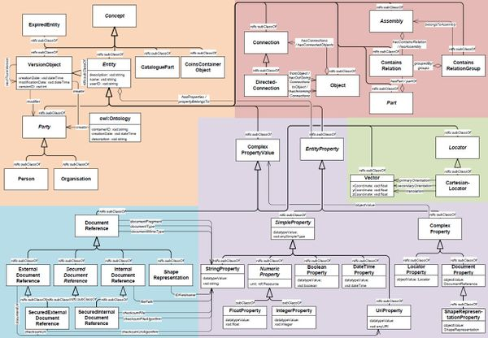
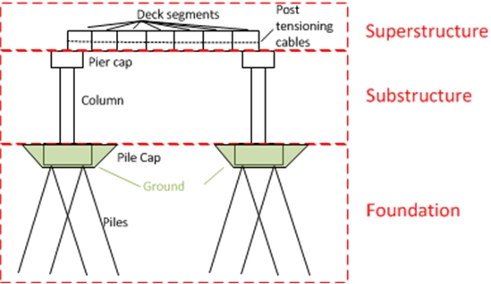
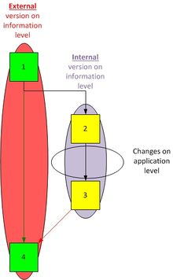
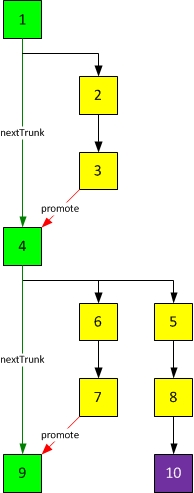

# Core Model

## UML-scheme

This UML-schema shown in this figure shows the logic and readable definition of the COINS 2.0 standard. The formal definition is defined in OWL/RDF. These are international standards supported by the W3C-consortium.

The UML-schema is divided into 5 area's:

identification and versioning; in this orange area on the left top of the UML-schema the identification and versioning of objects are determined
object modelling; this (aubergine colored) area on the right top of the schema shows the ways how objects can be related to eachother
properties; the purple area on the bottom right of the UML-schema shows the definitions of the properties used in COINS.
document references; the blue area on the bottom-left of the UML-schema shows the different documenttypes that can be used within COINS.
location; this green area describes the relations and classes needed for modelling the location of an object.

Or follow [this link](https://github.com/bimloket/COINS_2.0/blob/master/docs/coinsweb/presentaties/UML_Cbim-2.0_DEFINITIEF_v1.0.pdf)

## Overview

COINS is characterized by a flexible schema architecture, based on RDF(S)) and OWL.

The Coins Core Model is an extension of the OWL Ontology Structure and is formally represented in a COINS entity model, expressed in RDF/XML. The model can be serialised in XML, JSON, NTriples or CSV.

The Core Model defines the minimal set of classes required for exchange of data: Objects, their Properties and their Connections (relationships between Objects).

The Core Model also contains additional definitions for Persons and Organisations, Versioning, Locators and Document References.

## Reference frameworks
The Core Model can be extended by defining Reference Frameworks. These Frameworks contain specific knowledge needed for the exchange of information.

From functional point of view, there are two types of frameworks:

“standard” frameworks; for implementing management- and control issues like the Window of Authorization framework (WoA)

“specific” frameworks; containing definitions for specific domains, for use of libraries and/or for project-specific needs.

Parties are free to define and use specific reference frameworks, e.g. for in-company usage, or for use in a limited scope during a specific project, providing these have been harmonised with the core model and do not contain any supplements that conflict with this model. This architecture enables a commonly accepted specific framework to migrate to a standard reference framework.

In order to be COINS compatible, software must support the COINS Core Model and the standard reference frameworks. Support of specific frameworks is optional

## Relations between COINS objects
With COINS it is possible to relate objects in two ways:

Connection relation; this relation defines a relationship between objects. This relation can define all kinds of relationships. If you want to specify a direction between the related objects (e.g. for flow), you can use the DirectedConnection relation. That is a subtype of the Connection.

Contains relation; this relation specifies that an object is defined by its parts. This image shows the decomposition of a viaduct. It is divided into superstructure, substructure and foundation. The substructure contains of the column and pier cap.

## Versioning

### Version Management

Versionmanagement can be definend on two different levels:
* Application level,
* Information level.
At application level each software system (like CAD, GIS, Planning, etc.) has its own way of managing changes in the data. This makes it very difficult to exchange this information to other systems. In Coins we need an open and transparant way of versioning that is not dependent of such a software system. Therefore the versioning in Coins is managed on Information level.

Coins distinguishes 2 version types, external and internal versions.

* External versions are used when the information is exchanged between client and contractor. These versions are mandatory within Coins.
* Internal versions are used within the internal processes of a party. These versions are optional within Coins

Changes within the application are not a part of Coins.

### Version levels

Versioning can be schematised by the following image. A number of things can be distinguished:

* All squares are versions of an information item.
* the green squares are the external versions. They specify the Trunk of this version principle. Therefore they are called TrunkVersions.
* the yellow squares are the internal versions. They are called BranchVersions. They make it possible to follow the changes within the internal processes of a party.
* a purple squares means this VersionObject is expired but this object has no successor. the current version is number 9.
* Within the Coins core model the TrunkVersioning principle is defined. A reference framework is developed for adding the BranchVersioning functionalities (internal versions).

Between these TrunkVersionObjects there is a relation defined called the nextTrunkVersion (the green arrow from object 1 to 4 and from 4 to 9). When an object gets a nextTrunkVersion it must be classified as an ExpiredEntity, also. In this way, Coins is able to capture all the changes and makes it possible to return to a certain situation. In this way you can follow the changes back to its origin.

See also: Reference Framework Branch versioning
