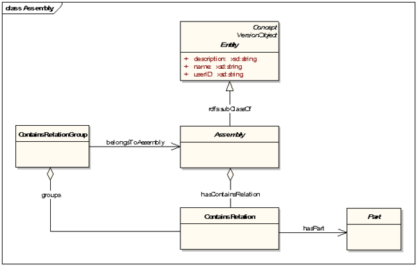
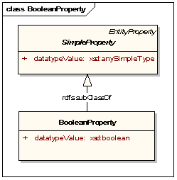
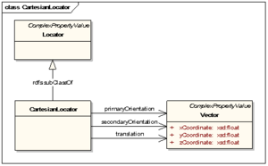
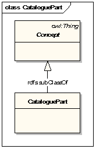
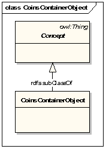
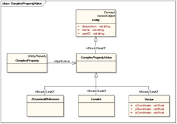
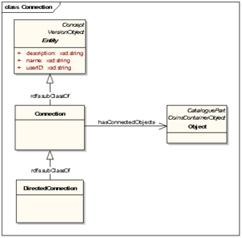
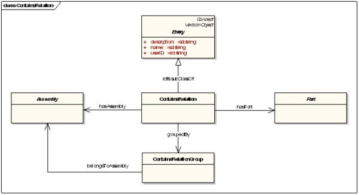
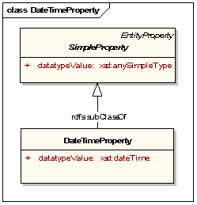
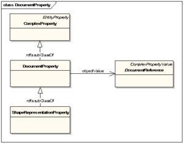

# Core Model Classes and Properties
Description of core model Classes and Properties

## Core Model Classes
Description of core model Classes 

### Assembly
<b>Assembly</b> is a subclass of <a href="https://bimloket.github.io/COINS_2.0/coinsweb/#entity" title="CoinsCore:Entity Class">Entity</a>.

Assembly is an abstract class; it can not be instantiated directly. Members of intantiatable subclasses of Entity can additionally be typed as Assembly.

The Assembly class is extendable.

The <a href="https://bimloket.github.io/COINS_2.0/coinsweb/#nexttrunkversion" title="CoinsCore:nextTrunkVersion Property">nextTrunkVersion</a> is restricted to one other individual of Assembly.

 
<b>History</b> * New in COINS

 

<b>Informative representation in UML</b> 

This image shows the informative representation of the Assembly class.

<b>Attributes</b> 

<table class="wikitable">
<tr>
<th> Name
</th>
<th> Type
</th>
<th> Description
</th></tr>
<tr>
<td> <a href="https://bimloket.github.io/COINS_2.0/coinsweb/#hascontainsrelation" title="CoinsCore:hasContainsRelation Property">hasContainsRelation</a> </td>
<td> <a href="https://bimloket.github.io/COINS_2.0/coinsweb/#containsrelation" title="CoinsCore:ContainsRelation Class">ContainsRelation</a> </td>
<td> Reference to ContainsRelations
</td></tr>
</table>

 

<b>Formal Representation in RDF/XML</b> 
<pre> &lt;owl:Class rdf:ID="Assembly"&gt;
   &lt;rdfs:label xml:lang="en-GB"&gt;Assembly&lt;/rdfs:label&gt;
   &lt;rdfs:comment xml:lang="en-GB"&gt;Parent&lt;/rdfs:comment&gt;
   &lt;rdfs:subClassOf rdf:resource="#Entity"/&gt;
   &lt;isClassAbstract rdf:datatype="xsd:boolean"&gt;true&lt;/isClassAbstract&gt;
   &lt;isClassExtendable rdf:datatype="xsd:boolean"&gt;true&lt;/isClassExtendable&gt;
   &lt;rdfs:subClassOf&gt;
     &lt;owl:Restriction&gt;
       &lt;owl:onProperty rdf:resource="#nextTrunkVersion"/&gt;
       &lt;owl:allValuesFrom rdf:resource="#Assembly"/&gt;
     &lt;/owl:Restriction&gt;
   &lt;/rdfs:subClassOf&gt;
   &lt;classCreator rdf:resource="#COINSTechnicalManagementGroup"/&gt;
   &lt;classCreationDate rdf:datatype="xsd:dateTime"&gt;2016-04-04T12:00:00.00&lt;/classCreationDate&gt;
   &lt;classVersionID rdf:datatype="xsd:string"&gt;1.0&lt;/classVersionID&gt;
 &lt;/owl:Class&gt;
</pre>

### BooleanProperty

BooleanProperty is disjoined with <a href="https://bimloket.github.io/COINS_2.0/coinsweb/#stringproperty"CoinsCore:StringProperty Class">StringProperty</a>, 
<a href="https://bimloket.github.io/COINS_2.0/coinsweb/#numericproperty" title="CoinsCore:NumericProperty Class">NumericProperty</a>, 
<a href="https://bimloket.github.io/COINS_2.0/coinsweb/#datetimeproperty" title="CoinsCore:DateTimeProperty Class">DateTimeProperty</a> and 
<a href="https://bimloket.github.io/COINS_2.0/coinsweb/#uriproperty" title="CoinsCore:UriProperty Class">UriProperty</a>.

BooleanProperty is not an abstract class; it can be instantiated directly. 

The <a href="https://bimloket.github.io/COINS_2.0/coinsweb/#nexttrunkversion" title="CoinsCore:nextTrunkVersion Property">nextTrunkVersion</a> is restricted to one other instance of BooleanProperty.

**History*
   * New in COINS 2.0

   
**Informative representation in UML**
 
This image shows the informative representation of the BooleanProperty class
 

 
**Attributes**
<table class="wikitable">
<tr>
<th> Name
</th>
<th> Type
</th>
<th> Description
</th></tr>
<tr>
<td> <a href="https://bimloket.github.io/COINS_2.0/coinsweb/#datatypevalue" title="CoinsCore:datatypeValue Property">datatypeValue</a> </td>
<td> xsd:boolean </td>
<td> Exactly one Boolean value. Empty value not allowed.
</td></tr>
</table>

 

<b>Formal Representation in RDF/XML</b> 
<pre> &lt;owl:Class rdf:ID="BooleanProperty"&gt;
   &lt;rdfs:label xml:lang="en-GB"&gt;BooleanProperty&lt;/rdfs:label&gt;
   &lt;rdfs:comment xml:lang="en-GB"&gt;BooleanProperty&lt;/rdfs:comment&gt;
   &lt;rdfs:subClassOf rdf:resource="#SimpleProperty"/&gt;
   &lt;owl:disjointWith rdf:resource="#StringProperty"/&gt;
   &lt;owl:disjointWith rdf:resource="#NumericProperty"/&gt;
   &lt;owl:disjointWith rdf:resource="#DateTimeProperty"/&gt;
   &lt;owl:disjointWith rdf:resource="#UriProperty"/&gt;
   &lt;owl:equivalentClass&gt;
     &lt;owl:Class&gt;
       &lt;owl:intersectionOf rdf:parseType="Collection"&gt;
         &lt;rdf:Description rdf:ID="SimpleProperty"/&gt;
         &lt;owl:Restriction&gt;
           &lt;owl:onProperty rdf:resource="#datatypeValue"/&gt;
           &lt;owl:allValuesFrom rdf:resource="xsd:boolean"/&gt;
         &lt;/owl:Restriction&gt;
       &lt;/owl:intersectionOf&gt;
     &lt;/owl:Class&gt;
   &lt;/owl:equivalentClass&gt;
   &lt;rdfs:subClassOf&gt;
     &lt;owl:Restriction&gt;
       &lt;owl:onProperty rdf:resource="#datatypeValue"/&gt;
       &lt;owl:allValuesFrom rdf:resource="xsd:boolean"/&gt;
     &lt;/owl:Restriction&gt;
   &lt;/rdfs:subClassOf&gt;
   &lt;isClassAbstract rdf:datatype="xsd:boolean"&gt;false&lt;/isClassAbstract&gt;
   &lt;isClassExtendable rdf:datatype="xsd:boolean"&gt;true&lt;/isClassExtendable&gt;
   &lt;rdfs:subClassOf&gt;
     &lt;owl:Restriction&gt;
       &lt;owl:onProperty rdf:resource="#nextTrunkVersion"/&gt;
       &lt;owl:allValuesFrom rdf:resource="#BooleanProperty"/&gt;
     &lt;/owl:Restriction&gt;
   &lt;/rdfs:subClassOf&gt;
   &lt;classCreator rdf:resource="#COINSTechnicalManagementGroup"/&gt;
   &lt;classCreationDate rdf:datatype="xsd:dateTime"&gt;2016-04-04T12:00:00.00&lt;/classCreationDate&gt;
   &lt;classVersionID rdf:datatype="xsd:string"&gt;1.0&lt;/classVersionID&gt;
 &lt;/owl:Class&gt;
</pre>

### CartesianLocator
   <b>CartesianLocator</b> is a subclass of <a href="https://bimloket.github.io/COINS_2.0/coinsweb/#locator" title="CoinsCore:CartesianLocator Class">Locatory</a>. It specifies the position and orientation of an Object using a 3D Euclidean space for relative placement of shape representations. Therefore it holds references to Vectors for its primary and secondary Orientation, plus a Vector for the translation.

CartesianLocator is disjoint with Party, EntityProperty and Vector.

CartesianLocator is not an abstract class; it can be instantiated directly.

The CartesianLocator class is extendable.

The <a href="https://bimloket.github.io/COINS_2.0/coinsweb/#nexttrunkversion" title="CoinsCore:nextTrunkVersion Property">nextTrunkVersion</a> is restricted to one other instance of CartesianLocator.

**History**
* New in COINS 2.0; <a href="https://bimloket.github.io/COINS_2.0/coinsarchive/#cbimlocator" title="Cbim:Locator">Cbim:Locator</a>
   
**Informative representation in UML**
   
 This image shows the informative representation of the CartesianLocator class.
   

   
**Attributes**
<table class="wikitable">
<tr>
<th> Name
</th>
<th> Type
</th>
<th> Description
</th></tr>
<tr>
<td> <a href="https://bimloket.github.io/COINS_2.0/coinsweb/#primaryorientation" title="CoinsCore:primaryOrientation Property">primaryOrientation</a> </td>
<td> <a href="https://bimloket.github.io/COINS_2.0/coinsweb/#vector" title="CoinsCore:Vector Class">Vector</a> </td>
<td> 0..1 Vector for primary orientation.
</td></tr>
<tr>
<td> <a href="https://bimloket.github.io/COINS_2.0/coinsweb/#secundaryorientation" title="CoinsCore:secundaryOrientation Property">secundaryorientation</a> </td>
<td> <a https://bimloket.github.io/COINS_2.0/coinsweb/#vector" title="CoinsCore:Vector Class">Vector</a> </td>
<td> 0..1 Vector for secundary orientation.
</td></tr>
<tr>
<td> <a href="https://bimloket.github.io/COINS_2.0/coinsweb/#translationproperty" title="CoinsCore:translation Property">translation</a> </td>
<td> <a href="https://bimloket.github.io/COINS_2.0/coinsweb/#vector" "title="CoinsCore:Vector Class">Vector</a> </td>
<td> 0..1 Vector for translation.
</td></tr>
</table>

**Formal representation in RDF/XML**
<code>
 <owl:Class rdf:ID="CartesianLocator">

   <rdfs:label xml:lang="en-GB">CartesianLocator</rdfs:label>
   <rdfs:comment xml:lang="en-GB">Specifier for position and orientation using a 3D Euclidean space for relative placement of shaperepresentations.</rdfs:comment>

   <rdfs:subClassOf rdf:resource="#Locator"/>

   <owl:disjointWith rdf:resource="#EntityProperty"/>
   <owl:disjointWith rdf:resource="#Vector"/>
   <owl:disjointWith rdf:resource="#Party"/>

   <rdfs:subClassOf>
     <owl:Restriction>
       <owl:onProperty rdf:resource="#primaryOrientation"/>
       <owl:maxCardinality rdf:datatype="xsd:nonNegativeInteger">1</owl:maxCardinality>
     </owl:Restriction>
   </rdfs:subClassOf>

   <rdfs:subClassOf>
     <owl:Restriction>
       <owl:onProperty rdf:resource="#secondaryOrientation"/>
       <owl:maxCardinality rdf:datatype="xsd:nonNegativeInteger">1</owl:maxCardinality>
     </owl:Restriction>
   </rdfs:subClassOf>

   <rdfs:subClassOf>
     <owl:Restriction>
       <owl:onProperty rdf:resource="#translation"/>
       <owl:maxCardinality rdf:datatype="xsd:nonNegativeInteger">1</owl:maxCardinality>
     </owl:Restriction>
   </rdfs:subClassOf>

   <isClassAbstract rdf:datatype="xsd:boolean">false</isClassAbstract>
   <isClassExtendable rdf:datatype="xsd:boolean">true</isClassExtendable>

   <rdfs:subClassOf>
     <owl:Restriction>
       <owl:onProperty rdf:resource="#nextTrunkVersion"/>
       <owl:allValuesFrom rdf:resource="#CartesianLocator"/>
     </owl:Restriction>
   </rdfs:subClassOf>

   <classCreator rdf:resource="#COINSTechnicalManagementGroup"/>
   <classCreationDate rdf:datatype="xsd:dateTime">2016-04-04T12:00:00.00</classCreationDate>
   <classVersionID rdf:datatype="xsd:string">1.0</classVersionID>

 </owl:Class>
   </code>
   

### CataloguePart
**CataloguePart** is a subclass of <a href="https://bimloket.github.io/COINS_2.0/coinsweb/#concept" title="CoinsCore:Concept Class">Concept</a>. CatalogueParts are for aligning of external Object Type Libraries.

CataloguePart is not abstract; it can be instantiated.

The CataloguePart class can be extended to other classes.

The <a href="https://bimloket.github.io/COINS_2.0/coinsweb/#nexttrunkversion" title="CoinsCore:nextTrunkVersion Property">nextTrunkVersion</a> is restricted to one other individual of CataloguePart.
   
**History**
* Unchanged in COINS 2.0
   
**Informative representation in UML**
This image shows the informative representation of the CataloguePart class.
   

   

**Formal representation in RDF/XML**
<code>
<owl:Class rdf:ID="CataloguePart">

   <rdfs:label xml:lang="en-GB">Cataloguepart</rdfs:label>
   <rdfs:comment xml:lang="en-GB">Generic catalogue part for alignement of external ObjectTypeLibraries.</rdfs:comment>

   <rdfs:subClassOf rdf:resource="#Concept"/>

   <rdfs:subClassOf>
     <owl:Class>
       <owl:intersectionOf rdf:parseType="Collection">
         <rdf:Description rdf:ID="Concept"/>
         <rdf:Description rdf:ID="Entity"/>
       </owl:intersectionOf>
     </owl:Class>
   </rdfs:subClassOf>

   <isClassAbstract rdf:datatype="xsd:boolean">false</isClassAbstract>
   <isClassExtendable rdf:datatype="xsd:boolean">true</isClassExtendable>

   <rdfs:subClassOf>
     <owl:Restriction>
       <owl:onProperty rdf:resource="#nextTrunkVersion"/>
       <owl:allValuesFrom rdf:resource="#CataloguePart"/>
     </owl:Restriction>
   </rdfs:subClassOf>

   <classCreator rdf:resource="#COINSTechnicalManagementGroup"/>
   <classCreationDate rdf:datatype="xsd:dateTime">2016-04-04T12:00:00.00</classCreationDate>
   <classVersionID rdf:datatype="xsd:string">1.0</classVersionID>

   </owl:Class>
   </code>

### CoinsContainerObject
CoinsContainerObject is a subclass of <a href="https://bimloket.github.io/COINS_2.0/coinsweb/#concept" title="CoinsCore:Concept Class">Concept</a>. It contains all individuals that are placed in a Coins Container.

CoinsContainerObject is not an abstract class; it can be instantiated.

The CoinsContainerObject class can be extended to other classes.

The <a href="https://bimloket.github.io/COINS_2.0/coinsweb/#nexttrunkversion" title="CoinsCore:nextTrunkVersion Property">nextTrunkVersion</a> is restricted to one other individual of CoinsContainerObject.

This CoinsContainerObject acts as a kind of placeholder for all objects within this container. So, when you import this information into your own system you are able to identify which objects have been sent to you in what container.
 
**History**
* New in COINS 2.0
   
**Informative representation in UML**

   This image shows the informative representation of the CoinsContainerObject class.
   

   

**Formal representation in RDF/XML**
<code><owl:Class rdf:ID="CoinsContainerObject">

   <rdfs:label xml:lang="en-GB">CoinsContainerObject</rdfs:label>
   <rdfs:comment xml:lang="en-GB">CoinsContainerObject</rdfs:comment>

   <rdfs:subClassOf rdf:resource="#Concept"/>

   <rdfs:subClassOf rdf:resource="#Entity"/>

   <isClassAbstract rdf:datatype="xsd:boolean">false</isClassAbstract>
   <isClassExtendable rdf:datatype="xsd:boolean">true</isClassExtendable>

   <rdfs:subClassOf>
     <owl:Restriction>
       <owl:onProperty rdf:resource="#nextTrunkVersion"/>
       <owl:allValuesFrom rdf:resource="#CoinsContainerObject"/>
     </owl:Restriction>
   </rdfs:subClassOf>

   <classCreator rdf:resource="#COINSTechnicalManagementGroup"/>
   <classCreationDate rdf:datatype="xsd:dateTime">2016-04-04T12:00:00.00</classCreationDate>
   <classVersionID rdf:datatype="xsd:string">1.0</classVersionID>

   </owl:Class></code>

### ComplexProperty

ComplexProperty is a subclass of <a href="https://bimloket.github.io/COINS_2.0/coinsweb/#entityproperty" title="CoinsCore:EntityProperty">EntityProperty</a>. It is the superclass of all property classes that hold exactly one single reference to an ComplexPropertyValue.

Where SimpleProperty refers to a simple value, ComplexProperty refers to an ComplexPropertyValue: an object instance. Therefore ComplexProperty is disjoined with SimpleProperty.

ComplexProperty is not an abstract class; can be instantiated directly.

The ComplexProperty class can be extended; in the COINS Core Model it is extended to DocumentProperty and LocatorProperty.

The <a href="https://bimloket.github.io/COINS_2.0/coinsweb/#nexttrunkversion" title="CoinsCore:nextTrunkVersion Property">nextTrunkVersion</a> is restricted to one other instance of ComplexProperty.
   

**History**
* New in COINS 2.0
   
**Informative representation in UML**

This image shows the informative representation of the ComplexProperty class.

   
**Attributes**
<table class="wikitable">
<tr>
<th> Name
</th>
<th> Type
</th>
<th> Description
</th></tr>
<tr>
<td> <a href="https://bimloket.github.io/COINS_2.0/coinsweb/#objectvalue" title="CoinsCore:ObjectValue Property">objectValue</a> </td>
<td> <a href="https://bimloket.github.io/COINS_2.0/coinsweb/#complexpropertyvalue" title="CoinsCore:ComplexPropertyValue">ComplexPropertyValue</a> </td>
<td> Reference to an other element
</td></tr>
</table>

**Formal representation in RDF/XML**
   
<code><owl:Class rdf:ID="ComplexProperty">

   <rdfs:label xml:lang="en-GB">Complex Property</rdfs:label>
   <rdfs:comment xml:lang="en-GB">Complex property</rdfs:comment>

   <rdfs:subClassOf rdf:resource="#EntityProperty"/>

   <owl:disjointWith rdf:resource="#SimpleProperty"/>

   <rdfs:subClassOf>
     <owl:Restriction>
       <owl:onProperty rdf:resource="#ComplexPropertyValue"/>
       <owl:cardinality rdf:datatype="xsd:nonNegativeInteger">1</owl:cardinality>
     </owl:Restriction>
   </rdfs:subClassOf>

   <isClassExtendable rdf:datatype="xsd:boolean">true</isClassExtendable>
   <isClassAbstract rdf:datatype="xsd:boolean">false</isClassAbstract>

   <rdfs:subClassOf>
     <owl:Restriction>
       <owl:onProperty rdf:resource="#nextTrunkVersion"/>
       <owl:allValuesFrom rdf:resource="#ComplexProperty"/>
     </owl:Restriction>
   </rdfs:subClassOf>

   <classCreator rdf:resource="#COINSTechnicalManagementGroup"/>
   <classCreationDate rdf:datatype="xsd:dateTime">2016-04-04T12:00:00.00</classCreationDate>
   <classVersionID rdf:datatype="xsd:string">1.0</classVersionID>

   </owl:Class></code>

### ComplexPropertyValue
ComplexPropertyValue is a subclass of <a href="https://bimloket.github.io/COINS_2.0/coinsweb/#entity" title="CoinsCore:Entity">Entity</a>. It has no further attributes of itself, but all <a href="https://bimloket.github.io/COINS_2.0/coinsweb/#complexproperty" title="CoinsCore:ComplexProperty">ComplexProperties</a> refer to a value of ComplexPropertyValue or specialization thereof. An instance of ComplexPropertyValue can not exist by itself.

ComplexPropertyValue is not an abstract class; it can be instantiated directly.

ComplexPropertyValue is extendable; in the Coins Core Model, it is extended to <a href="https://bimloket.github.io/COINS_2.0/coinsweb/#documentreference" title="CoinsCore:DocumentReference">DocumentReference</a>, <a href="https://bimloket.github.io/COINS_2.0/coinsweb/#locator title="CoinsCore:Locator">Locator</a> and <a href="https://bimloket.github.io/COINS_2.0/coinsweb/#vector" title="CoinsCore:Vector">Vector</a>.

The <a href="https://bimloket.github.io/COINS_2.0/coinsweb/#nexttrunkversion" title="CoinsCore:nextTrunkVersion Property">nextTrunkVersion</a> is restricted to one other instance of ComplexPropertyValue. 

   
**History**
* New in COINS 2.0
   
   
**Informative representation in UML**

This image shows the informative representation of the ComplexPropertyValue class.

   

**Formal representation in RDF/XML**
   
<code><owl:Class rdf:ID="ComplexPropertyValue">

   <rdfs:label xml:lang="en-GB">ComplexPropertyValue</rdfs:label>
   <rdfs:comment xml:lang="en-GB">ComplexPropertyValue</rdfs:comment>

   <rdfs:subClassOf rdf:resource="#Entity"/>

   <isClassAbstract rdf:datatype="xsd:boolean">false</isClassAbstract>
   <isClassExtendable rdf:datatype="xsd:boolean">true</isClassExtendable>

   <rdfs:subClassOf>
     <owl:Restriction>
       <owl:onProperty rdf:resource="#nextTrunkVersion"/>
       <owl:allValuesFrom rdf:resource="#ComplexPropertyValue"/>
     </owl:Restriction>
   </rdfs:subClassOf>

   <classCreator rdf:resource="#COINSTechnicalManagementGroup"/>
   <classCreationDate rdf:datatype="xsd:dateTime">2016-04-04T12:00:00.00</classCreationDate>
   <classVersionID rdf:datatype="xsd:string">1.0</classVersionID>

   </owl:Class></code>

### Concept
**Concept** is a subclass of [owl:Thing](http://www.w3.org/2002/07/owl#"). Concept serves as superclass of all classes in a COINS model.
It is without any properties or references.
Concept acts an abstract class; it can not be instantiated directly. Individuals belong indirectly to this class.
Concept is not extendable; in the Coins Core Model it is extended to The <a href="https://bimloket.github.io/COINS_2.0/coinsweb/#entity" title="CoinsCore:Entity Class">Entity</a>, The <a href="https://bimloket.github.io/COINS_2.0/coinsweb/#versionobject" title="CoinsCore:VersionObject Class">VersionObject</a>, The <a href="https://bimloket.github.io/COINS_2.0/coinsweb/#expiredentity" title="CoinsCore:ExpiredEntity Class">ExpiredEntity</a>, The <a href="https://bimloket.github.io/COINS_2.0/coinsweb/#cataloguepart" title="CoinsCore:CataloguePart Class">CataloguePart</a> and The <a href="https://bimloket.github.io/COINS_2.0/coinsweb/#coinscontainerobject" title="CoinsCore:CoinsContainerObject Class">CoinsContainerObject</a>.
Concept is the common superclass for all other COINS classes.
   
   
**History**
* New in COINS 2.0 - replaces <a href="https://bimloket.github.io/COINS_2.0/coinsarchive/#cbimobject" title="Cbim:Object">Cbim:Object</a>
   
**Informative representation in UML**

   

**Formal representation in RDF/XML**

<code><owl:Class rdf:ID="Concept">

   <rdfs:label xml:lang="en-GB">CbimEntity</rdfs:label>
   <rdfs:comment xml:lang="en-GB">Abstract superclass for all Cbim classes. This class is without any properties or relations</rdfs:comment>

   <rdfs:subClassOf rdf:resource="owl:Thing"/>

   <isClassAbstract rdf:datatype="xsd:boolean">true</isClassAbstract>
   <isClassExtendable rdf:datatype="xsd:boolean">false</isClassExtendable>

   <classCreator rdf:resource="#COINSTechnicalManagementGroup"/>
   <classCreationDate rdf:datatype="xsd:dateTime">2016-04-04T12:00:00.00</classCreationDate>
   <classVersionID rdf:datatype="xsd:string">1.0</classVersionID>

   </owl:Class></code>

### Connection
Connection is a subclass of <a href="https://bimloket.github.io/COINS_2.0/coinsweb/#entity" title="CoinsCore:Entity">Entity</a>. The Connection class enables the functional connection between two Objects. Therefore it holds references to exactly 2 Objects. The relation is undirected, meaning there is no source and target of the relationship; both Objects are considered equal.

Connection is not an abstract class; it can be instantiated directly.

The Connection class is extendable; in the Coins Core Model it is extended to <a href="https://bimloket.github.io/COINS_2.0/coinsweb/#directedconnection" title="CoinsCore:DirectedConnection Class">DirectedConnection</a> for defining a directed relationship.

The <a href="https://bimloket.github.io/COINS_2.0/coinsweb/#nexttrunkversion" title="CoinsCore:nextTrunkVersion Property">nextTrunkVersion</a> is restricted to one other individual of Connection.

   
**History**
* Modified in COINS 2.0; it is no longer for terminal objects only.
   
**Informative representation in UML**

   
**Attributes**
<table class="wikitable">
<tr>
<th> Name
</th>
<th> Type
</th>
<th> Description
</th></tr>
<tr>
<td> <a href="https://bimloket.github.io/COINS_2.0/coinsweb/#hasconnectedobjects" title="CoinsCore:hasConnectedObjects Property">hasConnectedObjects</a> </td>
<td> <a href="https://bimloket.github.io/COINS_2.0/coinsweb/#object" title="CoinsCore:Object Class">Object</a> </td>
<td> Reference to an other element
</td></tr>
</table>

**Formal representation in RDF/XML**

<code><owl:Class rdf:ID="Connection">

   <rdfs:label xml:lang="en-GB">Connection</rdfs:label>
   <rdfs:comment xml:lang="en-GB">undirected Connection between Objects</rdfs:comment>

   <rdfs:subClassOf rdf:resource="#Entity"/>

   <rdfs:subClassOf>
     <owl:Restriction>
       <owl:onProperty rdf:resource="#hasConnectedObjects"/>
       <owl:cardinality rdf:datatype="xsd:nonNegativeInteger">2</owl:cardinality>
     </owl:Restriction>
   </rdfs:subClassOf>

   <isClassAbstract rdf:datatype="xsd:boolean">false</isClassAbstract>
   <isClassExtendable rdf:datatype="xsd:boolean">true</isClassExtendable>

   <rdfs:subClassOf>
     <owl:Restriction>
       <owl:onProperty rdf:resource="#nextTrunkVersion"/>
       <owl:allValuesFrom rdf:resource="#Connection"/>
     </owl:Restriction>
   </rdfs:subClassOf>

   <classCreator rdf:resource="#COINSTechnicalManagementGroup"/>
   <classCreationDate rdf:datatype="xsd:dateTime">2016-04-04T12:00:00.00</classCreationDate>
   <classVersionID rdf:datatype="xsd:string">1.0</classVersionID>

   </owl:Class></code>

### ContainsRelation
   
**ContainsRelation** is a subclass of <a href="https://bimloket.github.io/COINS_2.0/coinsweb/#entity" title="CoinsCore:Entity Class">Entity</a>.

ContainsRelation is not an abstract class; it can instantiated directly.

The ContainsRelation class can be extended.

The <a href="https://bimloket.github.io/COINS_2.0/coinsweb/#nexttrunkversion" title="CoinsCore:nextTrunkVersion Property">nextTrunkVersion</a> is restricted to one other individual of ContainsRelation.

**History**
* New in COINS 2.0

**Informative representation in UML**

This image shows the informative representation of the ContainsRelation class.

**Attributes**
   
| Col1 | Col2 | Col3 |
| :--- | :--- | :--- |
| Name | Type |	Description |
| <a href="https://bimloket.github.io/COINS_2.0/coinsweb/#hasassembly" title="CoinsCore:hasAssembly Property">hasAssembly</a> |	a href="https://bimloket.github.io/COINS_2.0/coinsweb/#assembly" title="CoinsCore:Assembly Class">Assembly</a> |	Reference to exactly 1 instance of Assembly |
| <a href="https://bimloket.github.io/COINS_2.0/coinsweb/#hasassembly" title="CoinsCore:hasPart Property">hasAssembly</a> |  a href="https://bimloket.github.io/COINS_2.0/coinsweb/#haspart" title="CoinsCore:hasPart Property">hasPart</a> |  a href="https://bimloket.github.io/COINS_2.0/coinsweb/#part" title="CoinsCore:Part Class">Part</a> | Reference to exactly 1 instance of Part
| a href="https://bimloket.github.io/COINS_2.0/coinsweb/#groupedby" title="CoinsCore:groupedBy Property">groupedBy</a> | a href="https://bimloket.github.io/COINS_2.0/coinsweb/#containsrelationgroup" title="CoinsCore:ContainsRelationGroup Class">ContainsRelationGroup</a> | ContainsRelations can be grouped in ContainsRelationGroup

**Formal Representation in RDF/XML**

 <code> <owl:Class rdf:ID="ContainsRelation">

   <rdfs:label xml:lang="en-GB">ContainsRelation</rdfs:label>
   <rdfs:comment xml:lang="en-GB">ContainsRelation</rdfs:comment>

   <rdfs:subClassOf rdf:resource="#Entity"/>

   <owl:disjointWith rdf:resource="#Part"/>
   <owl:disjointWith rdf:resource="#Assembly"/>

   <rdfs:subClassOf>
     <owl:Restriction>
       <owl:onProperty rdf:resource="#hasAssembly"/>
       <owl:cardinality rdf:datatype="xsd:nonNegativeInteger">1</owl:cardinality>
     </owl:Restriction>
   </rdfs:subClassOf>

   <rdfs:subClassOf>
     <owl:Restriction>
       <owl:onProperty rdf:resource="#hasPart"/>
       <owl:cardinality rdf:datatype="xsd:nonNegativeInteger">1</owl:cardinality>
     </owl:Restriction>
   </rdfs:subClassOf>

   <isClassAbstract rdf:datatype="xsd:boolean">false</isClassAbstract>
   <isClassExtendable rdf:datatype="xsd:boolean">true</isClassExtendable>

   <rdfs:subClassOf>
     <owl:Restriction>
       <owl:onProperty rdf:resource="#nextTrunkVersion"/>
       <owl:allValuesFrom rdf:resource="#ContainsRelation"/>
     </owl:Restriction>
   </rdfs:subClassOf>

   <classCreator rdf:resource="#COINSTechnicalManagementGroup"/>
   <classCreationDate rdf:datatype="xsd:dateTime">2016-04-04T12:00:00.00</classCreationDate>
   <classVersionID rdf:datatype="xsd:string">1.0</classVersionID>

 </owl:Class> </code>

### ContainsRelationGroup
ContainsRelationGroup is a subclass of <a href="https://bimloket.github.io/COINS_2.0/coinsweb/#entity" title="CoinsCore:Entity Class">Entity</a>. It belongs to a exactly 1 Assembly and holds references to 0, 1 or more ContainsRelations.

ContainsRelationGroup can be instantiated and extended.

The <a href="https://bimloket.github.io/COINS_2.0/coinsweb/#nexttrunkversion" title="CoinsCore:nextTrunkVersion Property">nextTrunkVersion</a> is restricted to one other individual of ContainsRelationGroup.

This concept gives you the possibility to manage different options of object decompositions.

**History**
* New in COINS 2.0
   

   
**Attributes**
| Col1 | Col2 | Col3 |
| :--- | :--- | :--- |
| Name | Type |	Description |
| <a href="https://bimloket.github.io/COINS_2.0/coinsweb/#belongstoassembly" title="CoinsCore:belongsToAssembly Property"belongsToAssembly</a> |	a href="https://bimloket.github.io/COINS_2.0/coinsweb/#assembly" title="CoinsCore:Assembly Class">Assembly</a> |	Reference to exactly 1 instance of Assembly |
| <a href="https://bimloket.github.io/COINS_2.0/coinsweb/#hasassembly" title="CoinsCore:hasPart Property">hasAssembly</a> |  a href="https://bimloket.github.io/COINS_2.0/coinsweb/#groups" title="CoinsCore:groups Property">groups</a> |  a href="https://bimloket.github.io/COINS_2.0/coinsweb/#containsrelation" title="CoinsCore:ContainsRelation Class">ContainsRelation</a> | Reference to exactly 1 instance of Part

**Formal representation in RDF/XML**

<code><owl:Class rdf:ID="ContainsRelationGroup">

   <rdfs:label xml:lang="en-GB">ContainsRelationGroup</rdfs:label>
   <rdfs:comment xml:lang="en-GB">ContainsRelationGroup</rdfs:comment>

   <rdfs:subClassOf rdf:resource="#Entity"/>

   <rdfs:subClassOf>
     <owl:Restriction>
       <owl:onProperty rdf:resource="#belongsToAssembly"/>
       <owl:cardinality rdf:datatype="xsd:nonNegativeInteger">1</owl:cardinality>
     </owl:Restriction>
   </rdfs:subClassOf>

   <isClassAbstract rdf:datatype="xsd:boolean">false</isClassAbstract>
   <isClassExtendable rdf:datatype="xsd:boolean">true</isClassExtendable>

   <rdfs:subClassOf>
     <owl:Restriction>
       <owl:onProperty rdf:resource="#nextTrunkVersion"/>
       <owl:allValuesFrom rdf:resource="#ContainsRelationGroup"/>
     </owl:Restriction>
   </rdfs:subClassOf>

   <classCreator rdf:resource="#COINSTechnicalManagementGroup"/>
   <classCreationDate rdf:datatype="xsd:dateTime">2016-04-04T12:00:00.00</classCreationDate>
   <classVersionID rdf:datatype="xsd:string">1.0</classVersionID>

 </owl:Class></code>

### DateTimeProperty
DateTimeProperty is a subclass of The <a href="https://bimloket.github.io/COINS_2.0/coinsweb/#simpleproperty" title="CoinsCore:SimpleProperty Class">SimpleProperty</a>. The inherited datatypeValue of SimpleProperty is overridden by xsd:dateTime, restricting instances of DateTimeProperty to hold a single DateTime-value; an empty value (nil) is not allowed.
DateTime-values are integer-valued year, month, day, hour and minute properties, a decimal-valued second property, and an optional timezoned property in the format:

< yyyy-mm-dd T hh:mm:ss.sss >
See http://www.w3.org/TR/xmlschema-2/#dateTime for formal specification.

DateTimeProperty is disjoined with <a href="https://bimloket.github.io/COINS_2.0/coinsweb/#stringproperty" title="CoinsCore:StringProperty Class">StringProperty</a>, <a href="https://bimloket.github.io/COINS_2.0/coinsweb/#numericproperty" title="CoinsCore:NumericProperty Class">NumericProperty</a>, <a href="https://bimloket.github.io/COINS_2.0/coinsweb/#booleanproperty" title="CoinsCore:BooleanProperty Class">BooleanProperty</a> and <a href="https://bimloket.github.io/COINS_2.0/coinsweb/#uirproperty" title="CoinsCore:UriProperty Class">UriProperty</a>.

DateTimeProperty is not an abstract class; it can be instantiated directly.

The DateTimeProperty class is extendable.

The <a href="https://bimloket.github.io/COINS_2.0/coinsweb/#nexttrunkversion" title="CoinsCore:nextTrunkVersion Property">nextTrunkVersion</a> is restricted to one other instance of DateTimeProperty. 

**History**
* New in COINS 2.0
   
**Informative representation in UML**

   
**Attributes**
| Col1 | Col2 | Col3 |
| :--- | :--- | :--- |
| Name | Type |	Description |
| <a href="https://bimloket.github.io/COINS_2.0/coinsweb/#datatypevalue" title="CoinsCore:datatypeValue Property">datatypeValue</a> |	xsd:dateTime |	Exactly one date-time value. Empty value not allowed. |

**Formal representation in RDF/XML**

<code><owl:Class rdf:ID="DateTimeProperty">

   <rdfs:label xml:lang="en-GB">DateTimeProperty</rdfs:label>
   <rdfs:comment xml:lang="en-GB">DateTimeProperty</rdfs:comment>

   <rdfs:subClassOf rdf:resource="#SimpleProperty"/>

   <owl:disjointWith rdf:resource="#StringProperty"/>
   <owl:disjointWith rdf:resource="#NumericProperty"/>
   <owl:disjointWith rdf:resource="#BooleanProperty"/>
   <owl:disjointWith rdf:resource="#UriProperty"/>

   <owl:equivalentClass>
     <owl:Class>
       <owl:intersectionOf rdf:parseType="Collection">
         <rdf:Description rdf:ID="SimpleProperty"/>
         <owl:Restriction>
           <owl:onProperty rdf:resource="#datatypeValue"/>
           <owl:allValuesFrom rdf:resource="xsd:dateTime"/>
         </owl:Restriction>
       </owl:intersectionOf>
     </owl:Class>
   </owl:equivalentClass>

   <rdfs:subClassOf>
     <owl:Restriction>
       <owl:onProperty rdf:resource="#datatypeValue"/>
       <owl:allValuesFrom rdf:resource="xsd:dateTime"/>
     </owl:Restriction>
   </rdfs:subClassOf>

   <isClassAbstract rdf:datatype="xsd:boolean">false</isClassAbstract>
   <isClassExtendable rdf:datatype="xsd:boolean">true</isClassExtendable>

   <rdfs:subClassOf>
     <owl:Restriction>
       <owl:onProperty rdf:resource="#nextTrunkVersion"/>
       <owl:allValuesFrom rdf:resource="#DateTimeProperty"/>
     </owl:Restriction>
   </rdfs:subClassOf>

   <classCreator rdf:resource="#COINSTechnicalManagementGroup"/>
   <classCreationDate rdf:datatype="xsd:dateTime">2016-04-04T12:00:00.00</classCreationDate>
   <classVersionID rdf:datatype="xsd:string">1.0</classVersionID>

 </owl:Class></code>

### DirectedConnection
**DirectedConnection** is a subclass of Connection. The DirectedConnection enables a directed functional relationships between two Objects, meaning there is exactly one source Object and exactly one target Object, where the source Object delivers a function to the target Object.

DirectedConnection is not an abstract class; it can be instantiated directly.

The DirectedConnection class is extendable.

The <a href="https://bimloket.github.io/COINS_2.0/coinsweb/#nexttrunkversion" title="CoinsCore:nextTrunkVersion Property">nextTrunkVersion</a> is restricted to one other individual of DirectedConnection.  

**History**
* New in COINS 2.0

   
**Informative representation in UML**

   
**Attributes**
| Col1 | Col2 | Col3 |
| :--- | :--- | :--- |
| Name | Type |	Description |
| <a href="https://bimloket.github.io/COINS_2.0/coinsweb/#fromobject" title="CoinsCore:fromObject Property">fromObject</a> |	<a href="https://bimloket.github.io/COINS_2.0/coinsweb/#object" title="CoinsCore:Object Class">Object</a> |	Exactly 1 source Object |
| <a href="https://bimloket.github.io/COINS_2.0/coinsweb/#toobject" title="CoinsCore:toObject Property">toObject</a> |	<a href="https://bimloket.github.io/COINS_2.0/coinsweb/#object" title="CoinsCore:Object Class">Object</a> |	Exactly 1 target Object |

**Formal representation in RDF/XML**

<code><owl:Class rdf:ID="DirectedConnection">

   <rdfs:label xml:lang="en-GB">Directed Connection object</rdfs:label>
   <rdfs:comment xml:lang="en-GB">Directed connection object between Objects</rdfs:comment>

   <rdfs:subClassOf rdf:resource="#Connection"/>

   <rdfs:subClassOf>
     <owl:Restriction>
       <owl:onProperty rdf:resource="#fromObject"/>
       <owl:cardinality rdf:datatype=" xsd:nonNegativeInteger">1</owl:cardinality>
     </owl:Restriction>
   </rdfs:subClassOf>

   <rdfs:subClassOf>
     <owl:Restriction>
       <owl:onProperty rdf:resource="#toObject"/>
       <owl:cardinality rdf:datatype=" xsd:nonNegativeInteger">1</owl:cardinality>
     </owl:Restriction>
   </rdfs:subClassOf>

   <isClassAbstract rdf:datatype="xsd:boolean">false</isClassAbstract>
   <isClassExtendable rdf:datatype="xsd:boolean">true</isClassExtendable>

   <rdfs:subClassOf>
     <owl:Restriction>
       <owl:onProperty rdf:resource="#nextTrunkVersion"/>
       <owl:allValuesFrom rdf:resource="#DirectedConnection"/>
     </owl:Restriction>
   </rdfs:subClassOf>

   <classCreator rdf:resource="#COINSTechnicalManagementGroup"/>
   <classCreationDate rdf:datatype="xsd:dateTime">2016-04-04T12:00:00.00</classCreationDate>
   <classVersionID rdf:datatype="xsd:string">1.0</classVersionID>

 </owl:Class></code>

### DocumentProperty
**DocumentProperty** is a subclass of The <a href="https://bimloket.github.io/COINS_2.0/coinsweb/#complexproperty" title="CoinsCore:ComplexProperty Class">ComplexProperty</a>. Since it is a property that refers to a Document, the inherited reference for objectValue is overridden to refer to an instance of DocumentReference.

DocumentProperty is not an abstract class; it can be instantiated directly.

The DocumentProperty class can be extended to refer to more specialised documents. In the COINS Core Model it is extended to <a href="https://bimloket.github.io/COINS_2.0/coinsweb/#shaperepresentationproperty" title="CoinsCore:ShapeRepresentationProperty Class">ShapeRepresentationProperty</a>.

The <a href="https://bimloket.github.io/COINS_2.0/coinsweb/#nexttrunkversion" title="CoinsCore:nextTrunkVersion Property">nextTrunkVersion</a> is restricted to one other instance of DocumentProperty.

**History**
* New in COINS 2.0
   
**Informative representation in UML**
This image shows the informative representation of the DocumentProperty class.

   
**Attributes**
| Col1 | Col2 | Col3 |
| :--- | :--- | :--- |
| Name | Type |	Description |
| <a href="https://bimloket.github.io/COINS_2.0/coinsweb/#objectvalue" title="CoinsCore:objectValue Property">objectValue</a> |	<a href="https://bimloket.github.io/COINS_2.0/coinsweb/#	documentreference" title="CoinsCore:	DocumentReference Class">	DocumentReference</a> |	Reference to an instance of DocumentReference. |

**Formal representation in RDF/XML**

<code> <owl:Class rdf:ID="DocumentProperty">

   <rdfs:label xml:lang="en-GB">DocumentProperty</rdfs:label>
   <rdfs:comment xml:lang="en-GB">DocumentProperty</rdfs:comment>

   <rdfs:subClassOf rdf:resource="#ComplexProperty"/>

   <rdfs:subClassOf>
     <owl:Restriction>
       <owl:onProperty rdf:resource="#objectValue"/>
       <owl:allValuesFrom rdf:resource="#DocumentReference"/>
     </owl:Restriction>
   </rdfs:subClassOf>

   <owl:equivalentClass>
     <owl:Class>
       <owl:intersectionOf rdf:parseType="Collection">
         <rdf:Description rdf:ID="ComplexProperty"/>
         <owl:Restriction>
           <owl:onProperty rdf:resource="#objectValue"/>
           <owl:allValuesFrom rdf:resource="#DocumentReference"/>
         </owl:Restriction>
       </owl:intersectionOf>
     </owl:Class>
   </owl:equivalentClass>

   <isClassAbstract rdf:datatype="xsd:boolean">false</isClassAbstract>
   <isClassExtendable rdf:datatype="xsd:boolean">true</isClassExtendable>

   <classCreator rdf:resource="#COINSTechnicalManagementGroup"/>
   <classCreationDate rdf:datatype="xsd:dateTime">2016-04-04T12:00:00.00</classCreationDate>
   <classVersionID rdf:datatype="xsd:string">1.0</classVersionID>

 </owl:Class></code>

### DocumentReference
**DocumentReference** is a subclass of <a href="https://bimloket.github.io/COINS_2.0/coinsweb/#complexpropertyvalue" title="CoinsCore:ComplexPropertyValue Class">ComplexPropertyValue</a>. Individuals of this class refer to Documents; therefor this class has references to StringProperties for documentType, documentMimeType and documentFragment. These attributes facilitate deeplinking to information inside the referred document.

DocumentReference is not an abstract class; it can be instantiated directly.

DocumentReference is extendable; in the Coins Core Model it is extended to InternalDocumentReference, ExternalDocumentReference, SecuredDocumentReference and ShapeRepresentation.

The <a href="https://bimloket.github.io/COINS_2.0/coinsweb/#nexttrunkversion" title="CoinsCore:nextTrunkVersion Property">nextTrunkVersion</a> is restricted to one other instance of DocumentReference.

  
**History**
* New in COINS 2.0 - replaces <a href="https://bimloket.github.io/COINS_2.0/coinsarchive/#cbimdocument" title="Cbim:Document">Cbim:Document</a>
   
**Informative representation in UML**

   
**Attributes**

**Formal representation in RDF/XML**

### Entity
 
**History**

   
**Informative representation in UML**

   
**Attributes**

**Formal representation in RDF/XML**

### EntityProperty
   
**History**

   
**Informative representation in UML**

   
**Attributes**

**Formal representation in RDF/XML**

### ExpiredEntity
   
**History**

   
**Informative representation in UML**

   
**Attributes**

**Formal representation in RDF/XML**

### ExternalDocumentReference
   
**History**

   
**Informative representation in UML**

   
**Attributes**

**Formal representation in RDF/XML**

### FloatProperty
   
**History**

   
**Informative representation in UML**

   
**Attributes**

**Formal representation in RDF/XML**

### IntegerProperty
   
**History**

   
**Informative representation in UML**

   
**Attributes**

**Formal representation in RDF/XML**

### InternalDocumentReference
   
   
**History**

   
**Informative representation in UML**

   
**Attributes**

**Formal representation in RDF/XML**

### Locator
   
**History**

   
**Informative representation in UML**

   
**Attributes**

**Formal representation in RDF/XML**

### LocatorProperty
   
**History**

   
**Informative representation in UML**

   
**Attributes**

**Formal representation in RDF/XML**

### NumericProperty
   
**History**

   
**Informative representation in UML**

   
**Attributes**

**Formal representation in RDF/XML**

### Object
   
**History**

   
**Informative representation in UML**

   
**Attributes**

**Formal representation in RDF/XML**

### Organisation
   
**History**

   
**Informative representation in UML**

   
**Attributes**

**Formal representation in RDF/XML**

### Part
   
**History**

   
**Informative representation in UML**

   
**Attributes**

**Formal representation in RDF/XML**

### Party
   
**History**

   
**Informative representation in UML**

   
**Attributes**

**Formal representation in RDF/XML**

### Person
   
**History**

   
**Informative representation in UML**

   
**Attributes**

**Formal representation in RDF/XML**

### SecuredDocumentReference
 
**History**

   
**Informative representation in UML**

   
**Attributes**

**Formal representation in RDF/XML**

### SecuredExternalDocumentReference
   
**History**

   
**Informative representation in UML**

   
**Attributes**

**Formal representation in RDF/XML**

### SecuredInternalDocumentReference
   
**History**

   
**Informative representation in UML**

   
**Attributes**

**Formal representation in RDF/XML**

### ShapeRepresentation
   
**History**

   
**Informative representation in UML**

   
**Attributes**

**Formal representation in RDF/XML**

### ShapeRepresentationProperty
   
**History**

   
**Informative representation in UML**

   
**Attributes**

**Formal representation in RDF/XML**

### SimpleProperty
   
**History**

   
**Informative representation in UML**

   
**Attributes**

**Formal representation in RDF/XML**

### StringProperty
   
**History**

   
**Informative representation in UML**

   
**Attributes**

**Formal representation in RDF/XML**

### UriProperty
   
**History**

   
**Informative representation in UML**

   
**Attributes**

**Formal representation in RDF/XML**

### Vector
   
**History**

   
**Informative representation in UML**

   
**Attributes**

**Formal representation in RDF/XML**

### VersionObject
   
**History**

   
**Informative representation in UML**

   
**Attributes**

**Formal representation in RDF/XML**

## Core model properties
Description of core model Properties

### belongsToAssembly
 
**History**

   
**Informative representation in UML**

   
**Attributes**

**Formal representation in RDF/XML**

### checksumFile
   
**History**

   
**Informative representation in UML**

   
**Attributes**

**Formal representation in RDF/XML**

### checksumFileAlgorithm
   
**History**

   
**Informative representation in UML**

   
**Attributes**

**Formal representation in RDF/XML**

### checksumUri
   
**History**

   
**Informative representation in UML**

   
**Attributes**

**Formal representation in RDF/XML**

### checksumUriAlgorithm
   
**History**

   
**Informative representation in UML**

   
**Attributes**

**Formal representation in RDF/XML**

### coordinate
   
**History**

   
**Informative representation in UML**

   
**Attributes**

**Formal representation in RDF/XML**

### creationDate
   
**History**

   
**Informative representation in UML**

   
**Attributes**

**Formal representation in RDF/XML**

### creator
   
**History**

   
**Informative representation in UML**

   
**Attributes**

**Formal representation in RDF/XML**

### datatypeValue
   
**History**

   
**Informative representation in UML**

   
**Attributes**

**Formal representation in RDF/XML**

### description
   
**History**

   
**Informative representation in UML**

   
**Attributes**

**Formal representation in RDF/XML**

### documentFragment
   
**History**

   
**Informative representation in UML**

   
**Attributes**

**Formal representation in RDF/XML**

### documentMimeType
   
**History**

   
**Informative representation in UML**

   
**Attributes**

**Formal representation in RDF/XML**

### documentType
   
**History**

   
**Informative representation in UML**

   
**Attributes**

**Formal representation in RDF/XML**

### documentUri
   
**History**

   
**Informative representation in UML**

   
**Attributes**

**Formal representation in RDF/XML**

### filePath
   
**History**

   
**Informative representation in UML**

   
**Attributes**

**Formal representation in RDF/XML**

### fromObject
   
**History**

   
**Informative representation in UML**

   
**Attributes**

**Formal representation in RDF/XML**

### groupedBy
   
**History**

   
**Informative representation in UML**

   
**Attributes**

**Formal representation in RDF/XML**

### groups
   
**History**

   
**Informative representation in UML**

   
**Attributes**

**Formal representation in RDF/XML**

### hasAssembly
   
**History**

   
**Informative representation in UML**

   
**Attributes**

**Formal representation in RDF/XML**
   
   
### hasConnectedObjects
   
**History**

   
**Informative representation in UML**

   
**Attributes**

**Formal representation in RDF/XML**

### hasConnections
   
**History**

   
**Informative representation in UML**

   
**Attributes**

**Formal representation in RDF/XML**

### hasContainsRelation

**History**

   
**Informative representation in UML**

   
**Attributes**

**Formal representation in RDF/XML**

### hasIncomingConnections
   
**History**

   
**Informative representation in UML**

   
**Attributes**

**Formal representation in RDF/XML**

### hasOutgoingConnections

 **History**

   
**Informative representation in UML**

   
**Attributes**

**Formal representation in RDF/XML**

### hasPart

**History**

   
**Informative representation in UML**

   
**Attributes**

**Formal representation in RDF/XML**

### hasProperties

**History**

   
**Informative representation in UML**

   
**Attributes**

**Formal representation in RDF/XML**

### IDFieldname

**History**

   
**Informative representation in UML**

   
**Attributes**

**Formal representation in RDF/XML**
   

### modificationDate

**History**

   
**Informative representation in UML**

   
**Attributes**

**Formal representation in RDF/XML**

### modifier

**History**

   
**Informative representation in UML**

   
**Attributes**

**Formal representation in RDF/XML**

### name

**History**

   
**Informative representation in UML**

   
**Attributes**

**Formal representation in RDF/XML**

### nextTrunkVersion

**History**

   
**Informative representation in UML**

   
**Attributes**

**Formal representation in RDF/XML**

### objectValue

**History**

   
**Informative representation in UML**

   
**Attributes**

**Formal representation in RDF/XML**

### partOf

**History**

   
**Informative representation in UML**

   
**Attributes**

**Formal representation in RDF/XML**

### primaryOrientation

**History**

   
**Informative representation in UML**

   
**Attributes**

**Formal representation in RDF/XML**

### propertyBelongsTo

**History**

   
**Informative representation in UML**

   
**Attributes**

**Formal representation in RDF/XML**

### secundaryOrientation

**History**

   
**Informative representation in UML**

   
**Attributes**

**Formal representation in RDF/XML**

### toObject

**History**

   
**Informative representation in UML**

   
**Attributes**

**Formal representation in RDF/XML**

### translation

**History**

   
**Informative representation in UML**

   
**Attributes**

**Formal representation in RDF/XML**

### unit

**History**

   
**Informative representation in UML**

   
**Attributes**

**Formal representation in RDF/XML**
   
   
### userID

**History**

   
**Informative representation in UML**

   
**Attributes**

**Formal representation in RDF/XML**
   

### VersionID
   
**History**

   
**Informative representation in UML**

   
**Attributes**

**Formal representation in RDF/XML**

