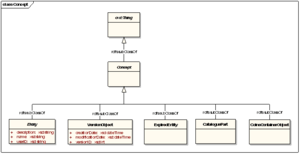
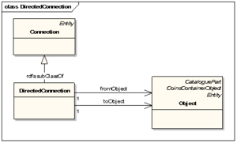

# Core Model Classes and Properties

Description of core model Classes and Properties

## Core Model Classes

Description of core model Classes 

### Assembly

**Assembly** is a subclass of <a href="https://bimloket.github.io/COINS_2.0/coinsweb/#entity" title="CoinsCore:Entity Class">Entity</a>.
Assembly is an abstract class; it can not be instantiated directly. Members of intantiatable subclasses of Entity can additionally be typed as Assembly.

The Assembly class is extendable.

The <a href="https://bimloket.github.io/COINS_2.0/coinsweb/#nexttrunkversion" title="CoinsCore:nextTrunkVersion Property">nextTrunkVersion</a> is restricted to one other individual of Assembly.

**History**

* New in COINS

**Informative representation in UML**

This image shows the informative representation of the Assembly class.

**Attributes**

<table class="wikitable">
<tr>
<th> Name
</th>
<th> Type
</th>
<th> Description
</th></tr>
<tr>
<td> <a href="https://bimloket.github.io/COINS_2.0/coinsweb/#hascontainsrelation" title="CoinsCore:hasContainsRelation Property">hasContainsRelation</a> </td>
<td> <a href="https://bimloket.github.io/COINS_2.0/coinsweb/#containsrelation" title="CoinsCore:ContainsRelation Class">ContainsRelation</a> </td>
<td> Reference to ContainsRelations
</td></tr>
</table>

**Formal Representation in RDF/XML**

<pre> &lt;owl:Class rdf:ID="Assembly"&gt;
   &lt;rdfs:label xml:lang="en-GB"&gt;Assembly&lt;/rdfs:label&gt;
   &lt;rdfs:comment xml:lang="en-GB"&gt;Parent&lt;/rdfs:comment&gt;
   &lt;rdfs:subClassOf rdf:resource="#Entity"/&gt;
   &lt;isClassAbstract rdf:datatype="xsd:boolean"&gt;true&lt;/isClassAbstract&gt;
   &lt;isClassExtendable rdf:datatype="xsd:boolean"&gt;true&lt;/isClassExtendable&gt;
   &lt;rdfs:subClassOf&gt;
     &lt;owl:Restriction&gt;
       &lt;owl:onProperty rdf:resource="#nextTrunkVersion"/&gt;
       &lt;owl:allValuesFrom rdf:resource="#Assembly"/&gt;
     &lt;/owl:Restriction&gt;
   &lt;/rdfs:subClassOf&gt;
   &lt;classCreator rdf:resource="#COINSTechnicalManagementGroup"/&gt;
   &lt;classCreationDate rdf:datatype="xsd:dateTime"&gt;2016-04-04T12:00:00.00&lt;/classCreationDate&gt;
   &lt;classVersionID rdf:datatype="xsd:string"&gt;1.0&lt;/classVersionID&gt;
 &lt;/owl:Class&gt;
</pre>

### BooleanProperty

**BooleanProperty** is disjoined with <a href="https://bimloket.github.io/COINS_2.0/coinsweb/#stringproperty "CoinsCore:StringProperty Class">StringProperty</a>, 
<a href="https://bimloket.github.io/COINS_2.0/coinsweb/#numericproperty" title="CoinsCore:NumericProperty Class">NumericProperty</a>, 
<a href="https://bimloket.github.io/COINS_2.0/coinsweb/#datetimeproperty" title="CoinsCore:DateTimeProperty Class">DateTimeProperty</a> and 
<a href="https://bimloket.github.io/COINS_2.0/coinsweb/#uriproperty" title="CoinsCore:UriProperty Class">UriProperty</a>.

BooleanProperty is not an abstract class; it can be instantiated directly. 

The <a href="https://bimloket.github.io/COINS_2.0/coinsweb/#nexttrunkversion" title="CoinsCore:nextTrunkVersion Property">nextTrunkVersion</a> is restricted to one other instance of BooleanProperty.

   
**History**
* New in COINS 2.0

   
**Informative representation in UML**
 
This image shows the informative representation of the BooleanProperty class
 

 
**Attributes**
	
<table class="wikitable">
<tr>
<th> Name
</th>
<th> Type
</th>
<th> Description
</th></tr>
<tr>
<td> <a href="https://bimloket.github.io/COINS_2.0/coinsweb/#datatypevalue" title="CoinsCore:datatypeValue Property">datatypeValue</a> </td>
<td> xsd:boolean </td>
<td> Exactly one Boolean value. Empty value not allowed.
</td></tr>
</table>
	
**Formal Representation in RDF/XML**
	
<pre> &lt;owl:Class rdf:ID="BooleanProperty"&gt;

   &lt;rdfs:label xml:lang="en-GB"&gt;BooleanProperty&lt;/rdfs:label&gt;
   &lt;rdfs:comment xml:lang="en-GB"&gt;BooleanProperty&lt;/rdfs:comment&gt;

   &lt;rdfs:subClassOf rdf:resource="#SimpleProperty"/&gt;

   &lt;owl:disjointWith rdf:resource="#StringProperty"/&gt;
   &lt;owl:disjointWith rdf:resource="#NumericProperty"/&gt;
   &lt;owl:disjointWith rdf:resource="#DateTimeProperty"/&gt;
   &lt;owl:disjointWith rdf:resource="#UriProperty"/&gt;

   &lt;owl:equivalentClass&gt;
     &lt;owl:Class&gt;
       &lt;owl:intersectionOf rdf:parseType="Collection"&gt;
         &lt;rdf:Description rdf:ID="SimpleProperty"/&gt;
         &lt;owl:Restriction&gt;
           &lt;owl:onProperty rdf:resource="#datatypeValue"/&gt;
           &lt;owl:allValuesFrom rdf:resource="xsd:boolean"/&gt;
         &lt;/owl:Restriction&gt;
       &lt;/owl:intersectionOf&gt;
     &lt;/owl:Class&gt;
   &lt;/owl:equivalentClass&gt;

   &lt;rdfs:subClassOf&gt;
     &lt;owl:Restriction&gt;
       &lt;owl:onProperty rdf:resource="#datatypeValue"/&gt;
       &lt;owl:allValuesFrom rdf:resource="xsd:boolean"/&gt;
     &lt;/owl:Restriction&gt;
   &lt;/rdfs:subClassOf&gt;

   &lt;isClassAbstract rdf:datatype="xsd:boolean"&gt;false&lt;/isClassAbstract&gt;
   &lt;isClassExtendable rdf:datatype="xsd:boolean"&gt;true&lt;/isClassExtendable&gt;

   &lt;rdfs:subClassOf&gt;
     &lt;owl:Restriction&gt;
       &lt;owl:onProperty rdf:resource="#nextTrunkVersion"/&gt;
       &lt;owl:allValuesFrom rdf:resource="#BooleanProperty"/&gt;
     &lt;/owl:Restriction&gt;
   &lt;/rdfs:subClassOf&gt;

   &lt;classCreator rdf:resource="#COINSTechnicalManagementGroup"/&gt;
   &lt;classCreationDate rdf:datatype="xsd:dateTime"&gt;2016-04-04T12:00:00.00&lt;/classCreationDate&gt;
   &lt;classVersionID rdf:datatype="xsd:string"&gt;1.0&lt;/classVersionID&gt;

 &lt;/owl:Class&gt;
</pre>

	
### CartesianLocator
	
**CartesianLocator** is a subclass of <a href="https://bimloket.github.io/COINS_2.0/coinsweb/#locator" title="CoinsCore:CartesianLocator Class">Locatory</a>. It specifies the position and orientation of an Object using a 3D Euclidean space for relative placement of shape representations. Therefore it holds references to Vectors for its primary and secondary Orientation, plus a Vector for the translation.

CartesianLocator is disjoint with Party, EntityProperty and Vector.

CartesianLocator is not an abstract class; it can be instantiated directly.

The CartesianLocator class is extendable.

The <a href="https://bimloket.github.io/COINS_2.0/coinsweb/#nexttrunkversion" title="CoinsCore:nextTrunkVersion Property">nextTrunkVersion</a> is restricted to one other instance of CartesianLocator.

**History**
	
* New in COINS 2.0; <a href="https://bimloket.github.io/COINS_2.0/coinsarchive/#cbimlocator" title="Cbim:Locator">Cbim:Locator</a>
   
**Informative representation in UML**
   
 This image shows the informative representation of the CartesianLocator class.
   

   
**Attributes**
<table class="wikitable">
<tr>
<th> Name
</th>
<th> Type
</th>
<th> Description
</th></tr>
<tr>
<td> <a href="https://bimloket.github.io/COINS_2.0/coinsweb/#primaryorientation" title="CoinsCore:primaryOrientation Property">primaryOrientation</a> </td>
<td> <a href="https://bimloket.github.io/COINS_2.0/coinsweb/#vector" title="CoinsCore:Vector Class">Vector</a> </td>
<td> 0..1 Vector for primary orientation.
</td></tr>
<tr>
<td> <a href="https://bimloket.github.io/COINS_2.0/coinsweb/#secundaryorientation" title="CoinsCore:secundaryOrientation Property">secundaryorientation</a> </td>
<td> <a https://bimloket.github.io/COINS_2.0/coinsweb/#vector" title="CoinsCore:Vector Class">Vector</a> </td>
<td> 0..1 Vector for secundary orientation.
</td></tr>
<tr>
<td> <a href="https://bimloket.github.io/COINS_2.0/coinsweb/#translationproperty" title="CoinsCore:translation Property">translation</a> </td>
<td> <a href="https://bimloket.github.io/COINS_2.0/coinsweb/#vector" "title="CoinsCore:Vector Class">Vector</a> </td>
<td> 0..1 Vector for translation.
</td></tr>
</table>

	
**Formal representation in RDF/XML**
	
<pre> &lt;owl:Class rdf:ID="CartesianLocator"&gt;

   &lt;rdfs:label xml:lang="en-GB"&gt;CartesianLocator&lt;/rdfs:label&gt;
   &lt;rdfs:comment xml:lang="en-GB"&gt;Specifier for position and orientation using a 3D Euclidean space for relative placement of shaperepresentations.&lt;/rdfs:comment&gt;

   &lt;rdfs:subClassOf rdf:resource="#Locator"/&gt;

   &lt;owl:disjointWith rdf:resource="#EntityProperty"/&gt;
   &lt;owl:disjointWith rdf:resource="#Vector"/&gt;
   &lt;owl:disjointWith rdf:resource="#Party"/&gt;

   &lt;rdfs:subClassOf&gt;
     &lt;owl:Restriction&gt;
       &lt;owl:onProperty rdf:resource="#primaryOrientation"/&gt;
       &lt;owl:maxCardinality rdf:datatype="xsd:nonNegativeInteger"&gt;1&lt;/owl:maxCardinality&gt;
     &lt;/owl:Restriction&gt;
   &lt;/rdfs:subClassOf&gt;

   &lt;rdfs:subClassOf&gt;
     &lt;owl:Restriction&gt;
       &lt;owl:onProperty rdf:resource="#secondaryOrientation"/&gt;
       &lt;owl:maxCardinality rdf:datatype="xsd:nonNegativeInteger"&gt;1&lt;/owl:maxCardinality&gt;
     &lt;/owl:Restriction&gt;
   &lt;/rdfs:subClassOf&gt;

   &lt;rdfs:subClassOf&gt;
     &lt;owl:Restriction&gt;
       &lt;owl:onProperty rdf:resource="#translation"/&gt;
       &lt;owl:maxCardinality rdf:datatype="xsd:nonNegativeInteger"&gt;1&lt;/owl:maxCardinality&gt;
     &lt;/owl:Restriction&gt;
   &lt;/rdfs:subClassOf&gt;

   &lt;isClassAbstract rdf:datatype="xsd:boolean"&gt;false&lt;/isClassAbstract&gt;
   &lt;isClassExtendable rdf:datatype="xsd:boolean"&gt;true&lt;/isClassExtendable&gt;

   &lt;rdfs:subClassOf&gt;
     &lt;owl:Restriction&gt;
       &lt;owl:onProperty rdf:resource="#nextTrunkVersion"/&gt;
       &lt;owl:allValuesFrom rdf:resource="#CartesianLocator"/&gt;
     &lt;/owl:Restriction&gt;
   &lt;/rdfs:subClassOf&gt;

   &lt;classCreator rdf:resource="#COINSTechnicalManagementGroup"/&gt;
   &lt;classCreationDate rdf:datatype="xsd:dateTime"&gt;2016-04-04T12:00:00.00&lt;/classCreationDate&gt;
   &lt;classVersionID rdf:datatype="xsd:string"&gt;1.0&lt;/classVersionID&gt;

 &lt;/owl:Class&gt;
</pre>
   

### CataloguePart
	
**CataloguePart** is a subclass of <a href="https://bimloket.github.io/COINS_2.0/coinsweb/#concept" title="CoinsCore:Concept Class">Concept</a>. CatalogueParts are for aligning of external Object Type Libraries.

CataloguePart is not abstract; it can be instantiated.

The CataloguePart class can be extended to other classes.

The <a href="https://bimloket.github.io/COINS_2.0/coinsweb/#nexttrunkversion" title="CoinsCore:nextTrunkVersion Property">nextTrunkVersion</a> is restricted to one other individual of CataloguePart.
   
**History**
* Unchanged in COINS 2.0
   
**Informative representation in UML**
This image shows the informative representation of the CataloguePart class.
   

   

**Formal representation in RDF/XML**
<pre> &lt;owl:Class rdf:ID="CataloguePart"&gt;

   &lt;rdfs:label xml:lang="en-GB"&gt;Cataloguepart&lt;/rdfs:label&gt;
   &lt;rdfs:comment xml:lang="en-GB"&gt;Generic catalogue part for alignement of external ObjectTypeLibraries.&lt;/rdfs:comment&gt;

   &lt;rdfs:subClassOf rdf:resource="#Concept"/&gt;

   &lt;rdfs:subClassOf&gt;
     &lt;owl:Class&gt;
       &lt;owl:intersectionOf rdf:parseType="Collection"&gt;
         &lt;rdf:Description rdf:ID="Concept"/&gt;
         &lt;rdf:Description rdf:ID="Entity"/&gt;
       &lt;/owl:intersectionOf&gt;
     &lt;/owl:Class&gt;
   &lt;/rdfs:subClassOf&gt;

   &lt;isClassAbstract rdf:datatype="xsd:boolean"&gt;false&lt;/isClassAbstract&gt;
   &lt;isClassExtendable rdf:datatype="xsd:boolean"&gt;true&lt;/isClassExtendable&gt;

   &lt;rdfs:subClassOf&gt;
     &lt;owl:Restriction&gt;
       &lt;owl:onProperty rdf:resource="#nextTrunkVersion"/&gt;
       &lt;owl:allValuesFrom rdf:resource="#CataloguePart"/&gt;
     &lt;/owl:Restriction&gt;
   &lt;/rdfs:subClassOf&gt;

   &lt;classCreator rdf:resource="#COINSTechnicalManagementGroup"/&gt;
   &lt;classCreationDate rdf:datatype="xsd:dateTime"&gt;2016-04-04T12:00:00.00&lt;/classCreationDate&gt;
   &lt;classVersionID rdf:datatype="xsd:string"&gt;1.0&lt;/classVersionID&gt;

 &lt;/owl:Class&gt;
</pre>

### CoinsContainerObject
	
CoinsContainerObject is a subclass of <a href="https://bimloket.github.io/COINS_2.0/coinsweb/#concept" title="CoinsCore:Concept Class">Concept</a>. It contains all individuals that are placed in a Coins Container.

CoinsContainerObject is not an abstract class; it can be instantiated.

The CoinsContainerObject class can be extended to other classes.

The <a href="https://bimloket.github.io/COINS_2.0/coinsweb/#nexttrunkversion" title="CoinsCore:nextTrunkVersion Property">nextTrunkVersion</a> is restricted to one other individual of CoinsContainerObject.

This CoinsContainerObject acts as a kind of placeholder for all objects within this container. So, when you import this information into your own system you are able to identify which objects have been sent to you in what container.
 
**History**
* New in COINS 2.0
   
**Informative representation in UML**

   This image shows the informative representation of the CoinsContainerObject class.
   

   

**Formal representation in RDF/XML**
	
<pre> &lt;owl:Class rdf:ID="CoinsContainerObject"&gt;

   &lt;rdfs:label xml:lang="en-GB"&gt;CoinsContainerObject&lt;/rdfs:label&gt;
   &lt;rdfs:comment xml:lang="en-GB"&gt;CoinsContainerObject&lt;/rdfs:comment&gt;

   &lt;rdfs:subClassOf rdf:resource="#Concept"/&gt;

   &lt;rdfs:subClassOf rdf:resource="#Entity"/&gt;

   &lt;isClassAbstract rdf:datatype="xsd:boolean"&gt;false&lt;/isClassAbstract&gt;
   &lt;isClassExtendable rdf:datatype="xsd:boolean"&gt;true&lt;/isClassExtendable&gt;

   &lt;rdfs:subClassOf&gt;
     &lt;owl:Restriction&gt;
       &lt;owl:onProperty rdf:resource="#nextTrunkVersion"/&gt;
       &lt;owl:allValuesFrom rdf:resource="#CoinsContainerObject"/&gt;
     &lt;/owl:Restriction&gt;
   &lt;/rdfs:subClassOf&gt;

   &lt;classCreator rdf:resource="#COINSTechnicalManagementGroup"/&gt;
   &lt;classCreationDate rdf:datatype="xsd:dateTime"&gt;2016-04-04T12:00:00.00&lt;/classCreationDate&gt;
   &lt;classVersionID rdf:datatype="xsd:string"&gt;1.0&lt;/classVersionID&gt;

 &lt;/owl:Class&gt;
</pre>

### ComplexProperty

ComplexProperty is a subclass of <a href="https://bimloket.github.io/COINS_2.0/coinsweb/#entityproperty" title="CoinsCore:EntityProperty">EntityProperty</a>. It is the superclass of all property classes that hold exactly one single reference to an ComplexPropertyValue.

Where SimpleProperty refers to a simple value, ComplexProperty refers to an ComplexPropertyValue: an object instance. Therefore ComplexProperty is disjoined with SimpleProperty.

ComplexProperty is not an abstract class; can be instantiated directly.

The ComplexProperty class can be extended; in the COINS Core Model it is extended to DocumentProperty and LocatorProperty.

The <a href="https://bimloket.github.io/COINS_2.0/coinsweb/#nexttrunkversion" title="CoinsCore:nextTrunkVersion Property">nextTrunkVersion</a> is restricted to one other instance of ComplexProperty.
   

**History**
* New in COINS 2.0
   
**Informative representation in UML**

This image shows the informative representation of the ComplexProperty class.

   
**Attributes**
<table class="wikitable">
<tr>
<th> Name
</th>
<th> Type
</th>
<th> Description
</th></tr>
<tr>
<td> <a href="https://bimloket.github.io/COINS_2.0/coinsweb/#objectvalue" title="CoinsCore:ObjectValue Property">objectValue</a> </td>
<td> <a href="https://bimloket.github.io/COINS_2.0/coinsweb/#complexpropertyvalue" title="CoinsCore:ComplexPropertyValue">ComplexPropertyValue</a> </td>
<td> Reference to an other element
</td></tr>
</table>

**Formal representation in RDF/XML**
   
<pre> &lt;owl:Class rdf:ID="ComplexProperty"&gt;

   &lt;rdfs:label xml:lang="en-GB"&gt;Complex Property&lt;/rdfs:label&gt;
   &lt;rdfs:comment xml:lang="en-GB"&gt;Complex property&lt;/rdfs:comment&gt;

   &lt;rdfs:subClassOf rdf:resource="#EntityProperty"/&gt;

   &lt;owl:disjointWith rdf:resource="#SimpleProperty"/&gt;

   &lt;rdfs:subClassOf&gt;
     &lt;owl:Restriction&gt;
       &lt;owl:onProperty rdf:resource="#ComplexPropertyValue"/&gt;
       &lt;owl:cardinality rdf:datatype="xsd:nonNegativeInteger"&gt;1&lt;/owl:cardinality&gt;
     &lt;/owl:Restriction&gt;
   &lt;/rdfs:subClassOf&gt;

   &lt;isClassExtendable rdf:datatype="xsd:boolean"&gt;true&lt;/isClassExtendable&gt;
   &lt;isClassAbstract rdf:datatype="xsd:boolean"&gt;false&lt;/isClassAbstract&gt;

   &lt;rdfs:subClassOf&gt;
     &lt;owl:Restriction&gt;
       &lt;owl:onProperty rdf:resource="#nextTrunkVersion"/&gt;
       &lt;owl:allValuesFrom rdf:resource="#ComplexProperty"/&gt;
     &lt;/owl:Restriction&gt;
   &lt;/rdfs:subClassOf&gt;

   &lt;classCreator rdf:resource="#COINSTechnicalManagementGroup"/&gt;
   &lt;classCreationDate rdf:datatype="xsd:dateTime"&gt;2016-04-04T12:00:00.00&lt;/classCreationDate&gt;
   &lt;classVersionID rdf:datatype="xsd:string"&gt;1.0&lt;/classVersionID&gt;

 &lt;/owl:Class&gt;
</pre>

### ComplexPropertyValue
	
ComplexPropertyValue is a subclass of <a href="https://bimloket.github.io/COINS_2.0/coinsweb/#entity" title="CoinsCore:Entity">Entity</a>. It has no further attributes of itself, but all <a href="https://bimloket.github.io/COINS_2.0/coinsweb/#complexproperty" title="CoinsCore:ComplexProperty">ComplexProperties</a> refer to a value of ComplexPropertyValue or specialization thereof. An instance of ComplexPropertyValue can not exist by itself.

ComplexPropertyValue is not an abstract class; it can be instantiated directly.

ComplexPropertyValue is extendable; in the Coins Core Model, it is extended to <a href="https://bimloket.github.io/COINS_2.0/coinsweb/#documentreference" title="CoinsCore:DocumentReference">DocumentReference</a>, <a href="https://bimloket.github.io/COINS_2.0/coinsweb/#locator title="CoinsCore:Locator">Locator</a> and <a href="https://bimloket.github.io/COINS_2.0/coinsweb/#vector" title="CoinsCore:Vector">Vector</a>.

The <a href="https://bimloket.github.io/COINS_2.0/coinsweb/#nexttrunkversion" title="CoinsCore:nextTrunkVersion Property">nextTrunkVersion</a> is restricted to one other instance of ComplexPropertyValue. 

   
**History**
* New in COINS 2.0
   
   
**Informative representation in UML**

This image shows the informative representation of the ComplexPropertyValue class.

   

**Formal representation in RDF/XML**
   
<pre> &lt;owl:Class rdf:ID="ComplexPropertyValue"&gt;

   &lt;rdfs:label xml:lang="en-GB"&gt;ComplexPropertyValue&lt;/rdfs:label&gt;
   &lt;rdfs:comment xml:lang="en-GB"&gt;ComplexPropertyValue&lt;/rdfs:comment&gt;

   &lt;rdfs:subClassOf rdf:resource="#Entity"/&gt;

   &lt;isClassAbstract rdf:datatype="xsd:boolean"&gt;false&lt;/isClassAbstract&gt;
   &lt;isClassExtendable rdf:datatype="xsd:boolean"&gt;true&lt;/isClassExtendable&gt;

   &lt;rdfs:subClassOf&gt;
     &lt;owl:Restriction&gt;
       &lt;owl:onProperty rdf:resource="#nextTrunkVersion"/&gt;
       &lt;owl:allValuesFrom rdf:resource="#ComplexPropertyValue"/&gt;
     &lt;/owl:Restriction&gt;
   &lt;/rdfs:subClassOf&gt;

   &lt;classCreator rdf:resource="#COINSTechnicalManagementGroup"/&gt;
   &lt;classCreationDate rdf:datatype="xsd:dateTime"&gt;2016-04-04T12:00:00.00&lt;/classCreationDate&gt;
   &lt;classVersionID rdf:datatype="xsd:string"&gt;1.0&lt;/classVersionID&gt;

 &lt;/owl:Class&gt;
</pre>
	

### Concept
	
**Concept** is a subclass of [owl:Thing](http://www.w3.org/2002/07/owl#"). Concept serves as superclass of all classes in a COINS model.
It is without any properties or references.
Concept acts an abstract class; it can not be instantiated directly. Individuals belong indirectly to this class.
Concept is not extendable; in the Coins Core Model it is extended to The <a href="https://bimloket.github.io/COINS_2.0/coinsweb/#entity" title="CoinsCore:Entity Class">Entity</a>, The <a href="https://bimloket.github.io/COINS_2.0/coinsweb/#versionobject" title="CoinsCore:VersionObject Class">VersionObject</a>, The <a href="https://bimloket.github.io/COINS_2.0/coinsweb/#expiredentity" title="CoinsCore:ExpiredEntity Class">ExpiredEntity</a>, The <a href="https://bimloket.github.io/COINS_2.0/coinsweb/#cataloguepart" title="CoinsCore:CataloguePart Class">CataloguePart</a> and The <a href="https://bimloket.github.io/COINS_2.0/coinsweb/#coinscontainerobject" title="CoinsCore:CoinsContainerObject Class">CoinsContainerObject</a>.
Concept is the common superclass for all other COINS classes.
   
   
**History**
* New in COINS 2.0 - replaces <a href="https://bimloket.github.io/COINS_2.0/coinsarchive/#cbimobject" title="Cbim:Object">Cbim:Object</a>
   
**Informative representation in UML**

   

**Formal representation in RDF/XML**

<pre> &lt;owl:Class rdf:ID="Concept"&gt;

   &lt;rdfs:label xml:lang="en-GB"&gt;CbimEntity&lt;/rdfs:label&gt;
   &lt;rdfs:comment xml:lang="en-GB"&gt;Abstract superclass for all Cbim classes. This class is without any properties or relations&lt;/rdfs:comment&gt;

   &lt;rdfs:subClassOf rdf:resource="owl:Thing"/&gt;

   &lt;isClassAbstract rdf:datatype="xsd:boolean"&gt;true&lt;/isClassAbstract&gt;
   &lt;isClassExtendable rdf:datatype="xsd:boolean"&gt;false&lt;/isClassExtendable&gt;

   &lt;classCreator rdf:resource="#COINSTechnicalManagementGroup"/&gt;
   &lt;classCreationDate rdf:datatype="xsd:dateTime"&gt;2016-04-04T12:00:00.00&lt;/classCreationDate&gt;
   &lt;classVersionID rdf:datatype="xsd:string"&gt;1.0&lt;/classVersionID&gt;

 &lt;/owl:Class&gt;
</pre>

### Connection
	
Connection is a subclass of <a href="https://bimloket.github.io/COINS_2.0/coinsweb/#entity" title="CoinsCore:Entity">Entity</a>. The Connection class enables the functional connection between two Objects. Therefore it holds references to exactly 2 Objects. The relation is undirected, meaning there is no source and target of the relationship; both Objects are considered equal.

Connection is not an abstract class; it can be instantiated directly.

The Connection class is extendable; in the Coins Core Model it is extended to <a href="https://bimloket.github.io/COINS_2.0/coinsweb/#directedconnection" title="CoinsCore:DirectedConnection Class">DirectedConnection</a> for defining a directed relationship.

The <a href="https://bimloket.github.io/COINS_2.0/coinsweb/#nexttrunkversion" title="CoinsCore:nextTrunkVersion Property">nextTrunkVersion</a> is restricted to one other individual of Connection.

   
**History**
* Modified in COINS 2.0; it is no longer for terminal objects only.
   
**Informative representation in UML**

   
**Attributes**
<table class="wikitable">
<tr>
<th> Name
</th>
<th> Type
</th>
<th> Description
</th></tr>
<tr>
<td> <a href="https://bimloket.github.io/COINS_2.0/coinsweb/#hasconnectedobjects" title="CoinsCore:hasConnectedObjects Property">hasConnectedObjects</a> </td>
<td> <a href="https://bimloket.github.io/COINS_2.0/coinsweb/#object" title="CoinsCore:Object Class">Object</a> </td>
<td> Reference to an other element
</td></tr>
</table>

**Formal representation in RDF/XML**

<pre> &lt;owl:Class rdf:ID="Connection"&gt;

   &lt;rdfs:label xml:lang="en-GB"&gt;Connection&lt;/rdfs:label&gt;
   &lt;rdfs:comment xml:lang="en-GB"&gt;undirected Connection between Objects&lt;/rdfs:comment&gt;

   &lt;rdfs:subClassOf rdf:resource="#Entity"/&gt;

   &lt;rdfs:subClassOf&gt;
     &lt;owl:Restriction&gt;
       &lt;owl:onProperty rdf:resource="#hasConnectedObjects"/&gt;
       &lt;owl:cardinality rdf:datatype="xsd:nonNegativeInteger"&gt;2&lt;/owl:cardinality&gt;
     &lt;/owl:Restriction&gt;
   &lt;/rdfs:subClassOf&gt;

   &lt;isClassAbstract rdf:datatype="xsd:boolean"&gt;false&lt;/isClassAbstract&gt;
   &lt;isClassExtendable rdf:datatype="xsd:boolean"&gt;true&lt;/isClassExtendable&gt;

   &lt;rdfs:subClassOf&gt;
     &lt;owl:Restriction&gt;
       &lt;owl:onProperty rdf:resource="#nextTrunkVersion"/&gt;
       &lt;owl:allValuesFrom rdf:resource="#Connection"/&gt;
     &lt;/owl:Restriction&gt;
   &lt;/rdfs:subClassOf&gt;

   &lt;classCreator rdf:resource="#COINSTechnicalManagementGroup"/&gt;
   &lt;classCreationDate rdf:datatype="xsd:dateTime"&gt;2016-04-04T12:00:00.00&lt;/classCreationDate&gt;
   &lt;classVersionID rdf:datatype="xsd:string"&gt;1.0&lt;/classVersionID&gt;

 &lt;/owl:Class&gt;
</pre>

### ContainsRelation
   
**ContainsRelation** is a subclass of <a href="https://bimloket.github.io/COINS_2.0/coinsweb/#entity" title="CoinsCore:Entity Class">Entity</a>.

ContainsRelation is not an abstract class; it can instantiated directly.

The ContainsRelation class can be extended.

The <a href="https://bimloket.github.io/COINS_2.0/coinsweb/#nexttrunkversion" title="CoinsCore:nextTrunkVersion Property">nextTrunkVersion</a> is restricted to one other individual of ContainsRelation.

**History**
* New in COINS 2.0

**Informative representation in UML**

This image shows the informative representation of the ContainsRelation class.

**Attributes**
   
| Name | Type |	Description |
| :--- | :--- | :--- |
| <a href="https://bimloket.github.io/COINS_2.0/coinsweb/#hasassembly" title="CoinsCore:hasAssembly Property">hasAssembly</a> |	<a href="https://bimloket.github.io/COINS_2.0/coinsweb/#assembly" title="CoinsCore:Assembly Class">Assembly</a> | Reference to exactly 1 instance of Assembly |
| <a href="https://bimloket.github.io/COINS_2.0/coinsweb/#hasassembly" title="CoinsCore:hasPart Property">hasAssembly</a> | <a href="https://bimloket.github.io/COINS_2.0/coinsweb/#haspart" title="CoinsCore:hasPart Property">hasPart</a> | <a href="https://bimloket.github.io/COINS_2.0/coinsweb/#part" title="CoinsCore:Part Class">Part</a> | Reference to exactly 1 instance of Part | 
| a href="https://bimloket.github.io/COINS_2.0/coinsweb/#groupedby" title="CoinsCore:groupedBy Property">groupedBy</a> | <a href="https://bimloket.github.io/COINS_2.0/coinsweb/#containsrelationgroup" title="CoinsCore:ContainsRelationGroup Class">ContainsRelationGroup</a> | ContainsRelations can be grouped in ContainsRelationGroup |

**Formal Representation in RDF/XML**

<pre> &lt;owl:Class rdf:ID="ContainsRelation"&gt;

   &lt;rdfs:label xml:lang="en-GB"&gt;ContainsRelation&lt;/rdfs:label&gt;
   &lt;rdfs:comment xml:lang="en-GB"&gt;ContainsRelation&lt;/rdfs:comment&gt;

   &lt;rdfs:subClassOf rdf:resource="#Entity"/&gt;

   &lt;owl:disjointWith rdf:resource="#Part"/&gt;
   &lt;owl:disjointWith rdf:resource="#Assembly"/&gt;

   &lt;rdfs:subClassOf&gt;
     &lt;owl:Restriction&gt;
       &lt;owl:onProperty rdf:resource="#hasAssembly"/&gt;
       &lt;owl:cardinality rdf:datatype="xsd:nonNegativeInteger"&gt;1&lt;/owl:cardinality&gt;
     &lt;/owl:Restriction&gt;
   &lt;/rdfs:subClassOf&gt;

   &lt;rdfs:subClassOf&gt;
     &lt;owl:Restriction&gt;
       &lt;owl:onProperty rdf:resource="#hasPart"/&gt;
       &lt;owl:cardinality rdf:datatype="xsd:nonNegativeInteger"&gt;1&lt;/owl:cardinality&gt;
     &lt;/owl:Restriction&gt;
   &lt;/rdfs:subClassOf&gt;

   &lt;isClassAbstract rdf:datatype="xsd:boolean"&gt;false&lt;/isClassAbstract&gt;
   &lt;isClassExtendable rdf:datatype="xsd:boolean"&gt;true&lt;/isClassExtendable&gt;

   &lt;rdfs:subClassOf&gt;
     &lt;owl:Restriction&gt;
       &lt;owl:onProperty rdf:resource="#nextTrunkVersion"/&gt;
       &lt;owl:allValuesFrom rdf:resource="#ContainsRelation"/&gt;
     &lt;/owl:Restriction&gt;
   &lt;/rdfs:subClassOf&gt;

   &lt;classCreator rdf:resource="#COINSTechnicalManagementGroup"/&gt;
   &lt;classCreationDate rdf:datatype="xsd:dateTime"&gt;2016-04-04T12:00:00.00&lt;/classCreationDate&gt;
   &lt;classVersionID rdf:datatype="xsd:string"&gt;1.0&lt;/classVersionID&gt;

 &lt;/owl:Class&gt;
</pre>

### ContainsRelationGroup

ContainsRelationGroup is a subclass of <a href="https://bimloket.github.io/COINS_2.0/coinsweb/#entity" title="CoinsCore:Entity Class">Entity</a>. It belongs to a exactly 1 Assembly and holds references to 0, 1 or more ContainsRelations.

ContainsRelationGroup can be instantiated and extended.

The <a href="https://bimloket.github.io/COINS_2.0/coinsweb/#nexttrunkversion" title="CoinsCore:nextTrunkVersion Property">nextTrunkVersion</a> is restricted to one other individual of ContainsRelationGroup.

This concept gives you the possibility to manage different options of object decompositions.

**History**
* New in COINS 2.0
   

   
**Attributes**

| Col1 | Col2 | Col3 |
| :--- | :--- | :--- |
| Name | Type |	Description |
| <a href="https://bimloket.github.io/COINS_2.0/coinsweb/#belongstoassembly" title="CoinsCore:belongsToAssembly Property">belongsToAssembly</a> | <a href="https://bimloket.github.io/COINS_2.0/coinsweb/#assembly" title="CoinsCore:Assembly Class">Assembly</a> | Reference to exactly 1 instance of Assembly |
| <a href="https://bimloket.github.io/COINS_2.0/coinsweb/#hasassembly" title="CoinsCore:hasPart Property">hasAssembly</a> | <a href="https://bimloket.github.io/COINS_2.0/coinsweb/#groups" title="CoinsCore:groups Property">groups</a> | <a href="https://bimloket.github.io/COINS_2.0/coinsweb/#containsrelation" title="CoinsCore:ContainsRelation Class">ContainsRelation</a> | Reference to exactly 1 instance of Part

**Formal representation in RDF/XML**

<pre>   &lt;rdfs:label xml:lang="en-GB"&gt;ContainsRelationGroup&lt;/rdfs:label&gt;
   &lt;rdfs:comment xml:lang="en-GB"&gt;ContainsRelationGroup&lt;/rdfs:comment&gt;

   &lt;rdfs:subClassOf rdf:resource="#Entity"/&gt;

   &lt;rdfs:subClassOf&gt;
     &lt;owl:Restriction&gt;
       &lt;owl:onProperty rdf:resource="#belongsToAssembly"/&gt;
       &lt;owl:cardinality rdf:datatype="xsd:nonNegativeInteger"&gt;1&lt;/owl:cardinality&gt;
     &lt;/owl:Restriction&gt;
   &lt;/rdfs:subClassOf&gt;

   &lt;isClassAbstract rdf:datatype="xsd:boolean"&gt;false&lt;/isClassAbstract&gt;
   &lt;isClassExtendable rdf:datatype="xsd:boolean"&gt;true&lt;/isClassExtendable&gt;

   &lt;rdfs:subClassOf&gt;
     &lt;owl:Restriction&gt;
       &lt;owl:onProperty rdf:resource="#nextTrunkVersion"/&gt;
       &lt;owl:allValuesFrom rdf:resource="#ContainsRelationGroup"/&gt;
     &lt;/owl:Restriction&gt;
   &lt;/rdfs:subClassOf&gt;

   &lt;classCreator rdf:resource="#COINSTechnicalManagementGroup"/&gt;
   &lt;classCreationDate rdf:datatype="xsd:dateTime"&gt;2016-04-04T12:00:00.00&lt;/classCreationDate&gt;
   &lt;classVersionID rdf:datatype="xsd:string"&gt;1.0&lt;/classVersionID&gt;

 &lt;/owl:Class&gt;
</pre>

### DateTimeProperty

DateTimeProperty is a subclass of The <a href="https://bimloket.github.io/COINS_2.0/coinsweb/#simpleproperty" title="CoinsCore:SimpleProperty Class">SimpleProperty</a>. The inherited datatypeValue of SimpleProperty is overridden by xsd:dateTime, restricting instances of DateTimeProperty to hold a single DateTime-value; an empty value (nil) is not allowed.
DateTime-values are integer-valued year, month, day, hour and minute properties, a decimal-valued second property, and an optional timezoned property in the format:

< yyyy-mm-dd T hh:mm:ss.sss >
See http://www.w3.org/TR/xmlschema-2/#dateTime for formal specification.

DateTimeProperty is disjoined with <a href="https://bimloket.github.io/COINS_2.0/coinsweb/#stringproperty" title="CoinsCore:StringProperty Class">StringProperty</a>, <a href="https://bimloket.github.io/COINS_2.0/coinsweb/#numericproperty" title="CoinsCore:NumericProperty Class">NumericProperty</a>, <a href="https://bimloket.github.io/COINS_2.0/coinsweb/#booleanproperty" title="CoinsCore:BooleanProperty Class">BooleanProperty</a> and <a href="https://bimloket.github.io/COINS_2.0/coinsweb/#uirproperty" title="CoinsCore:UriProperty Class">UriProperty</a>.

DateTimeProperty is not an abstract class; it can be instantiated directly.

The DateTimeProperty class is extendable.

The <a href="https://bimloket.github.io/COINS_2.0/coinsweb/#nexttrunkversion" title="CoinsCore:nextTrunkVersion Property">nextTrunkVersion</a> is restricted to one other instance of DateTimeProperty. 

**History**
* New in COINS 2.0
   
**Informative representation in UML**

   
**Attributes**
| Name | Type |	Description |
| :--- | :--- | :--- |
| <a href="https://bimloket.github.io/COINS_2.0/coinsweb/#datatypevalue" title="CoinsCore:datatypeValue Property">datatypeValue</a> |	xsd:dateTime |	Exactly one date-time value. Empty value not allowed. |

**Formal representation in RDF/XML**
<pre> &lt;owl:Class rdf:ID="DateTimeProperty"&gt;

   &lt;rdfs:label xml:lang="en-GB"&gt;DateTimeProperty&lt;/rdfs:label&gt;
   &lt;rdfs:comment xml:lang="en-GB"&gt;DateTimeProperty&lt;/rdfs:comment&gt;

   &lt;rdfs:subClassOf rdf:resource="#SimpleProperty"/&gt;

   &lt;owl:disjointWith rdf:resource="#StringProperty"/&gt;
   &lt;owl:disjointWith rdf:resource="#NumericProperty"/&gt;
   &lt;owl:disjointWith rdf:resource="#BooleanProperty"/&gt;
   &lt;owl:disjointWith rdf:resource="#UriProperty"/&gt;

   &lt;owl:equivalentClass&gt;
     &lt;owl:Class&gt;
       &lt;owl:intersectionOf rdf:parseType="Collection"&gt;
         &lt;rdf:Description rdf:ID="SimpleProperty"/&gt;
         &lt;owl:Restriction&gt;
           &lt;owl:onProperty rdf:resource="#datatypeValue"/&gt;
           &lt;owl:allValuesFrom rdf:resource="xsd:dateTime"/&gt;
         &lt;/owl:Restriction&gt;
       &lt;/owl:intersectionOf&gt;
     &lt;/owl:Class&gt;
   &lt;/owl:equivalentClass&gt;

   &lt;rdfs:subClassOf&gt;
     &lt;owl:Restriction&gt;
       &lt;owl:onProperty rdf:resource="#datatypeValue"/&gt;
       &lt;owl:allValuesFrom rdf:resource="xsd:dateTime"/&gt;
     &lt;/owl:Restriction&gt;
   &lt;/rdfs:subClassOf&gt;

   &lt;isClassAbstract rdf:datatype="xsd:boolean"&gt;false&lt;/isClassAbstract&gt;
   &lt;isClassExtendable rdf:datatype="xsd:boolean"&gt;true&lt;/isClassExtendable&gt;

   &lt;rdfs:subClassOf&gt;
     &lt;owl:Restriction&gt;
       &lt;owl:onProperty rdf:resource="#nextTrunkVersion"/&gt;
       &lt;owl:allValuesFrom rdf:resource="#DateTimeProperty"/&gt;
     &lt;/owl:Restriction&gt;
   &lt;/rdfs:subClassOf&gt;

   &lt;classCreator rdf:resource="#COINSTechnicalManagementGroup"/&gt;
   &lt;classCreationDate rdf:datatype="xsd:dateTime"&gt;2016-04-04T12:00:00.00&lt;/classCreationDate&gt;
   &lt;classVersionID rdf:datatype="xsd:string"&gt;1.0&lt;/classVersionID&gt;

 &lt;/owl:Class&gt;
</pre>

### DirectedConnection

**DirectedConnection** is a subclass of Connection. The DirectedConnection enables a directed functional relationships between two Objects, meaning there is exactly one source Object and exactly one target Object, where the source Object delivers a function to the target Object.

DirectedConnection is not an abstract class; it can be instantiated directly.

The DirectedConnection class is extendable.

The <a href="https://bimloket.github.io/COINS_2.0/coinsweb/#nexttrunkversion" title="CoinsCore:nextTrunkVersion Property">nextTrunkVersion</a> is restricted to one other individual of DirectedConnection.  

**History**
* New in COINS 2.0

   
**Informative representation in UML**

   
**Attributes**
| Name | Type |	Description |
| :--- | :--- | :--- |
| <a href="https://bimloket.github.io/COINS_2.0/coinsweb/#fromobject" title="CoinsCore:fromObject Property">fromObject</a> |	<a href="https://bimloket.github.io/COINS_2.0/coinsweb/#object" title="CoinsCore:Object Class">Object</a> |	Exactly 1 source Object |
| <a href="https://bimloket.github.io/COINS_2.0/coinsweb/#toobject" title="CoinsCore:toObject Property">toObject</a> |	<a href="https://bimloket.github.io/COINS_2.0/coinsweb/#object" title="CoinsCore:Object Class">Object</a> |	Exactly 1 target Object |

**Formal representation in RDF/XML**

<pre> &lt;owl:Class rdf:ID="DirectedConnection"&gt;

   &lt;rdfs:label xml:lang="en-GB"&gt;Directed Connection object&lt;/rdfs:label&gt;
   &lt;rdfs:comment xml:lang="en-GB"&gt;Directed connection object between Objects&lt;/rdfs:comment&gt;

   &lt;rdfs:subClassOf rdf:resource="#Connection"/&gt;

   &lt;rdfs:subClassOf&gt;
     &lt;owl:Restriction&gt;
       &lt;owl:onProperty rdf:resource="#fromObject"/&gt;
       &lt;owl:cardinality rdf:datatype=" xsd:nonNegativeInteger"&gt;1&lt;/owl:cardinality&gt;
     &lt;/owl:Restriction&gt;
   &lt;/rdfs:subClassOf&gt;

   &lt;rdfs:subClassOf&gt;
     &lt;owl:Restriction&gt;
       &lt;owl:onProperty rdf:resource="#toObject"/&gt;
       &lt;owl:cardinality rdf:datatype=" xsd:nonNegativeInteger"&gt;1&lt;/owl:cardinality&gt;
     &lt;/owl:Restriction&gt;
   &lt;/rdfs:subClassOf&gt;

   &lt;isClassAbstract rdf:datatype="xsd:boolean"&gt;false&lt;/isClassAbstract&gt;
   &lt;isClassExtendable rdf:datatype="xsd:boolean"&gt;true&lt;/isClassExtendable&gt;

   &lt;rdfs:subClassOf&gt;
     &lt;owl:Restriction&gt;
       &lt;owl:onProperty rdf:resource="#nextTrunkVersion"/&gt;
       &lt;owl:allValuesFrom rdf:resource="#DirectedConnection"/&gt;
     &lt;/owl:Restriction&gt;
   &lt;/rdfs:subClassOf&gt;

   &lt;classCreator rdf:resource="#COINSTechnicalManagementGroup"/&gt;
   &lt;classCreationDate rdf:datatype="xsd:dateTime"&gt;2016-04-04T12:00:00.00&lt;/classCreationDate&gt;
   &lt;classVersionID rdf:datatype="xsd:string"&gt;1.0&lt;/classVersionID&gt;

 &lt;/owl:Class&gt;
</pre>

### DocumentProperty

**DocumentProperty** is a subclass of The <a href="https://bimloket.github.io/COINS_2.0/coinsweb/#complexproperty" title="CoinsCore:ComplexProperty Class">ComplexProperty</a>. Since it is a property that refers to a Document, the inherited reference for objectValue is overridden to refer to an instance of DocumentReference.

DocumentProperty is not an abstract class; it can be instantiated directly.

The DocumentProperty class can be extended to refer to more specialised documents. In the COINS Core Model it is extended to <a href="https://bimloket.github.io/COINS_2.0/coinsweb/#shaperepresentationproperty" title="CoinsCore:ShapeRepresentationProperty Class">ShapeRepresentationProperty</a>.

The <a href="https://bimloket.github.io/COINS_2.0/coinsweb/#nexttrunkversion" title="CoinsCore:nextTrunkVersion Property">nextTrunkVersion</a> is restricted to one other instance of DocumentProperty.

**History**
* New in COINS 2.0
   
**Informative representation in UML**
This image shows the informative representation of the DocumentProperty class.

   
**Attributes**
| Name | Type |	Description |
| :--- | :--- | :--- |
| <a href="https://bimloket.github.io/COINS_2.0/coinsweb/#objectvalue" title="CoinsCore:objectValue Property">objectValue</a> |	<a href="https://bimloket.github.io/COINS_2.0/coinsweb/#documentreference" title="CoinsCore:DocumentReference Class">DocumentReference</a> | Reference to an instance of DocumentReference. |

**Formal representation in RDF/XML**
<pre> &lt;owl:Class rdf:ID="DocumentProperty"&gt;

   &lt;rdfs:label xml:lang="en-GB"&gt;DocumentProperty&lt;/rdfs:label&gt;
   &lt;rdfs:comment xml:lang="en-GB"&gt;DocumentProperty&lt;/rdfs:comment&gt;

   &lt;rdfs:subClassOf rdf:resource="#ComplexProperty"/&gt;

   &lt;rdfs:subClassOf&gt;
     &lt;owl:Restriction&gt;
       &lt;owl:onProperty rdf:resource="#objectValue"/&gt;
       &lt;owl:allValuesFrom rdf:resource="#DocumentReference"/&gt;
     &lt;/owl:Restriction&gt;
   &lt;/rdfs:subClassOf&gt;

   &lt;owl:equivalentClass&gt;
     &lt;owl:Class&gt;
       &lt;owl:intersectionOf rdf:parseType="Collection"&gt;
         &lt;rdf:Description rdf:ID="ComplexProperty"/&gt;
         &lt;owl:Restriction&gt;
           &lt;owl:onProperty rdf:resource="#objectValue"/&gt;
           &lt;owl:allValuesFrom rdf:resource="#DocumentReference"/&gt;
         &lt;/owl:Restriction&gt;
       &lt;/owl:intersectionOf&gt;
     &lt;/owl:Class&gt;
   &lt;/owl:equivalentClass&gt;

   &lt;isClassAbstract rdf:datatype="xsd:boolean"&gt;false&lt;/isClassAbstract&gt;
   &lt;isClassExtendable rdf:datatype="xsd:boolean"&gt;true&lt;/isClassExtendable&gt;

   &lt;classCreator rdf:resource="#COINSTechnicalManagementGroup"/&gt;
   &lt;classCreationDate rdf:datatype="xsd:dateTime"&gt;2016-04-04T12:00:00.00&lt;/classCreationDate&gt;
   &lt;classVersionID rdf:datatype="xsd:string"&gt;1.0&lt;/classVersionID&gt;

 &lt;/owl:Class&gt;
</pre>

### DocumentReference

**DocumentReference** is a subclass of <a href="https://bimloket.github.io/COINS_2.0/coinsweb/#complexpropertyvalue" title="CoinsCore:ComplexPropertyValue Class">ComplexPropertyValue</a>. Individuals of this class refer to Documents; therefor this class has references to StringProperties for documentType, documentMimeType and documentFragment. These attributes facilitate deeplinking to information inside the referred document.

DocumentReference is not an abstract class; it can be instantiated directly.

DocumentReference is extendable; in the Coins Core Model it is extended to InternalDocumentReference, ExternalDocumentReference, SecuredDocumentReference and ShapeRepresentation.

The <a href="https://bimloket.github.io/COINS_2.0/coinsweb/#nexttrunkversion" title="CoinsCore:nextTrunkVersion Property">nextTrunkVersion</a> is restricted to one other instance of DocumentReference.

  
**History**
* New in COINS 2.0 - replaces <a href="https://bimloket.github.io/COINS_2.0/coinsarchive/#cbimdocument" title="Cbim:Document">Cbim:Document</a>
   
**Informative representation in UML**
This image shows the informative representation of the DocumentReference class.

   
**Attributes**
| Name | Type |	Description |
| :--- | :--- | :--- |
| <a href="https://bimloket.github.io/COINS_2.0/coinsweb/#documenttype" title="CoinsCore:documentType Property">documentType</a> | <a href="https://bimloket.github.io/COINS_2.0/coinsweb/#stringproperty" title="CoinsCore:StringProperty Class">StringProperty</a> | The type of the document. |
| <a href="https://bimloket.github.io/COINS_2.0/coinsweb/#documentmimetype" title="CoinsCore:documentMimeType Property">documentMimeType</a> |	<a href="https://bimloket.github.io/COINS_2.0/coinsweb/#stringproperty" title="CoinsCore:StringProperty Class">StringProperty</a> | The MIME-type of the document |
| <a href="https://bimloket.github.io/COINS_2.0/coinsweb/#documentfragment " title="CoinsCore:documentFragment Property">documentFragment</a> |	<a href="https://bimloket.github.io/COINS_2.0/coinsweb/#stringproperty" title="CoinsCore:StringProperty Class">StringProperty</a> | The fragment addresses a specific location in the document. |

**Formal representation in RDF/XML**
<pre> &lt;owl:Class rdf:ID="DocumentReference"&gt;

   &lt;rdfs:label xml:lang="en-GB"&gt;Document reference&lt;/rdfs:label&gt;
   &lt;rdfs:comment xml:lang="en-GB"&gt;Document reference class for describing referals to documents&lt;/rdfs:comment&gt;

   &lt;rdfs:subClassOf rdf:resource="#ComplexPropertyValue"/&gt;

   &lt;rdfs:subClassOf&gt;
     &lt;owl:Class&gt;
       &lt;owl:unionOf rdf:parseType="Collection"&gt;
         &lt;rdf:Description rdf:ID="InternalDocumentReference"/&gt;
         &lt;rdf:Description rdf:ID="ExternalDocumentReference"/&gt;
       &lt;/owl:unionOf&gt;
     &lt;/owl:Class&gt;
   &lt;/rdfs:subClassOf&gt;

   &lt;isClassAbstract rdf:datatype="xsd:boolean"&gt;false&lt;/isClassAbstract&gt;
   &lt;isClassExtendable rdf:datatype="xsd:boolean"&gt;true&lt;/isClassExtendable&gt;

   &lt;rdfs:subClassOf&gt;
     &lt;owl:Restriction&gt;
       &lt;owl:onProperty rdf:resource="#nextTrunkVersion"/&gt;
       &lt;owl:allValuesFrom rdf:resource="#DocumentReference"/&gt;
     &lt;/owl:Restriction&gt;
   &lt;/rdfs:subClassOf&gt;

   &lt;classCreator rdf:resource="#COINSTechnicalManagementGroup"/&gt;
   &lt;classCreationDate rdf:datatype="xsd:dateTime"&gt;2016-04-04T12:00:00.00&lt;/classCreationDate&gt;
   &lt;classVersionID rdf:datatype="xsd:string"&gt;1.0&lt;/classVersionID&gt;

 &lt;/owl:Class&gt;
</pre>

### Entity

**Entity** is a subclass of Concept. It serves as superclass of Object, EntityProperty, ComplexPropertyValue, Party, Connection and ContainsRelation.
Assembly, Part and ContainsRelationGroup are also subclasses of Entity.
Entity can also be a subclass of VersionObject, thus allowing it’s members to have versions.

Entity can not be extended to other classes.

Entity is an abstract class; it can not be instantiated directly. It’s members have to be members of an extended class (Object, EntityProperty, ComplexPropertyValue, Party, Connection and ContainsRelation) and also be a member of CoinsContainerObject or CataloguePart.

It has properties for name and description (both of type string) and optionally (custom defined) properties from EntityProperty.

It holds references to exactly 1 Party as creator.

Since data elements are instances of classes derived from Entity, these elements all have an ID, a name and description and a reference to their creator (instances of Party). Extendend classes can have custom defined properties.

The nextTrunkVersion is restricted to one.

**History**
* New in COINS 2.0
   
**Informative representation in UML**

   
**Attributes**
| Name | Type |	Description |
| :--- | :--- | :--- |
| userID | xsd:string |	To humans, an unique identification of the individual
name |
| name | xsd:string | Name of the individual |
| description | xsd:string | Description of the individual |
| creator | Party | Party (0..1) who created this entity |
| hasProperties | EntityProperty | Set of custom defined properties |

	
**Formal representation in RDF/XML**

<pre> &lt;owl:Class rdf:ID="Entity"&gt;

   &lt;rdfs:label xml:lang="en-GB"&gt;Entity&lt;/rdfs:label&gt;
   &lt;rdfs:comment xml:lang="en-GB"&gt;Abstract supertype of all C-BIM classes with some relations and properties.&lt;/rdfs:comment&gt;

   &lt;rdfs:subClassOf rdf:resource="#Concept"/&gt;
   &lt;rdfs:subClassOf rdf:resource="#VersionObject"/&gt;

   &lt;rdfs:subClassOf&gt;
     &lt;owl:Class&gt;
       &lt;owl:unionOf rdf:parseType="Collection"&gt;
         &lt;rdf:Description rdf:about="#CoinsContainerObject"/&gt;
         &lt;rdf:Description rdf:about="#CataloguePart"/&gt;
       &lt;/owl:unionOf&gt;
     &lt;/owl:Class&gt;
   &lt;/rdfs:subClassOf&gt;

   &lt;rdfs:subClassOf&gt;
     &lt;owl:Class&gt;
       &lt;owl:unionOf rdf:parseType="Collection"&gt;
         &lt;rdf:Description rdf:ID="EntityProperty"/&gt;
         &lt;rdf:Description rdf:ID="Connection"/&gt;
         &lt;rdf:Description rdf:ID="Object"/&gt;
         &lt;rdf:Description rdf:ID="ComplexPropertyValue"/&gt;
         &lt;rdf:Description rdf:ID="ContainsRelation"/&gt;
         &lt;rdf:Description rdf:ID="Party"/&gt;
       &lt;/owl:unionOf&gt;
     &lt;/owl:Class&gt;
   &lt;/rdfs:subClassOf&gt;

   &lt;rdfs:subClassOf&gt;
     &lt;owl:Restriction&gt;
       &lt;owl:onProperty rdf:resource="#creator"/&gt;
       &lt;owl:maxCardinality rdf:datatype=" xsd:nonNegativeInteger"&gt;1&lt;/owl:maxCardinality&gt;
     &lt;/owl:Restriction&gt;
   &lt;/rdfs:subClassOf&gt;

   &lt;rdfs:subClassOf&gt;
     &lt;owl:Restriction&gt;
       &lt;owl:onProperty rdf:resource="#modifier"/&gt;
       &lt;owl:maxCardinality rdf:datatype="xsd:nonNegativeInteger"&gt;1&lt;/owl:maxCardinality&gt;
     &lt;/owl:Restriction&gt;
   &lt;/rdfs:subClassOf&gt;

   &lt;owl:equivalentClass&gt;
     &lt;owl:Class&gt;
       &lt;owl:intersectionOf rdf:parseType="Collection"&gt;
         &lt;owl:Class&gt;
           &lt;owl:unionOf rdf:parseType="Collection"&gt;
             &lt;rdf:Description rdf:about="#EntityProperty"/&gt;
             &lt;rdf:Description rdf:about="#Connection"/&gt;
             &lt;rdf:Description rdf:about="#Object"/&gt;
             &lt;rdf:Description rdf:about="#ComplexPropertyValue"/&gt;
             &lt;rdf:Description rdf:about="#ContainsRelation"/&gt;
             &lt;rdf:Description rdf:about="#Party"/&gt;
           &lt;/owl:unionOf&gt;
         &lt;/owl:Class&gt;

         &lt;owl:Class&gt;
           &lt;owl:unionOf rdf:parseType="Collection"&gt;
             &lt;rdf:Description rdf:ID="CoinsContainerObject"/&gt;
             &lt;rdf:Description rdf:ID="CataloguePart"/&gt;
           &lt;/owl:unionOf&gt;
         &lt;/owl:Class&gt;
       &lt;/owl:intersectionOf&gt;
     &lt;/owl:Class&gt;
   &lt;/owl:equivalentClass&gt;

   &lt;isClassAbstract rdf:datatype="xsd:boolean"&gt;true&lt;/isClassAbstract&gt;
   &lt;isClassExtendable rdf:datatype="xsd:boolean"&gt;false&lt;/isClassExtendable&gt;

   &lt;rdfs:subClassOf&gt;
     &lt;owl:Restriction&gt;
       &lt;owl:onProperty rdf:resource="#nextTrunkVersion"/&gt;
       &lt;owl:maxCardinality rdf:datatype="xsd:nonNegativeInteger"&gt;1&lt;/owl:maxCardinality&gt;
     &lt;/owl:Restriction&gt;
   &lt;/rdfs:subClassOf&gt;

   &lt;classCreator rdf:resource="#COINSTechnicalManagementGroup"/&gt;
   &lt;classCreationDate rdf:datatype="xsd:dateTime"&gt;2016-04-04T12:00:00.00&lt;/classCreationDate&gt;
   &lt;classVersionID rdf:datatype="xsd:string"&gt;1.0&lt;/classVersionID&gt;

 &lt;/owl:Class&gt;
</pre>

### EntityProperty

**EntityProperty** is a subclass of Entity. EntityProperty is used to describe a feature of an Object; therefore, each EntityProperty can not exist by itself but belongs to one or more Entities or extended classes thereof.

Each EntityProperty holds a value as measure of the feature. This value is either a single value (for a SimpleProperty) or complex value (for a ComplexProperty).

EntityProperty is an abstract class; it can not be instantiated directly.

EntityProperty is not extendable; in the Coins Core Model it is extended to SimpleProperty and ComplexProperty.

The nextTrunkVersion is restricted to one other instance of EntityProperty.
   
**History**

* New in COINS 2.0
   
**Informative representation in UML**

This image shows the informative representation of the EntityProperty class.

   
**Attributes**
| Name | Type |	Description |
| :--- | :--- | :--- |
| propertyBelongsTo | Entity |	Reference to minimal 1 Entity the Property belongs to |

**Formal representation in RDF/XML**

<pre> &lt;owl:Class rdf:ID="EntityProperty"&gt;

   &lt;rdfs:label xml:lang="en-GB"&gt;EntityProperty&lt;/rdfs:label&gt;
   &lt;rdfs:comment xml:lang="en-GB"&gt;Entity property&lt;/rdfs:comment&gt;

   &lt;rdfs:subClassOf rdf:resource="#Entity"/&gt;

   &lt;rdfs:subClassOf&gt;
     &lt;owl:Class&gt;
       &lt;owl:unionOf rdf:parseType="Collection"&gt;
         &lt;rdf:Description rdf:ID="ComplexProperty"/&gt;
         &lt;rdf:Description rdf:ID="SimpleProperty"/&gt;
       &lt;/owl:unionOf&gt;
     &lt;/owl:Class&gt;
   &lt;/rdfs:subClassOf&gt;

   &lt;rdfs:subClassOf&gt;
     &lt;owl:Restriction&gt;
       &lt;owl:onProperty rdf:resource="#propertyBelongsTo"/&gt;
       &lt;owl:minCardinality rdf:datatype="xsd:nonNegativeInteger"&gt;1&lt;/owl:minCardinality&gt;
     &lt;/owl:Restriction&gt;
   &lt;/rdfs:subClassOf&gt;

   &lt;isClassAbstract rdf:datatype="xsd:boolean"&gt;false&lt;/isClassAbstract&gt;
   &lt;isClassExtendable rdf:datatype="xsd:boolean"&gt;true&lt;/isClassExtendable&gt;

   &lt;rdfs:subClassOf&gt;
     &lt;owl:Restriction&gt;
       &lt;owl:onProperty rdf:resource="#nextTrunkVersion"/&gt;
       &lt;owl:allValuesFrom rdf:resource="#CbimProperty"/&gt;
     &lt;/owl:Restriction&gt;
   &lt;/rdfs:subClassOf&gt;

   &lt;classCreator rdf:resource="#COINSTechnicalManagementGroup"/&gt;
   &lt;classCreationDate rdf:datatype="xsd:dateTime"&gt;2016-04-04T12:00:00.00&lt;/classCreationDate&gt;
   &lt;classVersionID rdf:datatype="xsd:string"&gt;1.0&lt;/classVersionID&gt;

 &lt;/owl:Class&gt;
</pre>

### ExpiredEntity

ExpiredEntity is a subclass of Concept. It contains individuals that are expired.

ExpiredEntity is not an abstract class; it can be instantiated.
The ExpiredEntity class can be extended.

   
**History**
* New in COINS 2.0
   
**Informative representation in UML**
This image shows the informative representation of the ExpiredEntity class.

   

**Formal representation in RDF/XML**
<pre> &lt;owl:Class rdf:ID="ExpiredEntity"&gt;

   &lt;rdfs:label xml:lang="en-GB"&gt;ExpiredEntity&lt;/rdfs:label&gt;
   &lt;rdfs:comment xml:lang="en-GB"&gt;Defines individuals that are expired&lt;/rdfs:comment&gt;

   &lt;rdfs:subClassOf rdf:resource="#Concept"/&gt;

   &lt;isClassAbstract rdf:datatype="xsd:boolean"&gt;false&lt;/isClassAbstract&gt;
   &lt;isClassExtendable rdf:datatype="xsd:boolean"&gt;true&lt;/isClassExtendable&gt;

   &lt;classCreator rdf:resource="#COINSTechnicalManagementGroup"/&gt;
   &lt;classCreationDate rdf:datatype="xsd:dateTime"&gt;2016-04-04T12:00:00.00&lt;/classCreationDate&gt;
   &lt;classVersionID rdf:datatype="xsd:string"&gt;1.0&lt;/classVersionID&gt;

 &lt;/owl:Class&gt;
</pre>

### ExternalDocumentReference

**ExternalDocumentReference** is a subclass of DocumentReference. It specifies a document that not inside the CoinsContainer but somewhere on the web; therefore it holds exactly 1 reference to an URI where the document can be found.

A document can not be both Internal and external; therefore ExternalDocumentReference is disjoint with InternalDocumentReference.

ExternalDocumentReference is not an abstract class; it can be instantiated directly.

The ExternalDocumentReference class is extendable; in the Coins Core Model, it is extended to SecuredExternalDocumentReference.

The nextTrunkVersion is restricted to one other instance of InternalDocumentReference.  

**History**
* New in COINS 2.0
   
**Informative representation in UML**

   
**Attributes**
| Name | Type |	Description |
| :--- | :--- | :--- |
| documentUri | StringProperty |	URI of the external document. |

**Formal representation in RDF/XML**
<pre> &lt;owl:Class rdf:ID="ExternalDocumentReference"&gt;

   &lt;rdfs:label xml:lang="en-GB"&gt;External document referentie&lt;/rdfs:label&gt;
   &lt;rdfs:comment xml:lang="en-GB"&gt;External document reference residing outside the COINSContainer&lt;/rdfs:comment&gt;

   &lt;rdfs:subClassOf rdf:resource="#DocumentReference"/&gt;

   &lt;owl:disjointWith rdf:resource="#InternalDocumentReference"/&gt;

   &lt;rdfs:subClassOf&gt;
     &lt;owl:Restriction&gt;
       &lt;owl:cardinality rdf:datatype="xsd:nonNegativeInteger"&gt;1&lt;/owl:cardinality&gt;
       &lt;owl:onProperty rdf:resource="#documentUri"/&gt;
     &lt;/owl:Restriction&gt;
   &lt;/rdfs:subClassOf&gt;

   &lt;isClassAbstract rdf:datatype="xsd:boolean"&gt;false&lt;/isClassAbstract&gt;
   &lt;isClassExtendable rdf:datatype="xsd:boolean"&gt;true&lt;/isClassExtendable&gt;

   &lt;rdfs:subClassOf&gt;
     &lt;owl:Restriction&gt;
       &lt;owl:onProperty rdf:resource="#nextTrunkVersion"/&gt;
       &lt;owl:allValuesFrom rdf:resource="#InternalDocumentReference"/&gt;
     &lt;/owl:Restriction&gt;
   &lt;/rdfs:subClassOf&gt;

   &lt;classCreator rdf:resource="#COINSTechnicalManagementGroup"/&gt;
   &lt;classCreationDate rdf:datatype="xsd:dateTime"&gt;2016-04-04T12:00:00.00&lt;/classCreationDate&gt;
   &lt;classVersionID rdf:datatype="xsd:string"&gt;1.0&lt;/classVersionID&gt;

 &lt;/owl:Class&gt;
</pre>

### FloatProperty

FloatProperty is a subclass of NumericProperty. The inherited datatypeValue of SimpleProperty is overridden by xsd:float, restricting instances of FloatProperty to hold a single float-value, where values range from –infinite to +infinite. The number of decimals is infinite. An empty value (nil) is not allowed.

FloatProperty is disjoined with IntegerProperty.

FloatProperty is not an abstract class; it can be instantiated directly.

The FloatProperty class is extendable.

The nextTrunkVersion is restricted to one other instance of FloatProperty.
   
**History**
* New in COINS 2.0
   
**Informative representation in UML**

   
**Attributes**

| Name | Type |	Description |
| :--- | :--- | :--- |
| datatypeValue | xsd:float |	Exactly one float value. Empty value not allowed |

**Formal representation in RDF/XML**

<pre> &lt;owl:Class rdf:ID="FloatProperty"&gt;

   &lt;rdfs:label xml:lang="en-GB"&gt;FloatProperty&lt;/rdfs:label&gt;
   &lt;rdfs:comment xml:lang="en-GB"&gt;FloatProperty&lt;/rdfs:comment&gt;

   &lt;rdfs:subClassOf rdf:resource="#NumericProperty"/&gt;

   &lt;owl:disjointWith rdf:resource="#IntegerProperty"/&gt;

   &lt;rdfs:subClassOf&gt;
     &lt;owl:Restriction&gt;
       &lt;owl:onProperty rdf:resource="#datatypeValue"/&gt;
       &lt;owl:allValuesFrom rdf:resource="xsd:float"/&gt;
     &lt;/owl:Restriction&gt;
   &lt;/rdfs:subClassOf&gt;

   &lt;owl:equivalentClass&gt;
     &lt;owl:Class&gt;
       &lt;owl:intersectionOf rdf:parseType="Collection"&gt;
         &lt;rdf:Description rdf:ID="SimpleProperty"/&gt;
         &lt;owl:Restriction&gt;
           &lt;owl:onProperty rdf:resource="#datatypeValue"/&gt;
           &lt;owl:allValuesFrom rdf:resource="xsd:float"/&gt;
         &lt;/owl:Restriction&gt;
       &lt;/owl:intersectionOf&gt;
     &lt;/owl:Class&gt;
   &lt;/owl:equivalentClass&gt;

   &lt;isClassAbstract rdf:datatype="xsd:boolean"&gt;false&lt;/isClassAbstract&gt;
   &lt;isClassExtendable rdf:datatype="xsd:boolean"&gt;true&lt;/isClassExtendable&gt;

   &lt;rdfs:subClassOf&gt;
     &lt;owl:Restriction&gt;
       &lt;owl:onProperty rdf:resource="#nextTrunkVersion"/&gt;
       &lt;owl:allValuesFrom rdf:resource="#FloatProperty"/&gt;
     &lt;/owl:Restriction&gt;
   &lt;/rdfs:subClassOf&gt;

   &lt;classCreator rdf:resource="#COINSTechnicalManagementGroup"/&gt;
   &lt;classCreationDate rdf:datatype="xsd:dateTime"&gt;2016-04-04T12:00:00.00&lt;/classCreationDate&gt;
   &lt;classVersionID rdf:datatype="xsd:string"&gt;1.0&lt;/classVersionID&gt;

 &lt;/owl:Class&gt;
</pre>

### IntegerProperty

**IntegerProperty** is a subclass of NumericProperty. The inherited datatypeValue of SimpleProperty is overridden by xsd:integer, restricting instances of IntegerProperty to hold a single integer-value, where values range from –infinite to +infinite. Decimals are not allowed, nor is an empty value (nil) allowed.

IntegerProperty is not disjoint with FloatProperty, since an integer value is also an float value.

IntegerProperty is not an abstract class; it can be instantiated directly.

The IntegerProperty class is extendable.

The nextTrunkVersion is restricted to one other instance of IntegerProperty.

   
**History**
* New in COINS 2.0
   
**Informative representation in UML**

   
**Attributes**
| Name | Type |	Description |
| :--- | :--- | :--- |
| datatypeValue | xsd:integer |	Exactly one integer value. Empty value not allowed. |

**Formal representation in RDF/XML**
<pre> &lt;owl:Class rdf:ID="IntegerProperty"&gt;

   &lt;rdfs:label xml:lang="en-GB"&gt;IntegerProperty&lt;/rdfs:label&gt;
   &lt;rdfs:comment xml:lang="en-GB"&gt;IntegerProperty&lt;/rdfs:comment&gt;

   &lt;rdfs:subClassOf rdf:resource="#NumericProperty"/&gt;

   &lt;rdfs:subClassOf&gt;
     &lt;owl:Restriction&gt;
       &lt;owl:onProperty rdf:resource="#datatypeValue"/&gt;
       &lt;owl:allValuesFrom rdf:resource="xsd:integer"/&gt;
     &lt;/owl:Restriction&gt;
   &lt;/rdfs:subClassOf&gt;

   &lt;owl:equivalentClass&gt;
     &lt;owl:Class&gt;
       &lt;owl:intersectionOf rdf:parseType="Collection"&gt;
         &lt;rdf:Description rdf:ID="SimpleProperty"/&gt;
         &lt;owl:Restriction&gt;
           &lt;owl:onProperty rdf:resource="#datatypeValue"/&gt;
           &lt;owl:allValuesFrom rdf:resource="xsd:integer"/&gt;
         &lt;/owl:Restriction&gt;
       &lt;/owl:intersectionOf&gt;
     &lt;/owl:Class&gt;
   &lt;/owl:equivalentClass&gt;

   &lt;isClassAbstract rdf:datatype="xsd:boolean"&gt;false&lt;/isClassAbstract&gt;
   &lt;isClassExtendable rdf:datatype="xsd:boolean"&gt;true&lt;/isClassExtendable&gt;

   &lt;rdfs:subClassOf&gt;
     &lt;owl:Restriction&gt;
       &lt;owl:onProperty rdf:resource="#nextTrunkVersion"/&gt;
       &lt;owl:allValuesFrom rdf:resource="#IntegerProperty"/&gt;
     &lt;/owl:Restriction&gt;
   &lt;/rdfs:subClassOf&gt;

   &lt;classCreator rdf:resource="#COINSTechnicalManagementGroup"/&gt;
   &lt;classCreationDate rdf:datatype="xsd:dateTime"&gt;2016-04-04T12:00:00.00&lt;/classCreationDate&gt;
   &lt;classVersionID rdf:datatype="xsd:string"&gt;1.0&lt;/classVersionID&gt;

 &lt;/owl:Class&gt;
</pre>

### InternalDocumentReference

InternalDocumentReference is a subclass of DocumentReference. It specifies a document in the CoinsContainer; therefore it has the filePath property that holds exactly 1 reference to the filepath where in the Coins Container the document can be found.

A document can not be both internal and external; therefore InternalDocumentReference is disjoint with ExternalDocumentReference.

InternalDocumentReference is not an abstract class; it can be instantiated directly.

The InternalDocumentReference class is extendable; in the Coins Core Model, it is extended to SecuredInternalDocumentReference.

The nextTrunkVersion is restricted to one other instance of InternalDocumentReference.  
   
**History**
* New in COINS 2.0
   
**Informative representation in UML**

   
**Attributes**
| Name | Type |	Description |
| :--- | :--- | :--- |
| filePath | StringProperty | The filepath for the internal stored copy of the document in the doc directory within the COINS Container. |

**Formal representation in RDF/XML**

<pre> &lt;owl:Class rdf:ID="InternalDocumentReference"&gt;

   &lt;rdfs:label xml:lang="en-GB"&gt;internal document reference&lt;/rdfs:label&gt;
   &lt;rdfs:comment xml:lang="en-GB"&gt;internal document within the Coins container&lt;/rdfs:comment&gt;

   &lt;rdfs:subClassOf rdf:resource="#DocumentReference"/&gt;

   &lt;owl:disjointWith rdf:resource="#ExternalDocumentReference"/&gt;

   &lt;rdfs:subClassOf&gt;
     &lt;owl:Restriction&gt;
       &lt;owl:cardinality rdf:datatype="xsd:nonNegativeInteger"&gt;1&lt;/owl:cardinality&gt;
       &lt;owl:onProperty rdf:resource="#filePath"/&gt;
     &lt;/owl:Restriction&gt;
   &lt;/rdfs:subClassOf&gt;

   &lt;isClassAbstract rdf:datatype="xsd:boolean"&gt;false&lt;/isClassAbstract&gt;
   &lt;isClassExtendable rdf:datatype="xsd:boolean"&gt;true&lt;/isClassExtendable&gt;

   &lt;rdfs:subClassOf&gt;
     &lt;owl:Restriction&gt;
       &lt;owl:onProperty rdf:resource="#nextTrunkVersion"/&gt;
       &lt;owl:allValuesFrom rdf:resource="#InternalDocumentReference"/&gt;
     &lt;/owl:Restriction&gt;
   &lt;/rdfs:subClassOf&gt;

   &lt;classCreator rdf:resource="#COINSTechnicalManagementGroup"/&gt;
   &lt;classCreationDate rdf:datatype="xsd:dateTime"&gt;2016-04-04T12:00:00.00&lt;/classCreationDate&gt;
   &lt;classVersionID rdf:datatype="xsd:string"&gt;1.0&lt;/classVersionID&gt;

 &lt;/owl:Class&gt;
</pre>

### Locator

Locator is a subclass of ComplexPropertyValue.

Locator is not an abstract class; it can be instantiated directly.

Locator is extendable; in the Coins Core Model it is extended to CartesianLocator.

The nextTrunkVersion is restricted to one other instance of Locator.

   
**History**
* New in COINS 2.0
   
**Informative representation in UML**

**Formal representation in RDF/XML**

<pre> &lt;owl:Class rdf:ID="Locator"&gt;

   &lt;rdfs:label xml:lang="en-GB"&gt;Locator&lt;/rdfs:label&gt;
   &lt;rdfs:comment xml:lang="en-GB"&gt;Locator&lt;/rdfs:comment&gt;

   &lt;rdfs:subClassOf rdf:resource="#ComplexPropertyValue"/&gt;

   &lt;isClassExtendable rdf:datatype="xsd:boolean"&gt;true&lt;/isClassExtendable&gt;
   &lt;isClassAbstract rdf:datatype="xsd:boolean"&gt;false&lt;/isClassAbstract&gt;

   &lt;rdfs:subClassOf&gt;
     &lt;owl:Restriction&gt;
       &lt;owl:onProperty rdf:resource="#nextTrunkVersion"/&gt;
       &lt;owl:allValuesFrom rdf:resource="#Locator"/&gt;
     &lt;/owl:Restriction&gt;
   &lt;/rdfs:subClassOf&gt;

   &lt;classCreator rdf:resource="#COINSTechnicalManagementGroup"/&gt;
   &lt;classCreationDate rdf:datatype="xsd:dateTime"&gt;2016-04-04T12:00:00.000&lt;/classCreationDate&gt;
   &lt;classVersionID rdf:datatype="xsd:string"&gt;1.0&lt;/classVersionID&gt;

 &lt;/owl:Class&gt;
</pre>

### LocatorProperty

LocatorProperty is a subclass of ComplexProperty. Since it is a property that refers to a Locator, the inherited reference for objectValue is overridden to refer to an instance of Locator.

LocatorProperty is not an abstract class; it can be instantiated directly.

The LocatorProperty class can be extended.

The nextTrunkVersion is restricted to one other instance of LocatorProperty.

**History**
* New in COINS 2.0
   
**Informative representation in UML**

   
**Attributes**
| Name | Type |	Description |
| :--- | :--- | :--- |
| objectValue | Locator | Reference to an instance of Locator. |

**Formal representation in RDF/XML**

<pre> &lt;owl:Class rdf:ID="LocatorProperty"&gt;

   &lt;rdfs:label xml:lang="en-GB"&gt;LocatorProperty&lt;/rdfs:label&gt;
   &lt;rdfs:comment xml:lang="en-GB"&gt;Locator property&lt;/rdfs:comment&gt;

   &lt;rdfs:subClassOf rdf:resource="#ComplexProperty"/&gt;

   &lt;rdfs:subClassOf&gt;
     &lt;owl:Restriction&gt;
       &lt;owl:onProperty rdf:resource="#objectValue"/&gt;
       &lt;owl:allValuesFrom rdf:resource="#Locator"/&gt;
     &lt;/owl:Restriction&gt;
   &lt;/rdfs:subClassOf&gt;

   &lt;owl:equivalentClass&gt;
     &lt;owl:Restriction&gt;
       &lt;owl:onProperty rdf:resource="#objectValue"/&gt;
       &lt;owl:allValuesFrom rdf:resource="#Locator"/&gt;
     &lt;/owl:Restriction&gt;
   &lt;/owl:equivalentClass&gt;

   &lt;isClassAbstract rdf:datatype="xsd:boolean"&gt;false&lt;/isClassAbstract&gt;
   &lt;isClassExtendable rdf:datatype="xsd:boolean"&gt;true&lt;/isClassExtendable&gt;

   &lt;classCreator rdf:resource="#COINSTechnicalManagementGroup"/&gt;
   &lt;classCreationDate rdf:datatype="xsd:dateTime"&gt;2016-04-04T12:00:00.000&lt;/classCreationDate&gt;
   &lt;classVersionID rdf:datatype="xsd:string"&gt;1.0&lt;/classVersionID&gt;

 &lt;/owl:Class&gt;
</pre>

### NumericProperty

NumericProperty is a subclass of SimpleProperty. It is the superclass of properties holding a single numeric value and a unit. The Unit-attribute is an owl:ObjectProperty of type rdfs:Resource.

A Reference Framework for Units is available from www.coinsweb.nl/wiki. This Framework is recommended, but not part of the standard.

NumericProperty is disjoined with StringProperty, BooleanProperty, DateTimeProperty and UriProperty.

The NumericProperty class is extendable; in the Coins Core Model it is extended to IntegerProperty and FloatProperty.

NumericProperty is not an abstract class; it can be instantiated directly, as long as the instance is also defined as equivalent to FloatProperty or IntegerProperty.

The nextTrunkVersion is restricted to one other instance of NumericProperty.

**History**
* New in COINS 2.0
   
**Informative representation in UML**

   
**Attributes**
| Name | Type |	Description |
| :--- | :--- | :--- |
| unit | rdf:Resource |	unit using QUDT units. |

**Formal representation in RDF/XML**

<pre> &lt;owl:Class rdf:ID="NumericProperty"&gt;

   &lt;rdfs:label xml:lang="en-GB"&gt;NumericProperty&lt;/rdfs:label&gt;
   &lt;rdfs:comment xml:lang="en-GB"&gt;Objectified numeric property&lt;/rdfs:comment&gt;

   &lt;rdfs:subClassOf rdf:resource="#SimpleProperty"/&gt;

   &lt;owl:equivalentClass&gt;
     &lt;owl:Class&gt;
       &lt;owl:unionOf rdf:parseType="Collection"&gt;
         &lt;rdf:Description rdf:ID="FloatProperty"/&gt;
         &lt;rdf:Description rdf:ID="IntegerProperty"/&gt;
       &lt;/owl:unionOf&gt;
     &lt;/owl:Class&gt;
   &lt;/owl:equivalentClass&gt;

   &lt;rdfs:subClassOf&gt;
     &lt;owl:Class&gt;
       &lt;owl:unionOf rdf:parseType="Collection"&gt;
         &lt;rdf:Description rdf:about="#FloatProperty"/&gt;
         &lt;rdf:Description rdf:about="#IntegerProperty"/&gt;
       &lt;/owl:unionOf&gt;
     &lt;/owl:Class&gt;
   &lt;/rdfs:subClassOf&gt;

   &lt;owl:disjointWith rdf:resource="#StringProperty"/&gt;
   &lt;owl:disjointWith rdf:resource="#BooleanProperty"/&gt;
   &lt;owl:disjointWith rdf:resource="#DateTimeProperty"/&gt;
   &lt;owl:disjointWith rdf:resource="#UriProperty"/&gt;

   &lt;isClassAbstract rdf:datatype="xsd:boolean"&gt;false&lt;/isClassAbstract&gt;
   &lt;isClassExtendable rdf:datatype="xsd:boolean"&gt;true&lt;/isClassExtendable&gt;

   &lt;rdfs:subClassOf&gt;
     &lt;owl:Restriction&gt;
       &lt;owl:onProperty rdf:resource="#nextTrunkVersion"/&gt;
       &lt;owl:allValuesFrom rdf:resource="#NumericProperty"/&gt;
     &lt;/owl:Restriction&gt;
   &lt;/rdfs:subClassOf&gt;

   &lt;classCreator rdf:resource="#COINSTechnicalManagementGroup"/&gt;
   &lt;classCreationDate rdf:datatype="xsd:dateTime"&gt;2016-04-04T12:00:00.00&lt;/classCreationDate&gt;
   &lt;classVersionID rdf:datatype="xsd:string"&gt;1.0&lt;/classVersionID&gt;

 &lt;/owl:Class&gt;
</pre>

### Object

**Object** is a subclass of Entity. An Object instance in a COINS Container is always a member of CoinsContainerObject and can simultaneously be a CataloguePart.

Object is not abstract; it can be instantiated directly.

The Object class is extendable; it can be extended to more specialised classes.

Objects can hold references to (directed) connections with other Objects.

The nextTrunkVersion is restricted to one other individual of Object.

**History**
* New in COINS 2.0; replaces 
* <a href="https://bimloket.github.io/COINS_2.0/coinsarchive/#physicalobject" title="PhysicalObject">PhysicalObject</a> and 
* <a href="https://bimloket.github.io/COINS_2.0/coinsarchive/#functionfulfiller" title="FunctionFulfiller">FunctionFulfiller</a>
   
**Informative representation in UML**

   
**Attributes**
| Name | Type |	Description |
| :--- | :--- | :--- |
| hasConnections | Connection |	Reference to (undirected) connections with other objects |
| hasIncomingConnections | Directed Connection | Reference to incoming directed connections from other objects |
| hasOutgoingConnections | Directed Connection | Reference to outgoing directed connections to other objects |

**Formal representation in RDF/XML**

<pre> &lt;owl:Class rdf:ID="Object"&gt;

   &lt;rdfs:label xml:lang="en-GB"&gt;Object&lt;/rdfs:label&gt;
   &lt;rdfs:comment xml:lang="en-GB"&gt;Object&lt;/rdfs:comment&gt;

   &lt;rdfs:subClassOf rdf:resource="#CbimObject"/&gt;

   &lt;rdfs:subClassOf&gt;
     &lt;owl:Class&gt;
       &lt;owl:unionOf rdf:parseType="Collection"&gt;
         &lt;rdf:Description rdf:ID="CoinsContainerObject"/&gt;
         &lt;rdf:Description rdf:ID="CataloguePart"/&gt;
       &lt;/owl:unionOf&gt;
     &lt;/owl:Class&gt;
   &lt;/rdfs:subClassOf&gt;

   &lt;isClassAbstract rdf:datatype="xsd:boolean"&gt;false&lt;/isClassAbstract&gt;
   &lt;isClassExtendable rdf:datatype="xsd:boolean"&gt;true&lt;/isClassExtendable&gt;

   &lt;rdfs:subClassOf&gt;
     &lt;owl:Restriction&gt;
       &lt;owl:onProperty rdf:resource="#nextTrunkVersion"/&gt;
       &lt;owl:allValuesFrom rdf:resource="#Object"/&gt;
     &lt;/owl:Restriction&gt;
   &lt;/rdfs:subClassOf&gt;

   &lt;classCreator rdf:resource="#COINSTechnicalManagementGroup"/&gt;
   &lt;classCreationDate rdf:datatype="xsd:dateTime"&gt;2016-04-04T12:00:00.00&lt;/classCreationDate&gt;
   &lt;classVersionID rdf:datatype="xsd:string"&gt;1.0&lt;/classVersionID&gt;

 &lt;/owl:Class&gt;
</pre>

### Organisation

**Organisation** is a subclass of Party.

Organisation is not an abstract class; it can be instantiated directly. The Organisation class can be extended.

The nextTrunkVersion is restricted to one other instance of Organisation.
   
**History**
* New in COINS 2.0
   
**Informative representation in UML**

This image shows the informative representation of the Organisation class.

  

**Formal representation in RDF/XML**

<pre> &lt;owl:Class rdf:ID="Organisation"&gt;

   &lt;rdfs:label xml:lang="en-GB"&gt;Organisation&lt;/rdfs:label&gt;
   &lt;rdfs:comment xml:lang="en-GB"&gt;Organisation&lt;/rdfs:comment&gt;

   &lt;rdfs:subClassOf rdf:resource="#Party"/&gt;

   &lt;owl:disjointWith rdf:resource="#Person"/&gt;

   &lt;isClassAbstract rdf:datatype="xsd:boolean"&gt;false&lt;/isClassAbstract&gt;
   &lt;isClassExtendable rdf:datatype="xsd:boolean"&gt;true&lt;/isClassExtendable&gt;

   &lt;rdfs:subClassOf&gt;
     &lt;owl:Restriction&gt;
       &lt;owl:onProperty rdf:resource="#nextTrunkVersion"/&gt;
       &lt;owl:allValuesFrom rdf:resource="#Organisation"/&gt;
     &lt;/owl:Restriction&gt;
   &lt;/rdfs:subClassOf&gt;

   &lt;classCreator rdf:resource="#COINSTechnicalManagementGroup"/&gt;
   &lt;classCreationDate rdf:datatype="xsd:dateTime"&gt;2016-04-04T12:00:00.00&lt;/classCreationDate&gt;
   &lt;classVersionID rdf:datatype="xsd:string"&gt;1.0&lt;/classVersionID&gt;

 &lt;/owl:Class&gt;
</pre>

### Part
   
**Part** is a subclass of Entity.

Part is an abstract class; it can not be instantiated directly. Members of intantiatable subclasses of Entity can additionally be typed as Part. Individuals typed as a Part, need not be associated (through a ContainsRelation) with an Assembly.

The Part class is extendable.

**History**
* New in COINS 2.0
   
**Informative representation in UML**
This image shows the informative representation of the Part class.

   
**Attributes**
| Name | Type |	Description |
| :--- | :--- | :--- |
| partOf | ContainsRelation | Reference to 0, 1 ore more ContainsRelation |

**Formal representation in RDF/XML**

<pre> &lt;owl:Class rdf:ID="Part"&gt;

   &lt;rdfs:label xml:lang="en-GB"&gt;Part&lt;/rdfs:label&gt;
   &lt;rdfs:comment xml:lang="en-GB"&gt;Parent&lt;/rdfs:comment&gt;

   &lt;rdfs:subClassOf rdf:resource="#Entity"/&gt;

   &lt;isClassAbstract rdf:datatype="xsd:boolean"&gt;true&lt;/isClassAbstract&gt;
   &lt;isClassExtendable rdf:datatype="xsd:boolean"&gt;true&lt;/isClassExtendable&gt;

   &lt;classCreator rdf:resource="#COINSTechnicalManagementGroup"/&gt;
   &lt;classCreationDate rdf:datatype="xsd:dateTime"&gt;2016-04-04T12:00:00.00&lt;/classCreationDate&gt;
   &lt;classVersionID rdf:datatype="xsd:string"&gt;1.0&lt;/classVersionID&gt;

 &lt;/owl:Class&gt;
</pre>

### Party

**Party** is a subclass of Entity. It defines all legal entities (Persons and Organisations) involved.
It is an abstract class; it can not be instantiated directly. It’s members have to be members of an extended class (Person or Organisation)
Party can not be extended; in the Core Model it is the superclass of Person and Organisation.
The nextTrunkVersion is restricted to one other instance of Party.
Party is referenced as creator of individuals of owl:Ontology and Entity and as creator and modifier of individuals of VersionObject.

   
**History**
* New in COINS 2.0 - replaces <a href="https://bimloket.github.io/COINS_2.0/coinsarchive/#personororganisation" title="Cbim:Object">Cbim:PersonOrOrganisation</a>

   
**Informative representation in UML**
This image shows the informative representation of the COINS core Party-class.

**Formal representation in RDF/XML**
<pre> &lt;owl:Class rdf:ID="Party"&gt;
 
   &lt;rdfs:label xml:lang="en-GB"&gt;Party&lt;/rdfs:label&gt;
   &lt;rdfs:comment xml:lang="en-GB"&gt;Abstract reference to a LegalEntity.&lt;/rdfs:comment&gt;
 
   &lt;rdfs:subClassOf rdf:resource="#Entity"/&gt;
 
   &lt;rdfs:subClassOf&gt;
     &lt;owl:Class&gt;
       &lt;owl:unionOf rdf:parseType="Collection"&gt;
         &lt;rdf:Description rdf:ID="Organisation"/&gt;
         &lt;rdf:Description rdf:ID="Person"/&gt;
       &lt;/owl:unionOf&gt;
     &lt;/owl:Class&gt;
   &lt;/rdfs:subClassOf&gt;
 
   &lt;isClassAbstract rdf:datatype="xsd:boolean"&gt;true&lt;/isClassAbstract&gt;
   &lt;isClassExtendable rdf:datatype="xsd:boolean"&gt;false&lt;/isClassExtendable&gt;
 
   &lt;rdfs:subClassOf&gt;
     &lt;owl:Restriction&gt;
       &lt;owl:onProperty rdf:resource="#nextTrunkVersion"/&gt;
       &lt;owl:allValuesFrom rdf:resource="#Party"/&gt;
     &lt;/owl:Restriction&gt;
   &lt;/rdfs:subClassOf&gt;
 
   &lt;classCreator rdf:resource="#COINSTechnicalManagementGroup"/&gt;
   &lt;classCreationDate rdf:datatype="xsd:dateTime"&gt;2016-04-04T12:00:00.00&lt;/classCreationDate&gt;
   &lt;classVersionID rdf:datatype="xsd:string"&gt;1.0&lt;/classVersionID&gt;
 
 &lt;/owl:Class&gt;
</pre>

### Person

**Person** is a subclass of Party.

Person is not an abstract class; it can be instantiated directly. The Person class can be extended.

The nextTrunkVersion is restricted to one other instance of Person.
   
**History**
* New in COINS 2.0
   
**Informative representation in UML**
This image shows the informative representation of the Person class.

   

**Formal representation in RDF/XML**

<pre> &lt;owl:Class rdf:ID="Person"&gt;

   &lt;rdfs:label xml:lang="en-GB"&gt;Person&lt;/rdfs:label&gt;
   &lt;rdfs:comment xml:lang="en-GB"&gt;Person&lt;/rdfs:comment&gt;

   &lt;rdfs:subClassOf rdf:resource="#Party"/&gt;

   &lt;isClassAbstract rdf:datatype="xsd:boolean"&gt;false&lt;/isClassAbstract&gt;
   &lt;isClassExtendable rdf:datatype="xsd:boolean"&gt;true&lt;/isClassExtendable&gt;

   &lt;rdfs:subClassOf&gt;
     &lt;owl:Restriction&gt;
       &lt;owl:onProperty rdf:resource="#nextTrunkVersion"/&gt;
       &lt;owl:allValuesFrom rdf:resource="#Person"/&gt;
     &lt;/owl:Restriction&gt;
   &lt;/rdfs:subClassOf&gt;

   &lt;classCreator rdf:resource="#COINSTechnicalManagementGroup"/&gt;
   &lt;classCreationDate rdf:datatype="xsd:dateTime"&gt;2016-04-04T12:00:00.00&lt;/classCreationDate&gt;
   &lt;classVersionID rdf:datatype="xsd:string"&gt;1.0&lt;/classVersionID&gt;
</pre>

### SecuredDocumentReference

**SecuredDocumentReference** is a subclass of DocumentReference. It specifies secured documents and the corresponding checksum information.

SecuredDocumentReference is an abstract class; it can not be instantiated directly. It’s groups members of SecuredInternalDocumentReferences and SecuredExternalDocumentReference.

The SecuredDocumentReference class is extendable; in the Coins Core Model it is extended to SecuredInternalDocumentReference and SecuredExternalDocumentReference.
SecuredInternalDocumentReference and SecuredExternalDocumentReference are disjoint.

The nextTrunkVersion is restricted to one other instance of SecuredDocumentReference. 

**History**
* New in COINS 2.0
   
**Informative representation in UML**
This image shows the informative representation of the SecuredDocumentReference class.

   

**Formal representation in RDF/XML**
<pre> &lt;owl:Class rdf:ID="SecuredDocumentReference"&gt;
   &lt;rdfs:label xml:lang="en-GB"&gt;Secured document reference&lt;/rdfs:label&gt;
   &lt;rdfs:comment xml:lang="en-GB"&gt;Secured document reference&lt;/rdfs:comment&gt;

   &lt;rdfs:subClassOf rdf:resource="#DocumentReference"/&gt;

   &lt;rdfs:subClassOf&gt;
     &lt;owl:Class&gt;
       &lt;owl:unionOf rdf:parseType="Collection"&gt;
         &lt;rdf:Description rdf:ID="SecuredExternalDocumentReference"/&gt;
         &lt;rdf:Description rdf:ID="SecuredInternalDocumentReference"/&gt;
       &lt;/owl:unionOf&gt;
     &lt;/owl:Class&gt;
   &lt;/rdfs:subClassOf&gt;

   &lt;isClassAbstract rdf:datatype="xsd:boolean"&gt;true&lt;/isClassAbstract&gt;
   &lt;isClassExtendable rdf:datatype="xsd:boolean"&gt;true&lt;/isClassExtendable&gt;

   &lt;rdfs:subClassOf&gt;
     &lt;owl:Restriction&gt;
       &lt;owl:onProperty rdf:resource="#nextTrunkVersion"/&gt;
       &lt;owl:allValuesFrom rdf:resource="#SecuredDocumentReference"/&gt;
     &lt;/owl:Restriction&gt;
   &lt;/rdfs:subClassOf&gt;

   &lt;classCreator rdf:resource="#COINSTechnicalManagementGroup"/&gt;
   &lt;classCreationDate rdf:datatype="xsd:dateTime"&gt;2016-04-04T12:00:00.00&lt;/classCreationDate&gt;
   &lt;classVersionID rdf:datatype="xsd:string"&gt;1.0&lt;/classVersionID&gt;

 &lt;/owl:Class&gt;
</pre>

### SecuredExternalDocumentReference

**SecuredExternalDocumentReference** is a subclass of SecuredDocumentReference. It specifies secured external documents and the corresponding checksum information.

SecuredExternalDocumentReference is not an abstract class; it can be instantiated directly.

The SecuredExternalDocumentReference class can be extended.

The nextTrunkVersion is restricted to one other instance of SecuredExternalDocumentReference.

   
**History**
* New in COINS 2.0
   
**Informative representation in UML**

This image shows the informative representation of the SecuredExternalDocumentReference class.

   
**Attributes**

| Name | Type |	Description |
| :--- | :--- | :--- |
| checksumUri | UriProperty | Checksum hash of the URI of the linked document. |
| checksumUriAlgorithm | StringProperty | The checksum algorithm (e.g. SHA1, MD5, ...) that was used to generate the checksum of the URI of the linked document. |

**Formal representation in RDF/XML**
<pre> &lt;owl:Class rdf:ID="SecuredExternalDocumentReference"&gt;

   &lt;rdfs:label xml:lang="en-GB"&gt;External secured document reference&lt;/rdfs:label&gt;
   &lt;rdfs:comment xml:lang="en-GB"&gt;Exernal secured document reference residing outside the COINS Container&lt;/rdfs:comment&gt;

   &lt;rdfs:subClassOf rdf:resource="#SecuredDocumentReference"/&gt;

   &lt;rdfs:subClassOf&gt;
     &lt;owl:Class&gt;
       &lt;owl:intersectionOf rdf:parseType="Collection"&gt;
         &lt;rdf:Description rdf:ID="ExternalDocumentReference"/&gt;
         &lt;rdf:Description rdf:ID="SecuredDocumentReference"/&gt;
       &lt;/owl:intersectionOf&gt;
     &lt;/owl:Class&gt;
   &lt;/rdfs:subClassOf&gt;

   &lt;rdfs:subClassOf&gt;
     &lt;owl:Restriction&gt;
       &lt;owl:cardinality rdf:datatype="xsd:nonNegativeInteger"&gt;1&lt;/owl:cardinality&gt;
       &lt;owl:onProperty rdf:resource="#checksumUri"/&gt;
     &lt;/owl:Restriction&gt;
   &lt;/rdfs:subClassOf&gt;

   &lt;rdfs:subClassOf&gt;
     &lt;owl:Restriction&gt;
       &lt;owl:cardinality rdf:datatype="xsd:nonNegativeInteger"&gt;1&lt;/owl:cardinality&gt;
       &lt;owl:onProperty rdf:resource="#checksumUriAlgorithm"/&gt;
     &lt;/owl:Restriction&gt;
   &lt;/rdfs:subClassOf&gt;

   &lt;isClassAbstract rdf:datatype="xsd:boolean"&gt;false&lt;/isClassAbstract&gt;
   &lt;isClassExtendable rdf:datatype="xsd:boolean"&gt;true&lt;/isClassExtendable&gt;

   &lt;rdfs:subClassOf&gt;
     &lt;owl:Restriction&gt;
       &lt;owl:onProperty rdf:resource="#nextTrunkVersion"/&gt;
       &lt;owl:allValuesFrom rdf:resource="#SecuredExternalDocumentReference"/&gt;
     &lt;/owl:Restriction&gt;
   &lt;/rdfs:subClassOf&gt;

   &lt;classCreator rdf:resource="#COINSTechnicalManagementGroup"/&gt;
   &lt;classCreationDate rdf:datatype="xsd:dateTime"&gt;2016-04-04T12:00:00.00&lt;/classCreationDate&gt;
   &lt;classVersionID rdf:datatype="xsd:string"&gt;1.0&lt;/classVersionID&gt;

 &lt;/owl:Class&gt;
</pre>

### SecuredInternalDocumentReference

**SecuredInternalDocumentReference** is a subclass of SecuredDocumentReference. It specifies secured internal documents and the corresponding checksum information.

SecuredInternalDocumentReference is not an abstract class; it can be instantiated directly.

The SecuredInternalDocumentReference class can be extended.

The nextTrunkVersion is restricted to one other instance of SecuredInternalDocumentReference.
   
**History**
* New in COINS 2.0
   
**Informative representation in UML**

This image shows the informative representation of the SecuredInternalDocumentReference class.

   
**Attributes**

| Name | Type |	Description |
| :--- | :--- | :--- |
| checksumFile | StringProperty | Checksum hash of the attached file. |
| checksumFileAlgorithm | StringProperty | The checksum algorithm (e.g. SHA1, MD5, ...) that was used to generate the checksum of the attached file. |

**Formal representation in RDF/XML**
<pre> &lt;owl:Class rdf:ID="SecuredInternalDocumentReference"&gt;

   &lt;rdfs:label xml:lang="en-GB"&gt;Secured intern document referentie&lt;/rdfs:label&gt;
   &lt;rdfs:comment xml:lang="en-GB"&gt;Reference to a secured document within this COINSContainer&lt;/rdfs:comment&gt;

   &lt;rdfs:subClassOf rdf:resource="#SecuredDocumentReference"/&gt;

   &lt;rdfs:subClassOf&gt;
     &lt;owl:Class&gt;
       &lt;owl:intersectionOf rdf:parseType="Collection"&gt;
         &lt;rdf:Description rdf:ID="InternalDocumentReference"/&gt;
         &lt;rdf:Description rdf:ID="SecuredDocumentReference"/&gt;
       &lt;/owl:intersectionOf&gt;
     &lt;/owl:Class&gt;
   &lt;/rdfs:subClassOf&gt;

   &lt;rdfs:subClassOf&gt;
     &lt;owl:Restriction&gt;
       &lt;owl:onProperty rdf:resource="#checksumFile"/&gt;
       &lt;owl:cardinality rdf:datatype="xsd:nonNegativeInteger"&gt;1&lt;/owl:cardinality&gt;
     &lt;/owl:Restriction&gt;
   &lt;/rdfs:subClassOf&gt;

   &lt;rdfs:subClassOf&gt;
     &lt;owl:Restriction&gt;
       &lt;owl:onProperty rdf:resource="#checksumFileAlgorithm"/&gt;
       &lt;owl:cardinality rdf:datatype="xsd:nonNegativeInteger"&gt;1&lt;/owl:cardinality&gt;
     &lt;/owl:Restriction&gt;
   &lt;/rdfs:subClassOf&gt;

   &lt;isClassAbstract rdf:datatype="xsd:boolean"&gt;false&lt;/isClassAbstract&gt;
   &lt;isClassExtendable rdf:datatype="xsd:boolean"&gt;true&lt;/isClassExtendable&gt;

   &lt;rdfs:subClassOf&gt;
     &lt;owl:Restriction&gt;
       &lt;owl:onProperty rdf:resource="#nextTrunkVersion"/&gt;
       &lt;owl:allValuesFrom rdf:resource="#SecuredInternalDocumentReference"/&gt;
     &lt;/owl:Restriction&gt;
   &lt;/rdfs:subClassOf&gt;

   &lt;classCreator rdf:resource="#COINSTechnicalManagementGroup"/&gt;
   &lt;classCreationDate rdf:datatype="xsd:dateTime"&gt;2016-04-04T12:00:00.00&lt;/classCreationDate&gt;
   &lt;classVersionID rdf:datatype="xsd:string"&gt;1.0&lt;/classVersionID&gt;

 &lt;/owl:Class&gt;
</pre>

### ShapeRepresentation

**ShapeRepresentation** is a subclass of DocumentReference. It specifies object property values that refer to a shape.

ShapeRepresentation is not an abstract class; can be instantiated directly.

The ShapeRepresentation class can be extended.

The nextTrunkVersion is restricted to one other instance of ShapeRepresentation.
   
**History**
* New in COINS 2.0; replaces <a href="https://bimloket.github.io/COINS_2.0/coinsarchive/#explicit3drepresentation" title="Cbim:Object">Cbim:Explicit3DRepresentation</a>
   
**Informative representation in UML**

   
**Attributes**
| Name | Type |	Description |
| :--- | :--- | :--- |
| IDFieldname | StringProperty | Fieldname (or column name) where the ID of the shape/feature can be found. |

**Formal representation in RDF/XML**

<pre> &lt;owl:Class rdf:ID="ShapeRepresentation"&gt;

   &lt;rdfs:label xml:lang="en-GB"&gt;Shaperepresentation&lt;/rdfs:label&gt;
   &lt;rdfs:comment xml:lang="en-GB"&gt;Shape document link object.&lt;/rdfs:comment&gt;

   &lt;rdfs:subClassOf rdf:resource="#DocumentReference"/&gt;

   &lt;isClassAbstract rdf:datatype="xsd:boolean"&gt;false&lt;/isClassAbstract&gt;
   &lt;isClassExtendable rdf:datatype="xsd:boolean"&gt;true&lt;/isClassExtendable&gt;

   &lt;rdfs:subClassOf&gt;
     &lt;owl:Restriction&gt;
       &lt;owl:onProperty rdf:resource="#nextTrunkVersion"/&gt;
       &lt;owl:allValuesFrom rdf:resource="#ShapeRepresentation"/&gt;
     &lt;/owl:Restriction&gt;
   &lt;/rdfs:subClassOf&gt;

   &lt;classCreator rdf:resource="#COINSTechnicalManagementGroup"/&gt;
   &lt;classCreationDate rdf:datatype="xsd:dateTime"&gt;2016-04-04T12:00:00.00&lt;/classCreationDate&gt;
   &lt;classVersionID rdf:datatype="xsd:string"&gt;1.0&lt;/classVersionID&gt;

 &lt;/owl:Class&gt;
</pre>

### ShapeRepresentationProperty

**ShapeRepresentationProperty** is a subclass of DocumentProperty. Since it is a property that refers to a ShapeRepresentation, the inherited reference for objectValue is overridden to refer to an instance of ShapeRepresentation.

ShapeRepresentationProperty is not an abstract class; it can be instantiated directly.

The ShapeRepresentationProperty class can be extended.

The nextTrunkVersion is restricted to one other instance of ShapeRepresentationProperty.
   
**History**
* New in COINS 2.0
   
**Informative representation in UML**

This image shows the informative representation of the ShapeRepresentation class.

   
**Attributes**
| Name | Type |	Description |
| :--- | :--- | :--- |
| objectValue | ShapeRepresentation | Reference to an instance of ShapeRepresentation. |

**Formal representation in RDF/XML**
<pre> &lt;owl:Class rdf:ID="ShapeRepresentationProperty"&gt;

   &lt;rdfs:label xml:lang="en-GB"&gt;HasShapeRepresentation&lt;/rdfs:label&gt;
   &lt;rdfs:comment xml:lang="en-GB"&gt;HasShapeRepresentation&lt;/rdfs:comment&gt;

   &lt;rdfs:subClassOf rdf:resource="#DocumentProperty"/&gt;

   &lt;rdfs:subClassOf&gt;
     &lt;owl:Restriction&gt;
       &lt;owl:onProperty rdf:resource="#objectValue"/&gt;
       &lt;owl:allValuesFrom rdf:resource="#ShapeRepresentation"/&gt;
     &lt;/owl:Restriction&gt;
   &lt;/rdfs:subClassOf&gt;

   &lt;owl:equivalentClass&gt;
     &lt;owl:Restriction&gt;
       &lt;owl:onProperty rdf:resource="#objectValue"/&gt;
       &lt;owl:allValuesFrom rdf:resource="#ShapeRepresentation"/&gt;
     &lt;/owl:Restriction&gt;
   &lt;/owl:equivalentClass&gt;

   &lt;isClassAbstract rdf:datatype="xsd:boolean"&gt;false&lt;/isClassAbstract&gt;
   &lt;isClassExtendable rdf:datatype="xsd:boolean"&gt;true&lt;/isClassExtendable&gt;

   &lt;classCreator rdf:resource="#COINSTechnicalManagementGroup"/&gt;
   &lt;classCreationDate rdf:datatype="xsd:dateTime"&gt;2016-04-04T12:00:00.00&lt;/classCreationDate&gt;
   &lt;classVersionID rdf:datatype="xsd:string"&gt;1.0&lt;/classVersionID&gt;

 &lt;/owl:Class&gt;
</pre>

### SimpleProperty

**SimpleProperty** is a subclass of EntityProperty. The SimplePropery class serves as a generalisation of all property classes that hold exactly one single value; as opposed to ComplexProperty that refer to more complex elements. Therefore SimpleProperty is disjoined with ComplexProperty.

SimpleProperty is not an abstract class; it can be instantiated directly.

The SimpleProperty class can be extended; in the Coins Core Model it is extended to StringProperty, NumericProperty, BooleanProperty, DateTimeProperty and UriProperty.

The nextTrunkVersion is restricted to one other instance of SimpleProperty.
   
**History**
* New in COINS 2.0
   
**Informative representation in UML**

This image shows the informative representation of the SimpleProperty class.

   
**Attributes**

| Name | Type |	Description |
| :--- | :--- | :--- |
| datatypeValue | xsd:anySimpleType | Exactly one value of any simple type (overridable in extended classes) |

**Formal representation in RDF/XML**
<pre> &lt;owl:Class rdf:ID="SimpleProperty"&gt;

   &lt;rdfs:label xml:lang="en-GB"&gt;SimpleProperty&lt;/rdfs:label&gt;
   &lt;rdfs:comment xml:lang="en-GB"&gt;Simple Property&lt;/rdfs:comment&gt;

   &lt;rdfs:subClassOf rdf:resource="#EntityProperty"/&gt;

   &lt;owl:disjointWith rdf:resource="#ComplexProperty"/&gt;

   &lt;rdfs:subClassOf&gt;
     &lt;owl:Restriction&gt;
       &lt;owl:onProperty rdf:resource="#datatypeValue"/&gt;
       &lt;owl:cardinality rdf:datatype="xsd:nonNegativeInteger"&gt;1&lt;/owl:cardinality&gt;
     &lt;/owl:Restriction&gt;
   &lt;/rdfs:subClassOf&gt;

   &lt;isClassAbstract rdf:datatype="xsd:boolean"&gt;false&lt;/isClassAbstract&gt;
   &lt;isClassExtendable rdf:datatype="xsd:boolean"&gt;true&lt;/isClassExtendable&gt;

   &lt;rdfs:subClassOf&gt;
     &lt;owl:Restriction&gt;
       &lt;owl:onProperty rdf:resource="#nextTrunkVersion"/&gt;
       &lt;owl:allValuesFrom rdf:resource="#SimpleProperty"/&gt;
     &lt;/owl:Restriction&gt;
   &lt;/rdfs:subClassOf&gt;

   &lt;classCreator rdf:resource="#COINSTechnicalManagementGroup"/&gt;
   &lt;classCreationDate rdf:datatype="xsd:dateTime"&gt;2016-04-04T12:00:00.00&lt;/classCreationDate&gt;
   &lt;classVersionID rdf:datatype="xsd:string"&gt;1.0&lt;/classVersionID&gt;

 &lt;/owl:Class&gt;
</pre>

### StringProperty

**StringProperty** is a subclass of SimpleProperty. The datatypeValue of SimpleProperty is overridden by xsd:string, restricting instances of StringProperty to hold a single string-value. All characters are allowed and the number of characters in the string is not limited, but empty strings are not allowed.

StringProperty is disjoined with NumericProperty, BooleanProperty, DateTimeProperty and UriProperty.

StringProperty is not an abstract class; it can be instantiated directly.

The StringProperty class is extendable.

The nextTrunkVersion is restricted to one other instance of StringProperty.
   
**History**
* New in COINS 2.0
   
**Informative representation in UML**

This image shows the informative representation of the StringProperty class.

   
**Attributes**
| Name | Type |	Description |
| :--- | :--- | :--- |
| datatypeValue | xsd:String | Exactly one string value. Empty string not allowed. |

**Formal representation in RDF/XML**

<pre> &lt;owl:Class rdf:ID="StringProperty"&gt;

   &lt;rdfs:label xml:lang="en-GB"&gt;String Property&lt;/rdfs:label&gt;
   &lt;rdfs:comment xml:lang="en-GB"&gt;String Property&lt;/rdfs:comment&gt;

   &lt;rdfs:subClassOf rdf:resource="#SimpleProperty"/&gt;

   &lt;owl:disjointWith rdf:resource="#NumericProperty"/&gt;
   &lt;owl:disjointWith rdf:resource="#BooleanProperty"/&gt;
   &lt;owl:disjointWith rdf:resource="#DateTimeProperty"/&gt;
   &lt;owl:disjointWith rdf:resource="#UriProperty"/&gt;

   &lt;rdfs:subClassOf&gt;
     &lt;owl:Restriction&gt;
       &lt;owl:onProperty rdf:resource="#datatypeValue"/&gt;
       &lt;owl:allValuesFrom rdf:resource="xsd:string"/&gt;
     &lt;/owl:Restriction&gt;
   &lt;/rdfs:subClassOf&gt;

   &lt;owl:equivalentClass&gt;
     &lt;owl:Class&gt;
       &lt;owl:intersectionOf rdf:parseType="Collection"&gt;
         &lt;rdf:Description rdf:ID="SimpleProperty"/&gt;
         &lt;owl:Restriction&gt;
           &lt;owl:onProperty rdf:resource="#datatypeValue"/&gt;
           &lt;owl:allValuesFrom rdf:resource="xsd:string"/&gt;
         &lt;/owl:Restriction&gt;
       &lt;/owl:intersectionOf&gt;
     &lt;/owl:Class&gt;
   &lt;/owl:equivalentClass&gt;

   &lt;isClassAbstract rdf:datatype="xsd:boolean"&gt;false&lt;/isClassAbstract&gt;
   &lt;isClassExtendable rdf:datatype="xsd:boolean"&gt;true&lt;/isClassExtendable&gt;

   &lt;rdfs:subClassOf&gt;
     &lt;owl:Restriction&gt;
       &lt;owl:onProperty rdf:resource="#nextTrunkVersion"/&gt;
       &lt;owl:allValuesFrom rdf:resource="#StringProperty"/&gt;
     &lt;/owl:Restriction&gt;
   &lt;/rdfs:subClassOf&gt;

   &lt;classCreator rdf:resource="#COINSTechnicalManagementGroup"/&gt;
   &lt;classCreationDate rdf:datatype="xsd:dateTime"&gt;2016-04-04T12:00:00.000&lt;/classCreationDate&gt;
   &lt;classVersionID rdf:datatype="xsd:string"&gt;1.0&lt;/classVersionID&gt;

 &lt;/owl:Class&gt;
</pre>

### UriProperty

**UriProperty** is a subclass of SimpleProperty. The inherited datatypeValue of SimpleProperty is overridden by xsd:anyUri, restricting instances of UriProperty hold a single URI. An empty value (nil) is allowed.

UriProperty is disjoined with StringProperty, NumericProperty, BooleanProperty and DateTimeProperty.

UriProperty is not an abstract class; it can be instantiated directly.

The UriProperty class is extendable.

The nextTrunkVersion is restricted to one other instance of UriProperty.
   
**History**

* New in COINS 2.0

   
**Informative representation in UML**

   
**Attributes**
| Name | Type |	Description |
| :--- | :--- | :--- |
| datatypeValue | xsd:Uri | Exactly one URI. Empty value not allowed. |

**Formal representation in RDF/XML**
<pre> &lt;owl:Class rdf:ID="UriProperty"&gt;

   &lt;rdfs:label xml:lang="en-GB"&gt;UriProperty&lt;/rdfs:label&gt;
   &lt;rdfs:comment xml:lang="en-GB"&gt;Uri Property&lt;/rdfs:comment&gt;

   &lt;rdfs:subClassOf rdf:resource="#SimpleProperty"/&gt;

   &lt;owl:disjointWith rdf:resource="#StringProperty"/&gt;
   &lt;owl:disjointWith rdf:resource="#NumericProperty"/&gt;
   &lt;owl:disjointWith rdf:resource="#BooleanProperty"/&gt;
   &lt;owl:disjointWith rdf:resource="#DateTimeProperty"/&gt;

   &lt;rdfs:subClassOf&gt;
     &lt;owl:Restriction&gt;
       &lt;owl:onProperty rdf:resource="#datatypeValue"/&gt;
       &lt;owl:allValuesFrom rdf:resource="xsd:anyURI"/&gt;
     &lt;/owl:Restriction&gt;
   &lt;/rdfs:subClassOf&gt;

   &lt;owl:equivalentClass&gt;
     &lt;owl:Class&gt;
       &lt;owl:intersectionOf rdf:parseType="Collection"&gt;
         &lt;rdf:Description rdf:ID="SimpleProperty"/&gt;
         &lt;owl:Restriction&gt;
           &lt;owl:onProperty rdf:resource="#datatypeValue"/&gt;
           &lt;owl:allValuesFrom rdf:resource="xsd:anyURI"/&gt;
         &lt;/owl:Restriction&gt;
       &lt;/owl:intersectionOf&gt;
     &lt;/owl:Class&gt;
   &lt;/owl:equivalentClass&gt;

   &lt;isClassAbstract rdf:datatype="xsd:boolean"&gt;false&lt;/isClassAbstract&gt;
   &lt;isClassExtendable rdf:datatype="xsd:boolean"&gt;true&lt;/isClassExtendable&gt;

   &lt;rdfs:subClassOf&gt;
     &lt;owl:Restriction&gt;
       &lt;owl:onProperty rdf:resource="#nextTrunkVersion"/&gt;
       &lt;owl:allValuesFrom rdf:resource="#UriProperty"/&gt;
     &lt;/owl:Restriction&gt;
   &lt;/rdfs:subClassOf&gt;

   &lt;classCreator rdf:resource="#COINSTechnicalManagementGroup"/&gt;
   &lt;classCreationDate rdf:datatype="xsd:dateTime"&gt;2016-04-04T12:00:00.000&lt;/classCreationDate&gt;
   &lt;classVersionID rdf:datatype="xsd:string"&gt;1.0&lt;/classVersionID&gt;

 &lt;/owl:Class&gt;
</pre>

### Vector

Vector is a subclass of ComplexPropertyValue. It serves as specifier for a vector, therefore it has 3 attributes for a X-, Y- and Z-coordinate. These attributes must hold a value; they can not be empty.

Vector is disjoined with Locator, EntityProperty and Party.

Vector is not an abstract class; it can be instantiated, but since it is a ComplexPropertyValue, it can not exist by itself. In the Coins Core Model it has to be referred to by a CartesianLocator or subclass thereof.

The Vector class can be extended.

The nextTrunkVersion is restricted to one other instance of Vector.
   
**History**

* New in COINS 2.0
   
**Informative representation in UML**

   
**Attributes**
| Name | Type |	Description |
| :--- | :--- | :--- |
| xCoordinate | FloatProperty | Exactly one value representing the X-coordinate. | 
| yCoordinate | FloatProperty | Exactly one value representing the Y-coordinate. | 
| zCoordinate | FloatProperty | Exactly one value representing the Z-coordinate. | 

**Formal representation in RDF/XML**
<pre> &lt;owl:Class rdf:ID="Vector"&gt;

   &lt;rdfs:label xml:lang="en-GB"&gt;Vector&lt;/rdfs:label&gt;
   &lt;rdfs:comment xml:lang="en-GB"&gt;3D Vector specifier.&lt;/rdfs:comment&gt;

   &lt;rdfs:subClassOf rdf:resource="#ObjectPropertyValue"/&gt;

   &lt;owl:disjointWith rdf:resource="#CartesianLocator"/&gt;
   &lt;owl:disjointWith rdf:resource="#Party"/&gt;
   &lt;owl:disjointWith rdf:resource="#CbimProperty"/&gt;

   &lt;isClassAbstract rdf:datatype="xsd:boolean"&gt;false&lt;/isClassAbstract&gt;
   &lt;isClassExtendable rdf:datatype="xsd:boolean"&gt;true&lt;/isClassExtendable&gt;

   &lt;rdfs:subClassOf&gt;
     &lt;owl:Restriction&gt;
       &lt;owl:onProperty rdf:resource="#nextTrunkVersion"/&gt;
       &lt;owl:allValuesFrom rdf:resource="#Vector"/&gt;
     &lt;/owl:Restriction&gt;
   &lt;/rdfs:subClassOf&gt;

   &lt;classCreator rdf:resource="#COINSTechnicalManagementGroup"/&gt;
   &lt;classCreationDate rdf:datatype="xsd:dateTime"&gt;2016-04-04T12:00:00.000&lt;/classCreationDate&gt;
   &lt;classVersionID rdf:datatype="xsd:string"&gt;1.0&lt;/classVersionID&gt;

 &lt;/owl:Class&gt;
</pre>

### VersionObject

VersionObject is a subclass of Concept. It enables individuals to reference to one other individual as their successive trunk version.

Individuals of VersionObject have a creation date, a modification date and an integer version ID. They have references to a creator and modifier (both Party) and optionally a reference to a nextTrunkVersion.

VersionObject is not an abstract class; it can be instantiated.
The VersionObject class can be extended.
   
**History**
* New in COINS 2.0
   
**Informative representation in UML**

   
**Attributes**
| Name | Type |	Description |
| :--- | :--- | :--- |
| creationDate | xsd:dateTime	
| modificationDate | xsd:dateTime |  | 
| VersionID | xsd:int |  | 	
| creator | Party | Exactly 1 party that created this version | 
| modifier | Party | 0 .. 1 Party that modified this version | 
| nextTrunkVersion | VersionObject	0..1 reference to the succesive versio | 

**Formal representation in RDF/XML**
<pre> &lt;owl:Class rdf:ID="VersionObject"&gt;

   &lt;rdfs:label xml:lang="en-GB"&gt;VersionObject&lt;/rdfs:label&gt;
   &lt;rdfs:comment xml:lang="en-GB"&gt;VersionObject enables individuals to specificy their next version.&lt;/rdfs:comment&gt;

   &lt;rdfs:subClassOf rdf:resource="#Entity"/&gt;

   &lt;isClassAbstract rdf:datatype="xsd:boolean"&gt;true&lt;/isClassAbstract&gt;
   &lt;isClassExtendable rdf:datatype="xsd:boolean"&gt;true&lt;/isClassExtendable&gt;

   &lt;classCreator rdf:resource="#COINSTechnicalManagementGroup"/&gt;
   &lt;classCreationDate rdf:datatype="xsd:dateTime"&gt;2016-04-04T12:00:00.000&lt;/classCreationDate&gt;
   &lt;classVersionID rdf:datatype="xsd:string"&gt;1.0&lt;/classVersionID&gt;

 &lt;/owl:Class&gt;
</pre>

## Core model properties

Description of core model Properties

### belongsToAssembly
**belongsToAssembly** is a Functional Property of ContainsRelationGroup. It is a ObjectProperty holding a reference to an instance of Assembly.

**History**
* New in COINS 2.0.

**Formal Representation in RDF/XML**

	

### checksumFile
   
**checksumFile** is a Functional Property of Secured Internal DocumentReference. It is a Object Property holding a reference to a StringProperty holding the checksum hash of the document file.

checksumFile is a subProperty of hasProperties.

**History**
* New in COINS 1.0.

**Formal Representation in RDF/XML**

### checksumFileAlgorithm
   
**checksumFileAlgorithm** is a Functional Property of Secured Internal DocumentReference. It is a Object Property holding a reference to a StringProperty holding the checksum algorithm (e.g. SHA1, MD5, ...) that was used to generate the checksum of the attached file.

checksumFileAlgorithm is a subProperty of hasProperties.

**History**
* New in COINS 1.0.

**Formal Representation in RDF/XML**

	

### checksumUri
   
**checksumUri** is a Functional Property of Secured External DocumentReference. It is a Object Property holding a reference to a StringProperty holding the checksum hash of the URI of the document.

checksumFile is a subProperty of hasProperties.

**History**
* New in COINS 1.0.

**Formal Representation in RDF/XML**

### checksumUriAlgorithm
   
**ChecksumUriAlgorithm** is a Functional Property of Secured External DocumentReference. It is a Object Property holding a reference to a StringProperty holding the checksum algorithm (e.g. SHA1, MD5, ...) that was used to generate the checksum of the Uri of the linked document.

ChecksumUriAlgorithm is a subProperty of hasProperties.

**History**
* New in COINS 1.0.

Formal Representation in RDF/XML

### coordinate
   
**coordinate** is a Functional Property of Vector. It is a Datatype Property holding a float-value, representing a coordinate of a the vector.
A vector consists of an x-, y- and z-coordinate.

**History**
* New in COINS 1.0

**Formal Representation in RDF/XML**

### creationDate
   
**creationDate** is a Functional Property of VersionObject. It is a Datatype Property holding a dateTime-value, representing the date and time the object was created.

**History**
* New in COINS 1.0

**Formal Representation in RDF/XML**

### creator
   
**creatorV is a Functional Property of Entity and VersionObject. It is an ObjectProperty holding a reference to the instance of Party representing the Person or Organisation that created the object.

**History**
* New in COINS 1.0
* Modified in COINS 2.0 to refer to Party.

**Formal Representation in RDF/XML**

### datatypeValue
   
**datatypeValue** is a Functional Property of EntityProperty. It is a DatatypeProperty holding a reference to a simple data value.

**History**
* New in COINS 2.0.

**Formal Representation in RDF/XML**

### description
   
**description** is a Functional Property of Entity. It is a Datatype Property holding a string-value, describing the entity.

**History**
* New in COINS 1.0

**Formal Representation in RDF/XML**

### documentFragment
   
**documentFragment** is a Functional Property of DocumentReference. It is an Object Property holding a reference to a StringProperty, refering to a fragment or location inside the document.

documentFragment is a subProperty of hasProperties.

**History**
* New in COINS 1.0

**Formal Representation in RDF/XML**

<pre> &lt;owl:FunctionalProperty rdf:ID="documentFragment"&gt;
   &lt;rdfs:label xml:lang="en-GB"&gt;document fragment&lt;/rdfs:label&gt;
   &lt;rdfs:comment xml:lang="en-GB"&gt;The fragment addresses a specific location in the document.&lt;/rdfs:comment&gt;
   &lt;rdfs:domain rdf:resource="#DocumentReference"/&gt;
   &lt;rdf:type rdf:resource="owl:ObjectProperty"/&gt;
   &lt;rdfs:subPropertyOf rdf:resource="#hasProperties"/&gt;
   &lt;rdfs:range rdf:resource="#StringProperty"/&gt;
 &lt;/owl:FunctionalProperty&gt;
</pre>

### documentMimeType
   
**documentMimeType** is a Functional Property of DocumentReference. It is a Object Property holding a reference to a StringProperty, representing the mimetype of the document. The mimetype is a two-part identifier for file formats and format contents transmitted on the Internet. See wikipedia - Media type.

documentMimeType is a subProperty of hasProperties.

**History**
* New in COINS 2.0

**Formal representation in RDF/XML**

<pre> &lt;owl:FunctionalProperty rdf:ID="documentMimeType"&gt;
   &lt;rdfs:label xml:lang="en-GB"&gt;document mimetype&lt;/rdfs:label&gt;
   &lt;rdfs:comment xml:lang="en-GB"&gt;The mimetype of the document.&lt;/rdfs:comment&gt;
   &lt;rdfs:domain rdf:resource="#DocumentReference"/&gt;
   &lt;rdf:type rdf:resource="owl:ObjectProperty"/&gt;
   &lt;rdfs:subPropertyOf rdf:resource="#hasProperties"/&gt;
   &lt;rdfs:range rdf:resource="#StringProperty"/&gt;
 &lt;/owl:FunctionalProperty&gt;
</pre>

### documentType
   
**documentType** is a Functional Property of DocumentReference. It is a Object Property holding a reference to a StringProperty, representing the type of the document.

documentType is a subProperty of hasProperties.

**History**
* New in COINS 1.0

**Formal representation in RDF/XML**
<pre> &lt;owl:FunctionalProperty rdf:ID="documentType"&gt;
   &lt;rdfs:label xml:lang="en-GB"&gt;document type&lt;/rdfs:label&gt;
   &lt;rdfs:comment xml:lang="en-GB"&gt;The type of the document.&lt;/rdfs:comment&gt;
   &lt;rdfs:domain rdf:resource="#DocumentReference"/&gt;
   &lt;rdf:type rdf:resource="owl:ObjectProperty"/&gt;
   &lt;rdfs:subPropertyOf rdf:resource="#hasProperties"/&gt;
   &lt;rdfs:range rdf:resource="#StringProperty"/&gt;
 &lt;/owl:FunctionalProperty&gt;
</pre>

### documentUri
   
**documentUri** is a Functional Property of External DocumentReference. It is a Object Property holding a reference to a UriProperty holding the URI of the external document.

documentUri is a subProperty of hasProperties.

**History**
* New in COINS 1.0.

**Formal representation in RDF/XML**

<pre> &lt;owl:ObjectProperty rdf:ID="documentUri"&gt;
   &lt;rdfs:label xml:lang="en-GB"&gt;document URI&lt;/rdfs:label&gt;
   &lt;rdfs:comment xml:lang="en-GB"&gt;The URI of the document or identifiable object inside the document.&lt;/rdfs:comment&gt;
   &lt;rdfs:domain rdf:resource="#ExternalDocumentReference"/&gt;
   &lt;rdf:type rdf:resource="owl:FunctionalProperty"/&gt;
   &lt;rdfs:subPropertyOf rdf:resource="#hasProperties"/&gt;
   &lt;rdfs:range rdf:resource="#UriProperty"/&gt;
 &lt;/owl:ObjectProperty&gt;
</pre>

### filePath
   
**filePath** is a Functional Property of Internal DocumentReference. It is a Object Property holding a reference to a StringProperty holding the filepath for the internal stored copy of the document in the doc directory within the COINS Container.

filePath is a subProperty of hasProperties.

**History**
* New in COINS 2.0. Replaces Cbim:DocumentAliasFilePath.

**Formal representation in RDF/XML**

<pre> &lt;owl:FunctionalProperty rdf:ID="filePath"&gt;
   &lt;rdfs:label xml:lang="en-GB"&gt;filepath&lt;/rdfs:label&gt;
   &lt;rdfs:comment xml:lang="en-GB"&gt;The filepath for the internal stored copy of the document in the doc directory within the COINS Container.&lt;/rdfs:comment&gt;
   &lt;rdfs:domain rdf:resource="#InternalDocumentReference"/&gt;
   &lt;rdf:type rdf:resource="owl:ObjectProperty"/&gt;
   &lt;rdfs:subPropertyOf rdf:resource="#hasProperties"/&gt;
   &lt;rdfs:range rdf:resource="#StringProperty"/&gt;
 &lt;/owl:FunctionalProperty&gt;
</pre>

### fromObject
   
**fromObject** is a Functional Property of DirectedConnection. It is a ObjectProperty holding a reference to an instance of Object the DirectedConnection is initiated from.

fromObject is a subProperty of hasConnectedObjects.

**History**
* New in COINS 2.0.

**Formal representation in RDF/XML**

<pre> &lt;owl:ObjectProperty rdf:ID="fromObject"&gt;
   &lt;rdfs:label xml:lang="en-GB"&gt;from Object&lt;/rdfs:label&gt;
   &lt;rdfs:comment xml:lang="en-GB"&gt;from Object&lt;/rdfs:comment&gt;
   &lt;rdfs:domain rdf:resource="#DirectedConnection"/&gt;
   &lt;rdf:type rdf:resource="owl:FunctionalProperty"/&gt;
   &lt;rdfs:subPropertyOf rdf:resource="#hasConnectedObjects"/&gt;
   &lt;rdfs:range rdf:resource="#Object"/&gt;
 &lt;/owl:ObjectProperty&gt;
</pre>

### groupedBy
   
**groupedBy** is a InverseFunctional Property of ContainsRelation. It is a ObjectProperty holding a reference to an instance of ContainsRelationGroup.
groupedBy is the inverse of groups.

**History**
* New in COINS 2.0.

**Formal representation in RDF/XML**
<pre> &lt;owl:InverseFunctionalProperty rdf:ID="groupedBy"&gt;
   &lt;rdfs:label xml:lang="en-GB"&gt;groupedBy&lt;/rdfs:label&gt;
   &lt;rdfs:comment xml:lang="en-GB"&gt;groupedBy&lt;/rdfs:comment&gt;
   &lt;rdfs:domain rdf:resource="#ContainsRelation"/&gt;
   &lt;rdfs:range rdf:resource="#ContainsRelationGroup"/&gt;
 &lt;/owl:InverseFunctionalProperty&gt;
</pre>

### groups
   
**groups** is a property of ContainsRelationGroup. It is a ObjectProperty holding a reference to an instance of ContainsRelation.
The inverse of groups is groupedBy.

**History**
* New in COINS 2.0.

**Formal representation in RDF/XML**
<pre> &lt;owl:ObjectProperty rdf:ID="groups"&gt;
   &lt;rdfs:label xml:lang="en-GB"&gt;groups&lt;/rdfs:label&gt;
   &lt;rdfs:comment xml:lang="en-GB"&gt;groups&lt;/rdfs:comment&gt;
   &lt;rdfs:domain rdf:resource="#ContainsRelationGroup"/&gt;
   &lt;owl:inverseOf rdf:resource="#groupedBy"/&gt;
   &lt;rdfs:range rdf:resource="#ContainsRelation"/&gt;
 &lt;/owl:ObjectProperty&gt;
</pre>

### hasAssembly
   
**hasAssembly** is a property of ContainsRelation. It is a ObjectProperty holding a reference to an instance of Assembly.
hasAssembly is the inverse of hasContainsRelation.

**History**
* New in COINS 2.0.

**Formal representation in RDF/XML**
<pre> &lt;owl:InverseFunctionalProperty rdf:ID="hasAssembly"&gt;
   &lt;rdfs:label xml:lang="en-GB"&gt;hasAssembly&lt;/rdfs:label&gt;
   &lt;rdfs:comment xml:lang="en-GB"&gt;has Assembly&lt;/rdfs:comment&gt;
   &lt;rdfs:domain rdf:resource="#ContainsRelation"/&gt;
   &lt;owl:inverseOf rdf:resource="#hasContainsRelation"/&gt;
   &lt;rdfs:range rdf:resource="#Assembly"/&gt;
 &lt;/owl:InverseFunctionalProperty&gt;
</pre>   
   
### hasConnectedObjects
   
**hasConnectedObjects** is a property of Connection. It is an ObjectProperty holding a reference to an instance of Object.

hasConnectedObjects is superclass of fromObject and toObject.

**History**
* New in COINS 2.0.

**Formal representation in RDF/XML**
<pre> &lt;owl:ObjectProperty rdf:ID="hasConnectedObjects"&gt;
   &lt;rdfs:label xml:lang="en-GB"&gt;hasConnectedObjects&lt;/rdfs:label&gt;
   &lt;rdfs:comment xml:lang="en-GB"&gt;has connected Objects&lt;/rdfs:comment&gt;
   &lt;rdfs:domain rdf:resource="#Connection"/&gt;
   &lt;owl:inverseOf rdf:resource="#hasConnections"/&gt;
   &lt;rdfs:range rdf:resource="#Object"/&gt;
 &lt;/owl:ObjectProperty&gt;
</pre>

### hasConnections
   
**hasConnections** is a property of Object. It is a ObjectProperty holding a reference to an instance of Connection.

hasConnections is superclass of hasIncomingConnections and hasOutgoingConnections.

**History**
* New in COINS 2.0. Replaces femaleTerminal and maleTerminal.

**Formal representation in RDF/XML**

<pre> &lt;owl:ObjectProperty rdf:ID="hasConnections"&gt;
   &lt;rdfs:label xml:lang="en-GB"&gt;has Connections&lt;/rdfs:label&gt;
   &lt;rdfs:comment xml:lang="en-GB"&gt;has Connections&lt;/rdfs:comment&gt;
   &lt;rdfs:domain rdf:resource="#Object"/&gt;
   &lt;rdfs:range rdf:resource="#Connection"/&gt;
 &lt;/owl:ObjectProperty&gt;
</pre>

### hasContainsRelation

**History**

   
**Informative representation in UML**

   
**Attributes**

**Formal representation in RDF/XML**

### hasIncomingConnections
   
**History**

   
**Informative representation in UML**

   
**Attributes**

**Formal representation in RDF/XML**

### hasOutgoingConnections

 **History**

   
**Informative representation in UML**

   
**Attributes**

**Formal representation in RDF/XML**

### hasPart

**History**

   
**Informative representation in UML**

   
**Attributes**

**Formal representation in RDF/XML**

### hasProperties

**History**

   
**Informative representation in UML**

   
**Attributes**

**Formal representation in RDF/XML**

### IDFieldname

**History**

   
**Informative representation in UML**

   
**Attributes**

**Formal representation in RDF/XML**
   

### modificationDate

**History**

   
**Informative representation in UML**

   
**Attributes**

**Formal representation in RDF/XML**

### modifier

**History**

   
**Informative representation in UML**

   
**Attributes**

**Formal representation in RDF/XML**

### name

**History**

   
**Informative representation in UML**

   
**Attributes**

**Formal representation in RDF/XML**

### nextTrunkVersion

**History**

   
**Informative representation in UML**

   
**Attributes**

**Formal representation in RDF/XML**

### objectValue

**History**

   
**Informative representation in UML**

   
**Attributes**

**Formal representation in RDF/XML**

### partOf

**History**

   
**Informative representation in UML**

   
**Attributes**

**Formal representation in RDF/XML**

### primaryOrientation

**History**

   
**Informative representation in UML**

   
**Attributes**

**Formal representation in RDF/XML**

### propertyBelongsTo

**History**

   
**Informative representation in UML**

   
**Attributes**

**Formal representation in RDF/XML**

### secundaryOrientation

**History**

   
**Informative representation in UML**

   
**Attributes**

**Formal representation in RDF/XML**

### toObject

**History**

   
**Informative representation in UML**

   
**Attributes**

**Formal representation in RDF/XML**

### translation

**History**

   
**Informative representation in UML**

   
**Attributes**

**Formal representation in RDF/XML**

### unit

**History**

   
**Informative representation in UML**

   
**Attributes**

**Formal representation in RDF/XML**
   
   
### userID

**History**

   
**Informative representation in UML**

   
**Attributes**

**Formal representation in RDF/XML**
   

### VersionID
   
**History**

   
**Informative representation in UML**

   
**Attributes**

**Formal representation in RDF/XML**

