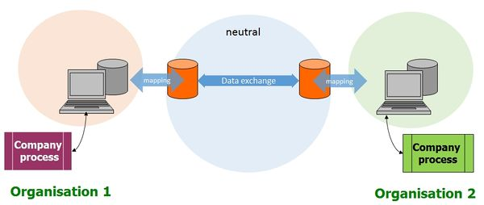
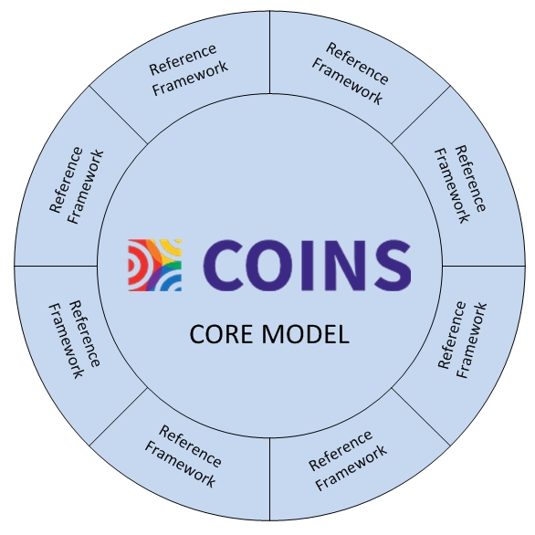

# How COINS works

## Exchange information containers

COINS is a formal way of first structuring information and then exchanging this information to another organisation. If you want to exchange information between parties, you have to agree upon what data will be exchanged. This agreement is defined in a neutral model. Then you are able to design a mapping from your own system to this neutral standard and visa versa. COINS is developed according to this simple principle and therefore defines this neutral system in a clear and unambiguously way, called the COINS core model.

COINS is a standard that is able to exchange information in a structured way. Besides COINS is able to maintain the relations to other standards, documents and models through the whole lifecycle of a building and construction project (from feasability study till the maintain and operate phase).

The COINS programme was developed by and for the building and construction industry.

COINS maintains relations IFC,GML,etc
This standard supports the exchange of information between parties within a building project from the first moment a project starts - eg the feasability stage - till the maintain and operate phase. This exchange data contains information and references to documents, models and objecttype libraries that are related to eachother. The exchanged informations consists of BIM-data, GIS-data, Systems Engineering data and respects standards (like GML, CityGML, IFC) and other file formats (DWG, DXF, RVT, SMC...)

So for instance you have selected a Hectometre sign. It has some values describing this object in COINS. Also, COINS knows which object this is in GML (this red dot) or IFC (this 3D object in e.g. Revit). And which text fragment is related to it in the requirement specifications document. So, COINS brings these connections together and maintains them during all project phases.

## COINS architecture

The architecture of COINS makes it possible to add extra features and functionalities to this standard. In fact, the core of the model has been defined in such a way that this can be extended. These extensions are called Reference Frameworks. For instance, one could add activities to COINS via a Reference Framework. Some Frameworks are designed already and will be explained later.

* **Core model**: COINS 2.0 has a core model. This core model describes in general the objects, properties, relations, document references and identifications needed for the exchange of information.

* **COINS container**: The COINS container is one of the special elements in the standard.

* **Reference Frameworks**: The core model can be extended with Reference Frameworks. This principle is further described in this section.

* **Ontlogy / ObjectTypeLibrary**: An objecttype library can be developed within Coins or an existing one can be referred to. How does this relate to Coins and how do you maintain this link will be further defined in the section Objecttype libraries.

* **Reference documents**: documents can be attached to the information in Coins. This mechanism will be clarified on the page Document referencing.

* **Data versioning**: It is extremely important to use good versionmanagement when you exchange information between parties. The solution for this according to COINS is described in the section Versioning.

* **Window of Authorisation**: Besides versionmanagement, COINS is able to use authorisation as well. Receiving a COINS container with a Window of Authorisation clarifies the system what may be edited by the reciever and what not. More information about this concept is given in the Window of Authorization section
