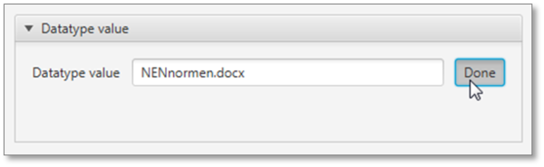
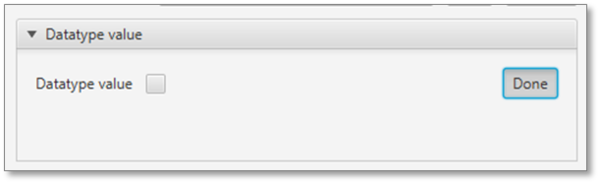
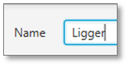
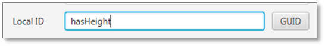

# Reference Frameworks

Reference frameworks: Generic
A Reference Framework is an extension of the Coins 2.0 Core Model ontology for specific domains, for use of libraries and/or for project- or company specific needs.

Usage of frameworks is optional, but when extension of the core model is required, it is recommended to use Standard frameworks where available.

## General

COINS is characterized by flexible schema architecture, based on RDF(S) and OWL. The Coins Core Model is an extension of the OWL Ontology Structure and is formally represented in a COINS entity model. This Core Model defines the minimal set of classes required for storage and exchange of data: Objects, their Properties and their Connections (relationships between Objects). The Core Model can be extended by defining Reference Frameworks.

From functional point of view, there are two types of frameworks:

“standard” frameworks: for extending the Core Model to specific domains according to commonly accepted standards for that domain, and for implementing management- and control issues like the Window of Authorization

“specific” frameworks: containing definitions for specific domains, for use of libraries and/or for project-specific needs.

Parties are free to define and use specific reference frameworks, e.g. for in-company usage, or for use in a limited scope during a specific project, providing these have been harmonised with the core model and do not contain any supplements that conflict with this model.

In order to be COINS compatible, software must support the COINS Core Model and the standard reference frameworks. Support of specific frameworks is optional.

## Usage

Coins Container folder structure
From a technical point of view, a Reference Framework is a file containing the additional ontology, defining extensions to the classes of the COINS Core Model. This file is “included” (referenced) in the OWL-file containing the data model (building information model). To parties involved, Reference Frameworks should be made available through their internet location (URL). When information models are exchanged through a Coins Container, Reference Frameworks can be included in the container by placing them in the Repository folder. The Repository folder is a subfolder of the BIM folder, where the information model is located. The Reference Framework for authorizations (the Window of Autorization) is an exception to this location; this file is placed in the WOA-folder.

## Example

In the following example, the Reference Frameworks “Units-2.0.rdf” and “COINSWOA.rdf” are included:

<pre>&lt;rdf:RDF

  &lt;rdf:Description rdf:about=""&gt;
    &lt;rdf:type rdf:resource="owl:Ontology"/&gt;
    &lt;owl:imports rdf:resource="<a rel="nofollow" class="external free" href="http://www.coinsweb.nl/units-2.0.rdf">http://www.coinsweb.nl/units-2.0.rdf</a>"/&gt;
    &lt;owl:imports rdf:resource="<a rel="nofollow" class="external free" href="http://www.coinsweb.nl/COINSWOA.rdf">http://www.coinsweb.nl/COINSWOA.rdf</a>"/&gt;
  &lt;/rdf:Description&gt;

&lt;/rdf:RDF&gt;
</pre>

## Available Frameworks

Standard Frameworks
The following standard frameworks are available:

Window of Authorization (WoA): this framework makes it possible to specify the access rights for a part of the model

## Specific Frameworks

The following standard frameworks are available:

Units (based on QUDT), this framework extends Coins with the ontology for a lot of units that are needed
BranchVersioning, this framework creates an extra versioning principle next to the default Versioning in the Coins core model

Note
A Reference framework for adding Systems Engineering functionalities is being developed. This framework will contain definitions for requirements, verifications and so on.

# COINS Navigator

The **Coins Navigator** tool shows the concepts of COINS in an application.

At this moment the Coins Navigator is developed on base of Coins 2.0.

**WARNING**: The objective of the COINS Navigator is aimed primarily as a demonstration tool. As a result it performs well with small containers, however, because its architecture as an in-memory application, its use for importing large containers is strongly discouraged. This typically includes all containers that import the Rijkswaterstaat object type library. As a rule of thumb the performance is acceptable for containers with roughly max. 10,000 COINS entity instances, though it may be necessary to increase the heap size of the involved Java runtime engine.

The COINS Navigator 2 can be downloaded from the [Github repository](https://github.com/bimloket/COINS_2.0)

## Installation

The COINS Navigator is a Java desktop application and needs a [Java](https://www.java.com/nl/) runtime environment (JRE), which may already be available on your platform (Java version 8+).
Unzip the download file into a folder where you have write permission.
Double click the Java archive (.jar) file.
For a quick start use the following tutorial based on the COINS 2.0 Starter kit. Coins Navigator 2 Starter Kit

### Create Organization (instance)

* Start the COINS Navigator 2 application.

* Open a new container form.

* Give the model a name (no spaces).

* Open a new object form.

* Make a choice between a guaranteed unique ID.

* or a readable ID.

* Select the static type.

* Give the organisation a name.

* Click the create entity button.

* And the new organisation is added.

* Save the model in a container.

* Ready.

Result container

### Create Person (instance)

* Start the COINS Navigator 2 application.

* Open a new container form.

Open a new container form.

* Give the model a name (no spaces).

* Open a new object form.

* Make a choice between a guaranteed unique ID.

* or a readable ID.

* Select the static type.

* Give the person a name.

* Click the create entity button.

* And the new person is added.

* Ready.

Result container

### Increment version (instance)

* Start the COINS Navigator 2 application.

* Select the person object of the previous tutorial.

* Check expired under the "Object"-tab section "Identification".

* Create a next version object.

* Make a change to the object's name.

* A new version object node is added.

* The previous version points to the next version.

-PersonNode.png "Previous version points to the next version.")

* The new version has incremented the version ID.

-PersonNode.png "Incremented version ID.")

* Ready.

### Create StringProperty (instance)

* Start the COINS Navigator 2 application.

* Start a new model ...

* ... or open a model in an existing container.

* Open a new object form.

* Select the static type.

* Give the string property a name.

* Click the create entity button.

* Open tab "Properties" section "Static properties/Entity property/Datatype value" and click the "Change"-button.

* Enter the string value.

* Ready.

### Create BooleanProperty (instance)

* Start the COINS Navigator 2 application.

* Start a new model ...

* ... or open a model in an existing container.

* Open a new object form.

* Select the static type.

* Give the string property a name.

* Click the create entity button.

* Open tab "Properties" section "Static properties/Entity property/Datatype value" and click the "Change"-button.

* Enter the booleanvalue and click the "Done"-button.

* Ready.

### Create DateTimeProperty (instance)

* Start the COINS Navigator 2 application.

* Start a new model ...

* ... or open a model in an existing container.

* Open a new object form.

* Select the static type.

* Give the date time property a name.

* Click the create entity button.

* Open tab "Properties" section "Static properties/Entity property/Datatype value" and click the "Change"-button.

* Enter the date time value and click the "Done"-button.

* Ready.

### Create IntegerProperty (instance)

* Start the COINS Navigator 2 application.

* Start a new model ...

* ... or open a model in an existing container.

* Open a new object form.

* Select the static type.

* Give the integer property a name.

* Click the create entity button.

* Open tab "Properties" section "Static properties/Entity property/Datatype value" and enter the integer value.

* Ready.

### Create FloatProperty (instance)

* Start the COINS Navigator 2 application.

* Start a new model ...

* ... or open a model in an existing container.

* Open a new object form.

* Select the static type.

* Give the integer property a name.

* Click the create entity button.

* Open tab "Properties" section "Static properties/Entity property/Datatype value" and enter the integer value.

Optionally, a unit can be specified.

* Ready.

### Create InternalDocumentReference (instance)

* Start the COINS Navigator 2 application.

* Start a new model ...

* ... or open a model in an existing container.

* Open a new object form.

* Select the static type.

* Give the document reference a name.

* Click the create entity button.

* Open tab "Properties" section "Static properties/Document Reference" and upload the local file.

* After successful uploading most of the document reference properties are filled in.

* Ready.

### Relate Person to InternalDocumentReference (instance)

* Start the COINS Navigator 2 application.

* Open the previous model.

* Select the "Object"-tab/"Governance"-section and select a creator party.

Creator relation on the canvas.

* Ready.

### Relate to CataloguePart

**Create a new library.**

* Start the COINS Navigator 2 application.

* Open a new container form to create a library.

* Give the library a name (no spaces).
* 

* Select the "Classes"-tab, find and select the COINS Object class, right click and select the "Create"-menu item.

* Select the "Identification"-section, toggle the "GUID"-button to enable the specification of a readable class ID.

* Select the "Super types"-section and make sure that the "Catalogue Part"-check box is selected.

* Select the "Description"-section and enter a user friendly name for the class.

* Click the "Create"-button...

... and the new subclass is added to the class tree.

* Save the library in a container.

**Create Instance model**

* Create a new model.

* Give the model a name (no spaces).

* Select the "Container"-tab/"Models"-tab and click the "Add"-button to import the "Library"-model.

* Select the "Objects"-tab and open the create new object form. Select the "Types"-section and add "MyLibrary:Column" as a dynamic type:

* Give the object a name and click the "Create"-button.

* The dynamically typed object is added to the model.

* Ready.

### Example: A very simple case

* Start the COINS Navigator 2 application.

* Start a new model ...

**Create Bench**

* Open a new object form, select the static type, give it a name and click the "Create"-button.

**Create Platform (dutch: "perron")
* Open a new object form, select the static type, give it a name and click the "Create"-button.

**Create connection**

* Open a new object form, select the static type, give it a name and click the "Create"-button.

* Select "Properties"-tab/"Static Properties"-section/"Connection"-section and select the connected objects.

**New connection version**

* Select the Connection object and then select the "Object"-tab/"Identification"-section. Select the "Expired"-check box and click then the "Next version"-button.

New connection version added to the model.

* Select the new Connection version.

* Make a change to the name.

Make a change to the name.

* Select the expired version.

* The expired version points to the next version.

**Decomposition**

* Select the "Zitbank" tree node and select under Object/Types the Assembly role type.

**Create support left (Steun links)**

* Open a new object form, select the static type, give it a name, check the "Part"-role type and click the "Create"-button.

**Create support right (Steun rechts)**

* Open a new object form, select the static type, give it a name, check the "Part"-role type and click the "Create"-button.

**Create beam (Ligger)**

Open a new object form, select the static type, give it a name, check the "Part"-role type and click the "Create"-button.

**Connect**

* Select the "Zitbank" object

* Select and add the three subpart objects.

* Ready.

### Type column and property in library

* Start the COINS Navigator 2 application.

**Edit the previous created MyLibrary model**

* Open the previous created "MyLibrary" model.

* Select the "Properties"-tab and next the "hasProperties" property.

* Open the create subproperty form.

* Give the new property an identification.

* Restrict the domain specification to "Column".

* Restrict the range specification to "FloatProperty".

* Give the property a name and click the create button.

* Select the "Classes"-tab and next the "Column"-class.

* Select the "Restrictions"-tab and then click the create restriction button.

* Select the "hasHeight"-property.

* Select "Cardinality" as restriction type, specify its value and click the create button.

!Select restriction type.

* Save the library in a container.

**Create an instance model that uses the libary**

* Create a new model and give it a name.

* Add the library as an imported model.

* Create a float property, next give it a name and a value.

* Create an object with static type "Object" and dynamic type "Column".

* Select the "Properties"-tab/"Dynamic properties"-section and select the float property as the value of the "column height"-property.

* Ready.

# Window of Authorization framework

## Intorduction

The Window of Authorization is a standard Reference Framework of Coins for defining permissions to read, write or restrict access to information supplied in the information model. The framework contains classes which specify the permissions for accessing members of the Coins 2.0 Object class. These permissions are subclasses of the ObjectPermissions class.
Permissions are:

NoAcces; members of this class can not be accessed (neither for reading nor for writing)
ReadAccess; members of this class can be accessed for reading but not for writing)
WriteAccess; members of this class can be accessed for reading and writing.
This figure gives an illustrative representation of how implementation of the Window of Authorszation reflects in a Building Information Model: - the red elements are not visible because they are typed as NotAccess - the blue elements are visible, but not editable (ReadAccess) - the green elements are visible and editable (WriteAccess)

Permissions for a member of the Coins 2.0 Object class are set by typing it also as a member of the applicable Permission class. This Permission class is available in this Reference Framework.

The ObjectPermission class has two additional attributes:

layerDepth; property for defining the number of levels the permission is valid (following the linkAccess properties)
linkAccess; defines the objecttype property to use for determining the layer depth.
The Window of Authorization file is called COINSWOA.rdf.

![Acces Permissions](./media/WoA.png "Acces permissions"]

## Details

**Informative representation of WoA in UML**

This image shows an informative representation of the Window of Authorization classes in UML.

### PermissionClass

PermissionClass is a subclass of owl:Thing. It serves as superclass for all permission classes. The Permission class has no further attributes.

**Formal Representation in RDF/XML**

<pre> &lt;owl:Class rdf:ID="PermissionClass"&gt;

   &lt;rdfs:label xml:lang="en-GB"&gt;PermissionClass&lt;/rdfs:label&gt;
   &lt;rdfs:comment xml:lang="en-GB"&gt;Specifies the modification rights for this object&lt;/rdfs:comment&gt;

   &lt;rdfs:subClassOf rdf:resource="owl:Thing"/&gt;

   &lt;rdf:type rdf:resource="cbim-2.0.rdf#COINSClass"/&gt;

 &lt;/owl:Class&gt;
</pre>

### ObjectPermissions

ObjectPermissions is a subclass of PermissionClass. It serves as superclass for all permissions pertaining to members of Cbim-2.0:Object. The ObjectPermissions class has a property for the layerDepth, defining the number of levels the permission is valid, following the object defined in the linkAccess property.

**Attributes**
| Name | Type | Description |
| :--- | :--- | :--- |
| layerDepth | xsd:integer | number of levels the permission is valid | 
| linkAccess | ObjectProperty | the property path to folow for determining the layer depth | 

**Formal Representation in RDF/XML**

<pre> &lt;cbim-2.0:COINSClass rdf:ID="ObjectPermissions"&gt;
 
   &lt;rdfs:label xml:lang="en-GB"&gt;ObjectPermission&lt;/rdfs:label&gt;
   &lt;rdfs:comment xml:lang="en-GB"&gt;Specifies the rights for this Object&lt;/rdfs:comment&gt;

   &lt;rdfs:subClassOf rdf:resource="#PermissionClass"/&gt;
   &lt;rdfs:subClassOf rdf:resource="cbim-2.0.rdf#Object"/&gt;

   &lt;rdfs:subClassOf&gt;
     &lt;owl:Restriction&gt;
       &lt;owl:onProperty rdf:resource="#layerdepth"/&gt;
       &lt;owl:cardinality rdf:datatype="xml:nonNegativeInteger"&gt;1&lt;/owl:cardinality&gt;
     &lt;/owl:Restriction&gt;
   &lt;/rdfs:subClassOf&gt;
 
   &lt;rdfs:subClassOf&gt;
     &lt;owl:Restriction&gt;
       &lt;owl:onProperty rdf:resource="#linkAccess"/&gt;
       &lt;owl:cardinality rdf:datatype="xml:nonNegativeInteger"&gt;1&lt;/owl:cardinality&gt;
     &lt;/owl:Restriction&gt;
   &lt;/rdfs:subClassOf&gt;
   &lt;rdf:type rdf:resource="owl:Class"/&gt;

 &lt;/cbim-2.0:COINSClass&gt;

</pre>

  

<pre> &lt;owl:DatatypeProperty rdf:ID="layerdepth"&gt;
   &lt;rdfs:label xml:lang="en-GB"&gt;layerdepth&lt;/rdfs:label&gt;
   &lt;rdfs:comment xml:lang="en-GB"&gt;determines the layerdepth via the linkAccess relation on which this permission applies&lt;/rdfs:comment&gt;
   &lt;rdf:type rdf:resource="owl:FunctionalProperty"/&gt;
   &lt;rdfs:domain rdf:resource="#ObjectPermissions"/&gt;
   &lt;rdfs:range rdf:resource="xsd:integer"/&gt;
 &lt;/owl:DatatypeProperty&gt;

</pre>

  

<pre> &lt;owl:ObjectProperty rdf:ID="linkAccess"&gt;
   &lt;rdfs:label xml:lang="en-GB"&gt;linkAccess&lt;/rdfs:label&gt;
   &lt;rdfs:comment xml:lang="en-GB"&gt;specifies the objecttype property used by the layerdepth&lt;/rdfs:comment&gt;
   &lt;rdf:type rdf:resource="owl:FunctionalProperty"/&gt;
   &lt;rdfs:domain rdf:resource="#ObjectPermissions"/&gt;
   &lt;rdfs:range rdf:resource="owl:ObjectProperty"/&gt;
 &lt;/owl:ObjectProperty&gt;
</pre>

### NoAccess
NoAccess is a subclass of ObjectPermissions. Members of this class may not be accessed, nor for reading neither for writing.

**Formal Representation in RDF/XML**

<pre> &lt;cbim-2.0:COINSClass rdf:ID="NoAccess"&gt;

   &lt;rdfs:label xml:lang="en-GB"&gt;NoAccess&lt;/rdfs:label&gt;
   &lt;rdfs:comment xml:lang="en-GB"&gt;No Access for this Object&lt;/rdfs:comment&gt;

   &lt;rdfs:subClassOf rdf:resource="#ObjectPermissions"/&gt;

   &lt;rdf:type rdf:resource="owl:Class"/&gt;

 &lt;/cbim-2.0:COINSClass&gt;
</pre>

### ReadAcces

ReadAccess is a subclass of ObjectPermissions. Members of this class may be accessed for display (reading) but not for modifying (writing).

**Formal Representation in RDF/XML**

<pre> &lt;cbim-2.0:COINSClass rdf:ID="ReadAccess"&gt;

   &lt;rdfs:label xml:lang="en-GB"&gt;ReadAccess&lt;/rdfs:label&gt;
   &lt;rdfs:comment xml:lang="en-GB"&gt;ReadAccess for this Object&lt;/rdfs:comment&gt;

   &lt;rdfs:subClassOf rdf:resource="#ObjectPermissions"/&gt;

   &lt;rdf:type rdf:resource="owl:Class"/&gt;

 &lt;/cbim-2.0:COINSClass&gt;
</pre>

### WriteAccess

WriteAccess is a subclass of ObjectPermissions. Members of this class may be accessed for display (reading) and for modifying (writing).

**Formal Representation in RDF/XML**

<pre> &lt;cbim-2.0:COINSClass rdf:ID="WriteAccess"&gt;

   &lt;rdfs:label xml:lang="en-GB"&gt;WriteAccess&lt;/rdfs:label&gt;
   &lt;rdfs:comment xml:lang="en-GB"&gt;Writeaccess for this Object&lt;/rdfs:comment&gt;

   &lt;rdfs:subClassOf rdf:resource="#ObjectPermissions"/&gt;

   &lt;rdf:type rdf:resource="owl:Class"/&gt;

 &lt;/cbim-2.0:COINSClass&gt;
</pre>

## Example

This figure shows an element, typed as a Cbim-2.0:Object with ReadAccess.
Since the properties for layerDepth and linkAccess (inherited from the ObjectPermission class) are set, the permission applies to 3 levels following ContainsRelation.

