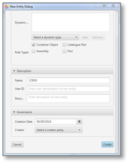
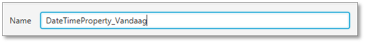

# <a>Reference Frameworks</a> 

Reference frameworks: Generic
A Reference Framework is an extension of the Coins 2.0 Core Model ontology for specific domains, for use of libraries and/or for project- or company specific needs.

Usage of frameworks is optional, but when extension of the core model is required, it is recommended to use Standard frameworks where available.

## General

COINS is characterized by flexible schema architecture, based on RDF(S) and OWL. The Coins Core Model is an extension of the OWL Ontology Structure and is formally represented in a COINS entity model. This Core Model defines the minimal set of classes required for storage and exchange of data: Objects, their Properties and their Connections (relationships between Objects). The Core Model can be extended by defining Reference Frameworks.

From functional point of view, there are two types of frameworks:

“standard” frameworks: for extending the Core Model to specific domains according to commonly accepted standards for that domain, and for implementing management- and control issues like the Window of Authorization
“specific” frameworks: containing definitions for specific domains, for use of libraries and/or for project-specific needs.
Parties are free to define and use specific reference frameworks, e.g. for in-company usage, or for use in a limited scope during a specific project, providing these have been harmonised with the core model and do not contain any supplements that conflict with this model.

In order to be COINS compatible, software must support the COINS Core Model and the standard reference frameworks. Support of specific frameworks is optional.

## Usage

Coins Container folder structure
From a technical point of view, a Reference Framework is a file containing the additional ontology, defining extensions to the classes of the COINS Core Model. This file is “included” (referenced) in the OWL-file containing the data model (building information model). To parties involved, Reference Frameworks should be made available through their internet location (URL). When information models are exchanged through a Coins Container, Reference Frameworks can be included in the container by placing them in the Repository folder. The Repository folder is a subfolder of the BIM folder, where the information model is located. The Reference Framework for authorizations (the Window of Autorization) is an exception to this location; this file is placed in the WOA-folder.

## Example

In the following example, the Reference Frameworks “Units-2.0.rdf” and “COINSWOA.rdf” are included:

<code><rdf:RDF

  <rdf:Description rdf:about="">
    <rdf:type rdf:resource="owl:Ontology"/>
    <owl:imports rdf:resource="http://www.coinsweb.nl/units-2.0.rdf"/>
    <owl:imports rdf:resource="http://www.coinsweb.nl/COINSWOA.rdf"/>
  </rdf:Description>

</rdf:RDF>

## Available Frameworks

Standard Frameworks
The following standard frameworks are available:

Window of Authorization (WoA): this framework makes it possible to specify the access rights for a part of the model

## Specific Frameworks

The following standard frameworks are available:

Units (based on QUDT), this framework extends Coins with the ontology for a lot of units that are needed
BranchVersioning, this framework creates an extra versioning principle next to the default Versioning in the Coins core model

Note
A Reference framework for adding Systems Engineering functionalities is being developed. This framework will contain definitions for requirements, verifications and so on.

# COINS Navigator
The **Coins Navigator** tool shows the concepts of COINS in an application.

At this moment the Coins Navigator is developed on base of Coins 2.0.

<WARNING: The objective of the COINS Navigator is aimed primarily as a demonstration tool. As a result it performs well with small containers, however, because its architecture as an in-memory application, its use for importing large containers is strongly discouraged. This typically includes all containers that import the Rijkswaterstaat object type library. As a rule of thumb the performance is acceptable for containers with roughly max. 10,000 COINS entity instances, though it may be necessary to increase the heap size of the involved Java runtime engine.>

The COINS Navigator 2 can be downloaded from the [Github repository](https://github.com/bimloket/COINS_2.0)

## Installation
The COINS Navigator is a Java desktop application and needs a [Java](https://www.java.com/nl/) runtime environment (JRE), which may already be available on your platform (Java version 8+).
Unzip the download file into a folder where you have write permission.
Double click the Java archive (.jar) file.
For a quick start use the following tutorial based on the COINS 2.0 Starter kit. Coins Navigator 2 Starter Kit

### Create Organization (instance)

* Start the COINS Navigator 2 application.

* Open a new container form.

* Give the model a name (no spaces).

Create a new model.

* Open a new object form.

* Make a choice between a guaranteed unique ID.

* or a readable ID.

* Select the static type.

* Give the organisation a name.

* Click the create entity button.

* And the new organisation is added.

* Save the model in a container.

* Ready.

Result container

### Create Person (instance)
* Start the COINS Navigator 2 application.

* Open a new container form.

Open a new container form.
* Give the model a name (no spaces).

Create a new model.

* Open a new object form.

* Make a choice between a guaranteed unique ID.

* or a readable ID.

* Select the static type.

* Give the person a name.

* Click the create entity button.

* And the new person is added.

* Ready.

Result container

### Increment version (instance)
* Start the COINS Navigator 2 application.

* Select the person object of the previous tutorial.

* Check expired under the "Object"-tab section "Identification".

* Create a next version object.

* Make a change to the object's name.

* A new version object node is added.

* The previous version points to the next version.

-PersonNode.png "Previous version points to the next version.")

* The new version has incremented the version ID.
-PersonNode.png "Incremented version ID.")

* Ready.

Result container

### Create StringProperty (instance)
* Start the COINS Navigator 2 application.

* Start a new model ...

* ... or open a model in an existing container.

* Open a new object form.

* Select the static type.

* Give the string property a name.

* Click the create entity button.

* Open tab "Properties" section "Static properties/Entity property/Datatype value" and click the "Change"-button.

* Enter the string value.

* Ready.

### Create BooleanProperty (instance)
* Start the COINS Navigator 2 application.

* Start a new model ...

* ... or open a model in an existing container.

* Open a new object form.

* Select the static type.

* Give the string property a name.

* Click the create entity button.

* Open tab "Properties" section "Static properties/Entity property/Datatype value" and click the "Change"-button.

* Enter the booleanvalue and click the "Done"-button.

* Ready.

### Create DateTimeProperty (instance)
* Start the COINS Navigator 2 application.

* Start a new model ...

* ... or open a model in an existing container.

* Open a new object form.

* Select the static type.

* Give the date time property a name.

* Click the create entity button.

* Open tab "Properties" section "Static properties/Entity property/Datatype value" and click the "Change"-button.

* Enter the date time value and click the "Done"-button.

* Ready.

### Create IntegerProperty (instance)
* Start the COINS Navigator 2 application.

* Start a new model ...

* ... or open a model in an existing container.

* Open a new object form.

* Select the static type.

* Give the integer property a name.

* Click the create entity button.

* Open tab "Properties" section "Static properties/Entity property/Datatype value" and enter the integer value.

* Ready.

### Create FloatProperty (instance)
* Start the COINS Navigator 2 application.

* Start a new model ...

* ... or open a model in an existing container.

* Open a new object form.

* Select the static type.

* Give the integer property a name.

* Click the create entity button.

* Open tab "Properties" section "Static properties/Entity property/Datatype value" and enter the integer value.

Optionally, a unit can be specified.

* Ready.

### Create InternalDocumentReference (instance)
* Start the COINS Navigator 2 application.

* Start a new model ...

* ... or open a model in an existing container.

* Open a new object form.

* Select the static type.

* Give the document reference a name.

### Relate Person to InternalDocumentReference (instance)

### Relate to CataloguePart

### Example: A very simple case

### Type column and property in library

