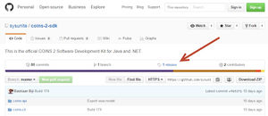
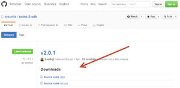
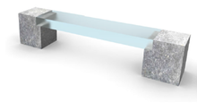

# Implementation guideline

## Exporting data to the COINS format

1. define the data within your system that you need to exchange
2. create a mapping between the [COINS Core model ](https://bimloket.github.io/COINS_2.0/coinsweb/#core-model) and the data model of your system
3. collect the data from your system
4. create Coins data from the collected data and export this to a <a>COINS</a> Container
5. transmit this <a>COINS</a> Container to your client
6. optional, validate the <a>COINS</a> container before sending it to your client

## Importing data from the COINS format

1. define the locations within your system in which <a>COINS</a> data will be imported
2. create a mapping between the [COINS Core model ](https://bimloket.github.io/COINS_2.0/coinsweb/#core-model) and the data model of your system
3. opening the <a>COINS</a> Container and read the <a>COINS</a> data
4. validate the <a>COINS</a> data in the Container
5. import the <a>COINS</a> data into your system

## Exporting data samples
1. Create a COINS container with one object
2. Create a COINS Container for a simple Bench with subobjects, the Coins Contains Relation.

## Creating a Coins container
This page describes the most basic steps to make for exporting a Coins Container via programming. The code samples are made in C#. It is also possible to use other Microsoft DotNet languges. It is also possible to use the COINS 2.0 API from Java.

Download
[Coins API](https://github.com/sysunite/coins-2-sdk)

**Go to Release**

**Download the latest ZIP or Tar.gz file.**

**Unpack this in a folder. In the "dist" folder you find the important dll's that we use in the samples.**

* dist\sdk\dll, contains coins-api.dll and coins-cli.exe
* dist\sdk\jar, contains coins-api.jar and coins-cli.jar
* dist\library\dll, contains cbim.dll and qudt.dll
* dist\library\jar, contains cbim.jar and qudt.jar

For C# we need the following files: coins-api.dll, cbim.dll and qudt.dll.

Next to this, we need IKVM to interope between Java and .NET. Go to [IKVM-files](https://sourceforge.net/projects/ikvm/files/) and download the latest version. Unpack this file into a folder.

In the "bin" folder you find the dll's that we need for the samples:

* bin\IKVM.Runtime.dll
* bin\IKVM.OpenJDK.XML.Parse.dll
* bin\IKVM.OpenJDK.XML.API.dll
* bin\IKVM.OpenJDK.Util.dll
* bin\IKVM.OpenJDK.Text.dll
* bin\IKVM.OpenJDK.SwingAWT.dll
* bin\IKVM.OpenJDK.Security.dll
* bin\IKVM.OpenJDK.Remoting.dll
* bin\IKVM.OpenJDK.Management.dll
* bin\IKVM.OpenJDK.Jdbc.dll
* bin\IKVM.OpenJDK.Core.dll
* bin\IKVM.OpenJDK.Beans.dll

Now, you are ready for programming.

**Outline**

Creating a Coins Container file (.ccr) typically consists of the following steps:

* Start a project in a DotNET or Java IDE.
* Instantiate a CoinsContainer instance.
* Interact with the CoinsContainer with the use of some interaction classes.
* Optionally trigger some post-processing.
* Export the CoinsContainer to a file.
* Setting up the IDE (Integrated Development Environment)
* For C#, open the File / New Project / Classic Desktop / Empty Project.
* Add the following references Project / Add References:
* Csharp-references.png

**Coins-api.dll and cbim.dll**
You can program the interface by using the coins-api.dll. This is a very generic approach. However, you can generate libraries as well. For example the cbim.dll contains code for all elements from the core model, like the Assembly or Object. We will start with the cbim.dll. This shows how less code is needed to program this. Next to that we will show the approach via coins-api.dll.

**Simple sample via cbim.dll**
In general this sample first creates a Coins container, called ccr. Than, a new Coins Object is created called bench. This object is added to the Coins container. The name of this bench is set to "couch". This information is exported to the Coins container.

<pre>using System;
using System.Collections.Generic;
using System.ComponentModel;
using System.Data;
using System.Drawing;
using System.Linq;
using System.Text;
using System.Windows.Forms;
using nl.coinsweb.cbim;
using nl.coinsweb.sdk;
using nl.coinsweb.sdk.jena;

namespace HelloCoinsWorld
{
    public partial class Form1&#160;: Form
    {
        public Form1()
        {
            InitializeComponent();
        }

        void sample1a()
        {
            // Start container
            JenaModelFactory factory = new JenaModelFactory();
            JenaCoinsContainer ccr = new JenaCoinsContainer(factory, "<a rel="nofollow" class="external free" href="http://demo.nl#">http://demo.nl#</a>"); 

            // Create individual
            // because Object exists in other namespaces as well, we must specify which object we want to use here
            nl.coinsweb.cbim.Object bench = new nl.coinsweb.cbim.Object(ccr);
    
            // Set property
            bench.setName("couch");

            // Export container
            ccr.export("D:\\bench1a.ccr");
        }

        private void btnSample1_Click(object sender, EventArgs e)
        {
            sample1a();
            this.Close();
        }
    }
}
</pre>

When you view the contents of the exported file (see Bestand:Bench1a.ccr) you will find the information about the bench in the BIM folder. In the "content.rdf" file all the information is stored. More detailled information about the structure and how you can create this file manually is described in this OWL and Coins sample. In this case we use RDF/XML before the export language. It shows:

<pre>&lt;rdf:RDF
    xmlns="<a rel="nofollow" class="external free" href="http://demo.nl#">http://demo.nl#</a>"
    xmlns:rdf="<a rel="nofollow" class="external free" href="http://www.w3.org/1999/02/22-rdf-syntax-ns#">http://www.w3.org/1999/02/22-rdf-syntax-ns#</a>"
    xmlns:coins2="<a rel="nofollow" class="external free" href="http://www.coinsweb.nl/cbim-2.0.rdf#">http://www.coinsweb.nl/cbim-2.0.rdf#</a>"
    xmlns:owl="<a rel="nofollow" class="external free" href="http://www.w3.org/2002/07/owl#">http://www.w3.org/2002/07/owl#</a>"
    xmlns:xsd="<a rel="nofollow" class="external free" href="http://www.w3.org/2001/XMLSchema#">http://www.w3.org/2001/XMLSchema#</a>"
    xmlns:rdfs="<a rel="nofollow" class="external free" href="http://www.w3.org/2000/01/rdf-schema#">http://www.w3.org/2000/01/rdf-schema#</a>"
  xml:base="<a rel="nofollow" class="external free" href="http://demo.nl#">http://demo.nl#</a>"&gt;
  &lt;owl:Ontology rdf:about=""&gt;
    &lt;owl:imports rdf:resource="<a rel="nofollow" class="external free" href="http://www.coinsweb.nl/units-2.0.rdf#">http://www.coinsweb.nl/units-2.0.rdf#</a>"/&gt;
    &lt;owl:imports rdf:resource="<a rel="nofollow" class="external free" href="http://www.coinsweb.nl/cbim-2.0.rdf#">http://www.coinsweb.nl/cbim-2.0.rdf#</a>"/&gt;
    &lt;coins2:containerId rdf:datatype="<a rel="nofollow" class="external free" href="http://www.w3.org/2001/XMLSchema#string">http://www.w3.org/2001/XMLSchema#string</a>"&gt;2866dee8-bdbb-49a9-9e53-423da45cd5f0&lt;/coins2:containerId&gt;
    &lt;coins2:creator rdf:resource="<a rel="nofollow" class="external free" href="http://sandbox.coinsweb.nl/defaultUser">http://sandbox.coinsweb.nl/defaultUser</a>"/&gt;
  &lt;/owl:Ontology&gt;
  &lt;coins2:Object rdf:about="#09a9b4c3-5c52-45e6-ac74-7a96055d961e"&gt;
    &lt;coins2:name rdf:datatype="<a rel="nofollow" class="external free" href="http://www.w3.org/2001/XMLSchema#string">http://www.w3.org/2001/XMLSchema#string</a>"&gt;couch&lt;/coins2:name&gt;
    &lt;coins2:creationDate rdf:datatype="<a rel="nofollow" class="external free" href="http://www.w3.org/2001/XMLSchema#dateTime">http://www.w3.org/2001/XMLSchema#dateTime</a>"&gt;2016-05-19T16:35:30.213Z&lt;/coins2:creationDate&gt;
    &lt;coins2:creator rdf:resource="<a rel="nofollow" class="external free" href="http://sandbox.coinsweb.nl/defaultUser">http://sandbox.coinsweb.nl/defaultUser</a>"/&gt;
  &lt;/coins2:Object&gt;
&lt;/rdf:RDF&gt;
</pre>

However, all the Coins-elements that are put into a Coins Container must be typed as a CoinsContainerObject. This can be executed by adding the following line to the code:
ccr.batchAddCoinsContainerObjectType()
This must be set before the export will be executed.

Therefore, the export changes as well. This results in:

<pre>&lt;rdf:RDF
   xmlns="<a rel="nofollow" class="external free" href="http://demo.nl#">http://demo.nl#</a>"
   xmlns:rdf="<a rel="nofollow" class="external free" href="http://www.w3.org/1999/02/22-rdf-syntax-ns#">http://www.w3.org/1999/02/22-rdf-syntax-ns#</a>"
   xmlns:coins2="<a rel="nofollow" class="external free" href="http://www.coinsweb.nl/cbim-2.0.rdf#">http://www.coinsweb.nl/cbim-2.0.rdf#</a>"
   xmlns:owl="<a rel="nofollow" class="external free" href="http://www.w3.org/2002/07/owl#">http://www.w3.org/2002/07/owl#</a>"
   xmlns:xsd="<a rel="nofollow" class="external free" href="http://www.w3.org/2001/XMLSchema#">http://www.w3.org/2001/XMLSchema#</a>"
   xmlns:rdfs="<a rel="nofollow" class="external free" href="http://www.w3.org/2000/01/rdf-schema#">http://www.w3.org/2000/01/rdf-schema#</a>"
 xml:base="<a rel="nofollow" class="external free" href="http://demo.nl#">http://demo.nl#</a>"&gt;
 &lt;coins2:CoinsContainerObject rdf:about=""&gt;
   &lt;owl:imports rdf:resource="<a rel="nofollow" class="external free" href="http://www.coinsweb.nl/units-2.0.rdf#">http://www.coinsweb.nl/units-2.0.rdf#</a>"/&gt;
   &lt;owl:imports rdf:resource="<a rel="nofollow" class="external free" href="http://www.coinsweb.nl/cbim-2.0.rdf#">http://www.coinsweb.nl/cbim-2.0.rdf#</a>"/&gt;
   &lt;coins2:containerId rdf:datatype="<a rel="nofollow" class="external free" href="http://www.w3.org/2001/XMLSchema#string">http://www.w3.org/2001/XMLSchema#string</a>"&gt;ae2a9922-d2b6-4747-96ac-dd1adac39213&lt;/coins2:containerId&gt;
   &lt;coins2:creator rdf:resource="<a rel="nofollow" class="external free" href="http://sandbox.coinsweb.nl/defaultUser">http://sandbox.coinsweb.nl/defaultUser</a>"/&gt;
   &lt;rdf:type rdf:resource="<a rel="nofollow" class="external free" href="http://www.w3.org/2002/07/owl#Ontology">http://www.w3.org/2002/07/owl#Ontology</a>"/&gt;
 &lt;/coins2:CoinsContainerObject&gt;
 &lt;coins2:CoinsContainerObject rdf:about="#701f43e7-409e-47cf-832d-ec450e87d792"&gt;
   &lt;coins2:name rdf:datatype="<a rel="nofollow" class="external free" href="http://www.w3.org/2001/XMLSchema#string">http://www.w3.org/2001/XMLSchema#string</a>"&gt;couch&lt;/coins2:name&gt;
   &lt;coins2:creationDate rdf:datatype="<a rel="nofollow" class="external free" href="http://www.w3.org/2001/XMLSchema#dateTime">http://www.w3.org/2001/XMLSchema#dateTime</a>"&gt;2016-07-12T10:55:09.696Z&lt;/coins2:creationDate&gt;
   &lt;coins2:creator rdf:resource="<a rel="nofollow" class="external free" href="http://sandbox.coinsweb.nl/defaultUser">http://sandbox.coinsweb.nl/defaultUser</a>"/&gt;
   &lt;rdf:type rdf:resource="<a rel="nofollow" class="external free" href="http://www.coinsweb.nl/cbim-2.0.rdf#Object">http://www.coinsweb.nl/cbim-2.0.rdf#Object</a>"/&gt;
 &lt;/coins2:CoinsContainerObject&gt;
&lt;/rdf:RDF&gt;
</pre>

Simple sample via coins-api.dll
Here you have to tell the RunTimeCoinsObject that it is a cbim-2.0:Object. In this sample all the Container-items are typed as a CoinsContainerObject

<pre>void sample1b()
{
   // Start container
   JenaModelFactory factory = new JenaModelFactory();
   JenaCoinsContainer ccr = new JenaCoinsContainer(factory, "<a rel="nofollow" class="external free" href="http://demo.nl#">http://demo.nl#</a>");

   // Create individual
   RuntimeCoinsObject bench = new RuntimeCoinsObject(ccr, "<a rel="nofollow" class="external free" href="http://www.coinsweb.nl/cbim-2.0.rdf#Object">http://www.coinsweb.nl/cbim-2.0.rdf#Object</a>"); 

   // Set property
   bench.setLiteralValue("<a rel="nofollow" class="external free" href="http://demo.nl#hasName">http://demo.nl#hasName</a>", "couch");

   // Add ContainerObjectType to all items
   ccr.batchAddCoinsContainerObjectType();

   // Export container
   ccr.export("D:\\bench1b.ccr");
}
</pre>

When you view the contents of the exported file (see Bestand:Bench1b.ccr) you will find the information about the bench in the BIM folder. In the "content.rdf" file all the information is stored.

### Example: Bench

This page shows how to use the Coins-api.dll and cbim.dll for creating a Coins Contains Relation.
This sample uses the same bench as in the previous sample. In this example the bench contains of three subobjects:

support-left
support-right
beam

We have to tell the bench that it is both an Object and an Assembly. We call this Multi-Typing. Therefore, you can use the method addType.

<pre>bench.addType(typeof(Assembly));
</pre>

Multiple typed objects can be cast to the preferred type in order to have access to functions/methods belonging to this type. The next code snippet casts a Bench object to an Assembly.

<pre>Assembly benchAsAssembly = (Assembly)bench.@as(typeof(Assembly));
</pre>

Below, the relations has been programmed for the support-left only. This support-left is both an object and a part. Via the ContainsRelation the bench and the support-left are connected to each other.:

<pre>// Start container
JenaModelFactory factory = new JenaModelFactory();
JenaCoinsContainer ccr = new JenaCoinsContainer(factory, "<a rel="nofollow" class="external free" href="http://demo.nl#">http://demo.nl#</a>");

// Create individual
nl.coinsweb.cbim.Object bench = new nl.coinsweb.cbim.Object(ccr);
nl.coinsweb.cbim.Object supportLeft = new nl.coinsweb.cbim.Object(ccr);
ContainsRelation crel = new ContainsRelation(ccr);

// Individual with multiple types
bench.addType(typeof(Assembly));
Assembly benchAsAssembly = (Assembly)bench.@as(typeof(Assembly));
supportLeft.addType(typeof(Part));

// Configure ContainsRelation
crel.setHasPart((Part)supportLeft.@as(typeof(Part)));
benchAsAssembly.addHasContainsRelation(crel);  
   
// Set property
bench.setName("Couch");
supportLeft.setName("Support Left Side");

// Export container
ccr.export("D:\\assembly.ccr");
</pre>

All Coins objects that are put into a Coins Container, must be typed CoinsContainerObject.
Therefore, this line of code is needed:  

<pre>ccr.batchAddCoinsContainerObjectType()
</pre>

